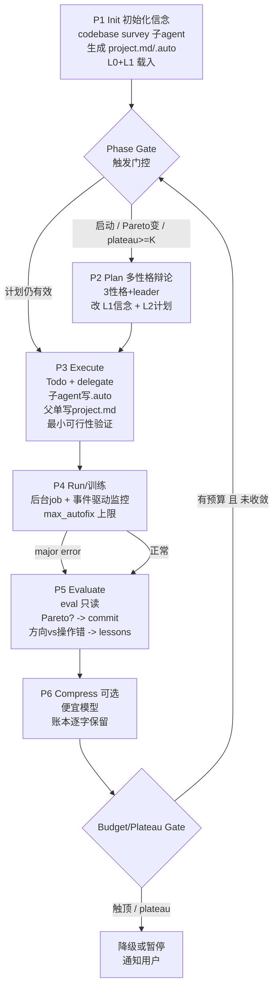

# AutoResearch v2 — 设计与实施计划

> 目标：一个**成本可控**、可**无限运行**的 autoresearch 框架。
> 本文是权威计划书：架构原则、文件契约、相位状态机、成本闸门、以及分阶段 roadmap。
> 代码基准：当前实现已整理到 `autoresearch/` Python 包中；`tools/autoresearch_tool.py` 只保留为 R-Agent 工具注册 shim。

---

## 0. 一句话架构

把系统拆成两个正交维度：

1. **分层记忆（谁看什么）** → 决定成本。
2. **相位状态机（何时做什么）** → 决定能否无限运行。

外加一个横切的 **预算闸门（Budget Gate）** —— 当前实现完全缺失，是无限运行的最大隐患。

---

## 1. 分层记忆（5 层）

| 层 | 载体 | 谁读 | 谁写 | 说明 |
|---|---|---|---|---|
| **L0 宪法** | `program.md` 的 `<!-- CONSTITUTION -->` 段 | Planner | **仅用户** | 研究方针，loop 永不改 |
| **L1 信念** | `program.md` 的 `<!-- BELIEF -->` 段 | Planner | 父进程（Plan/Eval 后） | 直觉性启发式，可演化 |
| **L2 项目态** | `project.md` | Planner | **父进程单写** | 梗概 / 当前计划 / 短期结论 / 经验账本索引 |
| **L3 细节** | 各目录 `.auto/*.md` | 对应子 agent | 该子 agent 自己 | 具体 how-to，**不进 Planner 上下文** |
| **L4 原始** | `.autoresearch/artifacts/` | 无人进 prompt | 系统 | 日志，只留路径 |

**关键纪律：**
- **program.md 不可被整体重写**。用 HTML 注释标记切成 L0/L1，loop 只允许改 L1 段。L0 缺失时降级为"全文只读"。
- **project.md 单写方 = 父进程**。子 agent 只写自己的 `.auto/`，通过结构化返回值让父进程汇总，避免并发写竞争。
- **`.auto/` 有 GC 与归属**：子任务结束前必须（a）更新自己的 `.auto/`（b）向上汇总一句进 `project.md`。否则 `.auto/` 无界膨胀 → 破坏成本可控。

### 文件契约

**`program.md`**
```markdown
<!-- CONSTITUTION -->
（用户写。研究目标、成功指标、允许/禁止修改的文件、评估口径、预算与停止条件。loop 永不改。）
<!-- /CONSTITUTION -->

<!-- BELIEF -->
（loop 写。当前对"如何改进项目"的直觉性信念，随实验演化。）
<!-- /BELIEF -->
```

**`project.md`**（父进程单写，人类可读）
```markdown
# Project State
## 梗概            # 项目当前实现概览
## 当前计划         # 本轮/近期要做什么（笼统级，细化在 .auto/plan.md）
## 改动记录         # 最近几轮做了什么
## 短期结论         # 最近实验的 keep/discard 结论
## 经验账本索引      # 指向 .autoresearch/lessons.jsonl 的关键条目
## phase           # 见相位状态机
## phase_reason    # 为什么在这个相位
```

**`.auto/plan.md` / `.auto/<topic>.md`**（子 agent 写）
```markdown
# 具体实现细节 / how-to / 下一步提示
（每个目录都可有 .auto/；子 agent 完成任务前更新。）
```

**`.autoresearch/` 机器态**
```
state.json         # 机器态（现有）：observations/buckets/experiments/pareto/best
budget.json        # 新增：累计 token/USD、按相位分解、硬上限
lessons.jsonl      # 新增：扛 git rollback 的经验账本（gitignore）
proposed_change.json  # 现有：change spec → apply_patch
artifacts/         # L4 原始输出
progress.md        # 文字 dashboard（现有）
best.json / pareto_front.json / active_context.md  # 现有
```

---

## 2. 相位状态机（6 相位，纯函数 `f(files) -> files`）

无限运行的形态：**对话永不跨相位存活**，状态全在文件 + git。loop 本体退化为
「读 `project.md.phase` → 起子进程跑该相位 → 相位写回文件 → 释放上下文 → 下一相位」。



### 各相位定义

| 相位 | 输入上下文 | 主要动作 | 输出（写回文件） | 成本档 |
|---|---|---|---|---|
| **P1 Init** | L0+L1 + codebase 采样 | 一次性 survey：读 train/eval/dataset 的 **schema/head/前若干行**（不读全量） | `project.md` 初稿、各 `.auto/` | util |
| **P2 Plan** | L0+L1+L2 | 3 性格取材+出观点 → leader 拍板 | L1 信念 diff、L2 计划、`.auto/plan.md` | **plan（贵）** |
| **P3 Execute** | L2 + scoped L3 | 父出 Todo → delegate 子 agent，含最小可行性验证 | `.auto/*`、父汇总进 project.md | exec |
| **P4 Run** | L0+L2 | 后台跑项目/训练，事件驱动监控，最小修 bug | 运行结果、必要时 major_error 标记 | exec/util |
| **P5 Evaluate** | L0+L2 | 跑只读 eval，Pareto 判定，方向 vs 操作错分类 | commit / lessons.jsonl / project.md 结论 | exec |
| **P6 Compress** | L2 全文 | 超阈值时语义压缩 program/project | 压缩后文件（账本逐字保留） | util |

**相位转移规则**（`project.md.phase` 驱动）：
```
P1 → Gate
Gate: 启动 or 上次 P5 后 Pareto 变 or plateau≥K  → P2 ; 否则 → P3
P2 → P3 → P4
P4: major_error → P5(带 major 标记) ; 否则 → P5
P5 → P6 → BudgetGate
BudgetGate: 有预算且未收敛 → Gate ; 触顶或 plateau → Pause(通知用户)
```

---

## 3. 成本可控（5 个杠杆）

1. **分层上下文**：贵的 P2 只吃 L0–L2（小且有界）；廉价子 agent 吃 scoped L3；谁都不背 L4。
2. **触发式相位**：只有（启动 / Pareto 变 / plateau≥K）才跑贵的 P2，其余时间在 P3→P4→P5 便宜循环。
3. **模型分级** `settings.model_tier = {"plan": 强, "exec": 中, "util": 便宜}`：辩论/结论用强模型，执行/监控/压缩用便宜模型。
4. **预算账本** `budget.json` + 计量 client：每次 LLM 调用自增 token/USD 并查上限；触顶先降级（减性格数 → 换便宜模型），再暂停通知用户。
5. **事件驱动而非轮询**：P4 训练当后台 job，轮询状态文件，**只在报错/状态跳变时唤醒 LLM**。训练类项目最大的省钱点。

### 收敛信号（避免"无限烧钱"）
- `plateau_counter`：连续 N 轮 Pareto 无改进 → 先加大 divergent 性格权重探一次；仍平 → 暂停问用户。
- "无限"= 能一直跑，不是必须一直烧。

---

## 4. 无限运行的实现要点

- 每相位 = 「读文件 → 起子进程 → 写文件 → 释放上下文」的纯函数；不跨相位保留对话。
- 复用现有 `AutoResearchLoop.run()` 的"每 round 释放上下文"地基，把"10 固定 step"换成"6 可重入相位"。
- 崩溃可恢复：进程重启后从 `project.md.phase` 续跑（幂等）。

---

## 5. 逐相位实现细则

**P1 Init** — codebase-survey 子 agent 只采 schema/head，别读全量 dataset。`.auto/` 定 GC 与归属。

**P2 Plan（最贵，必须封边界）**
- 3 性格 + 1 leader 封顶。每性格 = 1 轮取材（≤2 web_search + ≤3 file_read）+ 1 轮出观点；leader 1 轮拍板。约 7 次调用 → 必过预算门控。
- 性格 = 换 system prompt + allowed_tools 的 `AutoResearchStepAgent` 变体：
  - **divergent**：发散，新奇想法
  - **pragmatic**：可行性/计划性
  - **leader**：统筹，拍板产出 (a) L1 信念 diff (b) L2 计划 (c) `.auto/plan.md`
- **强制收敛**：leader 必须出结论，禁止无限辩论；辩论 transcript 落 L4，不进 project.md。

**P3 Execute**
- 复用 `delegate_task`。**project.md 单写**：子 agent 只写 `.auto/` 并返回结构化结果，父汇总后统一写。
- 最小可行性验证做成硬约束：delegate 返回必须带 `verification` 字段（import/编译/smoke 通过），否则不算 done。

**P4 Run/维护**
- 后台 job + 事件驱动。自动修 bug 有 `max_autofix_attempts` 上限；超了标 major_error 跳 P5。

**P5 Evaluate（关键正确性）**
- **eval 只读**：boundary 层硬拦截 `prepare.py` 等 eval 文件写入；要改必须带用户审批 token。
- **经验扛 rollback**：方向性错误的教训写进 `.autoresearch/lessons.jsonl`（gitignore，不随 git rollback 消失）。扩展现有 `useful_failures`。
- Pareto 更优 → `commit_pareto`（复用现有版本化四策略）；更差 → 只写 project.md/lessons，不 commit。
- 区分**方向性错误**（信念错，写回 L1 警示）vs **操作性错误**（代码 bug，git rollback）。

**P6 Compress（可选）**
- 机器态（state.json/buckets）保留现有字符预算截断。
- program/project.md 超阈值时用便宜模型**语义压缩**；**经验账本段落逐字保留**。

---

## 6. 对现有实现的三张清单

**✅ 保留（资产）**
- `ProjectBoundary` / `ProjectConfinedCommandRunner`（扩展 eval 只读）
- `AutoResearchArtifactStore` 原始输出外置 → L4 现成实现
- 版本化四策略 + Pareto/best → 对齐 P5
- `useful_failures` → lessons 账本种子
- `AutoResearchStepAgent` 结构化 JSON + fallback → 性格 agent 模板
- 后台 run + status → P4 训练监控地基
- progress.md dashboard → 可观测性
- `delegate_task`（已带 token usage 统计）→ P3 + 预算账本数据源

**🔧 改造**
- 固定 10 step 线性 planner → 6 相位可重入状态机（`project.md.phase` 驱动）
- program.md：只读输入 → L0 宪法 + L1 信念（loop 只改 L1）
- 引入 project.md（人类可读态），与 state.json（机器态）分离
- save_state 原子写 → project.md 单写方 + 子 agent scoped 写纪律

**➕ 新增（当前完全没有）**
- `budget.json` + 计量 client + 硬上限降级
- 模型分级 `model_tier`
- `.auto/` 分布式细节层 + GC/归属
- 触发门控（`phase`/`phase_reason`）+ plateau 收敛检测
- 多性格辩论 + leader 强制收敛
- eval 只读拦截 + 审批 token
- lessons 账本"扛 rollback"保证

---

## 7. 分阶段 Roadmap

按"能独立测试、逐步逼近"排序：

**阶段 A：骨架与闸门（先落地，因为决定成本/无限运行成败）**
- A1. `budget.py`：`BudgetLedger`（读写 budget.json）+ `MeteredLLMClient`（包住 create_llm_client，累计 usage）+ `model_tier` 配置。
- A2. `program.md` L0/L1 分段解析器（`split_constitution_belief` / `update_belief`）。
- A3. `project.md` 读写 + `phase`/`phase_reason` 字段。
- A4. `.auto/` 读写 + GC helper。
- 测试：预算累加/触顶降级、L0 只读保护、project.md 相位往返、.auto GC。

**阶段 B：相位状态机**
- B1. `PhaseStateMachine`：按 `project.md.phase` 分派，替换 `FixedAutoResearchPlanner` 的线性 round。
- B2. Phase Gate（触发门控）+ Budget/Plateau Gate。
- B3. P1 Init（codebase survey）、P5 Evaluate（复用现有 Pareto/versioning + lessons 账本 + eval 只读）。
- 测试：相位往返、门控触发、plateau 收敛、eval 只读拦截、lessons 扛 rollback。

**阶段 C：多性格 Plan**
- C1. `PersonaAgent`（divergent/pragmatic/leader，`AutoResearchStepAgent` 变体）。
- C2. P2 编排：取材（限额）→ 出观点 → leader 拍板 → 写 L1/L2/.auto。
- 测试：性格数封顶、leader 强制收敛、辩论 transcript 落 L4。

**阶段 D：Execute/Run 接 delegate**
- D1. P3 Todo + delegate + verification 硬约束 + 父单写 project.md。
- D2. P4 后台 job + 事件驱动监控 + max_autofix。
- 测试：并发写不竞争、verification gate、autofix 上限、事件驱动只唤醒一次。

**阶段 E：Compress + 收尾**
- E1. P6 语义压缩（便宜模型，账本逐字保留）。
- E2. 全链路 e2e 冒烟。

每阶段结束：全套 pytest 绿 + 在 `autoresearch` 分支 commit。

---

## 8. 兼容性承诺

- 现有 40 个测试全程保持绿；新行为通过新参数/新相位开关启用，默认 `planner_kind="fixed"` 行为不变。
- v2 通过 `planner_kind="phase"`（或等价开关）启用，逐阶段接入。

---

## 9. 实现状态（已落地）

全部 5 阶段已实现并测试通过（89 个 autoresearch 测试全绿）。

### 模块地图

| 模块 | 职责 | 关键导出 |
|---|---|---|
| `autoresearch/observability/budget.py` | 成本闸门 | `BudgetLedger`(usd/token 上限, degrade/exhaust), `MeteredLLMClient`, `ModelTiers` |
| `autoresearch/state/memory.py` | 分层记忆 | `split_program`/`update_belief`(L0/L1), `read_phase`/`write_phase`(L2), `.auto` 读写+`gc_auto_dir`(L3), `append_lesson`/`read_lessons`(扛 rollback) |
| `autoresearch/phases.py` | 相位入口 | `PhaseContext`/`PhaseResult`, `run_phase_loop` |
| `autoresearch/phase_handlers.py` | 确定性相位 | P1 `survey_project`, P5 evaluate(+lessons), P6 compress |
| `autoresearch/planner.py` | P2 多性格 | `PlanDebate`(预算感知性格数), `DIVERGENT`/`PRAGMATIC`/`LEADER`, `make_plan_handler` |
| `autoresearch/execution.py` | P3/P4 | `make_execute_handler`(验证硬约束), `make_run_handler`(有界 autofix) |
| `autoresearch/controller.py` | 当前 3-step 控制器 | `ThreeStepController`, `run_three_step_loop` |
| `autoresearch/runtime_policy.py` | step agent 策略 | `StepRuntimePolicy`, tool/skill whitelist, done tags |
| `autoresearch/tool.py` | 工具实现 | `auto_research_run`(legacy fixed/evolutionary), `auto_research_run_v2`(相位机), status/stop/kill |
| `tools/autoresearch_tool.py` | 工具注册 shim | 重新加载 `autoresearch.tool`，让 `ToolRegistry.reload_all()` 能发现注册项 |

### 运行方式

```python
from autoresearch.tool import auto_research_run_v2_tool
auto_research_run_v2_tool(
    "/path/to/project",
    max_steps=24,
    use_llm_step_agents=True,          # False = 全确定性、无模型调用
    max_usd=5.0,                        # 预算硬上限, 0=无限
    model_tier_plan="strong-model",     # 辩论用强模型
    model_tier_util="cheap-model",      # survey/压缩用便宜模型
    plateau_patience=3,                 # 收敛信号 K
)
```

### 成本可控 / 无限运行落点回顾

- **成本**：`BudgetLedger` 触 `degrade_ratio` 先减性格数(`DebateConfig.degrade_personas`)/降级；触上限则 `budget_gate` → `pause`。模型分级把贵的只放在 P2。survey 只采 schema/head。
- **无限**：每相位 = `f(files)->files`，`PhaseController.step()` 读 `project.md` 的 phase → 跑 handler → 写回 → 释放上下文；进程重启从 phase 续跑（幂等/可恢复）。
- **收敛**：`plateau_counter >= plateau_patience` 且 Pareto 未动 → 暂停通知用户，不无脑烧钱。

### 与 legacy 的关系

- `auto_research_run`（fixed / evolutionary）保持原样，未改行为。
- `auto_research_run_v2` 是新的相位机入口；两者共用 `AutoResearchLoop` 的 runner/artifact/git/Pareto 资产。
- 默认 handlers 无 LLM 也能完整跑通（确定性 fallback），便于测试与冒烟。

### 后续可选增强（未做，属超范围）

- P4 训练类项目的真·后台 job + 事件驱动监控（当前 Run 用 confined runner 同步执行）。
- P6 用便宜模型做真·语义压缩（当前是确定性 belief 截断）。
- P3 接真实 `delegate_task` 子 Agent（当前 execute_fn 为确定性 py_compile 验证，接口已留）。
