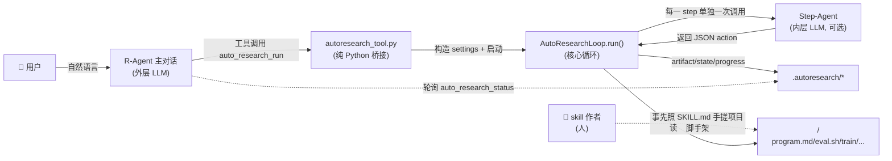
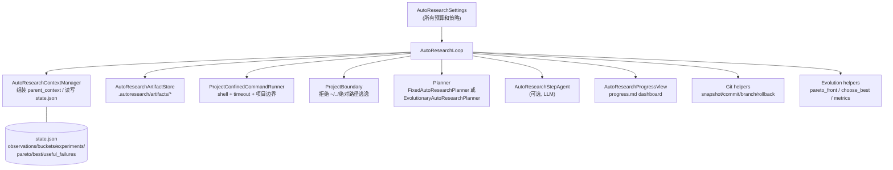
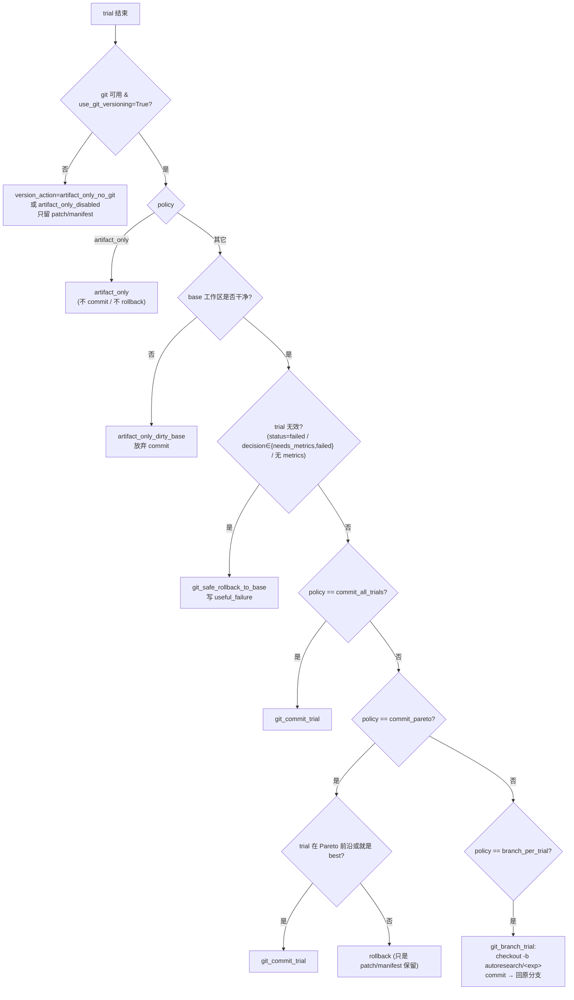
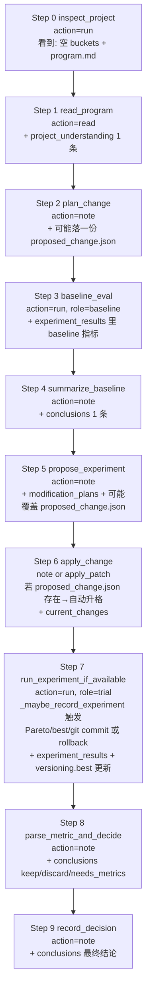
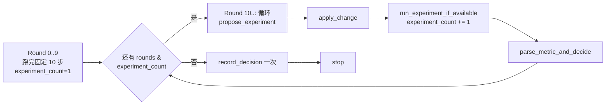

# auto_research 全景说明 — 从 LLM 上下文视角

> 目标读者：想快速搞懂 `autoresearch` 是怎么工作的、"每一步 LLM 看到什么"、以及 skill/tool/loop 三层之间怎么协作的人。
> 覆盖代码：
> - `tools/autoresearch_tool.py`（R-Agent 调用入口）
> - `core/autoresearch_loop.py`（真正的循环 + 上下文管理 + 版本化）
> - `skills/productivity/autoresearch/SKILL.md`（人给 R-Agent 用的手工搭脚手架说明）

---

## 0. 三层视角：谁在跟谁对话？

`autoresearch` 里有 **三个不同的"LLM"用户**，很多人会混淆，先分清楚：



三层各自承担的事：

| 层 | 谁 | 什么时候看到 LLM prompt | 它的记忆 |
|----|-----|----------------------|---------|
| **skill 层** | R-Agent（人在跟它聊天） | 用户第一次说"给我做 autoresearch"时，R-Agent 打开 `SKILL.md` 作为它自己的 prompt 指南 | R-Agent 主对话的 messages |
| **tool 层** | R-Agent（工具调用） | R-Agent 调用 `auto_research_run(...)` | 没有 —— 纯 Python 参数校验和进程启动 |
| **loop 层** | Step-Agent（如果 `use_llm_step_agents=True`） | `AutoResearchLoop` 内部每一 step 都独立开一次 `chat.completions.create` | **只有 `parent_context` 这一坨 JSON**，无 messages 历史 |

> **关键：Step-Agent 是"每 step 一次孤立调用"，跨 step 靠的不是 messages 滚动，而是外层把 `state.json` + `buckets` + `program.md` 打包成 JSON 塞给它。**

---

## 1. Skill 层：`SKILL.md` 是给 R-Agent 看的"手动脚手架说明"

`skills/productivity/autoresearch/SKILL.md` 不是给内层 Step-Agent 看的，它是 R-Agent（外层）在**跟用户聊清楚需求、动手手工搭建项目**时的 checklist。

主要内容：

- **When to use**：用户提"帮我基于这篇论文/仓库做 autoresearch"、"跑 baseline 后单假设实验"等场景。
- **Reference files**：先读 karpathy/autoresearch 的原始 README / program.md / prepare.py / train.py。
- **Core principles**：先定义评估、固定评估协议、单一假设、可回滚、日志驱动、资源有边界、用户需求优先。
- **Target project structure**：手把手告诉 R-Agent 应该给用户项目摊出下面这些文件：

```text
<project>/
  README.md
  prepare.py                # 数据/预处理/常量
  eval.py / eval.sh         # 固定评估协议
  program.md                # ⭐ 后续 loop 反复注入的核心文档
  results.tsv               # 实验记录
  run.log / eval.log
  train/
    train.sh / train.py
  reports/
    autoresearch_report.md
```

- **Workflow（10 步的"人类版"）**：Gather context → build eval → build train → write program.md → uv sync/prepare → git 分支 & results.tsv → baseline → propose one hypothesis → run/parse → keep/discard/rollback → report。
- **Safety & boundaries**：不无授权跑大训练、不改 evaluation harness、不继承无限循环、语音默认关。

**这一层的 LLM 上下文**：R-Agent 主对话把 `SKILL.md` 作为参考塞进它自己的 system/user context，然后一边跟用户聊一边用 `Bash/Read/Write` 之类的通用工具**手工**创建上面这套目录。等文件都摆好了，R-Agent 才调 `auto_research_run(...)` 把控制权丢进 `AutoResearchLoop`。

> ⚠️ **skill 层和 loop 层的 workflow 只是形似**：SKILL.md 里那 10 步是给 R-Agent 手动搭脚手架用的；`FixedAutoResearchPlanner` 里也有 10 步，是 loop 自己跑的。**两者语义相同、执行者不同**：前者做"编辑代码 + 拉起项目"，后者做"跑起来 + 记账"。

---

## 2. Tool 层：`autoresearch_tool.py` 是薄薄的桥

这个文件是 R-Agent 能看到的对外 API，只做四件事：

1. 定义两个 tool：`auto_research_run`、`auto_research_status`。
2. 把 R-Agent 传的参数塞进 `AutoResearchSettings`（`_make_settings`）。
3. 前台模式：直接 `AutoResearchLoop(settings).run()`，返回结果。
4. 后台模式（`background=True`）：
   - 生成 `run_id`；
   - 把 settings 序列化为 JSON；
   - 用 `subprocess.Popen(sys.executable, "-c", _CHILD_CODE, ...)` 启一个子进程，`start_new_session=True`，`stdout/stderr=DEVNULL`；
   - 子进程内部构造一模一样的 `AutoResearchLoop(settings).run()`，同时把 status 写到 `.autoresearch/run_<run_id>.json`；
   - 返回给 R-Agent 一份"我已经排队了"的 JSON，让它靠 `auto_research_status(run_id, project_dir)` 再来查。

关键参数（tool 层暴露的开关）：

| 参数 | 默认 | 作用 |
|------|-----|------|
| `project_dir` | 必填 | 项目根目录，所有路径都会被 `ProjectBoundary` 限死在这里面 |
| `rounds` | 10 | 最多跑多少 workflow step |
| `planner` | `fixed` | `fixed`（跑一遍 10 步）或 `evolutionary`（跑完再循环 propose/apply/run/decide） |
| `use_llm_step_agents` | False | 是否启用内层 Step-Agent；关掉就纯 deterministic fallback |
| `llm_model` | "" | Step-Agent 用哪个模型；空则拿 `core.config.get_model()` |
| `max_experiments` | 4 | 一次调用最多记账多少个 trial |
| `context_char_budget` | 24000 | 父上下文（塞给 Step-Agent 的 JSON）字符总预算 |
| `program_char_budget` | 12000 | program.md 部分预算 |
| `summary_char_budget` | 6000 | 滚动摘要预算 |
| `bucket_item_char_budget` × `bucket_max_items` | 900 × 3 | 每个 bucket 最多 3 条、每条 900 字符 |
| `max_active_context_chars` | 8000 | 人可读的 `active_context.md` 预算 |
| `max_pareto_items` | 8 | Pareto 前沿保留几个 |
| `max_useful_failures` | 3 | 失败/无用 trial 摘要保留几条 |
| `use_git_versioning` | True | 有 git 就记 base commit/status/diff；无 git 安全降级不会 git init |
| `versioning_policy` | `artifact_only` | `artifact_only` / `commit_pareto` / `commit_all_trials` / `branch_per_trial` |
| `background` | False | 后台非阻塞跑 |

`auto_research_status(run_id, project_dir)` 只做一件事：读 `.autoresearch/run_<run_id>.json` + `.autoresearch/progress.md` 前 4000 字，回给 R-Agent 一个"当前跑到哪儿了"的预览。

---

## 3. Loop 层：`core/autoresearch_loop.py` 里的每个组件

`AutoResearchLoop` 是把很多小 helper 组合成的一个 orchestrator。先把角色列清楚：



### 3.1 `AutoResearchSettings`

一个 `@dataclass`，收所有预算/路径/开关。`__post_init__` 里把 `versioning_policy` 和 `planner_kind` 归一化，防止后面 payload/state/progress 里出现不受支持的值。

### 3.2 `ContextBucket` + 7 个默认 bucket

```python
DEFAULT_CONTEXT_BUCKETS = (
    "project_understanding",
    "current_changes",
    "experiment_results",
    "conclusions",
    "modification_plans",
    "open_questions",
    "raw_observations",
)
```

每个 bucket 是一个尾部裁剪队列：`add(text)` 会把太长的条目 truncate 到 900 字符，然后只保留最后 3 条。每 step 结束后 `_apply_bucket_updates` 把 Step-Agent 的 `bucket_updates` 分类塞进去；`_persist_observation` 也用 `_bucket_for_observation` 启发式（`"inspect"→PU`、`"eval/metric/train"→ER`、`"plan"→MP`、`"conclusion/summary"→CC`、`"change/write/diff"→current_changes`）自动分桶。

### 3.3 `AutoResearchAction` 和 workflow step

Loop 支持的 8 种动作（`Decision` 类型）：`run / read / write / apply_patch / web_search / web_extract / note / stop`。

每一 step 是一个 `AutoResearchWorkflowStep`，它有：

- `name` / `action_type`（默认走什么动作）
- `rationale`（会写进 artifact 文件名，也是 `_is_baseline_action` / `_bucket_for_observation` 里的关键字来源）
- `command / path / content / patch / query / urls / max_results`（fallback 时用的默认参数）
- `allowed_tools`（**硬约束**：Step-Agent 返回的 action.type 不在这里就抛错）
- `role`（`"baseline"` / `"trial"` / 空；用来区分 baseline vs 实际实验，替代之前脆弱的 `"baseline" in rationale` 判断）

### 3.4 Planner：谁决定 round_index 对应哪个 step？

**`FixedAutoResearchPlanner`（默认，10 步走一遍）**

```
0 inspect_project   run   (run,read)   project 结构
1 read_program      read  (read)       program.md
2 plan_change       note  (note,read)  草稿一个可逆实验
3 baseline_eval     run   (run)        role=baseline, bash eval.sh 或 train.sh
4 summarize_baseline note (note,read)
5 propose_experiment note (note,read)  唯一改动方案
6 apply_change      note  (apply_patch,note,read)  ← 见 3.6 apply 桥
7 run_experiment_if_available run (run) role=trial, bash train.sh 或 eval.sh
8 parse_metric_and_decide note (note,read)
9 record_decision   note  (note,read)  最终决定
```

超过 10 → 返回 `stop`。

**`EvolutionaryAutoResearchPlanner`（可选，`planner="evolutionary"`）**

跑完 0..9 之后**不 stop**，只要 `experiment_count < max_experiments` 且 `rounds` 还没耗完，就循环回放：

```
propose_experiment → apply_change → run_experiment_if_available → parse_metric_and_decide
```

这 4 个 inner step。等 `experiment_count` 打满 → 尝试再放一次 `record_decision` → 之后返回 `stop`。这是让 `max_experiments`、Pareto、`commit_pareto` 有多个 trial 可用的入口。

### 3.5 `AutoResearchStepAgent`：内层 LLM 的调用契约

**只在 `use_llm_step_agents=True` 时活**。每一 step 独立开一次 `chat.completions.create`：

- `system`：始终一模一样的一段"你是隔离的 auto_research step agent，只吐 JSON，不加 markdown fence，动作必须在 allowed_tools 里，没 metrics 别乱说改进"。
- `user`：一个大 JSON dict，包含：
  - `round_index`
  - `step`: `{ name, fallback_action, allowed_tools, guidance }`（`guidance` 从 `STEP_GUIDANCE` 表查）
  - `parent_context`：见 §4，就是这一步 LLM 唯一的"记忆"
  - `output_schema`：告诉 LLM 该输出 `{action, bucket_updates}` 什么长相

调完之后，`extract_json_object` 从 raw text 里挖 JSON（支持 ```json``` 围栏、纯 JSON、prose 里嵌 JSON）。然后：

1. 校验 `action.type in allowed_tools`，不在就 `AutoResearchSafetyError`；
2. 对 LLM 没给的字段用 `fallback_action` 兜底（`command/path/content/patch/query/urls`）；
3. `bucket_updates` 里不认识的 key 全塞进 `raw_observations`。

`_chat_completion_with_retry` 会按 `llm_retry_attempts + 1` 次重试；旧 shim 不支持 `timeout=` 时会兜底。

任何异常 → 记 `step_agent_errors`，回退到 `fallback_action`（即 planner 的默认动作）。

### 3.6 apply_change 的"note→patch"升格桥（重要）

这是最近修的一个关键闭环 bug，值得单独讲。

历史问题：step 6 的 fallback 是 `note`。deterministic 路径下，`apply_change` 只写一条"skipped"的 note，不改代码。要真改代码，LLM 得亲手写 unified diff，但要求它字符级对齐（否则 `git apply --check` 拒收）。

现在的机制：

```mermaid
flowchart LR
    P2["Step 2 plan_change<br/>或 Step 5 propose_experiment<br/>(允许 note)"] -->|LLM 在 content 里塞<br/>{kind: 'write'/'search_replace', path, ...}| CS["_capture_proposed_change_spec<br/>抽出 JSON change spec<br/>落盘 .autoresearch/proposed_change.json"]
    A["Step 6 apply_change"] --> C{action.type=='apply_patch'<br/>且 patch 非空?}
    C -- 是 --> PASS["直通,用 LLM 原始 patch"]
    C -- 否 --> D{proposed_change.json 存在?}
    D -- 否 --> N["保留原 note<br/>(不改代码)"]
    D -- 是 --> S["_change_spec_to_patch:<br/>write → difflib 生成 unified diff<br/>search_replace → 定位唯一 old snippet 生成 diff"]
    S --> AP["升格为 apply_patch action"]
    AP --> GA["apply_patch_with_git:<br/>git apply --check + git apply"]
```

支持的两种 change spec：

```jsonc
// 覆盖/新建整个文件
{ "kind": "write", "path": "model.py", "content": "..." }

// 唯一替换某段
{ "kind": "search_replace", "path": "model.py", "old": "dropout=0.3", "new": "dropout=0.1" }
```

`search_replace` 要求 `old` 在文件里**只出现一次**（否则 `AutoResearchSafetyError`），避免误替换。`write` 会走 `difflib.unified_diff` 生成 `diff --git a/... b/...` 头的补丁。最终都统一由 `apply_patch_with_git` 用 `git apply --check` + `git apply` 落地，并对 patch 里出现的每条路径做 `ProjectBoundary` 校验。

### 3.7 Runner / Boundary / Patch 安全

- `ProjectBoundary.resolve(path)`：任何相对路径都拼到 `project_dir`，`resolve()` 后必须还在 `project_dir` 下，否则抛错。
- `ProjectBoundary.validate_command_surface(cmd)`：`shlex.split` 后逐 token 检查，`~` 前缀直接拒绝，`/` 绝对路径必须在项目内，`..` 相对逃逸拒绝。
- `ProjectConfinedCommandRunner`：不走全局 `run_command` 审批，直接 `subprocess.run(shell=True, timeout=command_timeout_seconds)`，超时返回带 `timeout=True` 的字典。
- 有两种 patch 引擎：
  - `apply_unified_patch_limited`：Python 手写小 diff engine，不允许删文件/重命名/二进制/绝对路径/`..`，用于 tests 或降级。
  - `apply_patch_with_git`：先扫描每条路径做 boundary 校验，再 `git apply --check` 干跑，通过后再 `git apply`。**loop 实际执行走这个。**

### 3.8 Metric / 决策 / Pareto

- `parse_primary_metric(text)`：从 raw stdout/JSON 里挖 `primary_metric` / `primary_metric_name` / `higher_is_better`，兜底扫 `accuracy/f1/score/loss/val_loss/metric`。
- `extract_metrics_from_text(text, program_text)`：多指标扫，还会 `json.loads` 整个文本看是不是 metrics dict。默认方向按 `_metric_direction` 猜（含 `loss/error/latency/cost/perplexity/wer/cer` → 越小越好；含 `acc/f1/auc/score/success/pass` → 越大越好），program.md 里出现 `minimize/lower is better` 会翻转默认。
- `decide_experiment(metric, baseline, higher_is_better)` → `baseline_recorded / keep / discard / neutral / needs_metrics`。
- `_dominates(a, b, directions)` + `pareto_front(experiments, directions, max_items)` → 非支配集。
- `choose_best_experiment(...)` 挑主指标最好的一条作为 `best_experiment`。
- `_collect_metric_files()` 会主动去读 `metrics.json / results.json / .autoresearch/metrics.json / results.tsv`，补齐指标。

### 3.9 版本化策略（`versioning_policy`）

有 4 种。每个 trial 都会先 `git_snapshot` 拿 base commit + status，跑完再 `git_snapshot` 拿 after，然后按 policy 决策：



三个关键 git helper：

- `git_snapshot`：只读 `rev-parse --is-inside-work-tree / --show-toplevel / HEAD` 和 `status --porcelain`，**永远不 init 也不 mutate**。
- `git_commit_trial`：`add -A .` + `commit -m "auto_research <exp>: ..."`，可指定 branch。
- `git_branch_trial`：先 `checkout -b autoresearch/<exp>`，commit 后 `checkout` 回原 ref。
- `git_safe_rollback_to_base`：`restore --staged .` + `restore --worktree --source=<base_commit> --` **只 rollback tracked/staged 文件**，untracked 保留（避免误删用户新建的 log/artifact）。

### 3.10 experiment 记账（`_maybe_record_experiment`）

只有 `_is_experiment_action` 判定为 trial 的 run action 才计入（依据：`action.role == "trial"`；若 role 缺失，兜底扫 `step_name/rationale/command` 有没有 `trial/experiment/run_experiment` 关键词，避免把 baseline 记成 trial）。

一次实验记录会：

1. `_experiment_count += 1`，超过 `max_experiments` → `_archive_useful_failure`，本轮不再 commit。
2. 从 artifact 文本 + `metrics.json` 系列文件挖 metrics，算 decision。
3. `save_project_diff`：git 可用就存 `diff / diff --cached / status`；不可用就存文件 manifest。
4. 更新 `state["experiments"]`，重算 `pareto_front` + `best_experiment`。
5. 按 policy 走 3.9 的分支。
6. `_write_evolution_artifacts` 把 `best.json` / `pareto_front.json` / `active_context.md` 落盘。

---

## 4. Step-Agent 每次收到的 `parent_context` 长什么样？

由 `AutoResearchContextManager.build_parent_context()` 组装，是**内层 LLM 唯一的记忆入口**：

```jsonc
{
  "project_id": "autoresearch",
  "program_md": "<program.md 内容, ≤ program_char_budget=12000>",
  "modular_context": {
    "project_understanding": ["≤ 3 条, 每条 ≤ 900 字"],
    "current_changes":       [ ... ],
    "experiment_results":    [ ... ],
    "conclusions":           [ ... ],
    "modification_plans":    [ ... ],
    "open_questions":        [ ... ],
    "raw_observations":      [ ... ]
  },
  "state_summary": "<滚动累积摘要, ≤ 6000 字>",
  "recent_observations": [                       // 最近 8 条 compact
    {"kind":"shell","status":"ok",
     "summary":"run rationale=...; metric=0.80 accuracy decision=keep",
     "artifact_path":".autoresearch/artifacts/2026....json",
     "created_at": 1751940000.0}
  ],
  "context_policy": {
    "max_chars": 24000,
    "raw_outputs": "archived separately; parent sees summaries and artifact paths only"
  },
  "versioning": {
    "policy": "commit_pareto",
    "use_git_versioning": true,
    "best_experiment": { "experiment_id": "...", "metrics": {...} } | null,
    "pareto_count": 3
  }
}
```

组装完再用 `_truncate_middle(text, context_char_budget=24000)` 保头保尾 middle-cut，防止总长炸掉。

**四条硬约束（框架真正值钱的地方）：**

1. **raw output 永不进 prompt**：shell 的 stdout/stderr、read 到的整个文件、web_extract 抓下的正文，全落到 `.autoresearch/artifacts/*`，LLM 只看到 summary + 路径。
2. **每类信息各自限重**：`program ≤ 12k`、`state_summary ≤ 6k`、每个 bucket ≤ `3 × 900 = 2.7k`（7 个 bucket 一共 ≤ 18.9k）、`recent_observations ≤ 8` 条。
3. **`allowed_tools` 硬约束**：LLM 返回的 `action.type` 越权直接抛错回 fallback。
4. **`versioning.best/pareto_count` 灌进上下文**：让 Step-Agent 在 `parse_metric_and_decide` / `record_decision` 时知道当前赢家。

---

## 5. 单 round 的完整时序

```mermaid
sequenceDiagram
    participant P as AutoResearchLoop
    participant CM as ContextManager
    participant PL as Planner
    participant SA as StepAgent (LLM)
    participant RN as Runner/FS/Git
    participant AR as ArtifactStore

    loop for round_index in 0..max_rounds
        P->>PL: step_for_round(round_index)
        PL-->>P: step (name, allowed_tools, fallback)
        P->>P: _write_progress("running", step.name, round_index)
        P->>CM: build_parent_context(observations)
        CM-->>P: parent_context (≤ 24k JSON)
        P->>SA: plan_step(step, fallback, parent_context)
        alt use_llm_step_agents=True 且 LLM ok
            SA-->>P: {action, bucket_updates}
            P->>P: _validate_step_tool_scope(action)
        else LLM 关闭 / 失败 / 越权
            P->>P: 用 fallback_action, 记 step_agent_errors
        end
        P->>P: _capture_proposed_change_spec (plan/propose 步骤才生效)
        P->>P: _maybe_hydrate_apply_change (apply_change 步骤才生效)
        P->>P: _apply_bucket_updates(bucket_updates)
        alt is_experiment_action & experiment_count < max_experiments
            P->>RN: git_snapshot() (拿 base_commit)
            P->>RN: execute_action (run/read/write/apply_patch/note/web_*)
            RN->>AR: 存 raw output 为 artifact
            RN-->>P: observation
        else 超预算
            P->>P: _archive_useful_failure, 不执行
        end
        P->>CM: _persist_observation → state.json 
        P->>P: _maybe_record_experiment (metrics, decision, pareto, best, git 版本化)
        P->>AR: _write_evolution_artifacts (best.json / pareto_front.json / active_context.md)
        P->>P: _write_progress(round_index + 1)
        alt action.type == "stop"
            break
        end
    end
    P->>AR: 最终 _write_evolution_artifacts + progress "completed"
```

---

## 6. 10 步的上下文演化（fixed planner，LLM 视角）



信息**只增不减**，直到 bucket 满 3 条被 tail-cut、或总长触 24k 被 middle-truncate。

---

## 7. Evolutionary Planner：多 trial 的循环形态



每一圈 4 个 inner step，圈内 `apply_change` 依赖前一轮 `propose_experiment` 写下的 `proposed_change.json`。Pareto/best 每轮都会重算，版本化按 `versioning_policy` 每轮独立决策。

---

## 8. 落盘的"外挂记忆"（LLM 看不到但一直在长）

每一 step 末尾都会更新的文件：

```
.autoresearch/
├── state.json               # 全量状态: observations / buckets / experiments / metrics / best / pareto / useful_failures
├── artifacts/               # 所有 raw output (shell/read/write/apply_patch/web_*/note/error/diff/manifest)
│   └── 20260708-011200-123-abc_autoresearch_experiment_result_trial_shell.json
├── proposed_change.json     # plan/propose 步骤落下的 JSON change spec，供 apply_change 升格用
├── best.json                # choose_best_experiment 输出
├── pareto_front.json        # 非支配候选
├── active_context.md        # ≤ max_active_context_chars (8000) 的人可读压缩视图
├── progress.md              # 文字 dashboard (进度条/ETA/最近 log tail/versioning 摘要)
└── run_<run_id>.json        # background 模式的状态记录 (queued/running/completed/failed)
```

同时项目根还会长：

- `results.tsv`：每次 `_record_metric` 追加一行（时间/rationale/metric_name/metric/higher/decision/artifact/status）。
- 如果 policy 允许，`git log` 里会出现 `auto_research exp-XXXX-...` 的 commit，或者 `autoresearch/<exp>` 的分支。

Step-Agent 通过 `parent_context` 每 round 只能拿到摘要视图；R-Agent 外层通过 `auto_research_status` 拉的是 `progress.md` 的前 4000 字。

---

## 9. 三层配合的完整生命周期（一次成功的 autoresearch 长什么样）

```mermaid
sequenceDiagram
    participant U as 用户
    participant R as R-Agent (外层)
    participant SK as SKILL.md
    participant FS as 项目文件系统
    participant T as autoresearch_tool
    participant BG as 后台子进程
    participant L as AutoResearchLoop
    participant SA as Step-Agent (内层)

    U->>R: "帮我基于这篇论文做 autoresearch"
    R->>SK: 加载 SKILL.md 作为参考
    R->>U: 澄清目标 / 指标 / 数据集 / 资源边界
    R->>FS: 手工创建 prepare.py/eval.sh/train/train.sh/program.md
    R->>FS: git checkout -b autoresearch/<tag>; 初始化 results.tsv
    R->>T: auto_research_run(project_dir, planner="evolutionary", background=True)
    T->>BG: subprocess.Popen 启动子进程
    T-->>R: {run_id, progress_path}
    R->>U: "已经在后台跑了, run_id=..."
    BG->>L: AutoResearchLoop(settings).run()
    loop for round_index
        L->>L: planner.step_for_round(round_index)
        L->>L: context.build_parent_context
        alt use_llm_step_agents
            L->>SA: chat.completions.create (system + parent_context JSON)
            SA-->>L: {action, bucket_updates}
        else
            L->>L: 用 fallback_action
        end
        L->>L: 校验 allowed_tools
        L->>L: capture change spec / hydrate apply_change
        L->>L: apply bucket_updates
        L->>FS: execute_action → artifact
        L->>L: persist observation & maybe record experiment
        alt trial 有效 & policy 允许
            L->>FS: git commit / branch
        else 无效
            L->>FS: git rollback tracked
        end
        L->>FS: 写 best.json / pareto_front.json / active_context.md / progress.md
    end
    L-->>BG: 结束状态
    BG->>FS: 更新 run_<run_id>.json 为 completed
    U->>R: "跑得怎么样了?"
    R->>T: auto_research_status(run_id)
    T->>FS: 读 run_<run_id>.json + progress.md
    T-->>R: {status:"completed", progress_preview:"..."}
    R->>U: 汇报最佳指标、Pareto 集、useful_failures
```

---

## 10. 一句话总结

- **skill 层**：R-Agent 照 `SKILL.md` 跟用户对话、手搓项目脚手架（`program.md/eval.sh/train/...`）。
- **tool 层**：`autoresearch_tool.py` 只是把参数打包丢给 `AutoResearchLoop`，可选后台。
- **loop 层**：固定或演化 workflow，每 step 单独一次 LLM 调用，无 messages 历史，靠 `parent_context` 这坨预算严格 (≤ 24k) 的 JSON 传递记忆；raw output 全外挂到 artifacts；experiment/metric/Pareto/best 全部记账；版本化按 policy 决定 commit/branch/rollback；每步落一份人可读 `progress.md` 供外层轮询。

**能做**：结构化实验记账、多目标 Pareto 治理、可选 LLM 演化循环、JSON change spec → 自动生成 unified diff → git apply 的代码修改闭环、非 git 安全降级、后台跑 + 文字 dashboard。

**明确不做**：滚动 messages 的开放式 agent、program.md 里声明 workflow、真正意义的 shell 沙箱（只做路径边界，不隔离进程）、跨 `auto_research_run` 会话的状态热续（状态是靠 `.autoresearch/state.json` 磁盘化的，重启会读回来，但没有跨项目共享）。
