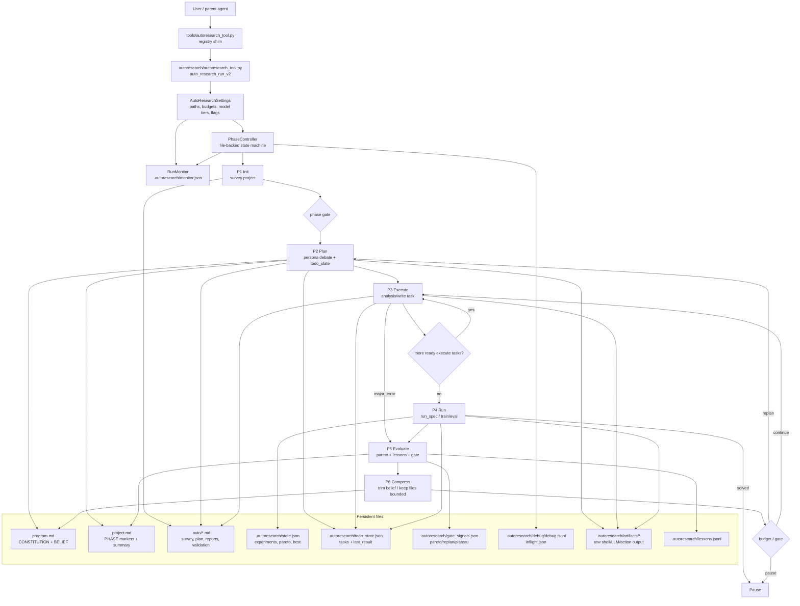
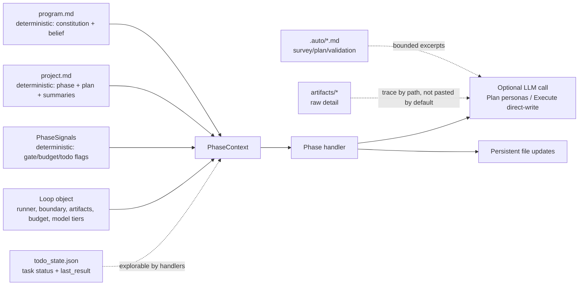
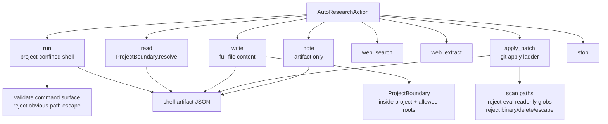

# AutoResearch Loop Context and Change Audit

This document has two purposes:

1. Audit the current `autoresearch` implementation against the first commit in this checkout.
2. Describe the current AutoResearch v2 loop from the perspective of context, files, actions, and safety boundaries.

Baseline used for comparison:

```text
7c45f46 baseline: R-Agent auto_research branch + prior autoresearch fixes
```

Current comparison summary:

```text
34 files changed, 9169 insertions(+), 82 deletions(-)
```

Current uncommitted delta on top of `HEAD` is concentrated in the `autoresearch/` runtime package, the thin `tools/autoresearch_tool.py` registry shim, planning/execution tests, and documentation. There are also unrelated dirty files in the working tree (`README.md`, `core/config.py`, `requirements.txt`, `AUTORESEARCH_HANDOFF.md`) that are not part of the loop design described here unless explicitly called out.

## Change Audit

### Necessary Core Additions

These changes are required for a large-project AutoResearch loop rather than a one-shot toy runner.

| Area | Files | Why it is needed |
|---|---|---|
| Runtime package | `autoresearch/` | Keeps AutoResearch code together inside the larger R-Agent repository instead of scattering it through generic `core/`. |
| Phase machine | `autoresearch/autoresearch_phases.py`, `autoresearch/autoresearch_phase_handlers.py` | Separates Plan, Execute, Run, Evaluate, Compress. Enables state to live in files instead of growing chat history. |
| Layered memory | `autoresearch/autoresearch_memory.py` | Defines `program.md` constitution/belief, `project.md` phase state, `.auto/*.md`, and `lessons.jsonl`. |
| Structured tasks | `autoresearch/autoresearch_todo_state.py` | Replaces free-form plan text with `todo_state.json`, dependencies, status, `run_spec`, and `last_result`. |
| Plan debate | `autoresearch/autoresearch_personas.py` | Produces a project belief, human-readable plan, structured todo state, and archived transcript. |
| Execute/Run handlers | `autoresearch/autoresearch_execution.py` | Implements task execution, safe LLM write path, run specs, behavior verification, and metric-aware run updates. |
| Monitor/debug | `autoresearch/autoresearch_monitor.py`, `autoresearch/autoresearch_debug.py`, `autoresearch/autoresearch_budget.py` | Makes background runs observable without LLM: phase, budget, inflight shell/LLM, stale PID, debug event stream. |
| LLM deadline | `autoresearch/autoresearch_timeout.py` | Prevents provider timeout behavior from blocking the phase loop forever. |
| Tool bridge | `autoresearch/autoresearch_tool.py`, `tools/autoresearch_tool.py` | The real implementation lives in the package; the `tools/` file is intentionally kept as a thin registry-discovery shim. |
| Tests | `tests/test_autoresearch_v2_*`, `tests/test_autoresearch_todo_state.py`, etc. | Covers phase routing, task merge, execute/run behavior, monitor, preflight, deadline, and integration. |

### Reasonable but Needs Continued Refinement

These are directionally correct, but are still rough or should be simplified as the framework matures.

| Area | Current behavior | Why it is reasonable | Risk / follow-up |
|---|---|---|---|
| Direct-write executor | Execute first asks for JSON full-file write, including optional `files` bundle. | More reliable than hand-authored patches; good for isolated code changes. | Still depends on LLM code generation quality and can time out on broad tasks. |
| Execute behavior check | After write/apply, optionally runs a train-side command and records outputs. | Prevents "py_compile passed but behavior unchanged" from looking done. | Needs project-specific command discovery beyond train/train.sh. |
| Fail-fast on Execute LLM timeout | Direct-write deadline becomes a failed task rather than launching another large LLM request. | Stops repeated 45s hangs and forces Evaluate/Replan. | May fail too aggressively when a second, smaller repair would have worked. |
| Natural-language Plan parsing | Leader prose is parsed into tasks and coalesced. | Practical bridge until leader emits strict task JSON. | Should move to explicit JSON task output to reduce misclassification. |
| RunSpec | Run tasks can define `single`, `loop`, `long_job`. | Separates "write code" from "run experiment" and prevents hidden repeated evals. | Needs better UX and project-level run command discovery. |
| Monitor stale PID | `read_monitor` flags running monitor with missing PID. | Prevents stale background runs from looking healthy. | PID namespaces can make this conservative; it marks stale instead of forcibly changing status. |

### Redundant or Questionable Work

These should be treated as candidates for cleanup.

| Item | Why questionable | Recommendation |
|---|---|---|
| Multiple docs with overlapping explanations (`AUTORESEARCH_DESIGN_v2.md`, `AUTORESEARCH_FLOW.md`, `AUTORESEARCH_小学生版.md`, this doc, roadmap) | Useful during exploration, but can diverge. | Keep one architecture source of truth plus one roadmap; archive older explanatory docs. |
| Legacy `AutoResearchLoop` planner path and v2 phase machine both active | The repo now has a legacy step workflow and v2 phase workflow. | Keep legacy for compatibility but document v2 as primary; avoid adding new features to both. |
| Large uncommitted changes in unrelated files (`README.md`, `core/config.py`, `requirements.txt`) | They may be user edits or separate work; they blur review scope. | Review separately before staging or committing. |
| Natural-language task classifier regex growth | Regexes are brittle. | Replace with leader-emitted typed task JSON when possible. |
| Search-driver auto-discovery in Run | Can accidentally run generated scripts if naming matches. | Prefer explicit `run_spec`; keep discovery conservative. |
| Provider-style task-specific scaffolds | They solve tests by protocol special-casing. | Removed. Do not reintroduce in core. If ever needed, place outside core and require explicit user opt-in. |

## Current V2 Loop: Big Picture



## Context Model

The design goal is step isolation: each phase receives bounded, persisted context rather than the entire prior LLM conversation.



### Deterministic Context

This is read directly and always available to handlers:

| Context | Source | Who uses it |
|---|---|---|
| Root path | `AutoResearchSettings.project_dir` | All phases |
| Program text | `program.md` | Init, Plan, Execute, Run, Compress |
| Project text and phase marker | `project.md` | PhaseController, Plan, Evaluate |
| Gate signals | `.autoresearch/gate_signals.json` | PhaseController, Gate/Compress routing |
| Budget state | `.autoresearch/budget.json` via `BudgetLedger` | PhaseController, Plan degradation, monitor |
| Todo state | `.autoresearch/todo_state.json` | Execute, Run, Plan merge |
| Loop services | `ProjectConfinedCommandRunner`, `ProjectBoundary`, artifact store | Execute, Run, actions |

### Explorable Context

The LLM can see bounded excerpts or paths to these, and can use action choices to inspect more when allowed:

| Context | How exposed | Limits |
|---|---|---|
| `.auto/survey.md` | Plan/Execute snippets | Truncated by `read_auto_notes` |
| `.auto/plan.md` / rendered todo state | Plan and Execute context | Truncated |
| `.auto/execute_validation.md` | Direct-write support context | Short summary only |
| `.autoresearch/artifacts/*` | Artifact paths in last_result/state/debug | Not pasted by default |
| Train-side source snippets | `_direct_write_support_context`, `_train_side_snippets` | Char-budgeted |
| Search/run logs | `outputs/search_log.jsonl`, `metrics.json`, `outputs/submission.json` | Read by run helpers and behavior check |

## Phase-by-Phase Contract

### P1 Init

Purpose: make a bounded project survey without LLM.

Deterministic context:

- Project root.
- File tree excluding `.git`, `.autoresearch`, `.auto`, venvs, node modules.
- First lines of selected source/config/docs files.

Explorable context:

- The generated `.auto/survey.md` can later be read by Plan/Execute.

Intermediate files:

- `.auto/survey.md`
- `project.md` overview section

Operations:

- Read project files.
- Write `.auto/survey.md`.
- Garbage collect `.auto/*.md` via `gc_auto_dir`.

Restrictions:

- No LLM.
- No code modification.
- Bounded file count and head lines only.

### P2 Plan

Purpose: convert current state into a belief, human-readable plan, and structured tasks.

Deterministic context:

- `program.md` constitution/belief.
- `project.md`.
- Budget degradation signal.
- Existing `todo_state.json` for merge.
- Existing experiment presence for baseline checkpoint insertion.

Explorable context:

- Personas see only bounded stable context: constitution, belief, project.
- Full transcript is archived, not injected into project state.

Intermediate files:

- `program.md` BELIEF updated if writable.
- `project.md` "当前计划" section.
- `.auto/plan.md` rendered from `todo_state`.
- `.autoresearch/todo_state.json`.
- `.autoresearch/artifacts/*plan_debate.json`.

Operations:

- LLM calls for `divergent`, `pragmatic`, and `leader`, bounded by `llm_request_timeout`.
- Parse leader `detailed_plan` into tasks.
- Coalesce implementation bullets.
- Insert baseline validation before first implementation if no metric experiment exists.
- Merge planned tasks with existing progress.

Restrictions:

- Leader transcript never goes into `project.md`.
- Natural-language parsing is a compatibility layer; it is not a perfect planner.
- Validation tasks become Run-owned tasks via `run_spec`.

### P3 Execute

Purpose: make or verify safe project-confined changes for ready Execute tasks.

Deterministic context:

- `todo_state.json` ready execute tasks, dependencies, status.
- Current task's `last_result`, attempts, subgoal index.
- `program.md`, `project.md`, `.auto/plan.md`.
- Editable train-side inventory.
- Existing train-side snippets.
- `.auto/execute_validation.md` summary if present.

Explorable context:

- Artifact paths from previous task results.
- Direct-write prompt can include support snippets and task context.
- Fallback StepAgent can receive compact context after direct-write errors.

Intermediate files:

- Modified project files under allowed write roots.
- `.auto/execute_report.md`.
- `.auto/execute_validation.md`.
- `.autoresearch/todo_state.json` last_result with behavior and artifacts.
- `.autoresearch/artifacts/*write.json`, `*apply_patch.json`, `*execute_behavior.json`.
- `.autoresearch/execute_cursor.json`.

Operations:

| Operation | Source | Purpose | Scope | Restrictions |
|---|---|---|---|---|
| Analysis task | Deterministic handler | Write bounded file snippets into `.auto/analysis_<task>.md` | Read project files | Project-confined, bounded paths |
| Direct write | LLM JSON `{path, content}` or `{files:[...]}` | Full-file write of one or a few train-side files | `train/`, `src/`, `scripts/` | Reject `..`, eval/oracle filenames, readonly eval globs |
| StepAgent fallback | LLM `AutoResearchAction` | Mutating `write` or `apply_patch` if direct-write fails non-timeout | Project-confined | Allowed tools `write`, `apply_patch` only |
| Apply change spec | Deterministic hydration | Convert queued JSON change spec into patch | Existing proposed spec | Safety and readonly guards |
| Static verification | deterministic | `py_compile` changed Python files; verify patch touched files | Project files | Fails no-op patches |
| Behavior check | deterministic command | Run train-side entrypoint once and record outputs | `bash train/train.sh` or `python3 train/train.py` | Does not call final eval; timeout bounded |

Restrictions and failure behavior:

- A task is done only when `verification == True`.
- Timeout from direct-write becomes `execute_direct_write_timeout`; it does not start a second large LLM request.
- Failed current task keeps cursor on the same task until it is verified or failed.
- If there is no plan/todo, Execute requests replan instead of inventing a vague task.
- No task-specific provider is present in core.

### P4 Run

Purpose: run project/experiment commands and record metric-bearing evidence.

Deterministic context:

- Ready Run task from `todo_state.json`.
- `run_spec` (`mode`, `commands`, `max_iters`, `max_seconds`, monitor commands).
- Existing search driver discovery if enabled.
- `metrics.json`, `outputs/submission.json`, `outputs/search_log.jsonl`.

Explorable context:

- Shell artifacts with full stdout/stderr.
- Search logs and metric files.

Intermediate files:

- `.autoresearch/append_search_log.py`.
- `outputs/search_log.jsonl`.
- `metrics.json`.
- `outputs/submission.json`.
- `.autoresearch/state.json` experiment observations.
- `.autoresearch/artifacts/*shell.json`, manifests/diffs.
- `results.tsv`.
- `todo_state.json` run task result.

Operations:

| Run mode | Meaning | Behavior |
|---|---|---|
| `single` | One command sequence | Run once, record metric |
| `loop` | Repeated command sequence | Repeat until max iters/seconds/error |
| `long_job` | Submit + monitor | Run submit command, optionally one monitor command |

Restrictions:

- Project-confined shell runner rejects obvious path escapes.
- Fallback repeated eval loops require explicit `run_spec` or search driver.
- No global solved threshold. Completion is project-owned and must be declared in `program.md` under a completion/stopping criteria section.
- In the V3 path, Run does not decide commit/rollback. It records evidence; Conclude finalizes governance.

### P5 Evaluate

Purpose: finalize experiment governance, update gate signals, write lessons, and update `project.md`.

Deterministic context:

- `.autoresearch/state.json`.
- `project.md` phase reason.
- `ctx.signals.major_error`.
- Prior gate state.

Explorable context:

- Best experiment artifact paths.
- Lessons ledger.

Intermediate files:

- `.autoresearch/gate_signals.json`.
- `.autoresearch/lessons.jsonl`.
- `project.md` "短期结论".
- `.autoresearch/best.json`.
- `.autoresearch/pareto_front.json`.
- `.autoresearch/active_context.md`.

Operations:

- Recompute `best_experiment` and `pareto_front`.
- Apply `versioning_policy`: `artifact_only`, `commit_pareto`, `commit_all_trials`, or `branch_per_trial`.
- Commit kept best/Pareto trials when policy allows.
- Roll back non-kept or failed tracked changes when policy and git state allow.
- Write one lesson for every finalized experiment, whether it improved, failed, or was discarded.
- Detect Pareto changes.
- Increment plateau counter.
- Set `plan_still_valid` and `needs_replan`.
- Append insight/dead_end/operational_error lesson.

Restrictions:

- Does not run experiments.
- Does not mutate train/eval files.

### P6 Compress

Purpose: bound mutable belief size and route next phase.

Deterministic context:

- `program.md` constitution/belief.
- Gate signals and budget signals.

Explorable context:

- Lessons and artifacts remain on disk, not compressed away.

Intermediate files:

- Updated `program.md` BELIEF if oversized.
- Phase marker in `project.md` via controller.

Operations:

- Trim belief section if too large.
- Route to Plan, Execute, or Pause through gates.

Restrictions:

- Does not delete lessons.
- Does not rewrite constitution.

## Action Surface and Safety



General boundaries:

- Path resolution is project-confined.
- Evaluation read-only globs protect `prepare.py`, `eval.sh`, `eval/**`, `evaluation/**`.
- Write actions call `_ensure_write_allowed` and `_ensure_not_readonly_eval`.
- Patches are scanned before apply.
- Shell commands are run with timeout and simple path escape rejection.
- Full raw outputs are artifacts; prompts get summaries and paths.

## Current Assessment

Necessary:

- Phase machine, layered files, structured todo state, run specs, evaluate gate, monitor/debug, LLM deadlines, behavior checks.

Reasonable:

- Direct-write full-file JSON action.
- Multi-file write bundles.
- Fail-fast after LLM deadline.
- Task cursor staying on unverified task.
- Stale PID monitor check.

Still weak:

- Plan should emit typed JSON tasks directly instead of regex parsing prose.
- Execute's general coding loop still depends heavily on LLM producing correct code in one shot.
- Run command discovery should prefer explicit project config over filename heuristics.
- Several docs overlap and should be consolidated.

Removed/Rejected:

- Task-specific x/y black-box bootstrap provider. It made the test look better but polluted the core design.
