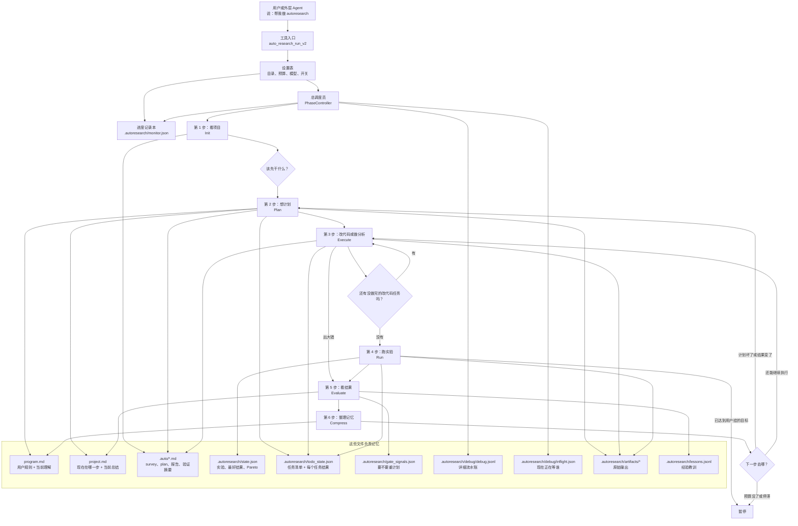
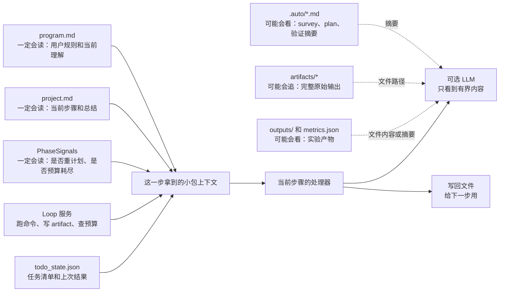
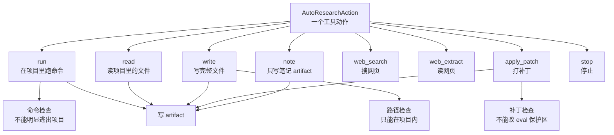

# AutoResearch Loop 小学生版说明

这份文档用尽量简单的话讲清楚一件事：`autoresearch` 现在到底是怎么工作的，它改了多少东西，哪些改动有用，哪些改动还不够好，哪些东西应该删掉。

你可以把 `autoresearch` 想成一个“自动做实验的小助手”。它不是一次性回答问题，而是反复做下面这些事：

1. 先看看项目里有什么文件。
2. 想一个计划。
3. 按计划改一点代码。
4. 跑项目，看看分数有没有变好。
5. 把结果记下来。
6. 如果还没好，就再想新计划。

它最重要的原则是：不要把所有聊天记录一直塞给 LLM。每一步结束后，都把重要信息写到文件里。下一步只读需要的文件和摘要。如果想查细节，再顺着文件路径去看原始记录。

## 1. 这次和最开始相比，改了多少

本仓库最开始的基线是这个 git 提交：

```text
7c45f46 baseline: R-Agent auto_research branch + prior autoresearch fixes
```

从这个基线到现在，大概改了这么多：

```text
34 files changed, 9169 insertions(+), 82 deletions(-)
```

意思是：一共动了 34 个文件，加了 9169 行，删了 82 行。大部分新增内容都和 AutoResearch v2 有关。

当前还没有提交的 AutoResearch 改动主要已经整理到 `autoresearch/` 文件夹里。这个仓库根目录叫 R-Agent，`autoresearch/` 只是其中一个子系统。

```text
autoresearch/autoresearch_execution.py
autoresearch/autoresearch_loop.py
autoresearch/autoresearch_monitor.py
autoresearch/autoresearch_personas.py
autoresearch/autoresearch_phase_handlers.py
autoresearch/autoresearch_phases.py
autoresearch/autoresearch_step_runtime.py
autoresearch/autoresearch_tool.py
tools/autoresearch_tool.py    # 只是给 R-Agent 工具注册用的薄入口
tests/test_autoresearch_v2_execution.py
tests/test_autoresearch_v2_monitor.py
tests/test_autoresearch_v2_personas.py
tests/test_autoresearch_step_runtime.py
```

工作区里还有这些文件也脏着：

```text
README.md
core/config.py
requirements.txt
AUTORESEARCH_HANDOFF.md
```

这些文件可能是别的任务或用户自己改的。本文档不把它们当成这次 loop 设计的核心改动。

## 2. 哪些改动是必须要有的

这些东西像房子的地基。没有它们，`autoresearch` 很难用于大项目。

| 改动 | 文件 | 用小学生能懂的话说 |
|---|---|---|
| 把 AutoResearch 代码放在一起 | `autoresearch/` | R-Agent 是大房子，AutoResearch 是其中一个房间。把这个房间里的东西放在一个文件夹里，阅读和修改都更清楚。 |
| 把大流程拆成几个步骤 | `autoresearch/autoresearch_phases.py`, `autoresearch/autoresearch_phase_handlers.py` | 不再让一个大脑一次做完所有事，而是分成“看项目、想计划、改代码、跑实验、看结果、整理”。 |
| 把记忆写进文件 | `autoresearch/autoresearch_memory.py` | 不靠一直聊天记住事情，而是写到 `program.md`、`project.md`、`.auto/`、`lessons.jsonl` 里。 |
| 用任务清单记进度 | `autoresearch/autoresearch_todo_state.py` | 不再只写一段文字计划，而是用 `todo_state.json` 记录每个任务有没有做完、失败了几次、上次结果是什么。 |
| 让 Plan 阶段会讨论 | `autoresearch/autoresearch_personas.py` | 让几个不同角色先提意见，再由 leader 总结成一个计划。 |
| 执行和运行分开 | `autoresearch/autoresearch_execution.py` | “改代码”和“跑实验”分开。改代码以后要检查是不是真的生效。 |
| 有进度条和 debug | `autoresearch/autoresearch_monitor.py`, `autoresearch/autoresearch_debug.py`, `autoresearch/autoresearch_budget.py` | 可以知道现在卡在哪一步、花了多少 token、是不是正在等 LLM 或 shell。 |
| 给 LLM 设置硬截止时间 | `autoresearch/autoresearch_timeout.py` | 如果 LLM 调用一直不回来，框架不能傻等，要先往下走或失败重试。 |
| 给外部 Agent 调用的工具 | `autoresearch/autoresearch_tool.py`, `tools/autoresearch_tool.py` | 真正代码在 `autoresearch/` 里；`tools/` 下保留一个很薄的入口，是因为 R-Agent 的工具注册器会扫描 `tools/`。 |
| 测试 | `tests/test_autoresearch_v2_*` 等 | 保证这些逻辑不会一改就坏。 |

## 3. 哪些改动是合理的，但还不够完美

这些东西方向对，但以后还要继续改。

| 改动 | 现在怎么做 | 为什么还可以 | 不够好的地方 |
|---|---|---|---|
| 让 LLM 直接写完整文件 | Execute 让 LLM 返回 JSON，比如 `{path, content}` 或 `{files:[...]}` | 比让 LLM 手写 patch 稳一些。 | 如果任务太大，LLM 还是可能写不出来或超时。 |
| 改完代码后跑一次行为检查 | 写完后跑 `bash train/train.sh` 或 `python3 train/train.py` | 不能只看语法对不对，还要看运行产物有没有变。 | 目前更懂 train 项目，对其他项目的命令发现还不够通用。 |
| LLM 超时就快点失败 | Direct-write 超时后不再马上发第二个大 LLM 请求 | 避免连续等很多个 45 秒。 | 有时第二个更小的修复请求可能真的能成功，所以以后要设计得更聪明。 |
| 把自然语言计划变成任务 | 现在用规则和正则从 leader 的文字里拆任务 | 暂时能用。 | 正则容易误判，最好让 leader 直接输出 JSON 任务。 |
| `run_spec` | Run task 里写清楚要跑什么命令、跑几次、最多多久 | 比偷偷循环 eval 更安全。 | 需要更好地从项目里发现默认运行命令。 |
| stale monitor 检测 | 如果 monitor 说还在跑，但 pid 没了，就标记 stale | 用户看进度时不会被骗。 | 不同系统的 pid namespace 可能让判断不完全准，所以只是标记，不强行改状态。 |

## 4. 哪些东西比较冗余，应该以后清理

| 东西 | 问题 | 建议 |
|---|---|---|
| 很多份说明文档 | `AUTORESEARCH_DESIGN_v2.md`、`AUTORESEARCH_FLOW.md`、`AUTORESEARCH_小学生版.md`、roadmap、本文档都在讲 autoresearch，容易互相不一致。 | 最后应该只留一份架构主文档和一份 roadmap，其他归档。 |
| legacy loop 和 v2 loop 同时存在 | 旧的 `AutoResearchLoop` step workflow 和新的 v2 phase workflow 都还在。 | 旧的保留兼容，新功能只加到 v2。 |
| 无关脏文件 | `README.md`、`core/config.py`、`requirements.txt` 可能不是本轮 loop 核心改动。 | 单独 review，不和 loop 改动混在一起。 |
| Plan 的正则分类越来越多 | 靠关键词判断任务类型，不够稳。 | 让 Plan 直接输出结构化 JSON。 |
| Run 自动找 search driver | 只靠文件名猜，可能误跑。 | 优先用明确的 `run_spec`。 |
| 任务专用 provider / scaffold | 这种东西会让框架为了某个测试而作弊式变强。 | 已删除。不要放进 core。 |

## 5. 整个 AutoResearch v2 像什么

可以把它想成一个“做实验的流水线”：



这张图的意思是：

- 用户不会直接控制每一步。
- 工具入口先创建设置。
- `PhaseController` 像总调度员，决定现在跑 Init、Plan、Execute、Run、Evaluate 还是 Compress。
- 每一步都把结果写进文件。
- 下一步不靠“记住全部聊天”，而是重新读这些文件。

## 6. 什么叫“确定性上下文”和“可探索上下文”

这两个词很重要。

确定性上下文，就是这一步一定会读到的信息。比如：

- 项目目录在哪里。
- `program.md` 里用户写了什么规则。
- `project.md` 里现在处于哪一步。
- `todo_state.json` 里哪些任务做完了。
- `gate_signals.json` 里是不是需要重新计划。

可探索上下文，就是这一步不一定全部读，但可以顺着线索去找的信息。比如：

- `.auto/survey.md` 里有项目概览。
- `.auto/execute_validation.md` 里有上次改代码后的运行结果。
- `.autoresearch/artifacts/*` 里有完整 shell 输出或 LLM 原始返回。
- `outputs/search_log.jsonl`、`metrics.json` 里有实验结果。

画成图就是：



重点是：LLM 不会天然知道所有东西。框架只给它一小包上下文。如果它需要细节，就必须通过文件路径、artifact、摘要去追。

## 7. 第 1 步 Init：先看看项目

Init 就像先翻一下作业本目录，不开始做题。

它一定知道：

- 项目根目录。
- 项目里有哪些文件。
- 一些关键文件开头几行。

它可能给后面留下的线索：

- `.auto/survey.md`，里面是项目概览。

它会产生这些文件：

```text
.auto/survey.md
project.md
```

它能做什么：

- 读取项目文件。
- 写 `.auto/survey.md`。
- 清理太多旧的 `.auto/*.md`。

它不能做什么：

- 不调用 LLM。
- 不改代码。
- 不读无限多文件，只读有上限的文件数量和开头几行。

## 8. 第 2 步 Plan：想一个计划

Plan 就像几个人先讨论“下一步该怎么做”，最后让一个 leader 写计划。

它一定知道：

- `program.md`：用户给的规则和当前理解。
- `project.md`：现在项目状态。
- 预算是否紧张。
- 之前的 `todo_state.json`。
- 是否已经跑过 baseline。

它可能参考：

- Init 写的 `.auto/survey.md`。
- 之前的计划、结果、经验文件。

它会产生这些文件：

```text
program.md                     # 只更新 BELIEF 部分，不能改用户规则
project.md                     # 写当前计划
.auto/plan.md                  # 把任务清单渲染成人能看的 Markdown
.autoresearch/todo_state.json  # 机器看的任务清单
.autoresearch/artifacts/*plan_debate.json
```

它能做什么：

- 让 `divergent` 角色提新想法。
- 让 `pragmatic` 角色挑可行方案。
- 让 `leader` 角色做最后决定。
- 如果输入是大仓库，R-Agent 在构建 autoresearch 项目脚手架前，应该先用 `skills/agent_ops/codebase_scout/SKILL.md` 建项目地图，再把地图整理进 `program.md`、`eval.sh`、`train/train.sh` 和报告里。
- 把 leader 的计划拆成任务。
- 如果还没 baseline，就先插入 baseline 任务。
- 把新任务和旧任务合并，不随便丢掉已有进度。

它不能做什么：

- 不能把完整讨论塞进 `project.md`。
- 不能修改用户写死的 constitution。
- 现在还不能完美理解自然语言计划，因为它还在用规则和正则拆任务。

## 9. 第 3 步 Execute：按计划改一点东西

Execute 就像真正开始写作业。它只处理“该改代码或分析文件”的任务，不负责最终跑分。

它一定知道：

- `todo_state.json` 里哪些 Execute 任务 ready。
- 当前任务上次有没有失败。
- 当前任务试了几次。
- 当前任务做到第几个小目标。
- `program.md`、`project.md`、`.auto/plan.md`。
- 可编辑的 train-side 文件清单。
- 一些 train-side 文件片段。
- 如果有 `.auto/execute_validation.md`，也会看上次验证摘要。

它可能追查：

- 上次任务留下的 artifact 路径。
- `.autoresearch/artifacts/*` 里的完整原始输出。
- `.auto/analysis_*.md`。

它会产生这些文件：

```text
被修改的项目文件
.auto/execute_report.md
.auto/execute_validation.md
.autoresearch/todo_state.json
.autoresearch/artifacts/*write.json
.autoresearch/artifacts/*apply_patch.json
.autoresearch/artifacts/*execute_behavior.json
.autoresearch/execute_cursor.json
```

Execute 里有几种操作：

| 操作 | 谁做 | 用来干什么 | 能碰哪里 | 不能干什么 |
|---|---|---|---|---|
| Analysis task | 程序自己 | 把一些文件片段写到 `.auto/analysis_<task>.md` | 只能读项目内文件 | 不能无限读，路径有界 |
| Direct write | LLM | 返回 JSON，要求写完整文件 | `train/`、`src/`、`scripts/` | 不能写 eval/oracle 文件，不能路径逃逸 |
| Multi-file write | LLM | 一次写多个文件，比如模块和入口脚本 | 同上 | 最多只是一小组文件，不是乱改全项目 |
| StepAgent fallback | LLM | direct-write 非超时失败时，再用较小上下文试一次 | 项目内 | 只允许 `write` 或 `apply_patch` |
| Apply change spec | 程序自己 | 把 JSON 改动说明转成 patch | proposed change 指向的文件 | 不能改只读 eval 文件 |
| Static verification | 程序自己 | 检查 Python 文件能不能编译，patch 是否真改到了文件 | 项目文件 | no-op patch 不能算成功 |
| Behavior check | 程序自己 | 跑一次 train-side 命令，看产物有没有出来 | `bash train/train.sh` 或 `python3 train/train.py` | 不跑最终 eval，超时有上限 |

Execute 的失败规则：

- 只有 `verification == True`，任务才算完成。
- Direct-write 超时会记录成 `execute_direct_write_timeout`。
- Direct-write 超时后不会马上再发第二个大 LLM 请求。
- 当前任务没完成时，不会跳到下一个任务。
- 没有 plan 或 todo 时，会要求重新 Plan，不会凭空编一个任务。
- core 里没有任何任务特定 provider。

## 10. 第 4 步 Run：真正跑实验

Run 就像把作业交给机器跑一遍，看分数。

它一定知道：

- `todo_state.json` 中 ready 的 Run task。
- 这个 Run task 的 `run_spec`。
- `run_spec` 里写了命令、运行模式、最多跑几次、最多跑多久。
- `metrics.json`、`outputs/submission.json`、`outputs/search_log.jsonl`。

它可能追查：

- shell artifact 的完整 stdout/stderr。
- search log。
- metrics 文件。

它会产生这些文件：

```text
.autoresearch/append_search_log.py
outputs/search_log.jsonl
metrics.json
outputs/submission.json
.autoresearch/state.json  # 这里只写实验观察记录
.autoresearch/artifacts/*shell.json
results.tsv
.autoresearch/todo_state.json
```

Run 有三种模式：

| 模式 | 小学生版解释 | 实际行为 |
|---|---|---|
| `single` | 跑一次 | 执行一遍命令，记录分数 |
| `loop` | 跑多次 | 重复跑到次数/时间用完或出错 |
| `long_job` | 提交长任务 | 先提交，再可选查一次状态 |

Run 的限制：

- 命令只能在项目内跑。
- 明显路径逃逸会被拒绝。
- 不会随便无限 eval。
- 通用框架没有全局 solved 阈值。是否完成必须由项目自己的 `program.md` 在“完成/停止标准”里声明。
- 在 V3 主流程里，Run 不负责 commit 或 rollback。Run 只交成绩单，Conclude 再决定要不要保留这次修改。

## 11. 第 5 步 Evaluate / Conclude：判断这次有没有用

Evaluate / Conclude 就像老师看分数单，判断这次有没有进步，还要决定这次修改要不要提交或回滚。

它一定知道：

- `.autoresearch/state.json` 里的实验记录。
- `project.md` 里的 phase reason。
- 当前是否有 major error。
- 之前的 gate state。

它可能追查：

- best experiment 的 artifact。
- lessons ledger。

它会产生这些文件：

```text
.autoresearch/gate_signals.json
.autoresearch/lessons.jsonl
project.md
.autoresearch/best.json
.autoresearch/pareto_front.json
.autoresearch/active_context.md
```

它能做什么：

- 重新计算 best experiment。
- 重新计算 Pareto front。
- 按 `versioning_policy` 做 `artifact_only`、`commit_pareto`、`commit_all_trials` 或 `branch_per_trial`。
- 如果是值得保留的 best/Pareto，按策略 commit。
- 如果变差或失败，且 git 状态允许，按策略 rollback。
- 无论成功、失败、变差，都会写 lesson。
- 看 Pareto 有没有变化。
- 如果没有进步，增加 plateau counter。
- 决定 plan 还是否有效。
- 决定是否需要 replan。
- 写入 lesson，比如 insight、dead_end、operational_error。

它不能做什么：

- 不跑实验。
- 不改 train/eval 文件。

## 12. 第 6 步 Compress：整理记忆

Compress 就像把太长的笔记缩短一点，避免以后读不动。

它一定知道：

- `program.md` 里的 constitution 和 belief。
- gate signals。
- budget signals。

它可能保留：

- lessons。
- artifacts。

它会产生这些文件：

```text
program.md
project.md
```

它能做什么：

- 如果 `program.md` 的 BELIEF 太长，就裁短。
- 决定下一步去 Plan、Execute 还是 Pause。

它不能做什么：

- 不能删 lessons。
- 不能改 constitution，也就是不能改用户写死的规则。

## 13. AutoResearch 能做哪些动作

AutoResearch 的动作就像工具箱里的工具。



这些动作的安全规则：

- 所有路径都必须在项目里。
- `eval.sh`、`eval/**`、`evaluation/**`、`prepare.py` 这类评估文件默认受保护。
- `write` 会检查 allowed roots 和 readonly eval guard。
- `apply_patch` 会先扫描路径，拒绝危险补丁。
- `run` 会检查命令里有没有明显路径逃逸。
- 完整原始输出都写到 `.autoresearch/artifacts/`。
- prompt 里只放摘要和路径，不默认塞完整大日志。

## 14. 现在这个框架还有什么问题

必须保留的东西：

- 分阶段状态机。
- 文件化记忆。
- 结构化任务。
- run spec。
- evaluate gate。
- monitor/debug。
- LLM deadline。
- behavior check。

合理但要继续改的东西：

- LLM 用 JSON 写完整文件。
- 一次可以写多个文件。
- LLM 超时后 fail-fast。
- 未验证任务不跳到下一个任务。
- monitor 检查 stale pid。

还很弱的地方：

- Plan 应该直接输出 JSON 任务，不要靠正则猜。
- Execute 的通用写代码能力还不够强。
- Run 应该优先读明确配置，不要太依赖文件名猜测。
- 文档太多，容易重复和不一致。

已经明确删除和拒绝的东西：

- 任务特定的 x/y black-box bootstrap provider。
- 这种东西会让某个测试好看，但会伤害通用框架。
- core 里不应该放这种特殊模板。
