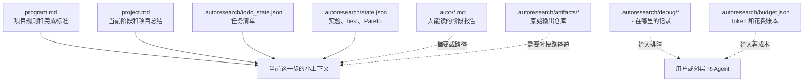
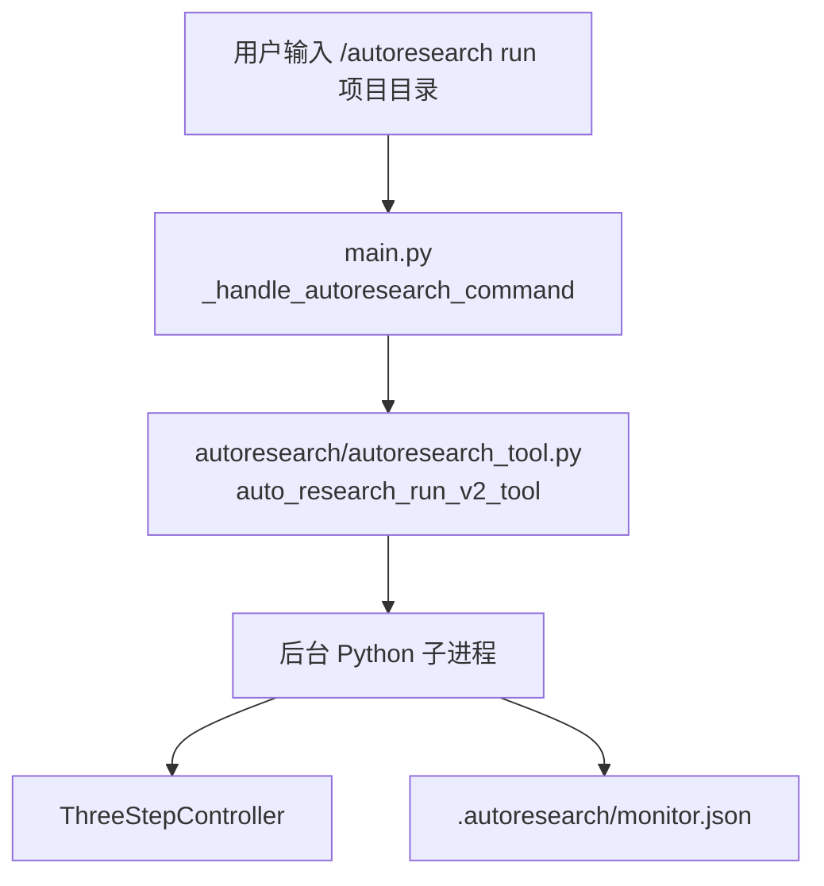
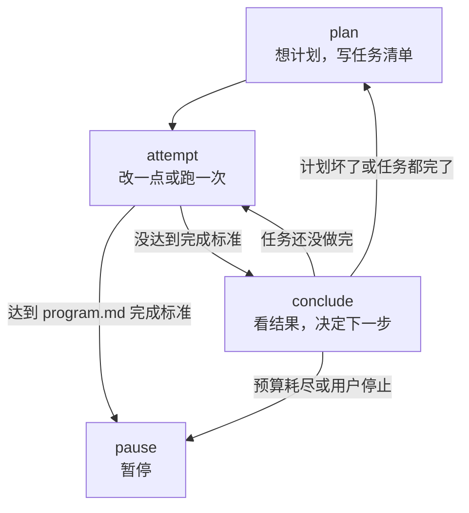
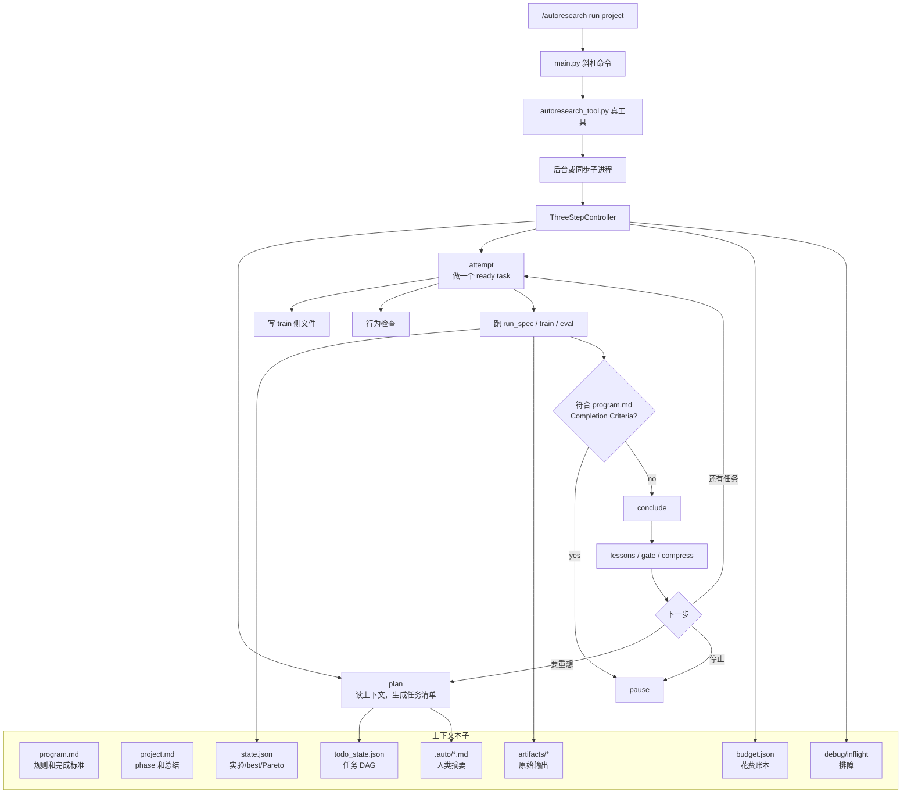

# AutoResearch 小学生版说明书：从上下文和流程看懂它

这份文档用尽量简单的话说明当前 AutoResearch 框架。它不是只讲概念，而是把现在代码里真实存在的细节也讲进去。

你可以把 AutoResearch 想成一个会做项目作业的小队伍。它不是一次聊天就把所有事情都做完，而是每次只做一小步，把结果写进文件，下次再从文件里接着做。

当前 R-Agent 仓库里，AutoResearch 的主要代码放在 `autoresearch/` 文件夹。`tools/autoresearch_tool.py` 只是一个很薄的入口，因为 R-Agent 的工具注册器会扫描 `tools/`。真正运行的是 `autoresearch/autoresearch_tool.py`。

## 一、先记住一句话

AutoResearch 做事的核心是：

```text
读项目文件 -> 做计划 -> 改一点或跑一次 -> 写结果文件 -> 再读文件继续
```

它故意不把所有聊天记录一直塞给 LLM。这样做是为了：

- 上下文不会越滚越大。
- 每一步都能从文件恢复。
- 用户可以随时看 `.autoresearch/monitor.json` 和 debug 文件知道卡在哪里。
- 大项目可以慢慢做，不需要一个 LLM 一口气读完整个仓库。

## 二、现在有哪些代码文件

R-Agent 是整座房子，AutoResearch 是其中一个房间。这个房间里的文件大致这样分工：

| 文件 | 小学生版解释 | 实际作用 |
|---|---|---|
| `autoresearch/autoresearch_tool.py` | 对外开关 | 实现 `auto_research_run_v2`、status、stop 等工具 |
| `tools/autoresearch_tool.py` | 门牌 | 让 R-Agent 工具注册器能找到真正的 AutoResearch 工具 |
| `main.py` | 斜杠命令入口 | `/autoresearch run/show/debug/kill` 从这里进来 |
| `autoresearch/autoresearch_three_step.py` | 总调度员 | 控制 `plan -> attempt -> conclude -> ...` |
| `autoresearch/autoresearch_personas.py` | 计划会议 | Plan 阶段的多角色讨论和任务 DAG 生成 |
| `autoresearch/autoresearch_execution.py` | 干活的人 | Attempt 阶段写代码、跑命令、修失败任务 |
| `autoresearch/autoresearch_todo_state.py` | 任务清单管理员 | 读写 `.autoresearch/todo_state.json` |
| `autoresearch/autoresearch_completion.py` | 验收员 | 从 `program.md` 读取项目自己的完成标准 |
| `autoresearch/autoresearch_monitor.py` | 黑板报 | 写 `.autoresearch/monitor.json`，供 `/autoresearch show` 查看 |
| `autoresearch/autoresearch_debug.py` | 详细流水账 | 写 debug 事件和 `inflight.json` |
| `autoresearch/autoresearch_budget.py` | 记账本 | 记录 token、花费、调用次数和耗时 |
| `autoresearch/autoresearch_loop.py` | 老底座 | 保存 action、artifact、runner、metric、版本治理等通用服务 |
| `autoresearch/autoresearch_step_runtime.py` | 工具规则表 | 定义 plan/attempt/conclude 能用什么工具和 skill |

还有一个容易混淆的点：`agentic_autoresearch/` 不是 `/autoresearch` 斜杠命令当前调用的主实现。当前 `/autoresearch` 调的是 `autoresearch/autoresearch_tool.py` 这一套。

## 三、上下文视角：它每一步到底看什么

### 1. 上下文就像几本本子

AutoResearch 不靠脑子记住一切，而是靠文件记住一切。



### 2. `program.md` 是项目自己的老师

`program.md` 写项目规则。它告诉 AutoResearch：

- 目标是什么。
- 哪些文件可以改。
- 哪些文件不能改。
- 要怎么训练或运行。
- 要怎么评估。
- 什么时候算完成。

现在“什么时候算完成”也必须写在 `program.md` 里，而不是写在通用框架参数里。例如 `autoresearch_test` 写的是：

```md
## Completion Criteria

This project is solved only when the official evaluation reports:

- `metric_name`: `z`
- `higher_is_better`: `false`
- `z <= 0.001`
```

框架不会自己发明一个全局 solved 阈值。框架只读项目自己的完成标准，然后根据当前 `metrics.json` 判断是否达到。

### 3. `project.md` 是总调度员的进度本

`project.md` 记录当前在哪一步。里面有类似这样的 phase 标记：

```text
<!-- PHASE: plan -->
<!-- PHASE_REASON: ... -->
```

如果当前是 `plan`，下一步就做计划。

如果当前是 `attempt`，下一步就改代码或跑验证。

如果当前是 `conclude`，下一步就总结、决定继续还是暂停。

这就是为什么进程中断后可以恢复：它重新读 `project.md`，知道上次停在哪里。

### 4. `todo_state.json` 是机器看的任务清单

Plan 阶段会把计划写成机器能看懂的任务，例如：

```json
{
  "tasks": [
    {
      "task_id": "implement_optimizer",
      "type": "implementation",
      "status": "pending",
      "depends_on": ["inspect_project"],
      "run_spec": {}
    },
    {
      "task_id": "validate_metric",
      "type": "validation",
      "status": "pending",
      "depends_on": ["implement_optimizer"],
      "run_spec": {
        "commands": ["bash train/train.sh", "bash eval.sh"]
      }
    }
  ]
}
```

小学生版解释：

- `task_id`：任务名字。
- `type`：任务种类，比如分析、改代码、验证。
- `status`：任务状态，比如 pending、in_progress、verified、failed。
- `depends_on`：要等哪些任务完成后才能做。
- `run_spec`：如果这个任务要跑命令，就把命令写这里。

为什么要这样设计：因为自然语言计划容易误解，机器任务清单更稳定，也更容易恢复。

### 5. `.auto/` 是给人看的阶段报告

`.auto/` 里面会有：

- `survey.md`：项目初步观察。
- `plan.md`：当前任务清单的人类可读版本。
- `execute_report.md`：改代码阶段做了什么。
- `execute_validation.md`：改完代码后跑了什么验证。
- `run_report.md`：运行结果和是否 solved。
- `analysis_*.md`：分析任务的摘要。

这些文件是“摘要本”，不是所有原始记录。

### 6. `.autoresearch/artifacts/` 是原始记录仓库

所有很长的原始输出都会放到 artifacts，不直接塞给 LLM。

比如：

- LLM 原始返回。
- shell 命令完整 stdout/stderr。
- 写文件动作的记录。
- apply_patch 结果。
- behavior check 结果。
- experiment manifest。

为什么这样设计：原始输出可能很长。如果每次都塞给 LLM，上下文会爆。框架只把摘要和 artifact 路径放进上下文。需要细节时，再顺着路径查。

### 7. `debug.jsonl` 和 `inflight.json` 是排障用的

`debug.jsonl` 是流水账，每一行是一个事件，比如：

```json
{"event": "llm_start", "phase": "plan", "detail": "plan leader"}
{"event": "shell_finish", "detail": "bash eval.sh", "returncode": 0}
```

`inflight.json` 是“现在正在等谁”。例如：

```json
{
  "kind": "llm",
  "phase": "attempt",
  "detail": "execute direct write",
  "timeout_seconds": 60
}
```

如果你觉得卡住了，先看这两个文件。

### 8. `monitor.json` 是给 `/autoresearch show`看的

`/autoresearch show` 不调用 LLM，它只读 `.autoresearch/monitor.json`。

它会显示：

- run_id。
- status：running、paused、completed、failed。
- current_phase。
- next_phase。
- step_index / max_steps。
- token、USD、调用次数。
- thinking time。
- last_summary。
- inflight。

这样主 R-Agent 不会因为后台 AutoResearch 还在跑就误以为已经完成。

### 9. 每一步确定会看到什么、可能会追什么

Plan 一定会看到：

- `program.md`
- `project.md`
- 项目文件摘要
- 当前 todo 摘要
- 近期实验状态

Plan 可能会追：

- `.auto/survey.md`
- 关键源码文件
- codebase_scout 报告
- 旧 artifact 路径

Attempt 一定会看到：

- 一个 ready task
- 这个 task 的 last_result
- `program.md` 里的限制
- 允许改和禁止改的路径
- 当前 train 侧文件片段

Attempt 可能会追：

- 上一次失败的 shell artifact
- `.auto/execute_validation.md`
- `outputs/submission.json`
- `metrics.json`
- `outputs/train_verification.json`

Conclude 一定会看到：

- `state.json`
- `todo_state.json`
- best / Pareto
- gate signals
- budget
- 最近 run/execute 结果

Conclude 可能会追：

- lessons
- artifacts
- active_context

## 四、流程视角：它怎么从 `/autoresearch` 跑起来

### 1. 用户输入 `/autoresearch run`

流程是：



`main.py` 直接 import：

```python
from autoresearch.autoresearch_tool import auto_research_run_v2_tool
```

所以 `/autoresearch` 调的是当前 `autoresearch/` 包，不是旧的 `core/autoresearch_*.py`。

`tools/autoresearch_tool.py` 仍然存在，但它只是工具注册 shim。它的作用是让工具注册器扫描 `tools/` 时能找到 AutoResearch 工具。

### 2. `/autoresearch` 有哪些子命令

```text
/autoresearch run <项目文件夹>
/autoresearch show [项目文件夹]
/autoresearch debug on [项目文件夹]
/autoresearch debug off [项目文件夹]
/autoresearch debug show [项目文件夹]
/autoresearch kill
```

`run`：后台启动，不阻塞 R-Agent 主进程。

`show`：只读 monitor，不调用 LLM。

`debug`：打开、关闭或查看 debug。

`kill`：列出并终止正在跑的 AutoResearch 进程。

### 3. 当前主循环只有三大步

以前文档里常写六步。当前实现的主心跳是三步：

```text
plan -> attempt -> conclude -> plan/attempt/pause
```

小学生版解释：

- `plan`：想清楚任务，写任务清单。
- `attempt`：做一个任务，必要时马上跑验证。
- `conclude`：看结果，记账，决定下一步。



### 4. Plan 阶段：先开计划会

Plan 阶段会做几件事：

1. 读取 `program.md` 和 `project.md`。
2. 读取项目关键文件摘要。
3. 让几个 persona 提意见。
4. leader 把意见合成一个计划。
5. 把计划变成 `todo_state.json`。
6. 把人类可读计划写到 `.auto/plan.md`。

现在默认 persona 可以被预算影响：

- 预算正常时，可以有 divergent、pragmatic、leader。
- 为了少花钱，也可以只用一个非 leader persona 加 leader。

Plan 也可以用 `codebase_scout` skill。大仓库时，不应该让一个 LLM 一口气读完所有文件，而是先做项目地图，再让子进程只读一部分文件并汇总。

Plan 不能随便改代码。它主要负责把事情想清楚。

### 5. Attempt 阶段：每次只认真做一件事

Attempt 会从 `todo_state.json` 里找 ready task。

现在默认 `execute_max_actions_per_step = 1`，意思是：

```text
一次 attempt 默认只处理一个 ready execute task
```

为什么这样设计：一次做太多任务会让一个 phase 变得很重，也会把失败原因混在一起。现在更像主 R-Agent loop：做一点，验证一点，再继续。

Attempt 遇到不同任务会这样处理：

| 任务类型 | 怎么做 |
|---|---|
| analysis | 读相关文件，写 `.auto/analysis_*.md` |
| implementation | 让 LLM 返回完整文件写入，或 fallback 到更小的 write/apply_patch |
| validation / experiment | 调 Run handler 跑 `run_spec` |
| maintenance | 如果有 run_spec，当作 Run 任务；否则当作 Execute 任务 |

### 6. Attempt 写代码时怎么避免乱改

写代码不是让 LLM 随便说一段话。它必须返回结构化动作。

常见动作：

```json
{"path": "train/optimizer.py", "content": "完整文件内容"}
```

或者：

```json
{
  "files": [
    {"path": "train/optimizer.py", "content": "完整文件内容"},
    {"path": "train/train.sh", "content": "完整文件内容"}
  ]
}
```

框架会检查：

- 路径不能逃出项目。
- 不能改 `eval.py`、`eval.sh`、`blackbox_oracle.py` 这类只读评测文件。
- Python 文件要能 `py_compile`。
- 写完后要跑一次训练侧行为检查。

行为检查常见是：

```text
bash train/train.sh
```

它不是最终考试，只是确认新代码真的能跑、能生成 submission 或相关产物。

### 7. Direct-write 和 fallback 是什么

Attempt 写代码时先试 direct-write。

direct-write 就是直接问 LLM：

```text
请返回完整文件内容，不要解释。
```

这样比让 LLM 手写 diff 更稳。

如果 direct-write 超时或失败，框架会换成 compact fallback：

- 上下文更小。
- 只要求一个安全的 write 或 apply_patch。
- 上一次 direct-write timeout 后，下一次同一任务会跳过大请求，避免反复烧同一个 60 秒。

### 8. Run 阶段：真正跑项目

Run 阶段通常由 Attempt 直接触发。也就是说：

```text
改完代码 -> 立刻跑对应验证
```

Run 会优先使用 task 里的 `run_spec`。

例子：

```json
{
  "mode": "single",
  "commands": ["bash train/train.sh", "bash eval.sh"]
}
```

如果没有明确 `run_spec`，框架会保守 fallback：

```text
bash train/train.sh
bash eval.sh
```

Run 完会：

- 解析 `metrics.json`。
- 记录 experiment。
- 更新 `.autoresearch/state.json`。
- 写 `.auto/run_report.md`。

它现在不负责 commit、rollback，也不负责最终判断这次实验该不该保留。Run 像考试监考员，只负责把试卷收上来、把分数登记好。

### 9. Run 失败以后怎么修

如果 Run 失败，例如：

```text
python3: can't open file 'train/optimizer.py'
```

框架不会立刻把整个计划判死。

它会生成一个 repair task：

```text
repair_baseline
```

这个 repair task 的意思是：

```text
先把训练入口修到能跑，再继续做后面的优化。
```

repair 成功后，原来失败的 run task 会被重新打开为 pending，并依赖 repair task。

小学生版解释：考试前发现铅笔断了，不是重写学习计划，而是先削铅笔，然后再考试。

### 10. Conclude 阶段：看结果，决定下一步

Conclude 会做几件事：

1. 看实验结果。
2. 更新 best / Pareto。
3. 按 `versioning_policy` 决定 commit、branch 或 rollback。
4. 无论好坏都写 lessons。
5. 写 `best.json`、`pareto_front.json`、`active_context.md`。
6. 看任务清单还有没有没做完。
7. 看预算有没有耗尽。
8. 看 `program.md` 的 Completion Criteria 是否满足。
9. 决定下一步去 `attempt`、`plan` 还是 `pause`。

Conclude 不是主要写代码的人，它更像班主任。Run 只交成绩单，Conclude 决定这张成绩单要不要贴红榜、要不要撤回这次改动、要记下什么教训。

### 11. 什么时候停止

现在停止标准有几种：

| 停止原因 | 谁决定 |
|---|---|
| 项目完成 | 项目自己的 `program.md` Completion Criteria |
| 用户停止 | `.autoresearch/STOP` 或 `/autoresearch kill` |
| 预算耗尽 | `BudgetLedger` |
| 进入 pause | Controller 写入 `project.md` 和 monitor |

最重要的是第一条：通用框架没有全局 solved 阈值。

框架不会说：

```text
只要 metric 等于 0 就自动完成
```

它只会说：

```text
program.md 里写了 z <= 0.001；
现在 metrics.json 里 z = 0；
所以这个项目完成了。
```

判断代码在 `autoresearch/autoresearch_completion.py`。

Run 阶段调用：

```python
criteria = parse_completion_criteria(ctx.program_text)
solved = is_metric_solved(metric, criteria)
```

### 12. 父进程和子进程怎么分工

AutoResearch 支持 step agent 和 child agent 的工具白名单。

当前三步的工具边界大概是：

| step | 父 step 可以做什么 | child 可以做什么 |
|---|---|---|
| plan | 读文件、搜文件、看 artifact、看 skill、管理 todo、delegate | 只读调研，不允许再 delegate |
| attempt | 读文件、写文件、跑命令、看 artifact、管理 todo、delegate | 可以读写和跑命令，但不能递归 delegate |
| conclude | 读文件、写总结、看 artifact、管理 todo | 主要总结，不做大范围写代码 |

`delegate_task` 现在支持 `child_allowed_tools`。父进程如果委派子任务，必须明确告诉子进程能用哪些工具。子进程即使拿到工具白名单，也会强制排除 `delegate_task`，防止无限套娃。

### 13. debug 模式怎么用

`/autoresearch run <目录>` 默认会打开 debug。

你可以看：

```text
/autoresearch show
/autoresearch debug show
/autoresearch debug off
/autoresearch kill
```

也可以直接看文件：

```text
.autoresearch/monitor.json
.autoresearch/debug/debug.jsonl
.autoresearch/debug/inflight.json
.autoresearch/step_traces/*.json
.autoresearch/budget.json
```

如果卡住，先看 `inflight.json`。

如果 `inflight.json` 写着：

```json
{"kind": "llm", "phase": "attempt", "detail": "execute direct write"}
```

意思就是现在正在等 LLM 写代码。

如果写着：

```json
{"kind": "shell", "detail": "bash train/train.sh"}
```

意思就是现在正在等 shell 命令。

`step_traces` 是更详细的上下文追踪。它会保存每个 step 当时的大致输入和输出，例如：

```text
.autoresearch/step_traces/step_000_plan.json
.autoresearch/step_traces/step_001_attempt.json
.autoresearch/step_traces/1783654957886_execute_direct_write.json
```

这些文件可以回答三个问题：

- 这个 step 当时读到了哪些 `program.md`、`project.md`、`todo_state.json` 摘要。
- 它当时准备处理哪个 task。
- 如果调用了 LLM 写代码，LLM 当时收到的 system/user 内容和原始返回是什么。

所以现在 debug 模式分两层：

| 文件 | 用途 |
|---|---|
| `debug.jsonl` | 看事件顺序，知道什么时候开始/结束 LLM 或 shell |
| `inflight.json` | 看现在卡在哪个 LLM 或 shell |
| `step_traces/*.json` | 看某一步当时的上下文、结果和 LLM 输入输出 |

### 14. budget 怎么算

`.autoresearch/budget.json` 记录：

- prompt tokens。
- completion tokens。
- total tokens。
- estimated USD。
- calls。
- 每个 phase 花了多少。
- 每个 model 花了多少。
- LLM thinking time。

`monitor.json` 会把这些变成短摘要，方便 `/autoresearch show` 一屏看完。

### 15. versioning 怎么处理

AutoResearch 有版本策略：

- `artifact_only`
- `commit_pareto`
- `commit_all_trials`
- `branch_per_trial`

默认更保守，主要把 diff、manifest、raw output 放到 `.autoresearch/artifacts/`。如果项目不是 git 仓库，不会偷偷 `git init`。如果启用 git 版本策略，也会先检查工作区状态，避免乱回滚用户自己的改动。

### 16. autoresearch_test 为什么能跑通

`autoresearch_test` 的项目规则写在 `program.md`。

其中 Completion Criteria 写明：

```text
z <= 0.001
```

最终 AutoResearch 找到了接近：

```json
{"x": 51.0, "y": -89.0}
```

对应：

```json
{"z": 0.0}
```

框架看到：

```text
program.md 要求 z <= 0.001
metrics.json 里 z = 0.0
```

于是它把下一步设为 `pause`，monitor 显示 solved。

## 五、完整大图：上下文和流程放在一起



## 六、最短总结

AutoResearch 不是一个一直聊天的机器人。它更像一个会读本子、写本子、按本子做事的小队伍。

从上下文视角看：

- 它把记忆放在 `program.md`、`project.md`、`todo_state.json`、`state.json`、`.auto/`、`artifacts/` 里。
- LLM 每次只看到当前步骤需要的有限上下文。
- 原始输出都放 artifact，不直接塞进 prompt。
- debug 和 monitor 给人看，方便知道它卡在哪里。

从流程视角看：

- `/autoresearch run` 启动当前 `autoresearch/` 包里的 v2 loop。
- 主循环是 `plan -> attempt -> conclude`。
- Plan 生成任务 DAG。
- Attempt 一次默认做一个任务，写代码后马上验证。
- Run 记录 metric、best、Pareto。
- Conclude 决定继续、重计划或暂停。
- 是否 solved 由项目自己的 `program.md` Completion Criteria 决定，不由通用框架写死。

## 七、当前版本补充：框架怎样避免“瞎改”和“越改越坏”

这一节是当前实现的新补充。它解释最近加入的几个机制：`eval_contract`、`failure_digest`、direct-eval smoke、best snapshot、small patch mode。它们的共同原则是：

```text
框架只负责把事实找出来、保存好、递给 LLM；
不要替 LLM 硬编码业务修改位置。
```

也就是说，框架不会说“这个项目一定要改 solution.py”。框架会说：

```text
eval.py 现在 import 了 solution.py；
metrics.json 现在这些 case 失败了；
上一次最好的代码快照在这里；
你本轮只需要根据这些事实做一个最小、安全、可验证的改动。
```

### 1. `eval_contract.md`：评测说明小纸条

每次 Execute/Run 前后，框架会机械读取 `eval.py` 和 `metrics.json`，写出：

```text
.auto/eval_contract.md
```

它会记录：

- `eval.py` 是否直接 import 某个文件，例如 `solution.py`。
- 评测可能会调用哪些函数，例如 `decode_text`、`repair_json`、`rank`、`solve`、`clean_row`。
- 当前主指标是什么。
- `eval.py` 前半部分长什么样。
- `metrics.json` 里是否已经有失败样例。

小学生版解释：

```text
eval_contract.md 是考试说明。
它告诉做题的人：老师怎么批卷、会看哪个文件、会调用哪个函数。
但它不直接替做题的人写答案。
```

### 2. `failure_digest.md`：错题本

每次 Run 后，框架会读取 `metrics.json`，写出：

```text
.auto/failure_digest.md
```

它会记录：

- 当前分数。
- 如果有失败样例，就列出 input / expected / pred / parsed error。
- 如果没有失败样例，就明确写“metrics.json 没列 failures”。

小学生版解释：

```text
failure_digest.md 是错题本。
下一轮不要再泛泛地“重写全部代码”，而是先看错题本，只修错的地方。
```

注意：有些项目的 `metrics.json` 只给总分，不给具体失败样例，例如某些 `submission/predictions.json` 对比任务。当前框架还需要继续增强：它应该能自己比较 predictions 和 truth，生成更细的错题本。

### 3. direct-eval smoke：直接被 eval import 的文件怎么验证

有些项目不是靠 `train/train.py` 生成结果，而是 `eval.py` 直接 import 一个文件，例如：

```python
spec_from_file_location('solution', Path('solution.py'))
```

这种情况下，如果 Execute 改了 `solution.py`，框架不会要求 `train/train.sh` 一定生成新产物。它会先做更合适的轻量验证：

```text
python3 -m py_compile solution.py
import solution.py smoke check
```

小学生版解释：

```text
如果老师直接检查 solution.py，
那改完 solution.py 后，先看它能不能编译、能不能被导入。
真正分数还是交给 eval.sh。
```

### 4. best source snapshot：最好答案的备份

每次 Run 记录实验时，框架会把一组关键源码文件保存成快照，例如：

```text
.autoresearch/artifacts/*_source_snapshot.json
```

Conclude 选出当前 best 后，如果项目不是 git versioning 模式，框架会尝试把源码恢复到 best 快照。

小学生版解释：

```text
每次考完试，如果这次成绩最好，就把这份答案复印一份。
后面如果乱改变差了，老师可以把答案恢复到最好那份。
```

这解决的是“越改越坏”的问题。不过它不是万能的：如果 best 的判定、快照范围、或者恢复时机不对，仍然可能留下坏状态，所以还要继续检查 `state.json` 里的 `best_restore`。

### 5. small patch mode：小错尽量小改

以前 direct-write 超时后，fallback 还是可能要求 LLM 整个文件重写，结果又超时或写坏。现在 fallback 会优先提示 LLM 输出一个小 JSON change spec，例如：

```json
{
  "kind": "search_replace",
  "path": "solution.py",
  "old": "旧代码片段",
  "new": "新代码片段"
}
```

或者：

```json
{
  "kind": "write",
  "path": "solution.py",
  "content": "完整文件内容"
}
```

框架看到这种 note 里的 JSON 后，会把它变成真正的 patch 执行。

小学生版解释：

```text
如果只错一道小题，就不要重写整本作业。
用 search_replace 只改那一小段。
```

### 6. 三个 step 现在看到什么、能用什么工具

| step | 主要任务 | 一定会看到 | 可能会看到 | 父 step 工具 | child 工具 |
|---|---|---|---|---|---|
| plan | 制定/刷新任务 DAG | `program.md`、`project.md`、项目关键文件摘要、已有 todo、best/Pareto | `.auto/survey.md`、旧 lessons、失败摘要路径 | `read_file`、`search_files`、artifact 工具、skill 工具、`todo_manage`、`delegate_task` | 只读工具，不能再 delegate |
| attempt | 做一个 ready task | 当前 task、`program.md`、`project.md`、`todo_state.json`、允许/禁止文件、train 片段 | `.auto/eval_contract.md`、`.auto/failure_digest.md`、`.auto/execute_validation.md`、上次 artifact | `read_file`、`search_files`、`write_file`、`run_command`、artifact 工具、skill 工具、`todo_manage`、`delegate_task` | 读写和运行命令，但不能递归 delegate |
| conclude | 总结并决定下一步 | `state.json`、best/Pareto、todo digest、budget、gate signals | lessons、active context、recent artifacts | `read_file`、`search_files`、`write_file`、artifact 工具、`todo_manage` | 主要总结工具，不做大范围代码改动 |

这里的“父 step”是 AutoResearch 外层调度器；“child 工具”是它委派子任务时允许子 Agent 使用的工具集合。

### 7. 当前还没完全解决的问题

当前框架已经比之前更稳，但还有几个明确短板：

1. **有些 metrics 没有失败样例**
   - 例如只给 `score`、`row_accuracy`、`cell_accuracy`。
   - 框架下一步应该自动比较 `submission/predictions.json` 和 truth 文件，生成字段级错题本。

2. **小补丁模式还不够强制**
   - 现在只是提示 LLM 优先输出 change spec。
   - 如果同一 task 多次超时，框架应该强制只允许小 change spec，不再允许整文件 rewrite。

3. **best snapshot 需要继续验证**
   - 已经会保存和恢复源码快照。
   - 但还要确认恢复范围、恢复时机、best 判定都正确。

4. **Plan 还应该输出更强的证据字段**
   - 例如 `evidence_target_files`、`context_paths`、`why_this_file`。
   - 这不是框架替模型选文件，而是要求模型说明“我为什么要改这个文件”。

## 八、当前最短总结

现在 AutoResearch 更像这样：

```text
读规则 -> 读考试方式 -> 读错题本 -> 计划任务 -> 做一个小改动 -> 跑验证 -> 保存最好答案 -> 再看错题本继续
```

最重要的变化是：

- `eval_contract.md` 告诉 LLM “考试怎么考”。
- `failure_digest.md` 告诉 LLM “错在哪里”。
- direct-eval smoke 让 `solution.py` 这种直接被评测 import 的文件先做合适的轻量验证。
- source snapshot 让框架可以恢复最好代码，减少越改越坏。
- small patch mode 鼓励小错小改，不要每次重写整文件。

但框架仍然要坚持一个原则：

```text
框架提供事实和安全边界，模型自己决定怎么改。
```
