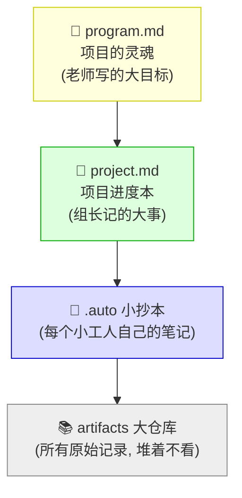
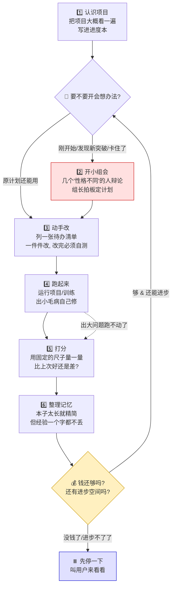
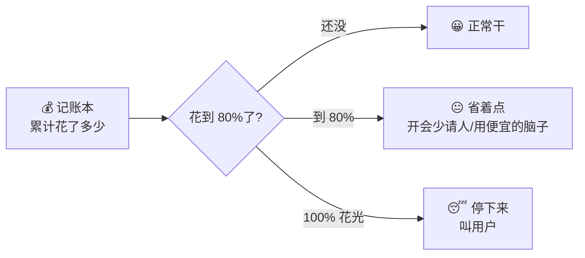
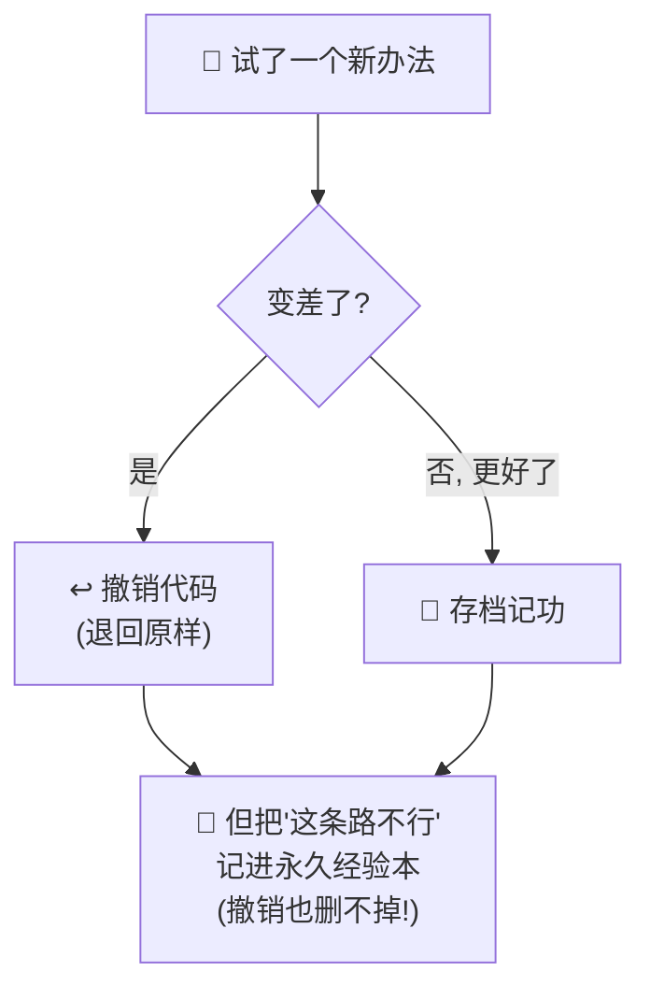

# 🤖 会自己做研究的机器人小科学家（小学生版说明书）

> 这份文档不讲代码，只讲**这个东西是干嘛的、怎么工作的**。
> 读完你就能明白：我们造了一个"机器人小科学家"，它能自己动手改进一个项目，还不会乱花钱、可以一直干下去。

---

## 一、它到底是什么？

想象你有一个**机器人小科学家** 🤖。

你给它一个任务，比如：

> "帮我把这个识别小猫小狗的程序做得更准一点。"

然后它就会**自己**：
1. 先把项目从头到尾看一遍，搞清楚里面有什么；
2. 开个"小组会"想办法；
3. 动手改代码；
4. 跑一遍看看行不行；
5. 打分，看这次改得好不好；
6. 把学到的经验记在小本本上；
7. 然后**再来一轮**，越做越好……

而且它有两个很厉害的本事：

- 💰 **不会乱花钱**：它每花一点钱（其实是"算力"）都会记账，钱快用完了就先省着花，真用完了就停下来问你。
- ♾️ **可以一直干**：它不会累、不会忘，就算中途断电了，重新开机也能**接着上次的进度**继续干。

---

## 二、它的"记忆"分成几层（很重要！）

机器人不像人有脑子，它的"记忆"都写在**几个本子**上。不同的人看不同的本子，这样才不会乱，也不会浪费钱。



用一个**学校做项目**的比喻来解释：

| 本子 | 好比是 | 谁能改它 | 里面写什么 |
|---|---|---|---|
| 📕 **program.md** | 老师定的**大目标** | ✋ 只有你（用户）能改上半本；机器人只能改下半本"我觉得应该这样做" | 上半本：任务和规矩（永远不许改）；下半本：机器人的"直觉想法" |
| 📗 **project.md** | 组长的**进度记录本** | 只有"组长"能写 | 项目现在做到哪了、下一步计划、最近结论 |
| 📘 **.auto 小抄** | 每个**小工人**的草稿本 | 每个小工人写自己的 | 具体怎么做的细节 |
| 📚 **artifacts 仓库** | 所有**原始草稿**堆的仓库 | 没人翻，只是留着 | 一大堆日志，需要时才去查 |

**为什么要分层？** 因为——

> 开"小组会"的聪明人（很贵💰）只看**大目标**和**进度本**，不用去翻那一大堆草稿，所以省钱！
> 干活的小工人（便宜）只看自己那本**小抄**就够了。

---

## 三、它是怎么一步步工作的？（主流程）

机器人干活分成 **6 个步骤**，像闯关一样一关接一关，转圈圈：



一步步说：

- **1️⃣ 认识项目**：像新同学第一天到班里，先大概认识一下环境（但不会把每本书都背下来，只翻翻目录，省时间）。
- **🚦 要不要开会**：如果是刚开始、或者上次有新突破、或者**连续好几次都没进步**，就去开会重新想办法；否则就照着原计划继续干。
- **2️⃣ 开小组会**（最花钱的一步）：请几个"性格不同"的小伙伴来辩论 👇
  - 🌈 **点子王**：专门想天马行空的新主意；
  - 🛠️ **实干家**：专门看哪个主意真能做、划算；
  - 👑 **组长**：听完大家的，**必须拍板**定一个计划（不许吵个没完）。
- **3️⃣ 动手改**：组长把计划拆成一张**待办清单**，小工人一件件做。**规矩：改完必须自己测一下能不能跑，不能跑就不算完成！**
- **4️⃣ 跑起来**：真的运行一遍。出小毛病（比如打错字）自己修，但**最多修几次**，修不好就认了，直接去打分。
- **5️⃣ 打分**：用一把**固定的尺子**量成绩。这把尺子**任何人都不许动**（不然就是作弊🚫）。比上次好 → 存档记功；比上次差 → 也记下来但不存档。
- **6️⃣ 整理记忆**：本子写太长了就精简一下，但**学到的经验（哪些行、哪些不行）一个字都不能删**。
- **💰 钱还够吗**：钱够、还有进步空间 → 回去再来一轮；没钱了或者怎么试都不进步了 → **先停下来叫你**。

---

## 四、三个最聪明的设计（划重点⭐）

### ⭐ 1. 钱包管家（不会乱花钱）

机器人身上装了一个**记账本** 💰。每做一件要花钱的事，它都记一笔。



而且它很会**看人下菜碟**：
- 开会想办法（最烧脑）→ 请**最聪明**（最贵）的大脑；
- 干杂活、看进度、整理笔记 → 用**便宜**的大脑就行。

### ⭐ 2. 会一直干，还断电不怕（可以无限运行）

它的秘诀是：**所有进度都写在本子上，脑子里什么都不留。**


好处：就算突然断电了 💥，重新开机，它翻开进度本一看"哦，上次到第 4 关了"，就**接着干**，一点不慌。

### ⭐ 3. 经验本子摔不烂（错误教训不会丢）

有时候机器人改坏了，需要**撤销**，把代码退回改之前的样子（就像 Ctrl+Z）。

但是！撤销代码的时候，**"这条路走不通"这个教训要单独存起来**，不能跟着一起被撤销掉。



这样下次它就不会**再犯同样的错**，白花钱。

---

## 五、它绝对不做的坏事（安全规矩）🚫

| 规矩 | 为什么 |
|---|---|
| 🚫 不许改"考试尺子"（评分文件） | 不然就是自己给自己打高分，作弊！ |
| 🚫 不许乱跑到项目文件夹外面去 | 只能在自己的一亩三分地里干活，不许乱翻别人东西 |
| 🚫 不许无限吵架 | 开会必须有组长拍板，不能永远决定不了 |
| 🚫 钱花光了不许硬撑 | 停下来问你，绝不偷偷刷爆"信用卡" |

---

## 六、一句话总结

> 我们造了一个**机器人小科学家** 🤖：
> 它会**自己看项目 → 开会想办法 → 动手改 → 跑一遍 → 打分 → 记经验**，然后一圈圈越做越好；
> 它**很会过日子**（钱包有管家，贵活用聪明脑子、杂活用便宜脑子），
> **不怕累不怕断电**（进度都写在本子上，随时能接着干），
> 还**很诚实**（不作弊、不乱花钱、犯过的错都记下来不再犯）。

---

## 七、想自己试试？（给会一点电脑的大朋友）

打开项目，运行这一句，就能让机器人跑起来（不花一分钱的"演习模式"）：

```python
from tools.autoresearch_tool import auto_research_run_v2_tool

auto_research_run_v2_tool(
    "你的项目文件夹",
    max_steps=24,              # 最多闯 24 关
    use_llm_step_agents=False, # False = 演习模式, 不请真的AI大脑, 不花钱
    max_usd=5.0,               # 最多花 5 块钱, 花完自动停
)
```

跑完以后，去项目文件夹里看这几个新出现的本子：
- 📗 `project.md`：进度记录
- 📘 `.auto/` 文件夹：小工人的草稿
- 💰 `.autoresearch/budget.json`：花钱账本
- 📓 `.autoresearch/lessons.jsonl`：永久经验本
