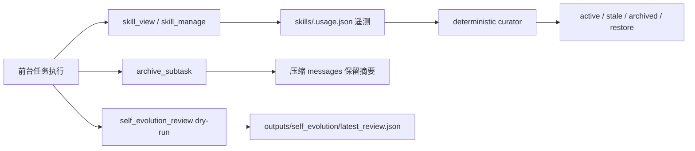

# R-Agent 更新日志

这里保存 R-Agent 的历史维护记录。README.md 只保留项目入口、核心能力和使用说明，避免随着迭代不断膨胀。

### 2026-07-16

- 将 README 与更新日志拆分：README 聚焦项目介绍、环境配置、核心能力、论文/仓库阅读与 autoresearch；历史更新记录迁移到独立 `CHANGELOG.md`，避免入口文档过于臃肿。
- 将 `skills/productivity/paper_research_scout/references/read_papers.json` 加入 `.gitignore`，避免本地论文阅读记录进入版本库。
- 按维护约定补充本次提交前的 README 更新记录。

### 2026-07-14

#### autoresearch Completion Criteria 默认模板

- **补充官方 solved 标准示例**：`autoresearch` skill 与 `program.md` 模板现在默认包含官方 `metrics.json` solved 标准示例：`metric_name: repair_exact_accuracy`、`higher_is_better: true`、`repair_exact_accuracy >= 1`。
- **要求指标来源可追溯**：若用户未显式给出指标，模板要求优先从项目 `README`、`eval` 文件或 `metrics.json` 推断；仍无法确定时必须向用户澄清，不得省略或自造评估协议。
- **区分 solved 与运行预算**：明确 `Completion Criteria` 中的官方指标阈值才表示项目已解决；轮数、时间、资源耗尽或无下一假设只属于预算/停止条件，不能当作 solved。

### 2026-07-10

#### paper scouting 与论文阅读工作流整理

- **README 文档更新**：按本次准备 push 的变更补充更新日志，便于提交前集中审阅文档、skill 与新增支持文件。
- **`paper_research_scout` skill 更新**：完善结构化论文指标采集流程，要求优先使用 skill-local 脚本或官方 API 获取引用、Hugging Face Papers、OpenReview 与 GitHub 代码热度等信号，并在输出中记录来源、检索日期、N/A 原因和产物路径。
- **新增 references 说明与已读历史数据**：新增 `skills/productivity/paper_research_scout/references/README.md` 与 `references/read_papers.json`，用于说明已读论文历史的维护方式，并保存从现有 `outputs/papers/` 导入的初始已读论文记录。
- **新增指标查询脚本**：新增 `skills/productivity/paper_research_scout/scripts/paper_metrics_lookup.py`，提供 OpenAlex、Semantic Scholar、Crossref、DataCite、Hugging Face Papers、OpenReview 与 GitHub 等结构化查询入口，同时保留标题匹配、限流提示和保守降级策略。
- **新增已读论文历史脚本**：新增 `skills/productivity/paper_research_scout/scripts/paper_read_history.py`，支持 `add`、`check`、`import-outputs`、`list`、`filter` 等操作，帮助 paper scouting 过滤已读或重复推荐的论文。
- **`read_paper` skill 联动更新**：更新 `skills/productivity/read_paper/SKILL.md`，要求确认阅读论文后尽量登记到 `paper_read_history.py`，登记失败不阻塞阅读流程但需在结果中说明。

#### 迁移到顶层 `autoresearch/` 包

- **统一实现位置**：当前 autoresearch runtime 已从 `core/autoresearch_*.py` 分散文件迁移到顶层 `autoresearch/` 包；`tools/autoresearch_tool.py` 仅作为工具注册 shim，真实逻辑位于 `autoresearch/tool.py`。
- **恢复工具入口**：重新注册 `auto_research_run`、`auto_research_status`、`auto_research_run_v2`、`auto_research_v2_status` 和 `auto_research_stop`，同时保留 legacy workflow 与 V3 phase loop。
- **CLI 改为后台控制面**：`/autoresearch run <dir>` 后台启动 V3，`/autoresearch show [dir]` 只读 `monitor.json` 查看进度，`/autoresearch debug` 控制 debug flag，`/autoresearch kill` 终止运行中的 autoresearch 进程。
- **补充回归测试**：恢复源项目 autoresearch 测试集，覆盖 legacy loop、V3 controller、todo/gate/completion、timeout、preflight、tool registry 和 CLI route。

#### Autoresearch debug trace 与上下文归档（历史记录，已被顶层 `autoresearch/` 包替代）

- **新增 `AutoresearchTracer`**：`core/autoresearch.py` 现在会为 Main / Plan / Execute / Conclude 记录结构化 debug trace，包含开始、结束、命令执行、上下文快照等事件。
- **分类保存 worker 事件**：每个目标项目的 `.autoresearch/traces/` 下新增 `trace.jsonl`、`plan.jsonl`、`execute.jsonl`、`conclude.jsonl`，既能按全局时间线查看，也能只看某个小进程。
- **保存上下文快照和流程说明**：新增 `.autoresearch/traces/contexts/` 保存各 worker 的 latest/context JSON，同时生成 `.autoresearch/traces/flow.md` 和每轮 `runs/exp_xxx/flow.md`，方便之后人工 debug。
- **终端结果暴露 trace 路径**：`/autoresearch` 完成摘要会显示 Debug Trace、流程归档和上下文快照目录，用户无需翻目录即可定位。
- **补充回归测试与文档**：扩展 `tests/test_autoresearch_mode.py` 覆盖 trace、分类事件、上下文快照和 flow 生成；同步更新 `autoresearch.md` 的小白说明。

#### 小型 autoresearch mode 最小闭环（历史记录，已被顶层 `autoresearch/` 包替代）

- **新增 `/autoresearch` 本地命令**：CLI 聊天框支持输入 `/autoresearch` 后再填写项目路径，也支持 `/autoresearch /path/to/project` 直接启动小型 autoresearch mode；运行期间复用现有 Rich 状态动画与 `Esc` 中断机制，用户输入锁定，只查看进程。
- **新增 autoresearch 核心运行器**：新增 `core/autoresearch.py`，实现第一版受控串行闭环 `Plan → Execute → Conclude`；Plan 只生成只读计划，Execute 只执行短时安全只读命令并写日志，Conclude 解析结果并输出 `keep/crash` 决策。
- **落地 `.autoresearch/` 状态目录**：每个目标项目下会生成 `.autoresearch/state.json`、`plan.json`、`execute_result.json`、`conclude_result.json`、`memory.md`、`lessons.md`、`results.tsv` 与 `runs/exp_xxx/` 日志目录，主进程只展示摘要。
- **明确第一版安全边界**：当前不会自动大改代码、不会长训练、不会下载大文件、不会自动 `git reset --hard`、不会无限循环；先跑通可中断、可追踪、可沉淀的最小研究闭环。
- **补充小白向说明文档**：新增 `autoresearch.md`，用中文和简单语言说明 autoresearch mode 怎么进入、三个 worker 各做什么、文件保存在哪里、第一版不会做什么。
- **补充回归测试**：新增 `tests/test_autoresearch_mode.py`，覆盖状态文件生成、中断状态标记、结果摘要格式和固定 run 路径初始化。

#### 上下文控制与自动压缩

- **新增上下文控制核心模块**：新增 `core/context_control.py`，提供模型上下文窗口本地映射、`messages + tools` token 估算、80% 阈值判别、压缩目标比例和完整 message 级压缩能力。
- **合并上下文压缩工具入口**：将新增压缩能力并入既有 `archive_subtask`，不再额外暴露重复的 `context_compress` 工具 schema；旧用法继续支持只传 `summary/next_steps`，新用法可传完整 `messages/tools` 返回 `compressed_messages`、摘要和统计信息。
- **主流程请求前自动判别压缩**：`core/agent.py` 在每次 LLM 请求前估算上下文占用，默认达到最大窗口 80% 时触发压缩，默认压缩到 55%；保留最近完整 message，不从单条保留 message 中间截断，并避免拆散 assistant tool_calls 与后续 tool result；`archive_subtask` 手动归档也复用同一套完整 message 压缩逻辑。
- **补充上下文窗口配置**：`core/config.py` 新增 `LLM_CONTEXT_WINDOW` / `MODEL_CONTEXT_WINDOW` / `CONTEXT_WINDOW_TOKENS` 显式覆盖，以及 `CONTEXT_COMPRESSION_TRIGGER_RATIO`、`CONTEXT_COMPRESSION_TARGET_RATIO`、`CONTEXT_COMPRESSION_PRESERVE_RECENT_MESSAGES` 调参入口；确认 API usage 只能提供本次 token 用量，不提供最大上下文窗口。
- **GUI 暴露上下文占用**：`app_gui/runtime.py` 的 session state 增加 `context_usage`，方便 Cockpit 后续查看估算 token、窗口上限、占用比例和自动压缩次数。
- **补充回归测试**：新增 `tests/test_context_control.py`，覆盖完整 message 保留、tool result 摘要、低于阈值不压缩、80% 阈值判定和 Agent 请求前自动压缩；相关最小测试已通过。


### 2026-07-09

#### `paper_research_scout` 结构化指标采集升级

- **新增 skill-local 指标脚本**：在 `skills/productivity/paper_research_scout/scripts/paper_metrics_lookup.py` 中实现论文指标查询脚本，保持在 skill 目录内，不注册为全局 Agent Loop 工具。
- **引用数改为结构化 API 优先**：脚本支持 OpenAlex `cited_by_count`、Semantic Scholar `citationCount`、Crossref `is-referenced-by-count`，并将 Google Scholar 明确降级为可选 SerpApi/人工校验路径，避免默认爬取不稳定页面。
- **Hugging Face 热度改用官方 JSON 端点**：支持 Hugging Face Papers `/api/daily_papers`、`/api/papers/search`、`/api/papers/{paperId}`，用于获取 upvotes、comments、GitHub stars 与关联模型/数据集/Spaces 等社区信号。
- **OpenReview 改为 API 路径**：脚本提供公开 forum 的 API 查询入口，skill 文档要求 venue/private 数据优先使用官方 `openreview-py` / API2 / API1，不再把 browser verification 页面误判为论文不可访问。
- **GitHub 代码信号扩展**：脚本通过 GitHub API 获取 stars、forks、open issues、pushed/updated 时间、license、language、archived、topics 等字段；skill 文档明确 stars 只是弱热度信号，不等同论文质量。
- **更新 skill 工作流与验收清单**：`paper_research_scout` 现在要求 top candidates 先尝试结构化指标脚本或等价官方 API，再使用通用网页抽取；输出中需记录 source、retrieval date、N/A 原因和脚本产物路径。
- **补充 DataCite 与标题校验**：`paper_metrics_lookup.py` 新增 DataCite DOI 查询，用于 arXiv/DataCite DOI 的保守 `citationCount`；OpenAlex、Semantic Scholar、DataCite、Crossref 结果会在提供标题时标注 `title_match_confidence`，低置信度匹配会自动置为不可用，避免 DOI 元数据错配导致误报引用数。
- **优化限流提示**：Semantic Scholar 匿名请求遇到 429 时返回明确 `hint`，提示设置 `SEMANTIC_SCHOLAR_API_KEY` 并退避重试，而不是反复匿名请求。
- **新增已读论文历史过滤**：新增 `skills/productivity/paper_research_scout/scripts/paper_read_history.py` 与 `references/read_papers.json`，支持 `add/check/import-outputs/list/filter`，用于记录 `read_paper` 已读论文并在后续 paper scouting 时按 arXiv ID、DOI、URL 或归一化标题过滤重复推荐。
- **导入现有已读论文**：从 `outputs/papers/` 导入当前 29 篇 PDF 到 `paper_research_scout/references/read_papers.json`，作为初始已读历史；验证产物保存在 `sandbox/paper_research_scout/import_read_history.json`。
- **联动 `read_paper` 工作流**：更新 `read_paper` skill，要求每次确认阅读论文后调用 `paper_read_history.py add` 登记路径、标题、类别以及可用的 arXiv/DOI/URL，登记失败不阻塞阅读但需说明。

### 2026-07-08

#### auto_research 中间版本管理说明

- 更新“1.1 auto_research 使用说明”，补充 `versioning_policy` 的四种策略语义：`artifact_only`、`commit_pareto`、`commit_all_trials`、`branch_per_trial`。
- 明确默认不频繁自动 commit：非 git 项目不会自动 `git init`，日常推荐先保存 patch/manifest，只有已有 git 仓库中达到 best/Pareto 等值得保留标准的 trial 才建议提交。
- 补充失败、无效或被支配 trial 的治理方式：保留 diff patch、实验记录/manifest 与 artifact；仅在 base 工作区干净且可安全归因时回滚 tracked changes，未跟踪文件保留供人工审阅。

### 2026-07-07

#### sandbox 自动清理兼容性修复

- 修复 sandbox 自动清理在 Python 3.9 环境下调用 `Path.stat()` / `Path.lstat()` 时不兼容 `follow_symlinks` 参数的问题，改为兼容 pathlib 真实行为的 stat/lstat 清理逻辑。
- 补充基于真实 `pathlib.Path` 的回归测试，覆盖清理逻辑在 Python 3.9 兼容路径下的行为，避免仅依赖 mock 掩盖接口差异。
- 清理错误不再因 `follow_symlinks` 触发的 `TypeError` 被静默吞掉而导致旧 sandbox 文件保留，确保异常可见并避免过期文件残留。

#### `read_paper` PDF 图表截图裁剪修复

- 更新 `skills/productivity/read_paper/scripts/pdf_snapshot.py` 的 PDF 截图裁剪启发式：
  - 为双栏论文新增 caption 所在列窗口估计，避免 Figure/Table 截入另一栏正文或文章大标题。
  - 增加矢量/文本型 Figure 的邻近文本块裁剪，减少图表与正文/其他图的错位。
  - 优化 Table 的上下方向判定，支持 caption 在表格下方的情况，降低误截正文或漏截表格的概率。
  - 保护跨双栏/全宽 Table 候选区域，避免居中短 caption 被误归入单栏后只截取半张表。
  - 增强正文/章节标题与表格行的启发式区分，降低双栏正文被并入图表截图的概率。
- 同步整理 README 更新日志，将本次 `read_paper` 截图裁剪修复记录到当日日期下，便于准备 git push 前审阅。

#### auto_research 专用 Agent Loop MVP

- **新增专用运行时骨架**：新增 `core/autoresearch_loop.py`，提供 `AutoResearchSettings`、`AutoResearchAction`、`AutoResearchObservation`、`AutoResearchLoop`、`AutoResearchContextManager`、`AutoResearchArtifactStore`、`ProjectBoundary` 与 `ProjectConfinedCommandRunner`，用于承载面向 autoresearch 的轻量 Agent Loop。
- **围绕 `program.md` 控制父上下文**：父 loop 每轮只读取 `program.md`、`.autoresearch/state.json` 和最近 observations，并通过 `context_char_budget`、`program_char_budget`、`summary_char_budget` 严格裁剪，避免普通对话式 messages 无限膨胀。
- **原始输出外置归档**：shell、file、web、note 等 action 的 raw output 统一写入 `.autoresearch/artifacts/`，文件名包含 `timestamp_project_id_trial_rationale_kind`；父上下文只保留 compact summary 与 artifact path。
- **项目内快速命令执行**：新增 `ProjectConfinedCommandRunner`，不调用全局 `run_command` 审批门，允许 autoresearch 在项目目录内快速执行实验命令；同时拒绝 `~`、绝对路径越界和 `../` 逃逸，避免放宽全局工具安全策略。
- **支持可插拔规划与总结**：`AutoResearchLoop` 支持注入 planner/summarizer，当前 MVP 默认执行安全 bootstrap inspect，后续可接入轻量 LLM planner，根据 `program.md` 自动提出实验、运行、总结和更新状态。
- **接入 R-Agent 子进程工具**：新增 `tools/autoresearch_tool.py` 并注册 `auto_research_run`，R-Agent 调用该工具时会通过现有 isolated tool process 运行 auto_research loop，使其成为主 Agent 可直接调度的子进程型运行时。
- **固定 auto_research workflow 骨架**：新增 `AutoResearchWorkflowStep` 与 `FixedAutoResearchPlanner`，默认分步执行 `inspect_project`、`read_program`、`plan_change`、`run_eval_if_available`、`summarize_result`，每步声明允许的 action/tool surface 并在 loop 内校验，避免无边界工具调用。
- **模块化上下文 buckets**：新增 `DEFAULT_CONTEXT_BUCKETS` 与 `ContextBucket`，按 `project_understanding`、`current_changes`、`experiment_results`、`conclusions`、`modification_plans`、`open_questions`、`raw_observations` 分类保存上下文，每个 bucket 由 `bucket_max_items` 与 `bucket_item_char_budget` 控制长度，父上下文输出 `modular_context`。
- **引入每 step 的 LLM 子 Agent**：新增 `AutoResearchStepAgent` 与 `AutoResearchStepResult`，在 `use_llm_step_agents=true` 时，每个固定 workflow step 会把 bounded parent context、step 定义和 allowed tools 发给独立 LLM 子 Agent，要求返回结构化 JSON action 与 bucket updates；父 loop 继续负责校验、执行和归档。
- **保留 deterministic fallback**：LLM step agent 返回非法 JSON、越出 allowed_tools、请求失败或缺少可用 client 时，`AutoResearchLoop` 会记录 `step_agent_errors`，把错误压入 `raw_observations`，并自动回退到 `FixedAutoResearchPlanner` 的 deterministic action，保证 autoresearch loop 稳定可运行。
- **增强 step prompt 与 JSON 解析**：为各 workflow step 增加专业 guidance，并新增 `extract_json_object()` 支持原始 JSON、```json fenced block 和正文内嵌 JSON object 提取，降低 LLM 输出格式轻微偏移导致失败的概率。
- **扩展实验循环骨架**：默认 workflow 扩展为 `inspect_project/read_program/plan_change/baseline_eval/summarize_baseline/propose_experiment/apply_change/run_experiment_if_available/parse_metric_and_decide/record_decision`，并新增 `parse_primary_metric()`、`decide_experiment()`、`extract_progress_percent()`，为 baseline、单一假设、训练/eval、指标解析、keep/discard 记录打基础；自动 commit 默认关闭，仅记录 would-commit 决策。
- **增加完整 `git apply` patch 能力**：新增 `apply_patch` action，并将执行引擎升级为 `apply_patch_with_git()`：先扫描 patch 头部路径并拒绝绝对路径、`~` 与 `../` 越界，再在项目目录内执行 `git apply --check --whitespace=nowarn -`，校验通过后执行 `git apply --whitespace=nowarn -`；保留 `apply_unified_patch_limited()` 作为受限后备 helper。默认 `apply_change` step 只有在 LLM step agent 生成安全 patch 时才应用，否则 fallback 为 note skip。
- **结构化记录实验指标**：shell/read/note action 会自动解析 `primary_metric` / `primary_metric_name` / `higher_is_better`，写入 `.autoresearch/state.json` 的 `metrics` / `baseline_metric`，并追加 `results.tsv`，记录 timestamp、rationale、metric、decision、artifact_path 和 status。
- **新增文字可视化进度界面**：新增 `AutoResearchProgressView`，持续写入 `.autoresearch/progress.md`，用纯文本进度条展示 Overall、Experiment/Train progress、ETA、当前修改计划、实验结论、最近日志 Tail、已完成部分和 artifacts，便于在后台运行时直观看进度。
- **支持后台非阻塞运行**：`auto_research_run(background=true)` 会立即返回 `run_id/progress_path/status_path`，并用独立 Python 子进程后台运行 auto_research；新增 `auto_research_status` 查询状态文件和 progress.md 预览，避免长实验阻塞 R-Agent 主进程。
- **补充演化式版本管理产物**：实验型 run 会在 `.autoresearch/state.json` 记录 experiments，并在可解析指标时维护 `best_experiment` 与多目标 `pareto_front`；同步写出 `.autoresearch/best.json`、`.autoresearch/pareto_front.json` 和 `.autoresearch/active_context.md`，用于保留当前最佳候选、Pareto 候选、近期结论和有用失败。
- **git 版本信息安全降级**：新增 `use_git_versioning` 开关，默认仅在已有 git 仓库中记录 base commit、status、changed files 和 diff artifact；非 git 项目不会自动初始化仓库，相关字段安全留空，自动 commit 仍默认关闭。
- **新增 auto_research 参数**：工具 schema 补充 `max_experiments`、`max_active_context_chars`、`max_pareto_items`、`max_useful_failures`、`use_git_versioning`、`versioning_policy`，便于限制实验轮次、active context 长度、Pareto 候选数量、失败/丢弃轮次摘要数量以及中间版本生命周期策略。
- **补充 README 使用说明**：在“1.1 auto_research 使用说明”中记录适用边界、常用参数和 `.autoresearch/` 产物，明确当前是固定 workflow + 可选 step agent + fallback 的实现，不夸大为完全自主科研系统。
- **补充回归测试**：当时新增/扩展旧 loop 对应测试，覆盖 raw output 归档、父上下文预算、工具注册运行、模块化上下文输出、step agent fallback、metric/progress 解析、progress.md 写入和后台 run/status；该旧方案后续已移除，当前 `/autoresearch` 以 `tests/test_autoresearch_mode.py` 为准。

### 2026-07-06

#### Skill 工具入口压缩与生命周期治理统一

- **压缩 Skill 查询入口**：新增统一 `skill_search` 工具，通过 `action=categories/by_category/search` 覆盖原 `skill_categories`、`skills_by_category` 与关键词检索场景，并默认跳过 `.archive` 等隐藏类目，减少全局工具 schema 数量。
- **保留精准阅读与管理入口**：继续保留 `skill_view` 读取 `SKILL.md` / supporting files，`skill_manage` 统一处理 `create/patch/edit/delete/write_file/remove_file/usage`，旧 `skills_list`、`skill_create`、`skill_delete` 不再默认注册。
- **统一生命周期治理入口**：新增 `skill_curator_manage(action=status/run/pin/restore)`，替代默认注册的 `skill_curator_status/run/pin/restore` 多入口，集中管理 stale/archive dry-run、pin/unpin 与 restore。
- **保留分类维护能力**：继续保留 `skill_relocate` 作为动态调整 skill 类目的专用入口，与 `skill_search` 形成“查找/查看/管理/迁移/治理”五个核心 Skill 工具。
- **补充验证覆盖**：新增 `tests/test_skill_core_tools.py`，覆盖五个核心工具注册、统一查询行为、隐藏归档目录过滤、旧入口不再默认注册，以及 curator manage 的 action 分发。

### 2026-07-06

- 降低父子 Agent 调度的默认 token 回灌：`todo_manage ready` 默认仅返回 ready task id，`include_tasks=true` 时才返回 compact task。
- `todo_manage digest` 新增 `include_completed`、`result_summary_chars`、`include_artifacts` 参数，用于按需裁剪已完成任务、结果摘要和 artifact 路径。
- `delegate_task` 新增 `return_mode=compact` 默认返回模式，以及 `include_todo_digest`、`include_goal`、`include_token_detail`、`include_context_artifacts` 控制项；`return_mode=full` 保留旧完整结构。
- `delegate_task` 默认使用 compact todo digest（不含 completed，结果摘要 200 字符）以减少父进程上下文占用。
- `delegate_task` 子 Agent 工具排除列表新增 `speak_text`、`text_to_speech`、`self_evolution_review`，避免委派子进程触发语音/音频副作用或后台自演进流程。


### 2026-07-06

#### 启动时自动清理 sandbox

- **启动即扫描 sandbox**：新增 `core/sandbox_cleanup.py`，R-Agent CLI 启动和 `RAgent` 会话创建时都会机会式执行清理，默认保留最近 3 天内创建的运行态文件。
- **递归清理所有 sandbox 内容**：清理范围从顶层条目扩展为 `sandbox/` 下所有文件和目录；旧文件/符号链接会直接删除，旧目录采用自底向上处理，仅在目录为空时删除，避免误删仍包含新文件的目录。
- **可配置且可关闭**：支持 `R_AGENT_SANDBOX_RETENTION_DAYS` 调整保留天数，`R_AGENT_SANDBOX_CLEANUP_INTERVAL_SECONDS` 调整同一进程内清理间隔，`R_AGENT_SANDBOX_CLEANUP_DISABLED=1` 关闭自动清理。
- **补充回归测试**：新增 `tests/test_sandbox_cleanup.py`，覆盖嵌套文件清理、保留新文件、创建时间/ctime fallback、间隔限制、禁用开关和 `RAgent` 构造触发清理。

#### 子 Agent Token Usage 汇总与 Cockpit 展示

- **父子 Agent token usage 合并**：子 Agent 执行结束后会汇总自身 LLM `usage`，并在父 Agent 侧合并统计，避免委派任务的 token 消耗只停留在子进程内部而无法被主会话感知。
- **区分最近一次、父进程、子进程与总量**：Token 用量展示从单一累计值升级为 `last / parent / children / total` 口径，其中 `last` 表示最近一次模型响应，`parent` 表示父 Agent 自身消耗，`children` 表示委派子 Agent 消耗，`total` 为父子合计。
- **Cockpit Resources 暴露完整用量字段**：GUI resources 增加 `parent_token_usage`、`children_token_usage`、`total_token_usage` 等字段，并保留 `last_token_usage`，便于前端资源面板查看父子任务整体资源消耗。
- **前端同步显示 token 细分**：R-Agent Cockpit 在界面中展示 `last / parent / children / total tokens`，让用户能直接区分当前回复、父 Agent 调度和子 Agent 执行分别消耗了多少 token。
- **delegate_task 返回委派用量**：`delegate_task` 返回结构新增 `delegated_token_usage`，父进程可在 digest/调度结果中读取本轮委派任务的 token 汇总，并用于后续合并与展示。

#### CLI 欢迎 Banner 对齐修复

- **规避 emoji 宽度差异**：`main.py` 的欢迎 banner 不再在内容行左侧使用 `✨`、`💡`、`⌨️`、`🚪` 等 emoji 前缀，避免 Rich 计算宽度与具体终端/字体实际显示宽度不一致导致右边框看起来错位。
- **抽出 banner 文本构造函数**：新增 `_build_welcome_banner_text()` 和 `_terminal_safe_banner_line()`，保留原有命令提示、模型信息与样式，同时让后续验证可以直接构造 banner 内容。
- **完成最小验证**：使用 Rich 渲染包含 `gpt-5.5-2026-04-24`、`AZURE` 与“使用语音输入”的欢迎面板，逐行 `cell_len` 均为 86，确认边框和内容行显示宽度一致。

### 2026-07-06

#### 父子任务上下文最小化与 Todo Digest 调度

- **先提交安全检查点**：在本轮重构前已创建 git commit `bfeb470 checkpoint before delegated todo context refactor`，保存上一阶段 todo session 隔离、超时保护和大工具输出治理改动。
- **父进程不再接收子进程完整上下文**：`delegate_task` 返回结构改为 `{tasks, todo_digest, note}`，每个子任务只返回状态、截断/超时标记和可选 `context_artifact_path`；不再返回 `sub_agent_messages`，避免父进程上下文被子进程完整轨迹撑爆。
- **子进程上下文延迟统一清理**：子 Agent 完成后不会把完整上下文回灌给父进程；其上下文会先保存为 `sandbox/delegate_contexts/<session>/...json` artifact，直到整个 todo tree 全部 completed 后才统一删除并清理 `context_artifact_path` 元数据。
- **失败/超时/未完成保留可诊断上下文**：当子 Agent 模型失败、异常、超时、截断或返回 success 但 todo 未 completed 时，`context_artifact_path` 会继续保留在 todo metadata / digest 中，父进程可按需显式读取；成功任务的上下文也只在整个任务成功后统一清理。
- **新增 Todo Digest**：`todo_manage` 新增 `digest` action，返回任务状态、依赖、ready 列表、result 摘要、blocked_reason、split proposal 摘要和可选 context artifact 路径，不返回子进程完整上下文。
- **系统提示强化调度策略**：`core/prompt_builder.py` 新增 Delegated todo context policy，要求复杂/需工具任务优先使用 todo_manage + delegate_task，父进程只做任务发布、依赖调度、拆分审批和 digest 汇总，子进程只接收任务相关上下文。
- **补充回归测试**：更新 `tests/test_delegate_progress.py` 和 `tests/test_todo_session_isolation.py`，验证 delegate 不再回灌 `sub_agent_messages`、子上下文保留到整体成功后统一清理、失败任务仅通过 context artifact 暴露上下文；全量测试已通过 `211 passed, 8 skipped`。

### 2026-07-06

#### Todo 会话隔离与父子调度防卡死

- **Todo List 按 session_id 隔离**：`todo_manage` 新增 `session_id` 参数；提供后任务看板写入 `sandbox/todo_lists/todo_list_<session_id>.json`，并使用对应 `.lock` 文件加锁，避免多个终端/GUI 会话同时读写同一个 `sandbox/todo_list.json` 造成覆盖。
- **父子 Agent 自动继承会话编号**：`RAgent` 新增 `session_id` 字段；CLI 启动时生成 `cli-<uuid>` 并注入 `R_AGENT_SESSION_ID`，GUI 使用 `GuiSession.session_id`；`delegate_task` 会把同一 `session_id` 传给子 `RAgent` 和子进程内的 `todo_manage`，保证父进程、子进程读写同一隔离 todo 文件。
- **补充 stale claim 回收**：`todo_manage` 新增 `reap_stale_claims` action，可将超过 `lease_minutes` 的 `in_progress` 任务自动标记为 `blocked`（或按 mode 释放回 pending），防止子进程异常退出后父进程长期等待。
- **增加子任务墙钟超时**：`delegate_task` 新增 `default_wall_timeout_seconds` 与单任务 `wall_timeout_seconds`，超时会尝试取消子任务并把对应 todo 标记为 `blocked`，返回 `timeout`，避免 `as_completed()` 永久等待。
- **模型/工具超时保护**：新增 `LLM_REQUEST_TIMEOUT`、`TOOL_EXECUTION_TIMEOUT`、`DELEGATE_TASK_WALL_TIMEOUT` 配置读取；LLM client 创建时设置请求超时，普通隔离工具调用传入执行超时，降低网络请求或工具进程卡死风险。
- **模型失败状态回写**：`delegate_task` 现在识别子 Agent 返回的“模型请求失败/上下文长度失败”等文本，并在 todo 仍处于 `in_progress` 时自动标记 `blocked`，同时异常分支也会回写 blocked，避免任务状态悬挂。
- **补充回归测试**：新增 `tests/test_todo_session_isolation.py`，覆盖 session_id 文件隔离、delegate 父子会话传递、过期 claim 回收；全量测试已通过 `210 passed, 8 skipped`。

### 2026-06-29

#### 大模型单次返回 token 告警与累计 token 误读修正

- **新增超大返回告警**：`core/agent.py` 在记录 LLM usage 时，如果单次响应的 `completion_tokens` 大于 50,000，会立即在终端打印告警，包含本次 `completion_tokens`、阈值、`prompt_tokens` 和 `total_tokens`，方便发现异常长回复或上下文压缩风险。
- **区分最近一次与会话累计 token**：`RAgent` 现在同时记录 `last_prompt_tokens/last_completion_tokens/last_total_tokens` 与累计 token；CLI 右侧提示改为 `last/session tokens: <last>/<session>`，避免把启动以来累计 900k 误读成单次上下文长度。GUI resources 也新增 `last_token_usage`。
- **保存超长上下文诊断样本**：当 LLM 请求因 context/token 长度过大失败时，`core/agent.py` 会将当前 `messages` 中序列化长度最大的 3 条 message 保存到 `outputs/long_context/`，并写入 summary，便于定位是 tool result、tool call arguments 还是 assistant/user 内容撑爆上下文。
- **降低每轮自动新增 skill 倾向**：弱化 system prompt 与 GUI/CLI 自演进提示中的“复杂任务后创建 skill”措辞，默认优先 patch 现有 skill；只有用户明确要求或确有高复用且无现有承载时才创建新 skill。
- **补充回归测试**：`tests/test_token_usage_display.py` 新增超过阈值打印告警、等于阈值不告警、最近一次 token 与累计 token 区分、context length 失败保存最长 3 条 message 的用例，确保该功能不影响既有累计 token 统计。

#### 大工具输出外置化与 artifact 二次检索

- **借鉴 Hermes-agent 三层防线**：新增 `core/context/budget_config.py` 与 `core/context/tool_result_storage.py`，把大 tool 输出治理拆成工具自身限流、单结果持久化和单轮聚合预算预留，避免超大工具结果直接塞入模型上下文。
- **新增 `<persisted-output>` 外置化格式**：`core/agent.py` 在工具结果写回 `messages` 前调用 `maybe_persist_tool_result()`；超阈值结果会完整保存到 `sandbox/tool_outputs/`，上下文中只保留大小、摘要、预览、artifact 路径和下一步检索建议。
- **保留原始命令/脚本输出**：`run_command` 与 `run_python` 不再把 `stdout` / `stderr` 固定截断到 4000 字符，改由统一持久化层决定是否落盘，确保完整输出可通过 artifact 后续查询。
- **新增 artifact 二次提取工具**：新增 `artifact_inspect`、`artifact_search`、`artifact_slice`，支持查看大输出规模与样本、按正则检索命中上下文、按行号安全读取局部片段；`artifact_slice` 有硬上限，避免 persisted output 被整份读回上下文。
- **防止读取循环和上下文反弹**：`read_file` 与 `artifact_*` 工具阈值固定为无限大，避免 `persist -> read_file/artifact_slice -> persist` 循环；persisted 输出提示优先使用 artifact 工具进行目标驱动提取。
- **接入单轮聚合预算执行**：`core/agent.py` 在同一轮 `tool_calls` 全部执行后，先收集本轮 tool messages 并调用 `enforce_turn_budget()`，当多个中等工具结果合计超过 `R_AGENT_TOOL_TURN_BUDGET_CHARS` 时，按 largest-first 自动把最大的几个结果落盘到 `sandbox/tool_outputs/`。
- **保留单结果与聚合双层治理**：单个超大结果仍由 `maybe_persist_tool_result()` 先行外置化；聚合预算只处理未外置化的本轮工具结果，并在预算满足后停止，避免无谓落盘和 persisted-output 循环。
- **补充回归测试**：新增/更新 `tests/test_tool_result_storage.py`、`tests/test_artifact_tools.py`、`tests/test_agent_large_tool_output.py`，覆盖大结果落盘、路径与预览、artifact 检索/切片、workspace 边界、Agent Loop 工具结果回填外置化，以及同轮多个中等工具结果聚合超预算时 largest-first 落盘。

### 2026-06-28

#### CLI 输出边界与后台 Agent 静默

- **修复后台工具日志污染输入行**：后台自演进复盘 Agent 现在显式传入 no-op `on_think` / `on_tool_start` / `on_tool_end` 回调，避免在主 CLI 已显示 `You>` 后继续输出 `[Tool Call]` / `[Tool Result]`。
- **核心 Agent 默认静默**：移除 `core/agent.py` 在无 UI 回调路径下的裸 `print` fallback；思考状态、工具调用和工具结果只应由 CLI 层或调用方回调负责展示。
- **降低 Rich/prompt_toolkit 输出串线风险**：后台复盘仍写入 `outputs/self_evolution/latest_review.json` 等日志，但不直接写用户终端，避免与右侧 token 提示和输入提示混排。

#### Project Progress 上下文合并与清理

- **增强 `/project_list` 清理能力**：在项目进度列表中继续支持直接输入编号载入上下文，同时新增 `1,2 del` / `delete` / `rm` / `remove` 后缀删除选中文件，便于清理已经合并或不再需要的旧上下文。
- **默认保存时合并压缩旧上下文**：`project_progress.py save` 现在默认读取同日同项目旧文件，将最近 entry 的关键字段压缩到 `Prior Context Considered` 后覆盖写入当前 entry，避免新对话载入旧上下文后再次保存造成旧+新重复膨胀。
- **保留显式追加模式**：只有确实需要完整历史流水时才使用 `--append`；新增脚本级 `delete/remove/rm` 子命令，用于安全删除 `Project_progress/` 内的指定文件或最新文件。
- **同步更新 Skill 文档**：`skills/agent_ops/project_progress_context/SKILL.md` 与 `Project_progress/README.md` 补充了默认合并策略、删除入口和注意事项。

#### `/bbb` 录音稳定性与退出卡死修复

- **修复录音命令 stderr 阻塞风险**：`/bbb` 通过 `ffmpeg` / `sox` / `arecord` 等系统命令录音时不再把 stderr 接到未消费的 PIPE，避免日志缓冲区填满后导致录音进程卡住、按 Enter 后没有可用录音。
- **增强录音停止兜底**：录音线程停止后会检查线程是否仍存活；若录音后端未能在超时时间内释放麦克风/退出进程，会明确提示“录音后端停止超时”，避免继续转写半写入或空 WAV 文件。
- **修复 `SELF_EVOLUTION_REVIEW_INTERVAL=0` 关闭语义**：后台自演进复盘现在只有 interval 大于 0 时才会自动调度，避免配置为 0 时反而每轮触发后台复盘。
- **降低 `exit` 卡死风险**：`RAgent` 增加后台任务跟踪、shutdown event 与 `shutdown_background_tasks()`；CLI 在 `exit` / `quit` / Ctrl-C / EOF 退出前会请求后台任务停止并短暂等待。
- **降低后台自演进复杂度**：CLI 自动后台复盘默认改为 heuristic dry-run，不再在后台线程中启动受限 review Agent 与隔离工具子进程，避免 macOS 多线程 fork / multiprocessing 清理阶段与主 CLI 退出竞争。
- **补充回归测试**：覆盖自演进 interval=0 不触发、interval>0 调度后台复盘、后台任务 shutdown、录音线程停止超时、录音进程无法终止兜底、stderr 使用 DEVNULL，以及 CLI 退出时调用后台任务清理。

#### R-Agent Cockpit 可视化界面 Phase 0/1

- **新增 GUI 上下文事件基础模块**：新增 `app_gui/` 包，提供 `schemas.py`、`normalizer.py`、`event_bus.py`、`snapshot_store.py`，为非终端可视化窗口界面建立统一事件、消息规范化、长 payload 引用和 JSONL 事件保存基础。
- **Agent Loop 增加可选观测埋点**：`RAgent.run_conversation()` 与续跑路径新增可选 `event_sink`，在不影响现有 CLI 的前提下发送 `message_appended`、`llm_request_snapshot`、`llm_response_received`、`tool_call_started`、`tool_call_finished`、`tool_result_appended`、`truncation_forced` 等事件。
- **支持展示模型实际可见上下文**：新增 LLM request snapshot，用于 GUI 后续展示每轮实际发给模型的 `messages + tools schema`，为“所有上下文可视化”提供数据源。
- **新增长内容懒加载基础**：`ContextSnapshotStore` 可把大段工具结果、文件内容或 prompt 保存为 payload 文件，事件中只保留 preview、size、truncated 和 payload id，便于前端折叠/点击展开。
- **补充 GUI 事件流测试**：新增 `tests/test_gui_context_events.py`，覆盖 SDK-like message/tool_calls 规范化、payload ref 保存与读取、LLM request snapshot，以及 fake tool call 下 Agent 事件顺序和工具结果捕获。

#### R-Agent Cockpit Phase 2：本地后端服务

- **新增 GUI Runtime Service**：新增 `app_gui/runtime.py`，提供 `AgentRuntimeService` 与 `GuiSession`，支持创建会话、构造并记录 system prompt / memory snapshot、发送消息、后台运行、interrupt、shutdown、事件查询和 payload 查询。
- **新增 FastAPI 服务入口**：新增 `app_gui/server.py`，定义 `/health`、`/sessions`、`/sessions/{id}/send`、`/sessions/{id}/interrupt`、`/sessions/{id}/events`、`/sessions/{id}/payloads/{payload_id}` 与 WebSocket `/sessions/{id}/ws`，为后续 Tauri/React 前端提供本地 API。
- **可选依赖显式化**：`requirements.txt` 增加 `fastapi` 与 `uvicorn`；未安装 GUI 服务依赖时模块仍可导入，启动服务会给出清晰错误。
- **补充 Runtime 测试**：新增 `tests/test_gui_runtime.py`，覆盖 session 创建时的 prompt/memory 事件、同步发送消息事件落盘、interrupt 状态和 server 模块导入兼容。

#### R-Agent Cockpit Phase 3：React 三栏前端 MVP

- **新增前端 MVP 脚手架**：新增 `app_gui_frontend/`，使用 Vite + React + TypeScript，提供 `ContextTree`、`ChatPane`、`Inspector`、`Timeline` 四块核心 UI，形成左侧上下文矩阵、中间聊天、右侧详情检查器、底部事件时间线的三栏 HUD 布局。
- **实现基础 API 客户端**：`src/api.ts` 支持创建 session、发送消息、interrupt、拉取 events、拉取 payload、连接 WebSocket，为前端实时展示 Agent 上下文事件打通入口。
- **支持 payload 点击展开**：Inspector 能递归查找事件中的 `payload_ref`，展示 preview，并通过 `/payloads/{payload_id}` 拉取完整内容，支撑长 prompt/工具结果/文件内容折叠展开。
- **增强后端前端集成**：`app_gui/server.py` 增加 CORS、`/frontend` 状态接口、构建产物 `/app` 静态挂载；WebSocket 循环改为带 receive timeout 的轮询，避免客户端断开后服务端无感知地长期空转。
- **补充前端结构测试**：新增 `tests/test_gui_frontend_structure.py`，在不依赖 npm install 的情况下验证前端关键文件、三栏布局、API 路径和后端静态挂载/CORS 入口。

#### R-Agent Cockpit Phase 4：资源上下文面板

- **新增资源快照接口**：`GuiSession.resources()` 与 `/sessions/{session_id}/resources` 汇总 tools schema、skills 列表、frozen/live memory 以及 `outputs/self_evolution/latest_review.json`，为前端提供除实时事件流外的全局上下文入口。
- **前端 Context Matrix 增加 Resources 分组**：左侧上下文矩阵新增 Tools、Skills、Memory、Self Evolution 资源节点，点击后可在 Inspector 中查看对应 JSON 和 payload preview。
- **Memory/Skill 长内容继续走 payload_ref**：skills 列表、frozen memory、live memory 和 self-evolution review 会写入 `ContextSnapshotStore` payload，前端可复用“点击展开完整 Payload”能力。
- **补充资源接口与前端结构测试**：扩展 `tests/test_gui_runtime.py` 与 `tests/test_gui_frontend_structure.py`，覆盖 resources 返回结构、前端资源节点、`/resources` API 路径和后端路由存在性。

#### R-Agent Cockpit 交互完善：新对话与斜杠菜单

- **新增 New Chat**：顶部栏新增 `New Chat` 按钮，可直接创建新的 GUI session、清空输入/选择/错误提示并切换到全新对话。
- **新增 Cockpit 斜杠菜单**：输入框键入 `/` 时显示 `/new`、`/help`、`/context`、`/messages`、`/tools`、`/skills`、`/memory` 等快捷命令，用于快速切换当前上下文视图或新建话题。
- **明确未接入能力提示**：`/bbb` 等终端 CLI 专属能力在 Cockpit 中会提示暂未接入，避免用户误以为无响应。
- **补充前端结构测试**：测试覆盖 New Chat 按钮、slash command 关键词与菜单样式。


### 2026-06-27


#### CLI /project_list 项目进度载入

- **新增 `/project_list` 本地命令**：扫描 `skills/**/Project_progress/` 下除 `README.md` 外的项目进度文件，在终端列出项目名、所属 skill、更新时间和文件名。
- **支持手动选择载入上下文**：用户可输入单个编号或逗号分隔的多个编号；选中的进度文件会作为 system 上下文追加到当前 Agent 会话，便于恢复长期/未完成项目上下文。
- **保留安全提醒**：载入内容明确标注来自旧进度文件，后续仍需结合当前工作区真实文件和 git diff 判断，避免只依赖陈旧上下文。

#### CLI /bbb 语音输入聊天

- **新增 `/bbb` 本地语音输入命令**：在终端聊天框输入 `/bbb` 后进入麦克风监听流程；按 `Enter` 停止监听并转写为文字，按 `Esc` 取消本次监听并返回聊天框。
- **识别结果按正常用户输入进入 Agent**：语音转写成功后会在终端显示为 `👤 You>`，并继续走原有 `agent.run_conversation()` 对话链路，不作为普通斜杠命令吞掉。
- **补全与帮助同步更新**：启动欢迎信息、`/help` 文案、斜杠命令补全均加入 `/bbb`。
- **明确交互提示与取消语义**：开始监听、`Enter` 停止识别、`Esc` 取消、识别中、空音频/空文本等所有需要用户操作或等待的位置都会给出终端提示。
- **录音/转写实现**：优先使用可选 Python 录音后端 `sounddevice`，未安装时降级尝试系统 `sox`/`rec`/`arecord`/`ffmpeg`；`ffmpeg` 后端可用 `VOICE_INPUT_FFMPEG_DEVICE` 指定录音设备；转写默认调用 OpenAI 兼容 Audio Transcriptions 接口，默认模型 `whisper-1`，可通过 `VOICE_INPUT_STT_MODEL` 与 `VOICE_INPUT_LANGUAGE` 配置。
- **新增本地 whisper.cpp 转写后端**：可设置 `VOICE_INPUT_STT_BACKEND="whispercpp"`，让 `/bbb` 录音后调用本机 `whisper.cpp` CLI 转写，不再依赖 OpenAI/Azure API Key；README 已补充是否启用该功能、`.env`/`.env.example` 配置项、Homebrew 安装方式和模型下载命令；需配置 `VOICE_INPUT_WHISPERCPP_BIN` 指向 `whisper-cli`，并配置 `VOICE_INPUT_WHISPERCPP_MODEL` 指向本地 ggml/gguf 模型文件，可用 `VOICE_INPUT_WHISPERCPP_THREADS`、`VOICE_INPUT_STT_TIMEOUT` 和 `VOICE_INPUT_WHISPERCPP_EXTRA_ARGS` 调整性能与参数。
- **增强 `/bbb` 错误诊断**：转写前会校验 WAV 是否为空、过短或损坏；遇到 `unexpected end of JSON input` / 400 类转写错误时，会提示单独配置支持音频转写的 `VOICE_INPUT_BASE_URL`、`VOICE_INPUT_API_KEY`、`VOICE_INPUT_STT_MODEL`，并检查 `VOICE_INPUT_FFMPEG_DEVICE`；本地 whisper.cpp 后端会提示检查 `VOICE_INPUT_WHISPERCPP_BIN`、`VOICE_INPUT_WHISPERCPP_MODEL` 与超时配置。
- **补充回归测试**：新增 `tests/test_voice_input_cli.py`，覆盖 `/bbb` 命令识别、转写结果兼容处理、取消时不转写、成功转写后清理临时音频并回显用户输入、ffmpeg 后端命令、音频校验、转写错误提示、whisper.cpp 命令构造/输出解析/无 API Key 本地转写和 `/project_list` 项目载入。新增根目录 `pytest.ini`，默认排除 `sandbox/` 测试副本，避免全量 pytest 收集到本地验证产物。

### 2026-06-26

#### Hermes 自演进 P0：受限后台复盘 Agent

- **升级 `self_evolution_review`**：从纯 heuristic dry-run 扩展为可选受限 forked/background review Agent，支持 `mode="background_review"` 或 `use_forked_agent=true` 启动子 Agent 复盘对话快照。
- **增加运行时工具白名单**：后台复盘只允许 `memory`、`memory_search`、`memory_get`、`skill_categories`、`skills_by_category`、`skill_view`、`skill_manage`，其它工具即使被模型尝试调用也会被 `tool_call_guard` 拒绝。
- **保持默认安全 dry-run**：`dry_run=true` 时会拒绝 `memory` 与 `skill_manage` 的写入动作，仅允许只读查询和 `skill_manage(action=usage)`；复盘结果继续写入 `outputs/self_evolution/latest_review.json`，并额外保留带时间戳的历史报告。
- **避免后台复盘递归**：`RAgent` 新增 `enable_self_review` 开关，复盘子 Agent 默认关闭自复盘调度，避免后台 Agent 再启动后台 Agent。
- **补充生效测试**：新增 `tests/test_self_evolution_review.py`，覆盖非白名单工具拒绝、heuristic 日志落盘、forked dry-run 写入拒绝。

#### Todo 看板原地刷新

- **支持连续 Todo 看板覆盖上一版**：新增 `tools/progress_render.py` 统一处理 Rich status 暂停、Todo Progress 面板行数记录和 ANSI 清屏；连续打印新的 Todo 看板时会在真实终端中原地覆盖上一块看板，减少历史面板刷屏。
- **避免误删普通日志和陈旧终端状态**：非看板输出会把终端状态标记为 ordinary output，后续 Todo 看板不会回退清除这些日志；看板状态还带有短期有效期，避免下一次启动或长时间间隔后误擦除终端内容。
- **补充回归测试**：扩展 `tests/test_delegate_progress.py`，覆盖连续看板输出包含清屏序列、普通日志和陈旧状态会阻止覆盖，以及原有 status stop/start 行为继续有效。

### 2026-06-25

#### Hermes 自演进机制融入（大版本升级）



- **对齐 Hermes 技能包管理**：`core/skills.py` 支持 `SKILL.md` 与 `references/`、`templates/`、`scripts/`、`assets/`、`Project_progress/` supporting files，`skill_view(file_path=...)` 可安全读取技能包内文件。
- **新增统一 `skill_manage` 工具**：在 `tools/skills_tool.py` 中支持 `create/patch/edit/delete/write_file/remove_file/usage`，`patch` 要求唯一匹配，避免误改。
- **新增 Skill Usage Telemetry**：`core/skill_usage.py` 维护 `skills/.usage.json`，记录 view/use/patch 计数、created_by、write_origin、state、pinned、archived_at，并使用锁与 atomic write 降低损坏风险。
- **补齐真实上下文压缩**：`core/agent.py` 对 `archive_subtask` 做特殊拦截，工具成功后保留 system、归档摘要和最近用户输入，清理中间冗长 tool/assistant 历史。
- **新增后台复盘雏形**：`tools/self_evolution_tool.py` 提供 `self_evolution_review` dry-run，按周期输出 memory/skill 沉淀建议到 `outputs/self_evolution/latest_review.json`，默认不自动写长期资产。
- **新增 deterministic curator**：`tools/skill_curator_tool.py` 提供 `skill_curator_status/run/pin/restore`，可按未活跃天数预览或执行 `active → stale → archived` 生命周期维护，pinned skill 会跳过。
- **增加回归测试**：新增 `tests/test_self_evolution_skill_manage.py`、`tests/test_archive_subtask_compression.py`、`tests/test_skill_curator_tool.py`，覆盖 supporting file、usage telemetry、路径穿越拒绝、archive 压缩与 curator dry-run/stale。
- **消除 Skill 工具重复逻辑**：`skill_create` / `skill_delete` 保留为兼容旧接口，但内部改为委托 `skill_manage(action=create/delete)`，避免新旧入口维护分叉；工具描述标记新代码优先使用 `skill_manage`。
- **加固 Skill 安全边界**：`core/skills.py` 对同名 skill 多匹配改为拒绝消歧，`create_skill` 默认拒绝覆盖已有 skill 并提供显式 `overwrite`，category 改为单级安全名称，`SKILL.md/...` 子路径被明确拒绝。
- **补充安全回归测试**：扩展 `tests/test_self_evolution_skill_manage.py`，覆盖旧接口委托、重复 create 拒绝、非法 category、`SKILL.md/child` 拒绝和同名 skill 歧义拒绝。
- **新增会话 Token 用量提示**：`core/agent.py` 累计本次 Agent 启动以来 LLM 返回的 `response.usage`，`main.py` 在 prompt_toolkit 输入框右侧以及 Rich 回复面板右下角显示 `tokens: <total>`，无 usage 时显示 `tokens: unavailable`；新增 `tests/test_token_usage_display.py` 覆盖累计和显示格式。
- **增强 Todo 看板任务明细可见性**：`delegate_task` 的 Todo Progress 面板新增“✅ 已完成任务”和“🕓 未完成任务”分组，未完成任务会直接列出 pending/in_progress/blocked/needs_split/failed/cancelled 等状态及分配信息，避免只看到总数、状态计数和 ready id 而看不到具体任务内容。
- **补充 Todo 看板明细回归测试**：扩展 `tests/test_delegate_progress.py`，覆盖已完成/未完成任务列表、blocked 任务提醒以及最终 100% 快照中的任务明细。
- **停止跟踪 outputs 文本产物**：确认 `outputs/` 已在 `.gitignore` 中，并将历史已跟踪的 outputs 文本/研究产物从 Git 索引移除（保留本地工作区文件），避免运行输出和阶段性研究稿继续进入版本库。
- **统一 Todo 看板输出入口**：将完整 Todo Progress 看板下沉到 `todo_manage`，直接 `init/update/claim/...` 时也会展示总进度、状态统计、已完成/未完成任务明细；`delegate_task` 改为只输出委托准备和子任务状态，具体看板由子任务触发的 `todo_manage` 变更输出，减少重复全量面板。

### 2026-06-25

#### 大型功能开发上下文保护 Skill

- **新增项目续接上下文 Skill**：新增 `skills/agent_ops/project_progress_context/`，规定开发较大功能时默认集中在 `skills/agent_ops/project_progress_context/Project_progress/` 维护进度上下文，并通过 `--project` 区分项目，用于保存未完成项目的目标、进展、关键代码、文件位置、验证状态和下一步。
- **新增 skill-local 进度脚本**：新增 `skills/agent_ops/project_progress_context/scripts/project_progress.py`，支持 `save/list/latest/read`，通过 `run_command` + `python3` 调用并将上下文保存在集中式 `Project_progress/`，避免注册为全局工具造成工具面膨胀。
- **落地首个进度上下文**：为本次 `project_progress_context` skill 创建 `Project_progress/2026-06-25_project-progress-context-skill_context.md`，记录需求、关键文件、验证状态和下一步。

#### Delegate 任务进度可视化增强

- **自动打印 Todo 进度快照**：增强 `delegate_task`，在委托启动前、每个子 Agent 结束后、全部子 Agent 完成后自动输出任务总数、完成进度、各状态计数、正在执行任务、待父 Agent 处理任务和 ready 任务。
- **防止子任务卡在执行中**：当子 Agent 达到 `max_iterations` 并触发强制收尾时，如果对应 todo 任务仍处于 `in_progress`，自动标记为 `blocked`，并将强制收尾结果写入 `result`，等待父 Agent 决定扩展预算、拆分或人工处理。
- **修复精简模式看板换行**：`main.py` 暴露当前 Rich status，`delegate_task` 打印 Todo Progress 面板和子 Agent 日志前临时暂停 status，避免精简模式 spinner 与看板黏在同一终端行。
- **修复 delegate 隔离执行崩溃**：`core/agent.py` 对 `delegate_task` 改为父进程直接执行，避免“隔离工具进程 → 线程池 → 子 Agent → 工具子进程”的嵌套 fork 导致 `Tool process ended without returning a result`。
- **修复 Todo 并发写覆盖**：`todo_manage` 为完整 action 增加线程锁和文件锁，并使用临时文件 + `os.replace()` 原子保存，避免多个子 Agent 同时 claim/update 时读旧状态覆盖新状态，导致最终看板仍显示 `0/5` 或进度不稳定。
- **补充回归测试**：新增/扩展 `tests/test_delegate_progress.py`，覆盖截断子 Agent 自动阻塞任务、进度快照输出、status 安全打印和并发完成后最终快照显示 `100%`。

### 2026-06-24

#### run_command 高风险审批 token 跨子进程修复

- **修复隔离工具进程审批失效**：将 `run_command` 的 pending approval 从进程内 `_PENDING_COMMAND_APPROVALS` 扩展为 `sandbox/command_approvals.json` 共享存储，解决 `execute_tool_isolated()` 每次新建子进程导致用户多次同意后 token 仍无法校验的问题。
- **保持安全边界**：审批 token 仍为随机 nonce，绑定 command/cwd/reasons，保留 10 分钟 TTL，并在命令成功执行后一次性消费；过期和畸形记录会自动清理。
- **补充回归测试**：新增 `tests/test_run_command_approval_store.py`，覆盖 isolated 子进程审批、同步审批、一次性消费、过期清理和低风险命令不创建审批记录。

#### read_paper 方法细节检查规则补强

- 维护 `read_paper` skill：补强论文方法细节检查规则，明确凡涉及 step label、critique、proxy、reward、verifier、oracle、ground truth、confidence/belief readout、benchmark evaluator signal 等中间监督信号时，必须追踪其来源、取值、计算规则、训练/评测可用阶段和迁移成本。
- 在 `read_paper` 流程中新增“监督信号来源表”要求，避免只记录抽象公式而遗漏附录里的 task-specific label/critique 构造细节。
- 强化论文重检查清单：要求专门核查附录中的标签、critique、proxy、reward 构造细节，防止将“easy-to-obtain / rule-based / automatic”笼统表述误写成无需过程监督。

### 2026-06-23

#### Web 工具 fork 崩溃修复

- **定位崩溃原因**：`web_search` / `web_extract` 在普通同步执行下可返回结果，但在 Agent 默认的 `execute_tool_isolated()` 子进程模式下偶发返回 `Tool process ended without returning a result`；根因是 macOS 下 `urllib` 默认代理发现可能调用系统 `_scproxy` / CoreFoundation，fork 子进程中进行网络请求时会在 Python 异常处理前退出。
- **修复网络请求入口**：`tools/web_tools.py` 改为优先通过 `curl` 子进程抓取网页，并保留显式 `ProxyHandler({})` 的 urllib 兜底，避免 macOS fork 子进程中 DNS/TLS/系统代理解析导致 Python 子进程无结果退出。
- **增强网页解析稳定性**：补充 HTML 实体反转义、script/style 清理、基础段落换行与 DuckDuckGo HTML 搜索结果兼容解析，并新增 Bing/Yahoo 搜索 fallback；当 DuckDuckGo 返回 anomaly/反爬页面时自动切换搜索源，减少空结果和粘连文本。
- **补充隔离执行测试**：扩展 `tests/test_tool_process_isolation.py`，覆盖工具超时、异常返回和不可 JSON 序列化结果的错误路径，防止工具进程无结果退出问题回归。

### 2026-06-22


#### Gateway 入门解释文档补充

- **补充小白向 Gateway 说明**：新增 `gateway/docs/GATEWAY_EXPLAINED_FOR_BEGINNERS.md`，从 IP、端口、HTTP、路由、公网隧道、Webhook 开始解释 Gateway 的作用，并用 QQ/飞书/微信消息流转例子说明 bot 消息如何经 Gateway 交给 R-Agent 处理。

#### Gateway QQ 接入文档补充

- **补充 QQ 接入说明**：README 与 gateway 文档新增 QQ 接入路径，新增 QQ 官方机器人原生 Webhook 最小适配，提供 `/webhook/qq`、URL 校验签名、消息事件解析、R-Agent 调用与 QQ 官方 API 文本回复。
- **明确风险边界**：不建议使用非官方个人 QQ 协议，避免稳定性和账号风险。

#### Gateway 服务化与微信/飞书接入

- **新增 Gateway 服务模式**：新增 `gateway/` 服务层，将 `RAgent.run_conversation()` 封装为可长期运行的 HTTP 服务，支持 `/healthz`、`/v1/chat`、会话查看/重置等接口。
- **支持微信与飞书 Webhook**：新增微信公众号明文 XML 回调适配、飞书 URL verification、`im.message.receive_v1` 解析和飞书文本消息发送客户端。
- **增加多会话隔离**：通过 `AgentSessionManager` 按 `session_id`、微信用户或飞书 chat 隔离上下文，避免不同外部会话串线。
- **补充轻量生产化能力**：新增 `gateway/queue.py`，支持飞书 `event_id` 内存 TTL 去重和可选异步后台队列，降低重复投递与回调超时风险。
- **新增部署与接入文档**：新增 `.env.gateway.example`、`Dockerfile.gateway`、`docker-compose.gateway.yml`、`gateway/docs/CONNECTORS.md`、`gateway/docs/DEPLOYMENT.md`、`gateway/docs/LOCAL_START_AND_CONNECT_SIMPLE.md`，并将 Gateway 本地启动、飞书 Bot、微信公众号、QQ 官方机器人原生接入指南整合进 README。
- **补充测试覆盖**：新增 `tests/test_gateway_adapters.py`，覆盖微信签名/XML、飞书事件解析、gateway handler 和事件去重逻辑。

#### paper_repo_code_research 源码阅读技能重构

- **聚焦论文核心方法定位**：重构 `paper_repo_code_research` skill，从“仓库调研百科”改为围绕“论文核心方法在源码中如何落地”的定位型源码阅读流程。
- **压缩输出模板**：删除冗长的工程地图式模板，改为源码阅读结论、核心文件、论文方法 ↔ 代码定位表、最小执行链、关键源码解读、配置/复现/改造注意事项。
- **强化低噪声阅读原则**：要求只保留影响理解、复现和改造的工程细节，明确跳过 logger、wandb、分布式样板、普通 helper 等低信息内容。
- **新增可改造导向**：每个论文核心点需要定位具体类/函数/配置项，并说明何时调用、输入输出、与 baseline 的差异，以及如何关闭或替换。

#### read_paper PDF 图表智能裁剪双向匹配修复

- **修复 RAGEN2 关键截图裁剪问题**：针对 Table 3 只截半张表、Table 5 截入大量正文、Figure 8 漏掉上方图片的问题，调整 `pdf_snapshot.py` 的 smart crop 逻辑并重新生成对应 PNG。
- **引入双向候选裁剪选择**：以 caption 为锚点同时生成上方/下方候选区域，结合 Figure/Table 的默认版式、目标侧内容高度和图像块检测选择更合理的裁剪框。
- **改进表格横向与纵向边界**：表格不再只使用 caption 文本宽度，而是估计页面主内容 x-window，避免宽表右侧列被裁掉；同时降低表格跨段合并阈值，减少把后续正文并入表格截图。
- **过滤 caption 误识别**：caption 正则要求编号后出现 `:/.|/-` 等 caption 分隔符，避免把正文中的 “Table 4 summarizes ...” 误当作新表格 caption。
- **增加表格文本块语义截断**：针对 Table 7/8 这种 caption 下方紧跟短表、随后紧贴正文的布局，优先用“caption + 相邻非正文文本块”生成表格裁剪框，遇到下一段 prose/section heading 或下一 caption 即停止。
- **修正表格行误判为正文的问题**：针对 Table 1/6 中带公式、数学符号、百分号、区间和紧凑指标名的长表格行，增加 math/table-like block 保护，避免语义截断过早停止后回退到 row-projection 并把下方正文一起截入。
- **验证 RAGEN2 截图结果**：重新验证 Table 1、Table 3、Table 5、Figure 8、Table 6、Table 7、Table 8 的裁剪框和 PNG 尺寸，确认输出图片已覆盖目标主体且排除明显相邻正文干扰。

### 2026-06-20

#### read_paper 分类目录镜像与输出清理

- **支持论文分类目录镜像**：明确 `outputs/papers/<category>/xxx.pdf` 的阅读笔记输出到 `outputs/papers_output/<category>/xxx_阅读笔记.md`，例如 `agent_RL` 与 `OPD` 分类目录。
- **调整截图资产目录**：`pdf_snapshot.py` 默认按论文相对目录输出到 `outputs/papers_output/<category>/assets/<pdf_stem>/`，阅读笔记继续使用相对路径 `assets/<pdf_stem>/...`，便于目录整体移动和预览。
- **规范暂存文件位置**：更新 `read_paper` skill，要求全文抽取、分块文本、索引 JSON、OCR/debug 日志等中间文件统一写入 `sandbox/read_paper/<paper_stem>/`，不再污染 `outputs/papers_output/`。
- **整理现有论文输出**：将已有 Agent RL 与 OPD 阅读笔记及图片资产移动到对应分类目录，并清理 `outputs/papers_output/_tmp` 与 `outputs/papers_output/extracted` 中的临时抽取文件，保留阅读笔记、用户导出版和图片资产。

### 2026-06-19

#### read_paper 改为 skill-local scripts 调用

- **移除全局 wrapper 工具**：删除 `tools/paper_locator_tool.py` 与 `tools/pdf_snapshot_tool.py`，不再注册 `locate_paper` / `pdf_snapshot` 两个全局 LLM tools。
- **改用 run_command 调脚本**：`read_paper` 流程改为通过 `run_command` 调用 `skills/productivity/read_paper/scripts/paper_locator.py` 与 `pdf_snapshot.py`，类似 `ocr-and-documents` 的 helper script 使用方式。
- **保留脚本可执行入口**：为 `paper_locator.py` 与 `pdf_snapshot.py` 补充 CLI 参数入口，便于 Agent 和用户直接从终端调用。
- **减少工具选择干扰**：论文阅读专用能力不再占用每轮全局 tool schema，只在读取 `read_paper` skill 后按需运行脚本。

#### CLI Esc 中断与上下文回退

- **新增运行中断入口**：`main.py` 将 Agent 执行改为后台线程运行，前台 Rich 状态动画显示“按 Esc 中断”，并在 TTY 下通过 `select`/`termios` 监听 Esc 单键。
- **增加用户可见反馈**：检测到 Esc 后立即打印 `esc 中断`，随后提示本轮 assistant/tool 中间上下文已回退，避免用户误以为 Agent 仍在继续处理。
- **接入取消信号**：`core/agent.py` 新增 `AgentInterrupted` 与 `cancel_event` 支持，在模型请求前后、重试等待、工具执行边界和强制收尾流程中检查中断。
- **新增工具进程隔离**：`tools/registry.py` 新增 `execute_tool_isolated()`，Agent 工具调用默认在子进程执行；Esc 触发后父进程会终止/kill 正在运行的工具子进程，并抛出 `AgentInterrupted` 回滚上下文。
- **强化中断状态提示**：`main.py` 统一追加 `[dim](按 Esc 中断)[/dim]`，默认等待、思考中、模型重试和工具执行状态都会持续提醒用户可按 Esc。
- **实现上下文回退**：普通对话中断后保留本次用户输入，丢弃其后的 assistant/tool/system 中间消息；截断续跑中断后回滚本次续跑追加内容。
- **补充最小验证**：新增 `tests/test_agent_interrupt.py`、`tests/test_tool_process_isolation.py`、`tests/test_status_hint.py`，覆盖普通/续跑回滚、隔离工具取消、状态提示去重；本地已通过 `py_compile` 与完整 `pytest` 验证。

#### read_paper 主线串读与论文截图复核

- **按最新版 skill 重写 RAGEN 阅读笔记主线**：使用更新后的 `read_paper` 规范重读 2025-04-24 RAGEN 论文，将第 4 节改为按论文行文顺序串联 Introduction、MDP/StarPO、PPO/GRPO、Echo Trap、StarPO-S、rollout 设计、reasoning 衰退和 Appendix 反证。
- **新增叙事地图要求落地验证**：在 RAGEN 阅读笔记中新增 `4.0 叙事地图`，验证“上一节点问题 → 当前机制/证据 → 下一节点引出”的连续段落式写法比表单式清单更易读。
- **复核并修正关键截图**：针对 Figure 1、Table 6 等裁剪异常，结合手动 bbox 精裁覆盖，减少 abstract、页边 arXiv 标识和相邻正文干扰。
- **准备推送 read_paper 维护变更**：本次推送范围聚焦 `skills/productivity/read_paper/`、`tools/paper_locator_tool.py`、`tools/pdf_snapshot_tool.py` 与 `README.md`，不包含 sandbox 临时看板和 memory 本地状态。

### 2026-06-18

#### read_paper 主线串读可读性强化

- **强化行文顺序要求**：更新 `read_paper` skill，要求第 4 节先给出论文叙事地图，再按论文实际行文顺序串联背景问题、方法定义、公式、图表、实验与局限。
- **避免表单式堆砌**：明确论文主线串读应以连续段落为主，说明“上一节点的问题 → 当前节点的机制/证据 → 下一节点的引出”，减少孤立的图表清单、公式清单和方法清单。
- **图表公式就地服务论证**：要求每张图/表/公式出现在它实际支撑的论证附近，并解释其如何推进作者主线，而不是让读者自行拼接。
- **更新模板与质量清单**：推荐模板新增 `4.0 叙事地图`，质量检查新增主线连贯性、图表公式嵌入位置和段落衔接检查。

#### read_paper 工具内聚与图表裁剪修复

- **工具实现归属调整**：将论文定位与 PDF 图表截图的核心实现内聚到 `skills/productivity/read_paper/scripts/`，新增/维护 `paper_locator.py` 与 `pdf_snapshot.py`，让 `read_paper` 拥有自己的可复用脚本。
- **保留全局工具入口**：`tools/paper_locator_tool.py` 与 `tools/pdf_snapshot_tool.py` 调整为薄 wrapper，只负责 `registry.register` 并调用 read_paper scripts，兼容现有 `locate_paper` / `pdf_snapshot` 工具调用方式。
- **修复 caption 智能裁剪过宽问题**：`pdf_snapshot` smart crop 从“整块窗口非白像素 bbox”改为“caption 锚点 + 行投影内容分段”，避免把 caption 上方的 abstract/正文和目标图表一起截入。
- **修复 caption 方向反判问题**：针对 Figure 默认优先截 caption 上方图，Table 默认优先截 caption 下方表，并加入目标侧内容检测与备用方向比较，减少截成“标题 + 标题下方正文”而漏掉上方图的情况。
- **增强脚本热重载稳定性**：工具 wrapper 在注册前 reload read_paper scripts，降低维护脚本后工具仍引用旧模块的风险。

#### 论文阅读图表截图能力增强

- **新增 PDF 图表截图工具**：新增 `pdf_snapshot` 工具，支持按整页、指定 bbox 或自动识别 Figure/Table caption 附近区域，将 PDF 图表渲染为 PNG。
- **接入 read_paper 流程**：更新 `read_paper` skill，要求论文精读时不只描述图表结论，还要对关键 Figure/Table 生成截图并插入阅读笔记。
- **强化简称解释规范**：`read_paper` 新增术语与简称表要求，重要缩写首次出现需给出完整英文名与中文解释，图表解读和结论中避免只堆简称。
- **规范截图资产目录**：默认将截图保存到 `outputs/papers_output/assets/<pdf_stem>/`，阅读笔记使用相对 Markdown 图片链接引用。
- **补充 ReMA 阅读笔记截图**：已为 2025-03-12 ReMA 论文生成 Figure 1-12、Table 1 等关键图表截图，并改为在第 4 节对应图表解释处就地插入，图片路径使用相对 Markdown 文件的 `assets/<pdf_stem>/...`，确保预览可见。
- **支持后续精裁**：自动裁剪不理想时，可用 `pdf_snapshot(mode="crops")` 传入页面 bbox 进行精确裁剪。

#### read_paper 研究型精读技能升级

- **吸收研究方法论**：根据 `read_paper.txt` 中关于选题、阅读原文、记录反证、训练研究品味、加速反馈循环等观点，重构 `read_paper` 的阅读心智模型。
- **新增研究者阅读记录**：要求论文笔记保留阅读动机、预读预测、读后校正和待追问问题，避免只做被动摘要。
- **强化批判性阅读**：在实验阅读中补充统计可信度、复现性、数据泄漏、评测污染、原始输出/失败案例和 Appendix/Limitations 检查。
- **面向后续研究行动**：模板新增最小复现实验、低成本 sanity check、下一步研究问题、下一篇应读资料和长期影响预测，帮助论文阅读转化为可执行研究判断。
- **更新输出模板与质量清单**：将 `read_paper` 从“结构化总结”升级为“研究者视角的精读、批判和行动沉淀”流程。

> 说明：以下日志为根据 `项目介绍.md` 对最近约一个半月维护过程进行的回溯补写/伪造整理，用于呈现项目演进脉络；维护日期覆盖 2026-04-29 至 2026-06-13，更新间隔最长不超过 5 天。

### 2026-06-13

#### README 回溯维护日志补全

- **补齐一个半月维护轨迹**：依据 `项目介绍.md` 中的架构地图、风险清单、最近架构变化摘要和维护原则，回填 2026-04-29 至 2026-06-13 的阶段性更新日志。
- **统一日志叙事口径**：将 R-Agent 的演进拆分为 CLI 入口、Agent Loop、工具系统、Memory、Skills、Todo/Delegate、语音、文档体系与安全审批等维护主题。
- **维护边界强化**：明确 README 记录变更，`项目介绍.md` 记录架构事实，outputs 记录阶段研究，memory/skills 分别保存长期事实与可复用流程。
- **补充运行链路说明**：记录从 `main.py` 启动、构建 system prompt、加载 frozen memory snapshot，到 `RAgent.run_conversation()` 执行 Agent Loop 的完整链路。
- **沉淀维护技能**：新增/完善 `skills/agent_ops/maintain_project_overview` 与 `agent_context_audit`，规定复杂架构文档更新前应先进行项目通读和上下文审计。

### 2026-06-09

- **引入项目级主身份文件**：将 `SOUL.md` 作为 R-Agent 的 persona/行为原则入口，system prompt 构建时优先加载，缺失或为空时回退默认身份。
- **完善 prompt 构建流程**：`core/prompt_builder.py` 增加默认 `SOUL.md` 初始化、长度控制、基础 prompt injection 与 secret-exfiltration 扫描。
- **CLI 接入身份系统**：`main.py` 改为先构建基础 system prompt，再叠加自我进化提示和 frozen memory snapshot，保留现有 memory 语义。
- **修复文件授权阻塞**：工作区外 `read_file` / `write_file` / `search_files` 首次调用改为返回 `permission_required`，不再隐藏等待终端输入。
- **统一危险操作二次确认**：危险 Python 执行和工作区外文件操作均采用结构化审批返回，由用户明确授权后再二次调用。

### 2026-06-03

- **加固文件型 Memory**：重构 `core/memory.py`，为 `USER.md` / `MEMORY.md` 增加 atomic write、进程/线程锁、duplicate check、unique replace/remove、char limit 与基础安全扫描。
- **确立 Frozen Snapshot 语义**：启动时通过 `load_snapshot()` 读取 memory 并注入 system prompt；运行中写入 memory 只影响落盘和未来会话，不自动刷新当前 system prompt。
- **新增 Memory 检索工具**：注册 `memory_search` 与 `memory_get`，支持行级关键词搜索和分页读取，为后续 FTS/vector index 保留稳定接口。
- **修正 CLI memory 读取**：`/mem USER`、`/mem MEMORY` 改为走 `MemoryManager.read_target()`，避免绕过锁、初始化和安全边界。
- **维护进度文档落地**：新增 `outputs/agent_memory_maintenance_progress.md`，记录 memory 项目当前完成状态、验证结果和下一步建议。
- **规范 Memory 目录**：将默认活跃 memory 目录统一为仓库根目录 `memories/`，迁移旧内容并更新忽略规则。
- **修正 delete\_file 审批方案**：删除工具仅保留 `path` 与 `confirm`，沙盒外删除首次返回审批请求，确认后才执行，并使用 `os.path.commonpath()` 加固路径边界。

### 2026-06-01

- **确立父子 Agent 协议**：父进程维护动态 todo list，子进程只领取 ready 任务；子进程需要拆分时只提出 `propose_split`，由父进程审批。
- **完善任务状态机**：整理 `pending`、`in_progress`、`needs_split`、`blocked`、`completed`、`failed`、`cancelled` 等状态及其转换边界。
- **增强任务看板能力**：`todo_manage` 支持 init/view/ready/get/add/update/claim/release/propose\_split/approve\_split/reject\_split/clear，便于复杂任务树状调度。
- **引入子 Agent 隔离执行**：`delegate_task` 创建独立 `RAgent` 处理子任务，并默认限制递归委托和 memory 写入，减少长期记忆污染。
- **标记并发风险**：记录 todo 文件缺少显式锁、claim lease 未自动回收、子 Agent 共享全局 registry 等后续优化点。

### 2026-05-29

#### Skill 系统分层与复用规范

- **整理技能库分类**：将 skills 按 `agent_ops`、`creative`、`github`、`productivity` 等类目组织，减少全量展开带来的上下文浪费。
- **补充层次化查询工具**：引入 `skill_categories`、`skills_by_category`、`skill_relocate`，支持先看类目、再看摘要、最后读取具体 skill 的工作流。
- **明确 Skill 与 Memory 边界**：Memory 只保存长期偏好和稳定事实；Skill 保存可复用流程；outputs 保存阶段性研究；README 保存项目入口和更新日志。
- **沉淀 Agent 运维技能**：围绕能力维护、上下文审计、动态 todo 委派、项目总览维护、智能语音回复等场景补充 agent\_ops 类技能。
- **维护技能安全边界**：强调新建或修改 skill 后应审查内容，避免把临时任务进度、敏感信息或未经验证的一次性流程写入技能库。

### 2026-05-24

#### 工具注册表与自我扩展能力增强

- **统一工具注册机制**：梳理 `tools/registry.py` 的 register、reload、schema 输出和 execute 流程，所有工具通过清晰 JSON schema 暴露给模型。
- **支持工具热加载**：每轮获取工具 schema 时扫描并 reload `tools/*.py`，使 Agent 新增工具文件后可在后续调用中自动生效。
- **扩展工具箱能力**：逐步形成文件、系统执行、Web、Memory、Skills、Todo、Delegate、上下文归档和语音等工具组。
- **强化工具安全边界**：高风险命令保留 approval token 审批；文件写入、工作区外访问、危险 Python 执行均要求结构化确认。
- **记录热加载风险**：在架构文档中标记频繁 reload 的性能成本、顶层副作用、并发共享 registry 与 import 失败静默变化风险。

#### Agent Loop 与迭代预算机制稳定

- **梳理核心执行循环**：明确 `RAgent.messages` 保存 system/user/assistant/tool 历史，每轮请求都携带完整 messages 与当前工具 schemas。
- **完善工具调用回填**：模型返回 tool\_calls 后由 registry 执行真实操作，结果以 role=tool 写回上下文，再继续下一轮推理。
- **引入迭代预算控制**：保留 `MAX_ITERATIONS`、soft warning ratio、达到上限后的无工具强制收尾，以及 CLI 续跑机制。
- **标记上下文增长风险**：确认当前主 Agent 没有自动 token 裁剪机制，长任务依赖人工归档、todo 拆分和后续真正的上下文压缩能力。
- **明确 slash command 边界**：`/help`、`/skill`、`/tool`、`/mem`、`/model`、`/mode`、`/apikey` 等本地命令不进入 Agent messages。

### 2026-05-11

- **简化启动入口职责**：`main.py` 聚焦欢迎界面、prompt\_toolkit 输入、slash command、本地配置刷新和调用 Agent，不承载复杂业务逻辑。
- **统一环境变量配置**：项目使用 `.env` / `.env.example` 管理 OpenAI/Azure 客户端类型、API Key、模型名称和迭代参数，减少本地 JSON 配置分叉。
- **兼容 OpenAI 与 Azure**：`core/config.py` 负责根据环境变量创建对应 client，为个人本地部署和不同模型接入保留弹性。
- **补充 CLI 本地命令**：维护 `/model`、`/mode`、`/apikey`、`/mem`、`/skill`、`/tool` 等入口，方便运行期查看和调整状态。
- **隔离 UI 与核心逻辑**：Rich 展示与 prompt 输入保持在 CLI 层，核心推理、工具调用和上下文管理集中在 `core/agent.py`。

### 2026-05-09

- **区分 USER 与 MEMORY**：`USER.md` 保存用户偏好、身份和沟通风格；`MEMORY.md` 保存项目/环境稳定事实，避免混淆长期偏好和项目约定。
- **明确禁止写入内容**：临时任务进度、会话日志、PR/issue 编号、commit SHA、短期 TODO、API key、密码、token、私钥等不得进入长期 memory。
- **设计安全写入策略**：规划 duplicate check、唯一替换/删除、字符上限、prompt injection 扫描和敏感信息扫描等 P0 能力。
- **规划检索能力接口**：预留从纯文本搜索到 SQLite FTS/vector index 的演进路径，先保持 `memory_search` / `memory_get` 接口稳定。
- **形成维护文档要求**：Agent memory 项目迭代过程需在 outputs 中维护进度文档，便于重启后快速恢复上下文。

### 2026-05-04

- **整理目录职责**：明确 `core/`、`tools/`、`skills/`、`memories/`、`sandbox/`、`tests/`、`outputs/`、`docs/` 与根目录文档的职责边界。
- **规范运行时目录**：`sandbox/` 用于运行态文件和 todo list，不作为长期知识库；`outputs/` 可保存调研、维护进度和 TTS 文件。
- **补充测试目录预期**：将 memory、工具、todo、delegate、prompt 构成等能力列为后续自动化测试重点。
- **确立维护原则**：复杂业务不堆在 CLI，工具不偷偷改变全局 Agent 行为，核心循环修改需谨慎并配套验证。
- **搭建核心心智模型**：以“用户输入 → 构造上下文 → LLM 决策 → 调用工具 → 工具结果回填 → 继续推理/验证 → 返回结果”作为基础 Agent Loop。
- **规划核心模块**：初步划分 LLM client、`RAgent.messages`、工具注册表、memory 文件、skills 目录、todo 看板、delegate 子 Agent 和项目人格文件。
- **确定本地可控方向**：项目不追求通用云端平台形态，而面向个人工作流，强调可读、可维护、可审计和可持续迭代。
- **建立后续演进路线**：优先补齐工具能力、长期记忆、安全审批、复杂任务调度、上下文管理和维护文档体系。
