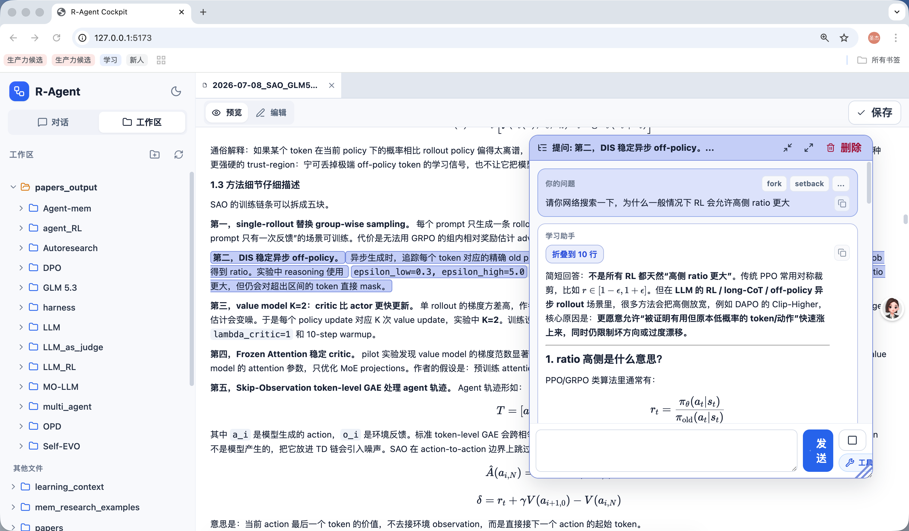
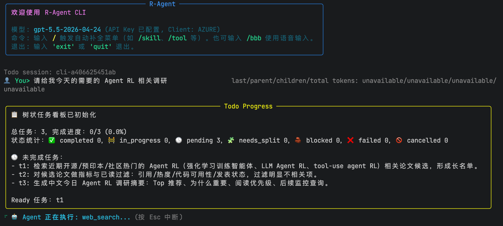

<div align="center">

# R-Agent

**一个本地化、会用工具的 AI 研究工作台**

调研论文、精读论文、阅读论文/代码仓库，并运行正在迭代中的 AutoResearch
自动实验循环——全部在一个可控的本地 Agent 里完成。

[English](README.md) · 简体中文

[](https://github.com/littlefishshow/R-Agent/stargazers)
[](LICENSE)
[](https://www.python.org/)

<sub>Research Scout · Paper Reader · Repo Reader · AutoResearch · Cockpit GUI</sub>

</div>

---

> [!TIP]
> **想直接用可视化界面？** 装好依赖并配置 `.env` 后，在项目根目录运行
> `bash scripts/start_cockpit.sh`，浏览器打开 **http://127.0.0.1:5173** 即可使用
> 可视化 Cockpit（学习型对话 / 论文与 Markdown 阅读 / 上下文分支）。停止用
> `bash scripts/stop_cockpit.sh`。详见 [可视化 Cockpit](#可视化-cockpit)。

R-Agent 不是只会聊天的问答壳子。它更像一个**可控的研究助理**：能调用工具、读写
文件、检索网页、维护结构化运行状态和长期记忆、复用技能包，把复杂任务拆成父子
Agent 协作执行，并在需要时启动 AutoResearch 循环去尝试改代码、跑验证、总结经验。

它也支持 **DIY tools 和 skills**：你可以直接在终端告诉 Agent“我想加入一个什么样的
功能 / 希望以后怎么处理某类任务”，Agent 会在可控范围内交互式地帮你设计、编写、
注册和验证新工具，或把稳定流程沉淀成 `skills/**/SKILL.md`。

## 演示

下面两张截图展示了 R-Agent 在命令行和可视化 Cockpit 中的实际运行效果。其余录制
位置可继续从 [`assets/readme/demo/`](assets/readme/demo/) 中按标注的文件名补充。

<table>
<tr>
<td width="50%">

**可视化 Cockpit**

[](r-Agent-gui.png)
_阅读论文与 Markdown 笔记，并基于选中文本提问和创建上下文分支。_

</td>
<td width="50%">

**CLI 调研工作流**

[](r-agent-cli.png)
_在 CLI 中执行调研任务，并实时查看 Todo 任务进度。_

</td>
</tr>
<tr>
<td width="50%">

**论文精读**

<!--  -->
_`assets/readme/demo/read-paper.gif` — 把 PDF 变成带图表的研究笔记。_

</td>
<td width="50%">

**AutoResearch 循环**

<!--  -->
_`assets/readme/demo/autoresearch.gif` — 在 benchmark 上 plan -> attempt -> conclude。_

</td>
</tr>
</table>

## 能力速览

- **可控的 Agent 运行时** — `core/agent.py` 保留模型—工具控制流；`core/middleware/`
  承担压缩、延迟工具、输出预算、状态追踪和安全治理。
- **结构化运行状态** — `core/state.py` 把 messages、summary、artifact、delegation、
  skill、sandbox 和 token 计量拆成独立 channel，而不是把全部状态伪装成聊天消息。
- **完整的工具面** — 文件、Shell/Python、Web Search/Extract、Memory、Skill、
  Todo/Delegate、artifact 检索和 AutoResearch，支持 schema 过滤、延迟暴露、执行期
  guard 和进程隔离。
- **可复用 skill** — 稳定工作流保存在 `skills/**/SKILL.md`，按需加载（`skill_view`）
  并可应用工具白名单（`skill_activate`）。
- **两种 Memory 后端** — 可读的 Markdown `file` 后端（`USER.md` / `MEMORY.md`）与
  结构化 `deermem` 后端（`facts.jsonl` + session facts），提供准入闸门、预算化注入、
  检索和治理。
- **长任务上下文控制** — 请求级临时视图、trigger/keep 规则、滚动 LLM 摘要、durable
  context，以及把大工具输出外置为 artifact。
- **可视化 Cockpit** — 浏览器界面，管理树状对话、VSCode 风格文件系统、PDF/Markdown
  阅读、选中文本分支和每会话工具开关。
- **AutoResearch** — 面向“小型、可验证、指标明确”实验的 `plan -> attempt -> conclude`
  循环，并通过内置 benchmark 套件持续验证。

## 快速开始

### 1. 准备环境

建议使用 Python 3.10+，在项目根目录执行：

```bash
git clone https://github.com/littlefishshow/R-Agent.git
cd R-Agent
python -m venv .venv
source .venv/bin/activate
pip install -r requirements.txt
```

`requirements.txt` 当前包含 OpenAI SDK、Rich、python-dotenv、pytest、语音输入相关
依赖，以及可视化 Cockpit 所需的 FastAPI / Uvicorn / websockets / PyMuPDF / Pillow。

### 2. 配置 `.env`

```bash
cp .env.example .env
```

最小配置如下：

```env
# openai 或 azure
LLM_CLIENT_TYPE="openai"

# OpenAI / 兼容 OpenAI 的 API Key
OPENAI_API_KEY="YOUR_API_KEY_HERE"

# OpenAI 模式填模型名；Azure 模式填接入点名称
LLM_MODEL="gpt-4o"

# 可选：第三方兼容 OpenAI 的 Base URL
# OPENAI_BASE_URL="https://api.example.com/v1"
```

Azure 模式可额外配置：

```env
LLM_CLIENT_TYPE="azure"
AZURE_OPENAI_ENDPOINT="https://xxx.openai.azure.com/"
AZURE_OPENAI_API_VERSION="2024-02-01"
LLM_MODEL="你的 Azure deployment / endpoint 名称"
```

`.env.example` 还给出了一组推荐的 Runtime 配置：

```env
DEFERRED_TOOLS_ENABLED=1
SESSION_SANDBOX_ENABLED=1
TOOL_SANITIZATION_MODE="audit"

DURABLE_CONTEXT_ENABLED=1
MEMORY_INJECTION_MODE="hidden_user"
MEMORY_PROVIDER="deermem"
MEMORY_WRITE_MIDDLEWARE_ENABLED=1
MEMORY_SESSION_FACTS_ENABLED=1
```

这组配置表示：专用工具先只出现在精简目录中，模型通过 `tool_search` 按需提升完整
schema；每个 CLI/GUI session 使用独立 workspace、Todo、RunEvent 和 artifact 路径；
工具结果注入检测采用 `audit`，只记录命中，不改写结果；summary、delegation、Skill 和
Memory 在请求时临时投影，不写入聊天历史；Memory 使用结构化 JSONL facts，并在上下文
压缩成功后自动抽取候选事实。

> **代码默认 vs. 示例配置。** 代码在没有这些环境变量时仍以 `file` Memory、关闭
> durable context、关闭延迟工具暴露和关闭 session sandbox 运行；复制 `.env.example`
> 后才会采用上面的推荐组合。完整语义见
> [`docs/03_上下文管理.md`](docs/03_上下文管理.md)、
> [`docs/04_Memory系统.md`](docs/04_Memory系统.md) 和
> [`docs/06_工具系统与沙箱.md`](docs/06_工具系统与沙箱.md)。

如需使用 Google 官方搜索，在 `.env` 中配置：

```env
GOOGLE_SEARCH_API_KEY="YOUR_GOOGLE_API_KEY"
GOOGLE_SEARCH_ENGINE_ID="YOUR_PROGRAMMABLE_SEARCH_ENGINE_ID"
```

然后调用 `web_search(provider="google_cse")`。默认 `provider="auto"` 的顺序是
`Bing -> Google Programmable Search（已配置时）-> GroundRoute/Serper（已配置时）->
Yahoo -> DuckDuckGo`。现有 `provider="google"` 仍表示 Serper 兼容别名。

### 3. 启动命令行 Agent

```bash
python main.py
```

启动后可直接输入自然语言任务，例如：

```text
帮我找最近一个月关于 test-time scaling 的高质量论文，按价值排序
```

```text
阅读 outputs/papers/agent_RL/xxx.pdf，生成研究型中文笔记
```

```text
阅读这个论文仓库，告诉我论文核心方法在代码里怎么实现
```

## 可视化 Cockpit

R-Agent 也提供浏览器版可视化 Cockpit，用于在本地管理学习型对话、论文文件、Markdown
笔记和上下文分支。

**前置条件**

- 已执行 `pip install -r requirements.txt`（含 FastAPI / Uvicorn / websockets /
  PyMuPDF / Pillow）；
- 已安装 Node.js 18+ 与 npm（前端基于 Vite，首次启动脚本会自动执行 `npm install`）；
- 已安装前端 Markdown / 数学公式渲染依赖：`markdown-it` 与 `katex`。如启动时提示缺少
  这两个包，请在前端目录执行 `cd app_gui_frontend && npm install`（或精确执行
  `cd app_gui_frontend && npm install markdown-it katex && npm install -D @types/markdown-it @types/katex`）；
  不要只在项目根目录安装，否则 Vite 可能回退解析到根目录 `node_modules` 并触发字体
  allow list 报错；
- 已按 [快速开始第 2 步](#2-配置-env) 配置好 `.env`。

**启动 / 停止**

```bash
bash scripts/start_cockpit.sh   # 前端: http://127.0.0.1:5173, 后端 API: http://127.0.0.1:8765
bash scripts/stop_cockpit.sh    # 关闭前后端并释放端口
```

自定义端口：

```bash
R_AGENT_COCKPIT_PORT=8765 R_AGENT_COCKPIT_FRONTEND_PORT=5173 bash scripts/start_cockpit.sh
```

当前 Cockpit 支持：树状问题链、聊天/文件双模式、映射到 `outputs/` 的 VSCode 风格
文件系统、带文本选择层的 PDF 阅读、Markdown 笔记、选中文本 fork/分支窗口、每会话
工具开关，以及可调三栏布局。

## 核心能力

| 能力 | 位置 | 典型用途 |
|---|---|---|
| Agent Runtime | `core/agent.py` + `core/middleware/` | 控制思考、工具调用、中断、重试和强制收尾 |
| ThreadState | `core/state.py` | 把 messages、summary、artifact、delegation、skill、sandbox、token 拆成独立 channel |
| Tool 系统 | `tools/registry.py` | schema 过滤、延迟暴露、执行期 guard、隔离子进程和超时 |
| Skill 系统 | `skills/**/SKILL.md` | 论文调研、论文阅读、仓库阅读、创意生成、GitHub 工作流 |
| Memory 系统 | `file`（`USER.md`/`MEMORY.md`）或 `deermem`（`facts.jsonl`） | 保存跨会话偏好与稳定事实，也支持当前 session 检索 |
| 上下文控制 | `core/context_control.py` | 滚动 LLM 摘要、trigger/keep、durable context、大输出 artifact |
| Todo / Delegate | Todo 文件 + 子 `ThreadState` | 并行调研、复杂工程维护、降低父上下文压力 |
| Session Sandbox | `sandbox/` | 隔离每会话 workspace、Todo、run events、tool outputs、delegate contexts |
| Run Event Stream | `core/events.py` | 将 run/LLM/tool/context/delegate/artifact 事件追加为 JSONL 并回放 |
| Paper Research | `paper_research_scout` | 找最新/高引/热门/有代码的论文 |
| Paper Reading | `read_paper` | PDF 精读、图表截图、中文研究笔记 |
| Repo Reading | `paper_repo_code_research` | 把论文方法映射到代码实现 |
| AutoResearch | `autoresearch/` | plan -> attempt -> conclude 小型研究闭环 |
| Cockpit GUI | `app_gui/` + `app_gui_frontend/` | 非终端阅读、树状对话与上下文审计 |

### Skill 分类

| 类别 | 位置 | 覆盖 |
|---|---|---|
| Agent 运维 | `skills/agent_ops/` | 上下文控制、动态 todo 委派、进度保存、代码库巡检、工具面审计、autoresearch 工作流 |
| 研究生产力 | `skills/productivity/` | `paper_research_scout`、`read_paper`、`paper_repo_code_research`、笔记修正、研究材料解释 |
| 文档/办公/知识库 | `skills/productivity/` | OCR 与文档处理、PDF、Notion、Airtable、Google Workspace、PowerPoint、地图、会议流水线 |
| GitHub 工程协作 | `skills/github/` | 仓库检查、代码审查、issue、PR workflow、仓库管理、认证 |
| 创意与可视化 | `skills/creative/` | 架构图、ASCII art/video、漫画、信息图、网页设计、Manim、p5.js、像素画、音乐、TouchDesigner |

## AutoResearch

`autoresearch/` 是 R-Agent 中正在开发的自动研究运行时。它面向“小型、可验证、指标
明确”的工程/算法实验，而不是无限制地让模型乱改大项目。核心循环是：

```text
Plan（规划）-> Attempt（尝试修改/运行）-> Conclude（评估/总结）-> 下一轮 Plan
```

**CLI**

```text
/autoresearch run <项目目录>
/autoresearch show [项目目录]
/autoresearch debug [on|off|show] [项目目录]
/autoresearch kill
```

**工具入口** — `auto_research_run_v2` / `auto_research_v2_status`（当前 V3 三步循环）、
`auto_research_run` / `auto_research_status`（legacy）、`auto_research_stop`。

它通过内置的 `autoresearch/benchmarks/atr_playground` 套件持续验证。这些项目共享
`prepare.py -> train/train.sh -> eval.sh -> metrics.json` 协议：在**不修改**固定评测
文件的前提下，修改 `solution.py`、`train/` 或 `submission/`，让官方指标变好。覆盖场景
包括文本清洗、JSON/编码修复、日志分类、信息检索、动态规划、组合优化和字符串算法。

安全边界：不自动 `git reset --hard`；不在非 git 项目里擅自初始化仓库；默认把中间
版本保存为 artifact/patch/manifest，而不是频繁 commit；用预算、超时、debug、monitor
和 stop 文件控制长运行。

## 常用命令

进入 `python main.py` 后：

```text
/help                      查看帮助
/model                     查看或切换模型相关配置
/mem                       查看 memory
/skill                     查看 skill
/tool                      查看工具
/project_list              载入历史项目进度上下文
/bbb                       语音输入，按 Enter 停止，Esc 取消
/autoresearch run <dir>    启动 AutoResearch
/autoresearch show [dir]   查看 AutoResearch 进度
/autoresearch kill         停止 AutoResearch
exit / quit                退出
```

**Gateway 服务模式（可选）。** `gateway/` 可把 R-Agent 封装为 HTTP 服务，并对接微信、
飞书、QQ 官方机器人等外部入口。相关文件见 `gateway/`、`Dockerfile.gateway`、
`docker-compose.gateway.yml` 和 `.env.gateway.example`。

## 文档

`docs/` 是一组按当前源码编写的实现教程。先阅读上面的能力地图，再按主题进入对应章节：

| 教程 | 主要回答的问题 |
|---|---|
| [`01_Agent循环中间件化.md`](docs/01_Agent循环中间件化.md) | 一轮模型决策、工具调用、Middleware hook 和强制收尾如何运行 |
| [`02_ThreadState结构化状态.md`](docs/02_ThreadState结构化状态.md) | 当前状态有哪些 channel，artifact/delegation/skill 如何合并 |
| [`03_上下文管理.md`](docs/03_上下文管理.md) | 请求视图、trigger/keep、滚动摘要、durable context 如何协作 |
| [`04_Memory系统.md`](docs/04_Memory系统.md) | file/deermem 双后端、事实抽取、gate、检索和治理如何实现 |
| [`05_子Agent委派契约.md`](docs/05_子Agent委派契约.md) | Todo 拓扑、子 Agent 隔离、预算和结果契约如何工作 |
| [`06_工具系统与沙箱.md`](docs/06_工具系统与沙箱.md) | 工具注册、权限过滤、进程隔离和 session 路径如何实现 |
| [`07_Skills与自定义Agent.md`](docs/07_Skills与自定义Agent.md) | Skill 发现、激活，以及 SOUL/Skill/Sub-agent 如何组合 |
| [`08_运行事件流.md`](docs/08_运行事件流.md) | RunEvent JSONL 与 GUI 实时事件如何分工和回放 |
| [`09_R-Agent整体流程图.md`](docs/09_R-Agent整体流程图.md) | 端到端运行时流程图 |
| [`10_AutoResearch上下文与长任务能力.md`](docs/10_AutoResearch上下文与长任务能力.md) | AutoResearch 上下文处理与长任务能力 |

## 项目结构

```text
R-Agent/
├── main.py                         # CLI 入口
├── core/
│   ├── agent.py                    # Agent Loop、迭代预算、中断与工具生命周期
│   ├── state.py                    # ThreadState 与 durable context 投影
│   ├── context_control.py          # 上下文估算、trigger/keep、滚动摘要
│   ├── memory_provider.py          # file/deermem MemoryProvider
│   ├── memory_facts.py             # JSONL FactStore 与 session fact store
│   ├── memory_extractor.py         # 对话到结构化事实的 LLM 抽取
│   ├── events.py                   # append-only RunEventStore
│   ├── middleware/                 # 生命周期 hook 与内置中间件
│   └── context/                    # 大工具结果与整轮输出预算
├── tools/                          # 工具注册、文件/命令/Memory/Skill/Todo/Delegate
├── skills/                         # 可复用工作流：论文调研、论文阅读、仓库阅读等
├── autoresearch/                   # AutoResearch runtime package
│   └── benchmarks/atr_playground/  # 内置 AutoResearch 示例 benchmark
├── app_gui/                        # Cockpit 后端 runtime / event / snapshot
├── app_gui_frontend/               # Cockpit 前端
├── gateway/                        # HTTP/Gateway/外部平台接入
├── memories/                       # Markdown memory、facts.jsonl、session facts
├── docs/                           # 当前 R-Agent Runtime 实现教程
├── outputs/                        # 论文、笔记、研究输出等本地产物（通常不进 Git）
├── sandbox/                        # session workspace、Todo、RunEvent、tool/delegate artifact
├── scripts/replay_events.py        # 回放全局或 session RunEvent JSONL
├── tests/                          # 自动化测试
├── requirements.txt
├── .env.example
├── README.md
└── CHANGELOG.md                    # 独立更新日志
```

## 测试

```bash
PYTHONPATH=. python -m pytest
```

如果当前 Python 环境缺少 pytest，先执行 `pip install -r requirements.txt`。

## 更新日志

更新日志保存在独立文件：[`CHANGELOG.md`](CHANGELOG.md)。

## License

基于 [MIT License](LICENSE) 发布。第三方 skill、依赖包、字体和媒体保留各自的许可证。
