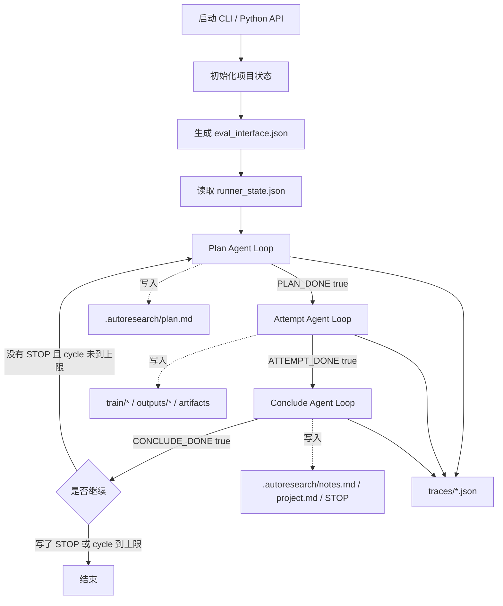

# agentic_autoresearch 说明书

这份文档用尽量简单的话解释当前 `agentic_autoresearch` 是什么、怎么跑、每一步看什么上下文、怎么调用工具、怎么记录 trace、怎么读指标、怎么监控长时间 train/eval。

你可以把它想成一个小机器人流水线。它不属于主 R-Agent 的大循环，暂时是一个独立项目。

---

## 1. 它是什么

`agentic_autoresearch` 是一个独立的 autoresearch 小框架，目录在：

```text
/mlx_devbox/users/renshengjie.422/playground/autoresearch/agentic_autoresearch
```

核心代码在：

```text
agentic_autoresearch/src/agentic_autoresearch/
  agent.py             # 一个小型 R-Agent 风格的工具调用循环
  runner.py            # 外层三步循环：plan -> attempt -> conclude
  steps.py             # 三个 step 的 prompt 和工具白名单
  tools.py             # 文件、命令、skill、eval 等工具
  context.py           # 每个 step 开始前，拼给 LLM 的上下文
  eval_interface.py    # 框架代码读取 eval 指标，不让 LLM 自己猜
  command_monitor.py   # 长时间 train/eval 的 heartbeat 监控
  delegate.py          # 轻量父子 Agent 委托工具
  monitor.py           # 整体运行状态 monitor
  debug.py             # debug.jsonl / inflight.json
  cli.py               # 手动测试命令行入口
```

它现在没有接入主 R-Agent loop。主 R-Agent 的 `/autoresearch run` 和 `auto_research_run_v2` 目前仍然指向旧的：

```text
autoresearch/autoresearch_tool.py
```

所以你手动测试新框架时，需要用：

```bash
PYTHONPATH=agentic_autoresearch/src python3 -m agentic_autoresearch.cli ...
```

---

## 2. 一句话理解

这个框架只做一件事：

```text
plan   ：先想清楚下一步要做什么
attempt：真正改 train/，跑 train/eval，收集证据
conclude：读取指标，总结经验，压缩上下文，决定要不要停
```

它会一直按这个顺序转：

```text
plan -> attempt -> conclude -> plan -> attempt -> conclude -> ...
```

但是每一步都必须由当前 step 的 LLM 明确打一个完成标签，外层 runner 才会进入下一步。

三个完成标签是：

```json
{"PLAN_DONE": true}
{"ATTEMPT_DONE": true}
{"CONCLUDE_DONE": true}
```

如果 LLM 没有打对标签，这个 step 就算没完成。

---

## 3. 总流程图



---

## 4. 运行方式

在父仓库目录下：

```bash
cd /mlx_devbox/users/renshengjie.422/playground/autoresearch
```

运行一个项目：

```bash
PYTHONPATH=agentic_autoresearch/src python3 -m agentic_autoresearch.cli run /path/to/project \
  --max-cycles 3 \
  --max-iterations-per-step 12 \
  --debug
```

查看状态：

```bash
PYTHONPATH=agentic_autoresearch/src python3 -m agentic_autoresearch.cli status /path/to/project
```

查看 JSON 状态：

```bash
PYTHONPATH=agentic_autoresearch/src python3 -m agentic_autoresearch.cli status /path/to/project --json
```

请求停止：

```bash
PYTHONPATH=agentic_autoresearch/src python3 -m agentic_autoresearch.cli stop /path/to/project
```

恢复运行，也就是删除 STOP：

```bash
PYTHONPATH=agentic_autoresearch/src python3 -m agentic_autoresearch.cli stop /path/to/project --resume
```

查看 debug tail：

```bash
PYTHONPATH=agentic_autoresearch/src python3 -m agentic_autoresearch.cli debug /path/to/project --tail 80
```

---

## 5. 运行后会生成哪些文件

假设项目目录是：

```text
/mlx_devbox/users/renshengjie.422/playground/at_test
```

框架会在项目下生成：

```text
at_test/.autoresearch/
  runner_state.json          # 外层三步循环的状态
  monitor.json               # 整体运行状态
  eval_interface.json        # 框架自动发现的 eval 读取接口
  STOP                       # 如果存在，表示请求停止

  traces/
    178..._plan.json         # plan step 完整 trace
    178..._plan_context.json # plan step 启动时给 LLM 的上下文快照
    178..._attempt.json
    178..._attempt_context.json
    178..._conclude.json
    178..._conclude_context.json

  commands/
    train-....json           # train 命令 heartbeat
    eval-....json            # eval 命令 heartbeat
    command-....json         # 普通 run_command heartbeat

  debug/
    debug.jsonl              # 事件流
    inflight.json            # 当前正在跑什么

  artifacts/
    attempt.md               # attempt 证据
    conclude.md              # conclude 总结等

  plan.md                    # plan step 写出的短计划
  detailed_plan.md           # 复杂任务才会写出的详细计划
  notes.md                   # conclude step 总结后的长期 notes
```

---

## 6. 三个 step 分别做什么

### 6.1 Plan：计划阶段

Plan 的目标是回答：

```text
我接下来应该做哪一个最小可执行尝试？
```

Plan 会看：

```text
program.md
project.md（如果存在）
.autoresearch/runner_state.json
.autoresearch/eval_interface.json
.autoresearch/notes.md（如果存在）
项目文件列表
最近 artifact 摘要
上一个 step 的 report
```

Plan 可以用的工具在 `steps.py`：

```text
read_file
search_files
skill_search
skill_view
detailed_plan
delegate_task
artifact_write
write_file
```

注意：`detailed_plan` 只有 plan 能用。

#### detailed_plan 是什么

有些项目很简单，读完 `program.md` 和文件结构就知道下一步该做什么，这时不需要详细计划。

有些项目很复杂，例如：

```text
多模块代码
多个训练入口
多个 eval
不确定指标
需要多阶段修复
```

这种情况下，plan step 可以调用 `detailed_plan` 工具。

`detailed_plan` 不调用 LLM。它只是把 LLM 给出的结构化长计划存成：

```text
.autoresearch/detailed_plan.md
```

这样主计划可以保持短，不会每次都把一大坨长计划塞进上下文里。

Plan 最后需要输出：

```json
{"PLAN_DONE": true}
```

如果没输出这个，runner 不会进入 attempt。

---

### 6.2 Attempt：执行阶段

Attempt 的目标是回答：

```text
我能不能按 plan 做一次真实尝试，并跑出证据？
```

Attempt 可以改：

```text
train/*
outputs/*
.autoresearch/artifacts/*
```

但工具层默认会保护：

```text
eval.py
eval.sh
eval/
evaluation/
```

Attempt 可以用的工具：

```text
read_file
search_files
skill_search
skill_view
write_file
run_command
run_train
run_eval
command_status
read_eval
delegate_task
artifact_write
```

#### run_train / run_eval

以前如果直接 `run_command("bash eval.sh")`，命令卡住时不容易判断是正在跑还是死掉。

现在有两个专用工具：

```text
run_train -> bash train/train.sh
run_eval  -> bash eval.sh
```

它们都会通过 `command_monitor.py` 跑命令，并持续写 heartbeat：

```text
.autoresearch/commands/train-xxx.json
.autoresearch/commands/eval-xxx.json
```

heartbeat 里有：

```json
{
  "command_id": "eval-...",
  "kind": "eval",
  "command": "bash eval.sh",
  "pid": 12345,
  "status": "running",
  "returncode": null,
  "timed_out": false,
  "started_at": 123,
  "updated_at": 124,
  "duration_seconds": 1.0,
  "heartbeat_age_seconds": 0.0,
  "stdout_tail": "...",
  "stderr_tail": "..."
}
```

如果命令很长，你可以看：

```bash
PYTHONPATH=agentic_autoresearch/src python3 -m agentic_autoresearch.cli status /path/to/project
```

如果看到：

```text
latest_command: eval status=running duration=123.4s heartbeat_age=0.8s cmd=bash eval.sh
```

说明 eval 还在跑。

如果看到：

```text
latest_command: eval status=timeout duration=300.0s ...
```

说明 eval 超时了。

#### read_eval

Attempt 可以在跑完 eval 后调用：

```text
read_eval
```

它不会调用 LLM，它只是读：

```text
.autoresearch/eval_interface.json
metrics.json
```

然后返回：

```json
{
  "metric_name": "z",
  "metric_value": 0.0,
  "higher_is_better": false,
  "solved": true
}
```

Attempt 最后需要输出：

```json
{"ATTEMPT_DONE": true}
```

---

### 6.2.1 delegate_task：父子 Agent 工具

现在 `agentic_autoresearch` 有一个轻量版父子 Agent 工具：

```text
delegate_task
```

它可以在 `plan` 和 `attempt` 使用，不能在 `conclude` 使用。

它和旧 R-Agent 的 `delegate_task` 不一样：

```text
旧 R-Agent delegate_task：
  绑定主 R-Agent、todo session、GUI、全局工具 registry

新 agentic_autoresearch delegate_task：
  只复用 agentic_autoresearch 自己的 AgentLoop
  不接主 R-Agent
  不接 GUI
  不接主 todo
  子 Agent 不能再次 delegate
```

适合委托的任务：

```text
读一个模块并总结
检查某个 artifact
分析一段日志
做一个不阻塞主线的小调查
```

不适合委托的任务：

```text
当前 step 的关键决策
必须马上完成的主线修改
需要强一致状态更新的操作
```

调用后会生成：

```text
.autoresearch/child_contexts/child-xxx.json
.autoresearch/child_results/child-xxx.json
.autoresearch/child_traces/child-xxx_*.json
```

父 step 只拿到摘要、trace 路径和 result 路径，不会把子 Agent 的完整对话塞回父上下文。

子 Agent 默认可用工具：

```text
read_file
search_files
skill_search
skill_view
artifact_write
read_eval
command_status
```

注意：子 Agent 默认没有 `write_file`、`run_train`、`run_eval`，这样可以避免子 Agent 乱改项目或启动长任务。以后如果需要，可以在调用时通过 `child_allowed_tools` 明确放开。

---

### 6.3 Conclude：收尾阶段

Conclude 的目标是回答：

```text
这次尝试到底好不好？经验是什么？下一轮还需要做什么？
```

Conclude 现在不应该靠自己读一堆日志猜 metric。

它应该先调用：

```text
read_eval
```

让框架代码告诉它：

```text
metric 是多少
是否 solved
completion criteria 是什么
```

如果 train/eval 很长，或者刚刚 timeout，它可以调用：

```text
command_status
```

看最近命令状态。

Conclude 的 LLM 重点应该是：

```text
总结经验
压缩上下文
写 notes.md
写 project.md
如果 solved，写 STOP
```

它不应该花很多 token 反复重新推断指标。

Conclude 最后需要输出：

```json
{"CONCLUDE_DONE": true}
```

---

## 7. 上下文是怎么管理的

每个 step 开始前，`context.py` 会构造一个 JSON 上下文。

上下文大概长这样：

```json
{
  "project_root": "/path/to/project",
  "run_id": "agentic-...",
  "step": "attempt",
  "state": {},
  "previous_report": {},
  "project_tree": [],
  "files": {
    "program.md": "...",
    ".autoresearch/runner_state.json": "...",
    ".autoresearch/eval_interface.json": "...",
    ".autoresearch/notes.md": "..."
  },
  "artifacts": [],
  "operating_rules": []
}
```

默认会放入这些文件：

```text
program.md
project.md
.autoresearch/runner_state.json
.autoresearch/eval_interface.json
.autoresearch/notes.md
```

不存在的文件不会放。

上下文会控制大小：

```text
AutoResearchConfig.context_char_budget 默认 24000
```

如果上下文太长，框架会截断重的字段。

### 每个 step 是独立对话

每个 step 都有自己的 message history。

也就是说：

```text
plan 的聊天记录不会自动塞给 attempt
attempt 的聊天记录不会自动塞给 conclude
```

它们靠文件传递状态：

```text
runner_state.json
plan.md
notes.md
artifacts
metrics.json
eval_interface.json
```

这很重要。因为这样不会让上下文无限变长。

---

## 8. AgentLoop 是怎么工作的

`agent.py` 里有一个 `AgentLoop`。

它做的事和 R-Agent 主 loop 很像，但是更小。

流程是：

```text
1. 准备 system message
2. 准备 user message，里面放 step context
3. 调 LLM
4. 如果 LLM 要调用工具，就执行工具
5. 把工具结果放回 messages
6. 再调 LLM
7. 一直循环，直到 LLM 最终输出 DONE tag
```

伪代码：

```python
messages = [system, user_context]

for iteration in range(max_iterations):
    response = llm(messages, tools=allowed_tools)

    if response.tool_calls:
        for tool_call in response.tool_calls:
            result = run_tool(tool_call)
            messages.append(tool_result)
        continue

    if final_text_has_done_tag(response.content):
        done = True
        break
```

### 为什么 done tag 不是简单 JSON parse

LLM 最终回答可能是：

```text
我完成了。
submission: {"x": 51, "y": -89}
metrics: {"z": 0}
{"ATTEMPT_DONE": true}
```

如果只解析第一个 JSON，就会读到 `{"x": 51, "y": -89}`，错过后面的 `ATTEMPT_DONE`。

所以现在 `_tag_is_true()` 会在整个文本里搜索：

```text
ATTEMPT_DONE: true
```

而不是只看第一个 JSON。

---

## 9. 工具系统

工具在 `tools.py`。

它不是主 R-Agent 的工具注册系统，而是 `agentic_autoresearch` 自己的小工具系统。

### 文件工具

```text
read_file
write_file
search_files
```

所有路径都必须在 project root 里面。

不能逃到外面：

```text
../
~
绝对路径逃逸
```

`write_file` 默认保护 eval：

```text
eval.py
eval.sh
eval/
evaluation/
```

### 命令工具

```text
run_command
run_train
run_eval
command_status
```

`run_command` 是通用命令。

`run_train` 固定跑：

```bash
bash train/train.sh
```

`run_eval` 固定跑：

```bash
bash eval.sh
```

这三个都会写 command heartbeat。

### skill 工具

```text
skill_search
skill_view
```

它们只看项目内的：

```text
skills/
```

不会自动使用主 R-Agent 全局 skill 系统。

### artifact 工具

```text
artifact_write
```

用于把长证据写到：

```text
.autoresearch/artifacts/
```

### detailed_plan 工具

```text
detailed_plan
```

只给 plan step 用。

用于复杂项目写：

```text
.autoresearch/detailed_plan.md
```

### eval 工具

```text
read_eval
```

用于读取当前指标和 solved 状态。

### delegate 工具

```text
delegate_task
```

用于启动一个轻量子 Agent 处理自包含 side task。

它会保存：

```text
child_contexts/
child_results/
child_traces/
```

并且不会允许子 Agent 再递归委托。

---

## 10. eval_interface 是什么

`eval_interface.py` 是为了避免 LLM 每次自己猜指标。

初始化 runner 时会自动运行：

```python
ensure_eval_interface(project_root)
```

它会写：

```text
.autoresearch/eval_interface.json
```

内容类似：

```json
{
  "metric_file": "metrics.json",
  "eval_command": "bash eval.sh",
  "train_command": "bash train/train.sh",
  "submission_file": "outputs/submission.json",
  "train_verification_file": "outputs/train_verification.json",
  "criteria": {
    "metric_name": "z",
    "higher_is_better": false,
    "threshold": 0.001,
    "op": "<="
  }
}
```

然后 `read_eval` 会读：

```text
metrics.json
```

并计算：

```text
metric_value
solved
```

例如：

```json
{
  "metric_name": "z",
  "metric_value": 3.2e-13,
  "higher_is_better": false,
  "solved": true
}
```

---

## 11. command heartbeat 是什么

如果 `eval.sh` 要跑 30 分钟，不能只看到“没输出”。

所以框架执行命令时会写：

```text
.autoresearch/commands/<command_id>.json
```

内容类似：

```json
{
  "command_id": "eval-...",
  "kind": "eval",
  "command": "bash eval.sh",
  "pid": 12345,
  "status": "running",
  "duration_seconds": 120.0,
  "heartbeat_age_seconds": 0.0,
  "stdout_tail": "...",
  "stderr_tail": "..."
}
```

如果命令结束：

```json
{
  "status": "ok",
  "returncode": 0
}
```

如果超时：

```json
{
  "status": "timeout",
  "timed_out": true
}
```

这样你可以知道：

```text
eval 是还在跑
eval 已经失败
eval 超时
eval 卡住没有 heartbeat
```

---

## 12. trace 里有什么

每个 step 会生成两个 trace 文件：

```text
178..._attempt.json
178..._attempt_context.json
```

### 主 trace

主 trace 有：

```json
{
  "step": "attempt",
  "done_tag": "ATTEMPT_DONE",
  "done": true,
  "iterations": 8,
  "started_at": 123,
  "finished_at": 456,
  "duration_seconds": 333,
  "context_manifest": {},
  "context": {},
  "initial_messages": [],
  "messages": [],
  "llm_events": [],
  "tool_events": [],
  "usage": {},
  "usage_delta": {},
  "step_stats": {}
}
```

### context_manifest

它告诉你 LLM 一开始看到了什么：

```json
{
  "context_chars": 4947,
  "file_keys": [
    "program.md",
    ".autoresearch/runner_state.json",
    ".autoresearch/eval_interface.json"
  ],
  "file_chars": {
    "program.md": 1788
  },
  "artifact_count": 0
}
```

这样你能判断：

```text
模型是不是看到了旧 metrics.json
模型是不是看到了旧 submission.json
模型是不是看到了旧 notes.md
模型是不是看到了 hidden 信息
```

### llm_events

每一次 LLM 调用都有：

```json
{
  "iteration": 3,
  "duration_seconds": 43.773,
  "usage_delta": {
    "prompt_tokens": 4831,
    "completion_tokens": 3992,
    "total_tokens": 8823
  },
  "messages_before": [],
  "assistant_message": {},
  "tool_call_count": 1
}
```

你可以看出：

```text
哪一次 LLM 最慢
哪一次 token 最多
它调用了什么工具
调用工具前看到了什么消息
```

### tool_events

每个工具调用都有：

```json
{
  "iteration": 5,
  "name": "run_eval",
  "arguments": "{}",
  "result": "...",
  "duration_seconds": 0.05
}
```

你可以看出：

```text
它是不是读取了 blackbox_oracle.py
它是不是直接写了 optimizer.py
它是不是跑了 eval.sh
它跑命令花了多久
```

---

## 13. monitor 里有什么

整体 monitor 在：

```text
.autoresearch/monitor.json
```

内容类似：

```json
{
  "run_id": "agentic-...",
  "status": "running",
  "current_step": "attempt",
  "next_step": "(running)",
  "cycle": 0,
  "max_cycles": 3,
  "usage": {
    "llm_calls": 18,
    "tool_calls": 37,
    "prompt_tokens": 89814,
    "completion_tokens": 8968,
    "total_tokens": 98782
  },
  "last_step_stats": {
    "duration_seconds": 30.394,
    "llm_seconds": 30.377,
    "tool_seconds": 0.004
  },
  "totals": {
    "step_seconds": 141.548,
    "llm_seconds": 141.318,
    "tool_seconds": 0.192
  }
}
```

CLI status 会把它显示成：

```text
run_id: agentic-... status: running
step: attempt -> (running)
cycles: 0/3
llm_calls: 18 tool_calls: 37
time: step_total=141.548s llm=141.318s tools=0.192s
last_step: duration=30.394s llm=30.377s tools=0.004s tokens=27068
latest_command: eval status=running duration=123.4s heartbeat_age=0.8s cmd=bash eval.sh
```

---

## 14. debug 里有什么

如果启动时加：

```bash
--debug
```

会写：

```text
.autoresearch/debug/debug.jsonl
.autoresearch/debug/inflight.json
```

`debug.jsonl` 是事件流：

```json
{"event": "step_start", "step": "attempt"}
{"event": "llm_start", "step": "attempt", "detail": "iteration 1"}
{"event": "llm_finish", "elapsed_seconds": 2.6}
{"event": "tool_start", "detail": "run_eval"}
{"event": "tool_finish", "elapsed_seconds": 0.05}
```

`inflight.json` 是当前正在跑什么：

```json
{
  "kind": "llm",
  "step": "attempt",
  "detail": "iteration 3",
  "age_seconds": 4.1
}
```

如果你怀疑卡住，可以看：

```bash
PYTHONPATH=agentic_autoresearch/src python3 -m agentic_autoresearch.cli debug /path/to/project --tail 80
```

---

## 15. 停止机制

停止靠文件：

```text
.autoresearch/STOP
```

如果这个文件存在，runner 会停止下一轮。

请求停止：

```bash
PYTHONPATH=agentic_autoresearch/src python3 -m agentic_autoresearch.cli stop /path/to/project
```

恢复：

```bash
PYTHONPATH=agentic_autoresearch/src python3 -m agentic_autoresearch.cli stop /path/to/project --resume
```

Conclude 如果发现 solved，也可以自己写 STOP。

---

## 16. 当前 at_test 的一次真实运行说明

在一次干净恢复后的 `at_test` run 中，结果是：

```text
z = 3.2076153715472017e-13
```

总耗时：

```text
141.548s
```

其中：

```text
LLM:   141.318s
tools: 0.192s
```

这说明：

```text
真正慢的是 LLM 思考，不是 train/eval 命令
```

step 级别：

```text
plan:     44.94s, 12,781 tokens
attempt:  66.21s, 58,933 tokens
conclude: 30.39s, 27,068 tokens
```

attempt 里最慢的是第三次 LLM：

```text
43.773s
```

这一次主要是在生成 `train/optimizer.py`。

---

## 17. 当前已知问题

### 17.1 plan 仍然可能偏重

现在已经加了 `detailed_plan`，但 LLM 是否调用它，仍由 prompt 引导。

简单任务时，希望它不要写超长计划。

后续可以加机器规则：

```text
如果项目文件少于 N 个，且 program.md 很短，禁止 detailed_plan。
```

### 17.2 attempt 仍然太自由

Attempt 现在可以自由读文件、写文件、跑命令。

更理想的是机器 checklist：

```text
1. 检查入口
2. 写 train 文件
3. run_train
4. run_eval
5. read_eval
6. 写 evidence
7. ATTEMPT_DONE
```

否则 LLM 会多读、多想、多消耗 token。

### 17.2.1 delegate_task 需要更清晰的机器调度规则

现在已经有轻量子 Agent，但是否调用仍靠 LLM 判断。

后续可以加规则：

```text
只有当任务是 read-only side task 时才允许 delegate
关键路径任务默认禁止 delegate
delegate 返回必须带 evidence artifact
父 step 只读取 child result 摘要，不读取完整 child messages
```

### 17.3 conclude 仍可能多轮思考

虽然有 `read_eval`，但 LLM 可能仍读很多文件。

后续可以把 conclude 改成：

```text
机器先 read_eval
如果 solved，机器直接写 STOP 和 notes 模板
LLM 只补充经验总结
```

### 17.4 train-side oracle 需要能力标记

像 `at_test` 允许 `train/` 调用 `blackbox_oracle.py`。

这对测试有用，但通用框架不应默认认为每个项目都有 oracle。

后续应该在 `eval_interface.json` 或 `capabilities.json` 里明确写：

```json
{
  "capabilities": {
    "train_side_oracle": true
  }
}
```

trace 里也应该标记：

```text
本次用了 train_side_oracle
```

这样你能区分：

```text
它是靠 eval 黑箱反馈优化
还是靠本地 oracle 直接求解
```

---

## 18. 设计原则

当前框架要坚持几个原则。

### 原则 1：三步要简单

```text
plan    想下一步
attempt 做下一步
conclude 总结下一步
```

不要再变成六七个 phase。

### 原则 2：指标判断交给代码

LLM 不应该每次自己读日志猜 metric。

应该用：

```text
eval_interface
read_eval
```

### 原则 3：长命令必须有 heartbeat

train/eval 可能很久。

必须能看：

```text
还在跑
跑多久
stdout/stderr 最近输出
是否 timeout
```

### 原则 4：LLM 做经验总结，不做机械判断

机器擅长：

```text
读 JSON
比较数字
判断 threshold
记录耗时
记录 token
```

LLM 擅长：

```text
总结经验
解释失败
提出下一步策略
压缩上下文
```

### 原则 5：所有重要事情都落盘

不要只存在模型对话里。

应该落到：

```text
runner_state.json
eval_interface.json
monitor.json
traces/*.json
commands/*.json
notes.md
artifacts/*
```

---

## 19. 怎样排查一次 run

如果一次 run 不对，按这个顺序看。

### 1. 看总状态

```bash
PYTHONPATH=agentic_autoresearch/src python3 -m agentic_autoresearch.cli status /path/to/project
```

看：

```text
status
current_step
last_step
latest_command
token
time
```

### 2. 看正在跑什么

```bash
PYTHONPATH=agentic_autoresearch/src python3 -m agentic_autoresearch.cli debug /path/to/project --tail 80
```

### 3. 看最近 train/eval

```text
.autoresearch/commands/*.json
```

### 4. 看 step trace

```text
.autoresearch/traces/*_plan.json
.autoresearch/traces/*_attempt.json
.autoresearch/traces/*_conclude.json
```

### 5. 看模型一开始看到了什么

```text
.autoresearch/traces/*_context.json
```

重点看：

```text
context_manifest.file_keys
context.files
project_tree
artifacts
```

### 6. 看指标接口

```text
.autoresearch/eval_interface.json
metrics.json
```

或者让工具读：

```text
read_eval
```

---

## 20. 和旧 autoresearch 的区别

旧 autoresearch 在：

```text
autoresearch/
```

新独立框架在：

```text
agentic_autoresearch/
```

旧的主入口目前还没切到新框架。

所以：

```text
/autoresearch run ...
auto_research_run_v2
```

仍然是旧框架。

要测试新框架，用：

```bash
PYTHONPATH=agentic_autoresearch/src python3 -m agentic_autoresearch.cli run ...
```

---

## 21. 最后用一个小故事记住它

你可以把 `agentic_autoresearch` 想成一个小学生做科学实验。

它有三本本子：

```text
计划本：plan
实验本：attempt
总结本：conclude
```

它每次做实验前：

```text
先写计划
再做实验
最后写总结
```

老师要求它：

```text
别只说“我觉得变好了”
要把分数写下来
要把命令跑了多久写下来
要把每次问大模型花了多少 token 写下来
要把自己看过哪些资料写下来
```

所以它每一步都会留下：

```text
trace
monitor
debug
command heartbeat
eval_interface
notes
```

这样如果结果不好，我们不是猜，而是能回头看：

```text
它看了什么
它想了多久
它调了什么工具
工具返回了什么
指标是多少
为什么它决定停或继续
```

这就是当前 `agentic_autoresearch` 的核心。
