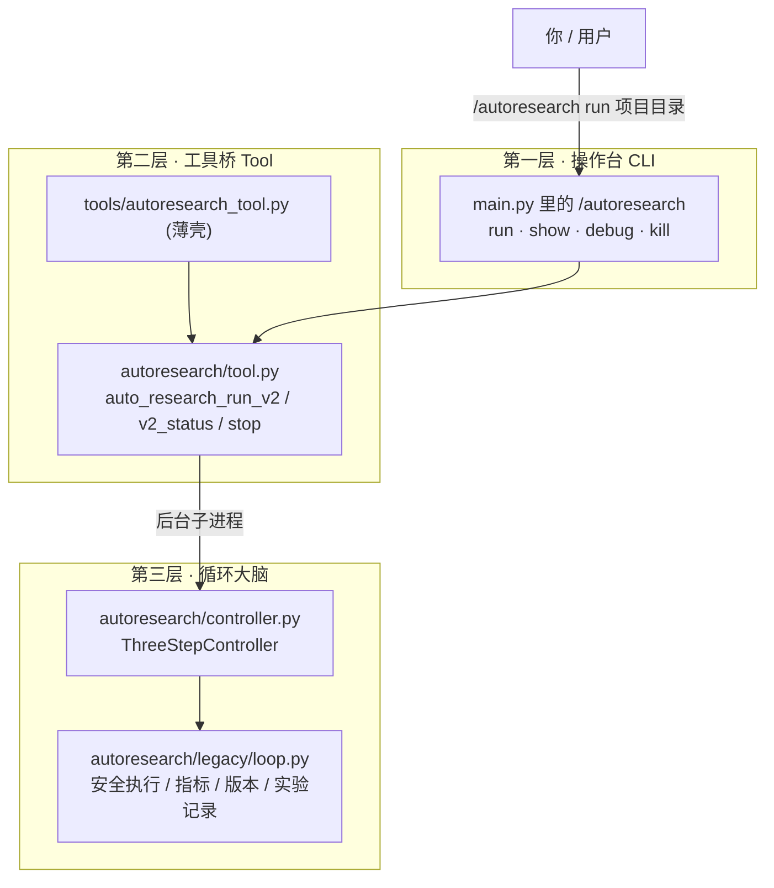
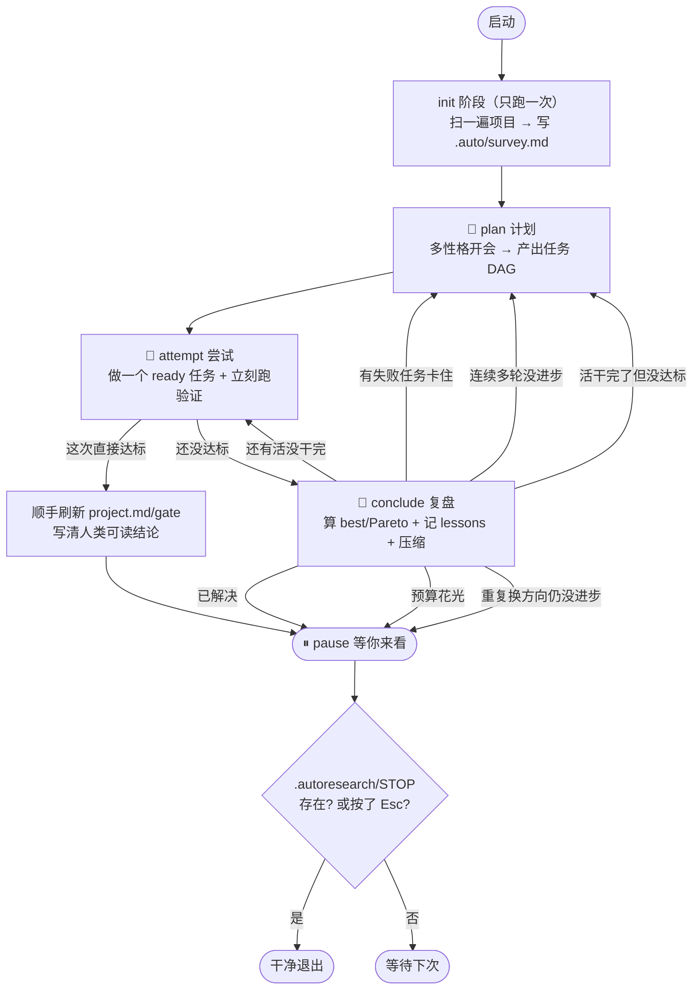
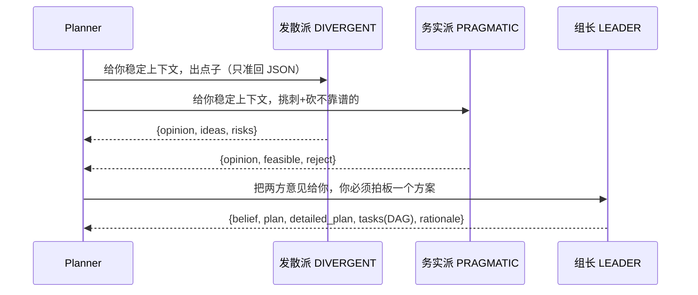
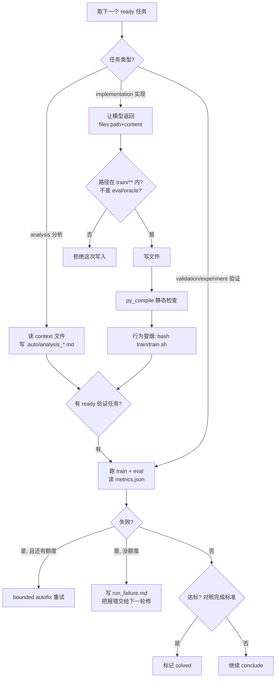
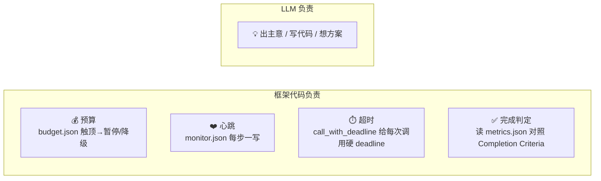
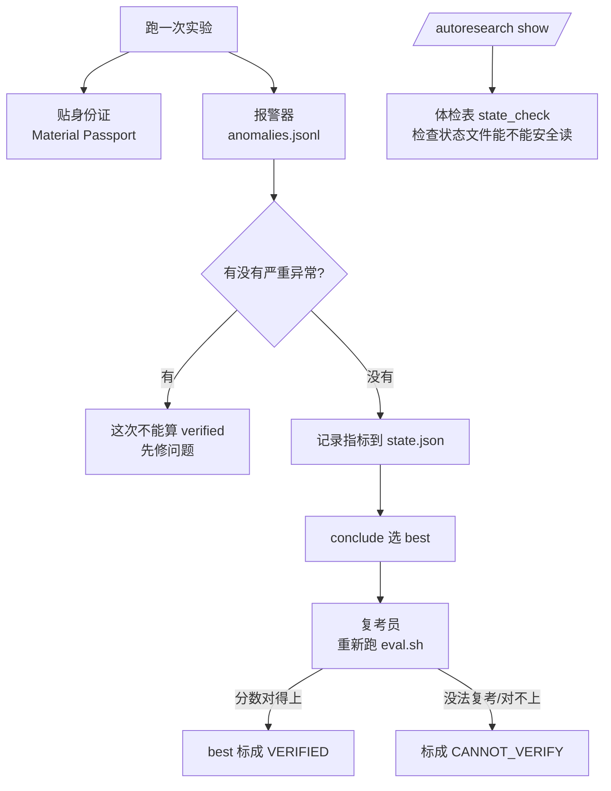

# AutoResearch 框架详解（小学生也能看懂版）

这份文档用最直白的话，把 R-Agent 里的 `autoresearch/` 包讲清楚：
它是什么、怎么一步步跑、每一步能用什么工具、能看到什么、会把结果写到哪、
这次新增的几个“检查员”在保护什么，以及现在还差什么才算“真正的自动科研”。

---

## 0. 一句话比喻

> AutoResearch 就像一个**很自律的小研究员**：
> 他先看清楚“老师留的题目”，然后**开会想办法 → 动手做实验 → 复盘总结**，
> 一轮一轮循环，直到题目达标或者预算花完，中间所有事都记在几个本子上，
> 你随时能翻本子看他做到哪了。

它不是“喊一句就自动发论文”的魔法，而是一个**边界清晰、状态落盘、可中断、可复盘**的循环。

---

## 1. 三层结构：谁负责喊、谁负责调度、谁负责干活



- **第一层 CLI**：你打字的地方。`/autoresearch run <目录>` 在后台起一个不阻塞主聊天的进程；
  `/autoresearch show` 只读进度条；`debug` 开关调试；`kill` 杀掉在跑的进程。
- **第二层 Tool**：`tools/autoresearch_tool.py` 只是个“门牌”，真正逻辑在 `autoresearch/tool.py`，
  它注册了 4 个工具：`auto_research_run`（老版）、`auto_research_run_v2`（现在主力）、
  `auto_research_v2_status`（看心跳）、`auto_research_stop`（放停止哨兵）。
- **第三层 循环大脑**：`ThreeStepController` 是真正的“研究员”，它跑 **plan → attempt → conclude**；
  脏活累活（在项目目录里安全跑命令、解析指标、记录实验、版本管理）复用 `legacy/loop.py`。

---

## 2. 五个“本子”：记忆是分层的（L0–L4）

小研究员不会把所有东西塞进脑子，而是分成 5 个本子，越靠上越“神圣不可改”，越靠下越“可以随便涂”。

| 层级 | 载体 | 谁能改 | 装什么 | 比喻 |
|------|------|--------|--------|------|
| **L0 宪法** | `program.md` 里 `<!-- CONSTITUTION -->` 段 | 只有用户 | 题目、规则、**完成标准**、禁止改的文件 | 老师写的考卷，学生不能涂改 |
| **L1 信念** | `program.md` 里 `<!-- BELIEF -->` 段 | Planner 可改 | 当前“我觉得该怎么解”的直觉 | 学生写在考卷旁的解题思路 |
| **L2 项目态** | `project.md` | 只有父进程 | 梗概/当前计划/改动记录/**短期结论**/PHASE 标记 | 班级黑板，全班都能看，只有班长写 |
| **L3 细节** | `.auto/*.md` | 子任务 | survey、plan、execute_report、run_report、run_failure… | 每个小组自己的草稿纸（会定期清理） |
| **L4 原始档案** | `.autoresearch/artifacts/` | 框架 | 辩论全文、命令原始输出、write 记录、快照 | 档案室，父进程只留“摘要+路径”，不塞回脑子 |

> 关键设计（记住这条）：**父进程只看“摘要/digest”，子任务的完整上下文落到 artifact 文件，绝不把子进程的长篇大论回灌到 project.md**。这样脑子（上下文）永远不爆。

`program.md` 如果没写 `<!-- BELIEF -->` 标记，就被当成**纯只读宪法**，框架永远不会去改它（见 `state/memory.py:73` `update_belief`）。

---

## 3. 主循环：三步走 + 谁决定下一步去哪



- 每走一步（step）都会写一次 `monitor.json` 心跳，所以你 `/autoresearch show` 永远能看到“现在第几步、在哪个阶段、花了多少钱”。
- 遇到 `pause`、发现 `STOP` 哨兵、或预算耗尽，循环就停。
- **收尾保险**：如果预算刚好停在 attempt 之后（下一步本该是 conclude），框架会**多补跑一次 conclude**，保证 best/lessons 一定被结算（见 `controller.py:560` 附近 `run()`）。

决定“下一步去哪”的逻辑全在 `_next_after_conclude`（`controller.py:145`），**这是纯代码判断，不靠 LLM 自觉**。

---

## 4. 每一步详解：能干啥 / 能用啥工具 / 能用啥技能 / 能看到啥

### 4.1 三步的“工具白名单”（框架强制，越权直接拒绝）

工具白名单定义在 `runtime_policy.py`，`tool_guard` 会拦截不在名单里的调用。

| 能力 | 🧠 plan | 🔨 attempt | 📌 conclude |
|------|:---:|:---:|:---:|
| `read_file` 读文件 | ✅ | ✅ | ✅ |
| `search_files` 搜文件 | ✅ | ✅ | ✅ |
| `write_file` 写文件 | ❌ | ✅ | ✅ |
| `run_command` 跑命令 | ❌ | ✅ | ❌ |
| `artifact_inspect/search/slice` 翻档案 | ✅ | ✅ | ✅ |
| `skill_search / skill_view` 查技能 | ✅ | ✅ | ❌ |
| `todo_manage` 管任务看板 | ✅ | ✅ | ✅ |
| `delegate_task` 派子任务 | ✅ | ✅ | ❌ |

一句话记忆：
- **plan 只动嘴不动手**（能读能查能规划，不能改代码、不能跑命令）；
- **attempt 才是唯一能改代码、能跑命令的人**；
- **conclude 只做账房先生**（读证据、写结论、管看板，不改代码不跑命令）。

### 4.2 能用哪些 Skill

- plan / attempt 允许的技能白名单目前只有 **`codebase_scout`**（快速摸清代码库），见 `runtime_policy.py:155,175`。
- conclude 不开放技能。
- 想用别的技能？`skill_view` 会被 `tool_guard` 拦下来，报“不在白名单”。这是刻意的——研究循环要收敛，不能让子步骤乱翻技能。

### 4.3 每一步“能看到的上下文”

上下文由 `build_step_context`（`runtime_policy.py:213`）打包，**有 12000 字符预算，超了就按固定顺序砍最重的字段**（先砍 state.json、experiment_memory，再砍 project.md/program.md）。

| 🧠 plan 看到 | 🔨 attempt 看到 | 📌 conclude 看到 |
|------|------|------|
| 宪法 + 信念（program.md） | 那一个 ready 任务 + 它的 last_result | state 里的实验记录 |
| 项目梗概（project.md） | program 的约束（哪些能改/不能改） | best / Pareto |
| 代码库扫描摘要 / survey | 可改路径 / 受保护路径 | 任务看板 digest |
| 任务看板 digest | 验证命令表 | 最近的 execute/run 产物 |
| 最近的 best 实验 | 最近的行为检查产物 | lessons + 预算/门控信号 |
| **额外**：关键项目源码（README/train/eval/pyproject，最多 18000 字符，见 `planner.py:356`） | | |

> plan 是**最贵**的一步，所以它被特批看更多真实源码（像“父进程拿到充足上下文再规划”）；
> attempt/conclude 只看和自己那点活相关的东西，省钱省脑子。

### 4.4 plan（计划）到底怎么“开会”



- 默认 2 个性格（发散 + 务实）并行发言，**预算紧张时自动降到 1 个**（`planner.py:113`）。
- 组长 LEADER 只有一次机会，必须输出**结构化 JSON**：
  - `belief` → 写回 L1（program.md 信念）
  - `plan` → 写进 L2（project.md 当前计划）
  - `detailed_plan` + `tasks` → 变成任务看板 `todo_state.json` + `.auto/plan.md`
  - 全部辩论记录 → 丢进 L4 档案（**不进 project.md**）
- 贴心兜底：
  - 如果还没有任何“带指标的实验”，会**自动插入一个 baseline 任务**先跑通再说（`planner.py:310`）；
  - 如果已经有实验了还在 replan，会**把计划压缩成“一个实现 + 一个验证”**，避免越想越多把步数耗光（`planner.py:482` `_compact_repair_plan`）；
  - 没有可用 LLM 时，也会给一个**确定性的兜底 DAG**，绝不卡死。

### 4.5 attempt（尝试）到底怎么“动手”

attempt 一步里其实做了两件事：**Execute（改/读）+ Run（验证）**。



attempt 的几条硬规矩：
- **只有 `verification==True` 才算做完**（`execution.py` 里贯穿的“硬约束”）。光说“我改好了”不算数，得能编译、能跑。
- **只准写 `train/**`，绝不碰 `eval.py` / `eval.sh` / `blackbox_oracle.py`**（`execution.py:515` `_is_train_side_write_path`）。
- 大任务会**切成小 subgoal**，一次只做一小块，每个任务最多试 `execute_max_task_attempts`（默认 3）次。
- 验证失败时，**真实的 stderr/traceback 会被写进 `.auto/run_failure.md`**，下一轮 Execute 第一件事就是修它，而不是继续优化指标。
- 失败的验证任务会被 `repair_failed_run_tasks`（`todo.py:287`）**自动变成一个“修复任务”**插进 DAG。
- 子任务的完整上下文落到 `.autoresearch/delegate_contexts/*.json`（父进程只看摘要）。

### 4.6 conclude（复盘）到底在“算账”

- `evaluate` handler（`phase_handlers.py`）：
  1. `finalize_experiments`：算出 best / Pareto 前沿 / 按版本策略处理 commit/rollback；
  2. 更新 `gate_signals.json`（门控信号）；
  3. 往 project.md 的“短期结论”写**人话**：best 是谁、指标多少、**完成标准达没达标、下一步是 pause 还是继续**；
  4. 把经验写进 `lessons.jsonl`。
- `compress` handler：信念段太长时裁剪，别让上下文膨胀。
- 然后 `_next_after_conclude` 拍板下一步（见第 3 节的分支）。

---

## 5. 状态文件地图：想查什么去哪翻

都在项目目录下的 `.autoresearch/`（和根目录的 `project.md` / `.auto/`）。

| 文件 | 装什么 | 你什么时候看它 |
|------|--------|----------------|
| `monitor.json` | 心跳：状态/阶段/第几步/花了多少钱/pid | 想知道“**现在跑到哪了**”→ `/autoresearch show` |
| `/autoresearch show` 返回里的 `state_check` | 给 `.autoresearch` 做体检：状态文件是不是坏了、phase 是否合法、todo/gate 能不能读 | 想知道“**这次能不能安全续跑**” |
| `project.md` | 人类可读的项目态 + **短期结论** | 想知道“**结果咋样、解没解决**”，第一眼看这里 |
| `state.json` | 所有实验 / best / Pareto / 指标历史 | 想看“**每次实验的数字**” |
| `todo_state.json` | 任务 DAG（谁依赖谁、做到哪） | 想看“**计划和进度**” |
| `gate_signals.json` | best_id / pareto_changed / plateau 计数 / 是否要重规划 | 想知道“**为什么它决定换方向/暂停**” |
| `budget.json` | token / USD 账本 | 想知道“**花了多少钱**” |
| `lessons.jsonl` | 经验账本（**gitignore，回滚也不丢**） | 想看“**踩过哪些坑**” |
| `experiment_memory.json/md` | 实验记忆摘要 | 规划下一步的参考 |
| `anomalies.jsonl` | 运行时发现的异常分类，比如缺输出、输出没变、导入失败、超时 | 想知道“**为什么这次验证不能算通过**” |
| `regression_cases.json` | 回归用例 / 收尾契约 | 收尾阶段防止改坏 |
| `debug/inflight.json` | **当前卡在哪个 LLM/shell/phase** | 感觉“卡住了”时看这个 |
| `debug/debug.jsonl` | debug 事件流 | 详细排查 |
| `step_traces/step_XXX_*.json` | 每一步的完整快照 | 事后复盘单步 |
| `delegate_contexts/*.json` | 子任务拿到的完整上下文 | 想看“子任务当时看到了啥” |
| `.auto/run_failure.md` | 最近一次失败的报错 | 排查为什么没跑通 |
| `STOP` | 停止哨兵（放一个文件就优雅停） | 想让它停下来 |
| `bin/python` | 指向 python3 的小垫片 | 防止老环境把 `python` 认成 python2 |

---

## 6. 框架“机械负责”的四件事（不交给 LLM 瞎判断）

这是这个框架最重要的设计原则：**机械的判断交给代码，别让大模型“凭感觉”决定**。



- **完成判定**：程序读 `program.md` 里的 `## Completion Criteria`（比如 `z <= 0.001`），
  再读 `metrics.json` 的真实指标，用 `is_metric_solved` **算**出来解没解决（`state/completion.py`）。
  不是让大模型说“我觉得完成了”。
- **超时**：每次 LLM/命令调用都套 `call_with_deadline`，卡住会被打断并记录到 inflight。
- **预算**：`budget.json` 累计 token/USD，触顶就暂停或降级 persona，保证“可以无限跑”不会变成“无限烧钱”。
- **心跳**：`monitor.json` 每步一写，即使它在后台独立进程里跑，你也能随时观测。


---

## 7. 这次新增的“四个检查员”（autoresearch3）

这次改动可以先不用看代码，记成一句话：

> 以前小研究员会做实验、记分数；现在他还会给每份结果贴身份证，给自己的本子做体检，遇到异常会拉警报，最后还会复考一次确认“好成绩不是碰巧来的”。



### 7.1 身份证：Material Passport

`passport` 就像每张试卷右上角贴的一张小卡片，写清楚：

- 这是谁写的：`R-Agent AutoResearch`；
- 这是哪种东西：run report、experiment record；
- 什么时候写的；
- 属于哪个项目、哪个实验；
- 现在可信度是什么：`UNVERIFIED`、`VERIFIED`、`CANNOT_VERIFY`。

为什么要贴身份证？

以前你看到一个 `best.json` 或 `.auto/run_report.md`，要自己猜“这是哪轮来的、算不算验证过”。现在不用猜，直接看 `passport.verification_status`。

相关文件：

- `autoresearch/state/passport.py`：负责做身份证；
- `.auto/run_report.md`：现在开头会带 `## Material Passport`；
- `.autoresearch/state.json` 里的实验记录：现在也会带 `passport` 字段。

### 7.2 体检表：state_check + revision

`state_check` 像每天上课前检查书包：

- `state.json` 是不是能打开；
- `todo_state.json` 里的任务是不是列表；
- `gate_signals.json` 里的计数是不是数字；
- `project.md` 里的 phase 合不合法；
- 有没有文件坏掉到不能继续。

`revision` 像作业本页码。每次框架保存 `state.json`，页码都会加 1。这样以后要做更强的断点续跑或冲突检测时，就知道“这本子是不是被别人动过”。

你怎么用？

- 跑 `/autoresearch show`；
- 返回结果里会有 `state_check`；
- `state_check.ok=true` 表示状态体检通过；
- `ok=false` 表示状态文件坏了或结构不对，应该先修状态，不要假装能安全续跑。

相关文件：

- `autoresearch/state/schema.py`：负责体检；
- `autoresearch/legacy/context.py`：每次保存 `state.json` 时自动写 `schema_version/revision/updated_at`；
- `autoresearch/tool.py`：`auto_research_v2_status` 会返回 `state_check`。

### 7.3 报警器：run_spec 监控 + anomalies

以前 Run 阶段主要看“命令是不是 0 退出”和“有没有指标”。但有些坏情况不能只看 exit code：

- 命令成功了，但应该生成的文件没生成；
- 日志文件一直没变，像卡住了；
- 报错是导入失败、schema 错、资源不够、还是超时；
- eval 其实没拿到新输出，只读到了旧的 `metrics.json`。

所以现在 `run_spec` 可以多写一些“老师额外要求”：

```json
{
  "mode": "single",
  "commands": ["bash train/train.sh", "bash eval.sh"],
  "expected_outputs": ["outputs/submission.json", "metrics.json"],
  "monitor_files": ["run.log"],
  "experiment_type": "training",
  "determinism": "deterministic"
}
```

报警器会把问题分门别类，比如：

| 类型 | 小学生版解释 | 会发生什么 |
|------|--------------|------------|
| `MISSING_OUTPUT` | 老师要交两张纸，你少交了一张 | 这次验证不能算稳 |
| `OUTPUT_STALL` | 本子很久没写新字，可能卡住 | 写入异常记录，提醒下一轮看 |
| `SCHEMA_ERROR` | 答案格式不对，老师读不懂 | 先修输出格式 |
| `IMPORT_ERROR` | 代码找不到要用的模块 | 先修环境或 import |
| `RESOURCE_ANOMALY` | 内存/GPU 之类资源出问题 | 先降规模或改资源策略 |
| `HARD_TIMEOUT` | 超时没做完 | 停下来，缩小任务或加预算 |
| `CRASHED` / `RUN_FAILED` | 命令崩了或非 0 退出 | 先修崩溃 |

重点：如果报警器发现“严重异常”，这个 run task **不会被标成 verified**。也就是说，不能只因为命令表面跑完了，就说“作业合格”。

相关文件：

- `autoresearch/anomalies.py`：负责分类报警；
- `autoresearch/run_handler.py`：执行前后拍快照，写 `.autoresearch/anomalies.jsonl`，并把异常写进 `last_result`；
- `autoresearch/planner.py`：保留 planner 产出的新 `run_spec` 字段。

### 7.4 复考员：best reproducibility verification

一次考高分不一定代表真的会了，可能是碰巧。所以 conclude 现在会对 best candidate 做“复考”：

1. 先选出当前 best；
2. 如果能跑 `eval.sh`，就重新跑一次或多次；
3. 把复跑指标和原来的 best 指标比较；
4. 如果对得上，就把 best 的 `passport.verification_status` 升级成 `VERIFIED`；
5. 如果缺 `eval.sh`、复跑失败、或者分数对不上，就标成 `CANNOT_VERIFY`。

复考也分三种题型：

| 类型 | 怎么比较 |
|------|----------|
| `deterministic` | 同样代码同样数据，分数必须一样 |
| `stochastic` | 有随机性，允许一点点误差，默认 5% |
| `environment-sensitive` | 跟硬件/系统有关，允许更宽一点，默认 10% |

工具参数里可以控制：

- `best_reproducibility_runs`：复考几次；0 表示跳过；
- `best_reproducibility_determinism`：题型是 deterministic / stochastic / environment-sensitive；
- `best_reproducibility_threshold`：允许的相对误差。

相关文件：

- `autoresearch/reproducibility.py`：负责比较分数；
- `autoresearch/legacy/loop.py`：conclude/finalize 时复跑 best，并写回 `best_experiment.reproducibility`。

---

## 8. 安全边界（它绝对不会做的事）

- 不改 `eval.py` / `eval.sh` / `blackbox_oracle.py`，只在 `train/**` 里改；
- 不做静默的破坏性 git 操作，默认版本策略 `artifact_only`（只存 patch/manifest，不自动 commit）；
- 不把子进程长篇上下文塞回父进程状态；
- 不靠“LLM 自觉”决定停不停，用 `STOP` 哨兵 / 预算 / 完成标准这些**硬闸门**；
- 越权工具调用被 `tool_guard` 当场拒绝。

---

## 9. 跟着一个真实例子走一遍（black_box）

题目：最小化黑盒函数 `z`，完成标准 `z <= 0.001`，只能改 `train/`。

1. **plan**：开会 → 决定“修好 train 入口 + 写一个带缓存的确定性 2D 搜索器 + 跑验证”，生成任务 DAG。
2. **attempt #1**：跑 baseline，发现 `train/optimizer.py` 缺失报错 → 自动生成“修复任务”。
3. **attempt #2**：修好入口，baseline 跑通，`z=10522`（有指标了）。
4. **attempt #3**：写出真正的搜索器（广域网格探索 + 局部精修），跑验证 → `z=0.0`。
5. **完成判定**：`0.0 <= 0.001` ✅ → 直接刷新 `project.md` 短期结论（best=exp-0003、metric z=0.0、completion met、next=pause）→ **pause**。
6. 你 `/autoresearch show` 看到 `status: paused`，翻 `project.md` 一眼就知道“解决了”。

---

## 10. 现在还差什么？（距离“真正的 AutoResearch”的 TODO）

当前框架已经能把**单目标、指标明确、可快速评测**的任务端到端跑通（black_box 已验证）。
但离“通用自动科研”还有这些可以做：

### A. 让每一步真正变成“完整 Agent”
- 现在 attempt 主要走**确定性的 direct_write**（让模型直接返回文件内容），
  `_run_step_agent_loop`（`controller.py:337` 附近）虽然预留了“把每一步换成完整 RAgent 循环”的接口，但默认没启用。
- **TODO**：把 plan/attempt/conclude 都升级成真正带工具调用的子 Agent 循环，让它能自己多轮 read→改→跑→再改。

### B. Planner 直接产出结构化任务，去掉“prose 解析”兜底
- `planner.py` 里 `_plan_to_todo_state`/`_classify_plan_item` 明确写着是“临时兼容层”，
  靠正则把自然语言计划猜成任务类型，容易误判。
- **TODO**：强约束 LEADER 只输出 typed DAG JSON，彻底退役 prose 解析。

### C. 真正的“语义压缩”
- 现在 conclude 的 `compress` 只是“信念段太长就裁掉尾巴”，是确定性截断。
- **TODO**：用便宜模型做真正的语义压缩（保留关键结论、丢冗余），让它能跑成百上千轮不爆上下文。

### D. 并行 / 多分支探索
- 现在是单线程一条 DAG 往前走。
- **TODO**：支持并行开多个实验分支、用 Pareto 前沿做真正的多目标搜索与择优。

### E. 版本管理落地
- `commit_pareto` / `branch_per_trial` 等策略代码在，但默认只用 `artifact_only`，未充分实战。
- **TODO**：在真实 git 项目上验证“每个有效 trial 自动 commit / 开分支”，让好结果可回溯、坏结果可回滚。

### F. 子进程真委派
- attempt 目前大多在**父进程内联**完成子任务，`delegate_contexts` 已经把上下文落盘了，但还没大规模用 `delegate_task` 起真正的子进程去干。
- **TODO**：把叶子任务真正委派给隔离子 Agent 执行，父进程只调度 + 收 digest。

### G. 更广的任务类型
- 目前深度验证的是黑盒优化这类“有明确数值指标 + 秒级评测”的任务。
- **TODO**：验证多文件工程改造、长训练任务（`long_job` 模式已有雏形）、非数值指标（如通过率/人评）等更真实的科研场景，并补齐鲁棒性与断点续跑。

### H. 可视化
- 现在看进度靠 `monitor.json` 文本。
- **TODO**：把 monitor / step_traces / DAG 接到 R-Agent Cockpit，做成可视化面板。

---

## 11. 一页速记

- **入口**：`/autoresearch run <目录>` 后台起；`show` 看进度；`kill` 杀进程。
- **大脑**：`ThreeStepController` 跑 **plan → attempt → conclude** 循环。
- **记忆**：L0 宪法 / L1 信念 / L2 项目态 / L3 细节 / L4 档案，父进程只看摘要。
- **分工**：plan 动嘴、attempt 动手（唯一能改代码跑命令）、conclude 算账。
- **闸门**：完成标准、预算、超时、STOP —— 全是**代码机械判断**，不靠 LLM 自觉。
- **安全**：只改 `train/**`，不碰 eval/oracle，默认不自动 commit。
- **状态**：想知道“解没解决”看 `project.md`；想知道“跑到哪”看 `monitor.json`；想知道“能不能安全续跑”看 `state_check`。
- **新检查员**：passport 贴身份证，state_check 做体检，anomalies 拉警报，reproducibility 给 best 复考。
