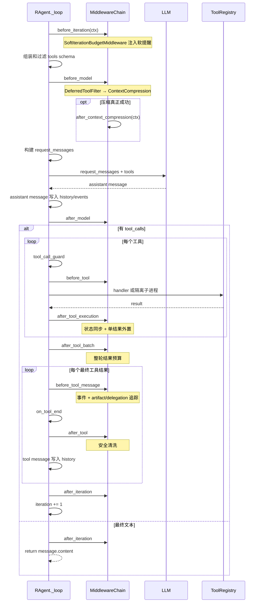

# 01 · Agent 循环中间件化

> 本章只讲 R-Agent 当前代码怎样运行：Middleware 解决什么问题、对象怎样构造、七个
> hook 在真实循环中的准确位置，以及哪些职责仍由 `_loop` 直接承担。

## 1. 中间件的作用是什么

R-Agent 的核心是一个反复执行的模型—工具循环：

```text
准备本轮上下文和工具
  → 调用模型
  → 模型要求调用工具
  → 执行工具并写回结果
  → 再调用模型
  → 直到模型给出最终文本或预算耗尽
```

这个循环必须直接处理“下一步走哪个分支”；但有些能力并不负责决定流程，而是希望在多个
固定位置观察、限制或补充流程。例如：

- 每轮开始时记录统计；
- 模型调用前检查当前工具列表；
- 工具执行前阻止危险调用；
- 工具执行后清洗外部文本；
- 上下文压缩成功后抽取长期记忆。

如果这些能力全部写成 `_loop` 里的 `if`，主循环会同时承担流程、Memory、安全和观测，
不同能力也很难单独启停。Middleware 的作用就是为这些**横切能力**提供稳定插槽。

### 1.1 Middleware 不负责什么

Middleware 不是第二套 Agent Loop，也不会自己驱动模型。它不能决定 `while` 是否继续，
不能替代工具注册表，也不会自动持久化状态。真正的控制权仍在 `RAgent._loop()`。

可以用一个交通路口来理解：

- `_loop` 是交警，决定车辆直行、转弯还是停车；
- Middleware 是路口上的摄像头、限高杆和消毒通道；
- 它们能观察、拦截或处理经过的车辆，但不会替代交警规划整个交通流程。

### 1.2 当前支持的五类中间件行为

| 行为 | 使用的 hook | 能做什么 |
| --- | --- | --- |
| 观察 | `before_iteration`、`before_model`、`after_model`、`after_iteration` | 读取运行状态、记录统计、更新自己的计数 |
| 否决 | `before_tool` | 返回一段拒绝原因，阻止工具 handler 真正执行 |
| 单结果处理 | `after_tool_execution`、`before_tool_message`、`after_tool` | 更新状态、外置大结果、追踪和清洗最终文本 |
| 整批处理 | `after_tool_batch` | 约束同一 assistant turn 的工具结果总量 |
| 压缩后处理 | `after_context_compression` | 读取压缩前消息和压缩结果，执行 Memory 等副作用 |

当前核心文件：

- `core/middleware/base.py`：数据契约、基类和调度链；
- `core/middleware/builtins.py`：内核运行时、治理和安全中间件；
- `core/agent.py:RAgent.__init__`：构造中间件链；
- `core/agent.py:RAgent._loop`：六个常规 hook 的运行位置；
- `core/agent.py:RAgent._maybe_compress_context`：压缩后 hook 的运行位置；
- `tools/delegate_tool.py:_build_subagent_middlewares`：子 Agent 专用链。

## 2. 当前中间件的构造是什么

当前构造可以分成四层：

```text
Middleware 子类
    ↓ 实现一个或多个 hook
MiddlewareChain
    ↓ 按注册顺序调度
AgentContext / ToolCallView
    ↓ 提供运行时数据
RAgent.run_conversation + RAgent._loop
    ↓ 在准确位置触发 chain
```

### 2.1 `Middleware`：扩展协议

`Middleware` 基类提供十个默认 no-op hook：

```python
class Middleware:
    def before_iteration(self, ctx): ...
    def before_model(self, ctx): ...
    def after_model(self, ctx): ...
    def before_tool(self, ctx, call): ...
    def after_tool_execution(self, ctx, call, result): ...
    def after_tool_batch(self, ctx, calls, tool_messages): ...
    def before_tool_message(self, ctx, call, result): ...
    def after_tool(self, ctx, call, result): ...
    def after_iteration(self, ctx): ...
    def after_context_compression(self, ctx): ...
```

子类只覆盖自己需要的部分。例如只想拦截写工具，就只实现 `before_tool`。

### 2.2 数据契约：`AgentContext`

`AgentContext` 是一轮循环共享的运行时上下文：

| 字段 | 创建或赋值时机 | 中间件能看到什么 |
| --- | --- | --- |
| `agent` | 每轮开始创建时 | 当前 `RAgent`，包括 `state`、`messages`、`session_id`、事件方法 |
| `iteration` | 每轮开始创建时 | 当前循环编号 |
| `tools` | 进入 `before_model` 前赋值 | 本轮候选 tool schema；先由 deferred filter 原地收窄，再用于压缩估算 |
| `message` | 模型返回后、`after_model` 前赋值 | 当前 assistant message，包括 `content` 和 `tool_calls` |
| `event_sink` | 每轮开始创建时 | GUI 实时事件接收器，可为空 |
| `extra` | 创建时为空 dict | 特殊阶段的附加数据；压缩成功时放入压缩前消息和压缩结果 |

`ctx.agent` 是一个真实对象引用，不是只读快照。中间件技术上可以修改
`ctx.agent.state`、`ctx.tools` 或其它字段。因此编写中间件时必须明确副作用，不能把它
当成任意修改 Agent 内部状态的捷径。

### 2.3 工具契约：`ToolCallView`

工具 hook 不直接收到注册表内部对象，而是收到一个小型视图：

```python
ToolCallView(
    name="write_file",
    arguments='{"path":"a.md","content":"..."}',
    call_id="call_123",
)
```

它只包含工具名、原始参数和 call id。这样中间件不需要依赖 OpenAI SDK 的 tool-call
对象形状，也不需要读取 `registry._tools`。

当前 `before_tool` 的正式返回契约只有“返回拒绝字符串或 `None`”，没有参数改写协议。
即使中间件执行 `call.arguments = "..."`，`_loop` 中真正传给 handler 的局部
`func_args` 也不会同步变化。需要修正参数时应在工具 handler 内验证和规范化，或扩展一套
明确的参数改写契约，不能依赖修改 `ToolCallView`。

### 2.4 `MiddlewareChain`：顺序调度器

`MiddlewareChain` 保存一份有序列表：

```python
MiddlewareChain([first, second, third])
```

运行普通观察 hook 时，各对象按顺序执行。工具结果相关 hook 有特殊规则：

- `before_tool`：返回第一个非空拒绝字符串后立即停止后续中间件；
- `after_tool_execution`：单结果链式改写；
- `after_tool_batch`：整批 tool messages 链式改写；
- `before_tool_message`：只观察最终预算化结果，不改写；
- `after_tool`：所有中间件都会运行；前一个改写后的结果会传给后一个；
- 所有 hook 异常都会记录到 `chain.errors`，然后继续执行。

例如两个结果处理中间件：

```text
原始结果
  → A 添加安全标签
  → B 截断敏感字段
  → 最终结果写进 tool message
```

### 2.5 `run_conversation` 和 `_loop` 的关系

#### `run_conversation` 是“一次用户请求”的外壳

它负责：

- 首次加入 system message；
- 为本次请求创建 `RunEventStore` 和 `run_id`；
- 写入用户消息；
- 修复上一次中断留下的悬空 tool call；
- 复位截断、软提醒、排除工具和延迟提升状态；
- 调用 `_loop()`；
- 在成功、错误或用户中断时做收尾。

`run_conversation` 不会在每个生命周期点直接运行 Middleware；它先准备一次 run 的边界，
然后把 `event_sink`、工具限制、取消信号等参数交给 `_loop`。

#### `_loop` 是“模型工作循环”

每轮按下面的真实顺序执行：



这里有五个容易误解的位置：

1. 上下文压缩现在由第一个 `before_model` 中间件触发；`after_context_compression`
   是压缩过程中的条件 hook；
2. `after_model` 发生在 assistant message 已经写入 `messages` 之后、工具/最终文本分支之前；
3. `before_tool` 发生在调用方 `tool_call_guard` 之后；
4. `after_tool_execution` 逐个处理原始结果，`after_tool_batch` 再处理整批结果；
5. `before_tool_message` 先追踪预算化结果，随后运行 `on_tool_end`，最后由
   `after_tool` 清洗即将写入 history 的文本。

## 3. 当前具体的中间件和对应运行时位置

先区分两个概念：

- **hook 已存在**：`_loop` 会在这个位置调用 `MiddlewareChain`；
- **当前有内置中间件使用它**：仓库已有中间件覆盖了这个 hook。

当前十个 hook 都可用；当前内置中间件已经使用其中八个：

| 运行顺序 | Hook | 运行时位置 | 当前内置使用者 |
| --- | --- | --- | --- |
| 1 | `before_iteration` | 每轮取消检查后 | `SoftIterationBudgetMiddleware` |
| 2 | `before_model` | 基础工具权限确定后、请求消息构建前 | `DeferredToolFilterMiddleware`、`ContextCompressionMiddleware` |
| 条件 | `after_context_compression` | 压缩成功并提交状态后 | `MemoryWriteMiddleware` |
| 3 | `after_model` | 模型回复和 token 已记录、assistant message 已写入 history 后 | 无 |
| 4 | `before_tool` | `tool_call_guard` 未否决后、session 参数注入和 handler 执行前 | `LoopDetectionMiddleware` |
| 5 | `after_tool_execution` | 单个 handler 返回或被拒绝后 | `ToolRuntimeStateMiddleware`、`ToolOutputBudgetMiddleware` |
| 6 | `after_tool_batch` | 同一 assistant turn 的全部工具结果准备完成后 | `ToolOutputBudgetMiddleware` |
| 7 | `before_tool_message` | 整批预算完成后、`on_tool_end` 前 | `ToolResultTrackingMiddleware` |
| 8 | `after_tool` | `on_tool_end` 后、tool message 写入 history 前 | `ToolResultSanitizationMiddleware` |
| 9 | `after_iteration` | 一轮全部工具结果写入后，或最终文本返回前 | 无 |

### 3.1 `before_iteration`：一轮刚开始

真实顺序：

```text
检查 cancel_event
  → 创建 AgentContext
  → before_iteration
  → SoftIterationBudgetMiddleware 按需注入提醒
```

此时 `ctx.tools=[]`、`ctx.message=None`。它适合重置中间件自己的轮级状态、记录轮次开始，
但不适合检查最终工具列表，因为工具还没有组装。

### 3.2 `before_model` 与 `after_context_compression`：压缩前后

`DeferredToolFilterMiddleware` 是第一个 `before_model` 中间件，先隐藏尚未提升的工具；
`ContextCompressionMiddleware` 随后调用
`_maybe_compress_context(ctx.tools, mw_ctx=ctx)`，所以调用方自定义 `before_model`
看到的是过滤并压缩后的状态。

`after_context_compression` 不在每轮固定触发。只有压缩判断命中，并且
`compress_messages()` 真正返回 `compressed=True` 后才运行。

此时 R-Agent 已经：

1. 用压缩后的消息替换 `agent.messages`；
2. 更新 `state.summary_text`；
3. 更新 `state.context_usage`；
4. 写入 `context.compact` 运行事件。

然后在 `ctx.extra` 放入：

```python
ctx.extra["pre_compression_messages"] = pre_compression_messages
ctx.extra["compression_result"] = result
```

`MemoryWriteMiddleware` 使用的就是这个位置。它读取压缩前的完整消息，优先调用
provider 的 `add_compression()`；provider 没有该方法时才退回 `add()`。

为什么不能放在压缩前？因为压缩可能失败，此时不应把一次“没有发生的压缩”误当成
Memory 更新时机。为什么要传压缩前消息？因为压缩后的 history 已经丢失了具体细节。

实际是否写入还取决于 provider：默认 file provider 的 `add()` 是 no-op；deermem
provider 才会启动事实抽取和 apply 流程。

压缩中间件运行前已经完成：

- 外部 `allowed_tools` 过滤；
- Skill `allowed_tools` 交集；
- `exclude_tools` 排除；
- deferred tool 过滤；

`ctx.tools` 是本轮准备给模型的 schema 列表；`request_messages` 尚未构建，durable
context 和 tool catalog 也尚未插入。

调用方中间件随后仍可检查工具数量或状态。若要修改工具列表，需要区分：

- `ctx.tools.append(...)`、`ctx.tools[:] = ...` 等**原地修改**会影响 `_loop` 的局部
  `tools`，因为二者最初引用同一个 list；
- `ctx.tools = new_list` 只替换 `AgentContext` 字段，不会改变 `_loop` 后续使用的局部
  `tools` 变量。

当前 `before_model` 没有正式的“返回新工具列表”契约。需要长期支持工具改写时，
应扩展显式返回值协议，而不是利用引用细节。

### 3.3 `after_model`：模型已经回答，但还没路由

运行前已经完成：

- LLM 请求成功；
- token usage 已累计；
- GUI 和 RunEvent 已记录模型回复；
- assistant message 已追加到 `agent.messages`；
- `ctx.message` 已指向该回复。

之后 `_loop` 才判断 `message.tool_calls`。因此该 hook 同时覆盖“模型准备调用工具”和
“模型准备给最终文本”两种情况。

当前没有内置中间件使用它。需要注意：这里改 `ctx.message` 引用本身，不会自动替换已经
追加到 `agent.messages` 的原消息；若直接修改二者共同引用的 message 对象字段，则可能
影响历史。需要改写模型回复时应定义明确契约，而不是依赖对象引用关系。

### 3.4 `before_tool`：工具真正执行前

每个 tool call 都运行一次。顺序是：

```text
发 tool.call 事件
  → 调用 on_tool_start
  → tool_call_guard
  → before_tool
  → 注入当前 session_id
  → allowed/excluded 二次检查
  → 执行 handler
```

`LoopDetectionMiddleware` 在这里将 `工具名 + 原始参数字符串` 拼成签名。如果相同签名
连续达到阈值，就：

- 设置 `agent._loop_capped=True`；
- 写一条 loop-capped 工具事件；
- 返回拒绝字符串；
- handler 不执行；
- 拒绝字符串作为正常 tool result 交给模型，让模型改变策略。

该中间件由 `delegate_task` 为每个子 Agent 单独创建，主 Agent 默认链不包含它。

`before_tool` 看到的是模型给出的原始参数。当前 session id 的自动注入发生在它之后；
因此循环签名不会因为框架补入 `session_id` 而改变。

### 3.5 `after_tool_execution`：单工具结果处理

每个 handler 返回或被拒绝后，结果依次经过：

1. `ToolRuntimeStateMiddleware`
   - 合并 delegate token；
   - 处理 `tool_search` promotion；
   - 捕获 `skill_view` 上下文；
   - 应用 `skill_activate` policy。
2. 调用方自定义 `after_tool_execution`。
3. `ToolOutputBudgetMiddleware`
   - 单结果超过阈值时写入 artifact；
   - 用 `<persisted-output>` 替换原始正文。

输出预算位于调用方中间件之后，保证自定义处理即使扩大文本，最终仍受预算约束。

### 3.6 `after_tool_batch`：整批结果预算

同一 assistant message 可能同时发出多个 tool calls。全部单结果处理完后，
`ToolOutputBudgetMiddleware` 计算本轮总字符数；超过预算时优先外置最大的结果。

这个 hook 是为聚合策略新增的。把它放进单工具 `after_tool_execution` 无法知道其它结果
大小，也无法正确执行整轮预算。

### 3.7 `before_tool_message` 与 `after_tool`：追踪和最终清洗

整批预算完成后，结果先进入 `before_tool_message`：

1. `ToolResultTrackingMiddleware`
   - 发 GUI `tool.finished` 和 RunEvent；
   - 更新 `artifact_index`；
   - 更新 `delegation_ledger`。

随后 Loop 调用外部 `on_tool_end`，最后进入 `after_tool`：

2. `ToolResultSanitizationMiddleware`（配置开启时）
   - audit 或中和 prompt injection。
3. 调用方其它 `after_tool` 中间件。

此时 tool message 还没有追加进 `agent.messages`。所以这个 hook 处理的是“下一轮模型最终
会看到的文本”，而不是工具实际副作用。

`ToolResultSanitizationMiddleware` 在这里检测明显的 prompt-injection 短语：

- `audit`：记录命中事件，返回 `None`，原结果继续进入模型；
- `enforce`：添加安全提示，并用零宽字符打断可疑短语；
- `<persisted-output>` 占位块直接跳过，因为完整正文已经在 artifact 文件中。

这些工具后 hook 收到的 `ToolCallView.arguments` 来自执行阶段保存的参数，可能包含框架
自动注入的 `session_id`，这与 `before_tool` 看到的原始参数不同。

即使工具被 `tool_call_guard`、Middleware、allowed/excluded 检查拒绝，拒绝字符串也会
作为结果继续经过工具后处理链。所以这些 hook 处理的不只是成功 handler 的返回值。

### 3.8 `after_iteration`：一轮结束

有工具调用时，它在本轮所有 tool messages 写入后运行，然后 `iteration += 1`。没有工具
调用时，它在返回最终文本前运行。

当前没有内置中间件使用它。它适合轮级统计，但不能假设每次
`before_iteration` 都一定有配对的 `after_iteration`：中断、模型错误或工具阶段抛出的
`AgentInterrupted` 都可能让本轮提前退出。

## 4. 哪些部分不在中间件中，而在 Loop 中

Middleware 只提供扩展点。以下职责仍由 `run_conversation` 或 `_loop` 直接实现。

### 4.1 Run 边界和中断回滚

`run_conversation()` 负责创建 run id、写入用户消息、修复悬空 tool calls、保存回滚位置。
用户按 Esc 后，它将本轮 assistant/tool 中间消息回滚，但保留用户输入。

这是一次请求的事务边界，不是某个横切插件的职责。

### 4.2 迭代预算和强制收尾

`_loop` 自己维护 `iteration`，`SoftIterationBudgetMiddleware` 只负责软提醒。达到最大
轮数后，Loop 调用 `_force_finalize()`，不再提供工具，强制模型生成当前结论和未完成
事项。

强制收尾调用**不经过**常规 `before_model` / `after_model` hook。这是当前实现的重要
边界：中间件不能假设所有 LLM 调用都会经过模型 hook。

### 4.3 工具集合的确定

`_loop` 直接计算：

```text
注册表全量工具
  ∩ 调用方 allowed_tools
  ∩ 当前 Skill policy
  - exclude_tools
  → deferred tool filter
```

这是工具可见性与执行权限的核心规则。Middleware 可以观察最终 `ctx.tools`，但当前没有
统一的“返回一个新工具集合”契约。

### 4.4 请求视图构建

上下文压缩触发已经由 `ContextCompressionMiddleware` 负责，但具体压缩算法仍复用
`_maybe_compress_context()` 和 `core/context_control.py`。

压缩完成后，Loop 调用 `_build_request_messages()`，临时插入 tool catalog、summary、
delegation、Skill 和 Memory。请求视图构建仍属于 Loop。

### 4.5 LLM 调用、重试和 token 统计

`_chat_completion_with_retry()` 负责超时、瞬时错误识别、指数退避、取消检查和 token
累计。模型上下文过长时，Loop 还会保存诊断文件。

这些逻辑决定一次模型调用是否成功，当前没有 `wrap_model_call` 类型的中间件。

### 4.6 工具执行与外部回调

Loop 负责：

- session 参数注入；
- execution-level allow/exclude 检查；
- 普通工具隔离子进程和 timeout；
- `delegate_task` 的特殊进程路径；
- `on_tool_start` / `on_tool_end` 调用方回调；
- 把中间件处理后的 tool message 追加进 history；
- 根据模型是否产生 tool calls 决定继续循环还是返回。

输出外置、整轮预算、artifact/delegation 追踪已经迁入中间件。工具 handler 的实际副作用
仍由 Loop/ToolRegistry 执行，中间件不能撤销已经发生的文件写入、命令执行或网络请求。

## 5. 当前怎样构造中间件，Agent 可以直接构造吗

### 5.1 主 Agent 的默认构造

`RAgent.__init__` 的逻辑是：

```python
optional_middlewares = (
    list(middlewares)
    if middlewares is not None
    else build_default_middlewares()
)
self.middleware = MiddlewareChain(
    build_runtime_middlewares(optional_middlewares)
)
```

含义是：

- 内核运行时链始终存在；
- `middlewares=None`：配置决定工具清洗和 Memory 写入是否加入；
- 显式传入 list：该 list 替换配置可选链，但不会移除内核链；
- 显式传入空 list `[]`：关闭配置可选链，仍保留运行时不变量；
- 调用方传入的是 Middleware 对象列表，`RAgent` 最后统一包成 `MiddlewareChain`。

### 5.2 默认链怎样组装

`build_runtime_middlewares()` 先构造完整运行时链。没有自定义中间件时，顺序是：

```text
DeferredToolFilterMiddleware
ContextCompressionMiddleware
ToolRuntimeStateMiddleware
ToolResultTrackingMiddleware
[配置可选中间件]
ToolOutputBudgetMiddleware
SoftIterationBudgetMiddleware
```

`build_default_middlewares()` 只负责配置可选部分：

```text
TOOL_SANITIZATION_MODE / TOOL_SANITIZATION_ENABLED
    → ToolResultSanitizationMiddleware

MEMORY_WRITE_MIDDLEWARE_ENABLED
    → MemoryWriteMiddleware
```

调用方中间件插在 `ToolResultTrackingMiddleware` 之后、`ToolOutputBudgetMiddleware`
之前。这样调用方可以先规范化结果，但不能绕过最后的输出预算。

这个列表是全局排列顺序；进入某个 hook 时，只会调用真正覆盖该 hook 的对象。例如
`ToolResultTrackingMiddleware` 排在调用方中间件之前，但它只实现
`before_tool_message`，不会影响调用方的 `before_model`。

`SoftIterationBudgetMiddleware` 放在链尾，是为了保持旧顺序：调用方
`before_iteration` 先运行，软提醒随后注入。

### 5.3 显式传入只替换配置可选链

例如：

```python
agent = RAgent(middlewares=[ReadOnlyGuard()])
```

最终仍包含压缩、状态同步、输出预算、追踪和软提醒；但不会自动加入配置中的
`ToolResultSanitizationMiddleware` 或 `MemoryWriteMiddleware`。

如果希望同时保留配置可选链，需要显式合并：

```python
from core.agent import RAgent
from core.middleware import build_default_middlewares

agent = RAgent(
    middlewares=[
        *build_default_middlewares(),
        ReadOnlyGuard(),
    ]
)
```

因此测试中显式注入 `MemoryWriteMiddleware(provider=fake)` 时，内核运行时能力仍在，但
配置工具清洗不会自动附带。

### 5.4 子 Agent 使用专用链

`delegate_task` 不调用主 Agent 的默认链，而是：

```python
RAgent(
    max_iterations=max_iters,
    session_id=session_id,
    middlewares=_build_subagent_middlewares(),
)
```

`_build_subagent_middlewares()` 当前返回 `LoopDetectionMiddleware`，并作为显式可选链
传入。`RAgent` 仍会在外层安装完整内核运行时链，所以子 Agent 自动拥有：

- 上下文压缩；
- 工具状态同步；
- 单结果与整批输出预算；
- artifact/delegation 追踪；
- 软预算提醒；
- 额外的 LoopDetection。

子 Agent 不会自动加入配置中的工具清洗和 MemoryWrite。

这种隔离是有意的：

- 子 Agent 不允许写长期 Memory，因此不装 `MemoryWriteMiddleware`；
- 子 Agent 更需要循环保护；
- 父子链各自构造内核 Middleware 实例，不共享可变状态。

如果希望子 Agent 同时使用工具清洗，需要在 `_build_subagent_middlewares()` 显式加入。

### 5.5 可以让 Agent 在运行中直接构造吗

要区分“Python 调用方”和“正在对话的模型”：

- **Python 调用方可以直接构造。** 创建 Middleware 对象，传给 `RAgent(...)` 即可；
- **模型当前不能在一次运行中动态安装 Middleware。** 工具注册表里没有
  `middleware_manage`，也没有把 `agent.middleware` 暴露为可修改工具；
- 模型即使能用 `write_file` 修改源码，也不会让当前已经创建的 `RAgent` 自动重新构造
  chain；通常需要受控修改、测试并重启 Agent；
- 运行中直接改 `agent.middleware._middlewares` 属于内部实现操作，没有锁和公共 API，
  不应作为正常用法。

### 5.6 一个可直接使用的只读中间件

```python
from core.agent import RAgent
from core.middleware import Middleware, build_default_middlewares

class ReadOnlyGuard(Middleware):
    name = "read_only_guard"

    def before_tool(self, ctx, call):
        if call.name in {"write_file", "delete_file", "run_command"}:
            return f"只读运行禁止执行 {call.name}。请改用读取或搜索工具。"
        return None

agent = RAgent(
    middlewares=[
        *build_default_middlewares(),
        ReadOnlyGuard(),
    ]
)
```

模型仍可能提出写工具调用，但 handler 不会执行，拒绝理由会作为 tool message 返回，模型
可以在下一轮改用安全工具。

## 6. 异常和安全边界

### 6.1 单个 Middleware 异常默认 fail-open

每个 hook 都由 `MiddlewareChain` 单独 `try/except`。异常会记录为：

```python
{
    "phase": "before_model",
    "middleware": "quota_observer",
    "error": "database unavailable",
}
```

然后执行下一个中间件，主循环继续。

**例子：** 一个统计中间件连接数据库失败。如果异常直接冒泡，用户连普通问答都无法完成；
当前策略会让对话继续，并在 `agent.middleware.errors` 留下诊断。

**边界：** 这对观测、Memory 等增强能力合理，但对必须强制执行的安全策略不够。不能通过
“在异常时 raise”实现 fail-closed，因为 chain 会吞掉异常。安全中间件应在能够判断时
返回明确 denial；如果策略数据不可用就必须停止执行，则应放在更高优先级的
`tool_call_guard` 或 Loop 的确定性权限检查中。

### 6.2 `tool_call_guard` 的优先级高于 `before_tool`

调用方 guard 先执行，只有它没有返回拒绝原因时，Middleware 才运行。

**例子：**

```text
AutoResearch guard：当前阶段禁止 write_file
ReadOnlyMiddleware：当前模式也禁止 write_file
```

工具调用会使用 AutoResearch guard 的拒绝结果，ReadOnlyMiddleware 不再执行。这样调用方
为某次 run 设置的边界不会被通用 Middleware 覆盖。

### 6.3 `before_tool` 只停止 handler，不删除工具调用记录

被否决时，模型已经生成了 assistant tool call，该消息也已经进入 history。R-Agent 不会
删掉它，而是生成一条对应的 tool result，内容就是拒绝原因。

这是保持 OpenAI tool-call 协议完整所必需的：

```text
assistant(tool_call_id=123)
tool(tool_call_id=123, content="已拒绝")
```

如果只阻止 handler 却不补 tool message，下一次模型请求会因悬空 tool call 被 API 拒绝。

### 6.4 `after_tool` 不能撤销副作用

`after_tool` 运行时 handler 已经执行。

**例子：** `write_file` 已经把内容写入磁盘，随后清洗中间件把返回文本中的可疑指令打断。
这只改变模型下一轮看到的文本，不会回滚文件。

因此：

- 阻止危险操作必须用 `tool_call_guard`、`before_tool` 或工具自身审批；
- `after_tool` 适合清洗、脱敏、格式转换和观测；
- 不要把“工具后清洗”误解为“工具执行沙箱”。

另外，当前 GUI 的 `EVENT_TOOL_CALL_FINISHED` 和落盘的 `tool.result` RunEvent 都由
`before_tool_message` 发出，位于 `after_tool` **之前**。因此：

- 模型下一轮看到的是中间件改写后的 tool message；
- GUI 回调和 RunEvent preview 记录的可能仍是改写前结果。

如果审计要求记录“最终注入模型的文本”，需要在 `after_tool` 之后再发一条专门事件，
不能把现有 `tool.result` 默认理解为最终注入值。

### 6.5 Schema 隐藏和执行期权限是两层边界

`allowed_tools`、Skill policy、`exclude_tools` 和 deferred tools 先决定模型看到哪些
schema。执行前 Loop 还会再检查 `effective_allowed` 和 `excluded`。

**例子：** 模型根据旧上下文手写了一个当前已隐藏的 `delete_file` 调用。即使 tool call
名称被生成出来，执行期仍会返回“未启用/已禁用”，不会运行 handler。

Middleware veto 是第三层可复用策略，但不能替代前两层。

### 6.6 中间件实例带状态，不能随意跨 Agent 共享

`LoopDetectionMiddleware` 保存 `_last_sig` 和 `_count`。如果同一个实例同时给两个 Agent
使用，它们的工具调用会互相影响：

```text
Agent A 调用 read_file(x) 两次
Agent B 调用 read_file(x) 一次
→ 共享实例可能错误判定已连续三次
```

正确做法是每个 Agent 构造自己的实例。`delegate_task` 当前正是这样做的。

同一个 `RAgent` 会跨多次 `run_conversation()` 复用自己的 chain，所以有状态中间件的
状态也会跨用户轮次保留。`LoopDetectionMiddleware` 当前用于一次性子 Agent，影响较小；
如果把它装到长期运行的主 Agent，应考虑在 `before_iteration`、run 边界或最终回复后
重置计数，否则上一轮最后一次工具调用可能影响下一轮第一次调用。

### 6.7 `AgentContext` 是可变引用，不提供事务回滚

Middleware 可以通过 `ctx.agent.state` 改状态。若它先修改 state，随后自身抛异常，chain
只会记录错误，不会自动撤销前面的修改。

**例子：** 中间件先清空 `artifact_index`，再因格式错误抛异常。对话会继续，但索引已经
被清空。因此中间件应先计算新值、完成校验，再一次性提交；复杂副作用应自行实现原子性。

### 6.8 Hook 不覆盖全部退出路径和全部 LLM 调用

当前存在这些不配对情况：

- `before_iteration` 后如果用户中断，可能没有 `after_iteration`；
- 模型请求直接返回错误字符串时，不运行 `after_model` 和 `after_iteration`；
- `_force_finalize()` 的 LLM 调用不运行 `before_model` / `after_model`；
- while 因迭代预算耗尽而进入 `_force_finalize()` 时，也不会额外运行
  `after_iteration`；
- `after_context_compression` 只在真正压缩成功时运行；
- 配置可选链构造失败时会退回空列表，但内核运行时链仍会安装。

因此中间件不能依赖“每个 before 都一定有 after”来释放关键资源。需要可靠释放的资源应
使用 `try/finally`、上下文管理器，或放在 `run_conversation` / Agent shutdown 边界。

### 6.9 工具进程隔离不属于 Middleware 安全保证

普通工具由 `ToolRegistry.execute_tool_isolated()` 在子进程执行，并支持取消和 timeout；
`delegate_task` 因内部线程池和终端看板走特殊路径。这些是 Loop/ToolRegistry 的边界，
不是 Middleware 提供的。

一个 `before_tool` 中间件只决定“要不要执行”，不能改变子进程的文件权限、网络权限或
操作系统隔离级别。

## 7. 如何验证

```bash
PYTHONPATH=. pytest -q tests/test_middleware.py tests/test_middleware_builtins.py
PYTHONPATH=. pytest -q tests/test_agent_interrupt.py tests/test_agent_tool_call_sanitize.py
PYTHONPATH=. pytest -q tests/test_delegate_contract.py
```

重点测试：

- hook 顺序：`test_hook_order_across_a_tool_turn`
- 工具否决：`test_before_tool_veto_blocks_execution`
- 异常隔离：`test_middleware_exception_does_not_break_loop`
- 结果改写：`test_sanitizer_rewrites_tool_message_in_loop`
- 压缩后写 Memory：`test_memory_write_only_after_context_compression`

---

<template>

**状态：🚧 进行中（2026-08-11：中间件框架 + 6 个 hook 点已接入主循环，默认空链零行为变化；把现有逻辑逐个平移成 middleware 待做）**
**对应 deer-flow 学习文档：** 第 3 章（Agent-loop）+ 第 4 章（Lead Agent 构建链路）+ 13.1（把 agent loop 瘦身为 runtime + middleware）
**建议顺序：** 第 4 步（在事件流、ThreadState、上下文管理之后做最顺）
**依赖：** `02_ThreadState结构化状态`（middleware 需要一个统一 state 对象来读写）、`08_运行事件流`（用事件流验证 hook 是否按顺序触发）

---

## 1. 要解决什么问题（R-Agent 现状）

R-Agent 的主循环是 `core/agent.py:891` 的 `RAgent._loop`，一个 `while iteration < self.max_iterations:` 的大循环。
一次循环里它同时干了这些事：

- 注入软警告（`_inject_soft_warning`，L904）
- 组装工具 schema + allow/exclude 过滤（L908–918）
- 判断是否压缩上下文（`_maybe_compress_context`，L919）
- 带重试地调用 LLM（`_chat_completion_with_retry`，L936）
- 追加 assistant 消息（L957）
- 遍历执行每个 tool_call（L963–1059）
- 执行 turn 预算（`enforce_turn_budget`，L1061）
- 追加工具结果（L1072）
- 终态兜底（`_force_finalize`，L1093）

**痛点：** 所有横切逻辑（预算、压缩、安全、观测、memory）都焊死在一个函数里。每加一个能力，这个函数就更大更难改，
也很难单独测试某一段。这正是 deer-flow 学习文档 13.1 点名的反模式："不要把 agent loop 写成越来越大的循环函数。"

对照 deer-flow：它把循环交给 LangGraph runtime，自己只写一条 **middleware chain**，每个 middleware 只管一件事
（上下文注入、压缩、memory、限流、工具错误、安全、兜底）。

---

## 2. deer-flow 是怎么做的

- 关键文件：`deer-flow/backend/packages/harness/deerflow/agents/lead_agent/agent.py`
  的 `make_lead_agent()` → `build_middlewares()` → `create_agent(...)`。
- 循环本身由 LangGraph/LangChain runtime 负责，DeerFlow 只在这些 hook 阶段插入 middleware：
  `before_agent` / `before_model` / `wrap_model_call` / `wrap_tool_call` / `after_model` / `after_agent`。
- 每个 middleware 是一个独立对象，职责单一，顺序可编排（见学习文档第 3 章末尾的分类）。

**速学重点（原文）：** 主 loop 只当"交通指挥"，把复杂逻辑拆成稳定 hook。

---

## 3. R-Agent 打算怎么改（简略步骤）

我们**不引入 LangGraph**（那会是一次大重写，且破坏 R-Agent 现有轻量特性）。目标是用一个**轻量 middleware 协议**
在不改变外部行为的前提下，把 `_loop` 里的逻辑抽出来。

1. **定义中间件协议**：在 `core/middleware/base.py` 新增一个 `Middleware` 基类，提供可选钩子：
   `before_iteration(ctx)`、`before_model(ctx)`、`after_model(ctx)`、`before_tool(ctx, call)`、`after_tool(ctx, call, result)`、`after_iteration(ctx)`。
   `ctx` 是一个贯穿本轮的运行上下文对象（引用 ThreadState、tools、iteration、event_sink 等）。
2. **保持 `_loop` 为最小骨架**：`_loop` 只保留"调模型 → 执行工具 → 推进状态"，其余全部改为在合适的 hook 点依次调用已注册的 middleware。
3. **逐个平移现有逻辑**（一次一个，每次都跑测试）：
   - `_inject_soft_warning` / `_force_finalize` → `SoftWarningMiddleware` / `TerminalResponseMiddleware`（`before_model` / `after_iteration`）
   - `_maybe_compress_context` → `SummarizationMiddleware`（`before_model`）
   - `enforce_turn_budget` + `maybe_persist_tool_result` → `ToolOutputBudgetMiddleware`（`after_tool`）
   - `tool_call_guard` 回调 → `GuardrailMiddleware`（`before_tool`）
   - `_emit_event` 调用 → 由各 middleware 在自己阶段发事件（配合 `08_运行事件流`）
4. **提供 `build_default_middlewares()`**：在 `RAgent.__init__` 里组装默认链，顺序显式可读（参考 deer-flow `build_middlewares()`）。
5. **加开关**：`RAgent(..., use_middleware=True/False)`。先默认 `False`（走老路径），中间件链通过测试后再翻默认值，保证可回滚。

> 关键约束：现有回调（`on_think`/`on_tool_start`/`on_tool_end`）、`event_sink`、`tool_call_guard`、`allowed_tools`/`exclude_tools`
> 的对外行为必须保持不变——它们要么被 middleware 适配，要么继续并存。

### 本轮已落地（✅） / 待做（⬜）

- ✅ **步骤 1 · 中间件协议**：新增 `core/middleware/base.py` + `__init__.py`。`Middleware` 基类（6 个 hook 默认 no-op）、`AgentContext`（贯穿一轮的运行上下文，持有 agent/iteration/tools/message/event_sink）、`ToolCallView`（工具调用只读视图）、`MiddlewareChain`（按序调度、**单个中间件异常被吞掉绝不打断主循环**、`before_tool` 可返回否决串）、`build_default_middlewares()`（默认返回**空链**）。
- ✅ **步骤 2+4 · 接入 hook + 默认链**：`core/agent.py:_loop` 在 6 个固定阶段调用中间件——`before_iteration`（每轮开始）、`before_model`（tools 组装+压缩后）、`after_model`（拿到回复后）、`before_tool`（执行工具前，可否决，**与既有 `tool_call_guard` 并存，guard 优先**）、`after_tool`（工具后，**可改写工具结果**）、`after_iteration`（每轮结束，两条退出路径都触发）。`RAgent.__init__` 新增 `middlewares=None` 参数，默认用 `build_default_middlewares()`（按 config 开关组装，默认空链）。
- ✅ **首批真实中间件落地**（验证框架价值）：`core/middleware/builtins.py` 新增两个内置中间件，兑现 `03`/`04` 的待做项：
  - `ToolResultSanitizationMiddleware`（`after_tool`）：中和工具结果里的 prompt injection（= `03` 步骤 6）。开关 `TOOL_SANITIZATION_ENABLED`。
  - `MemoryWriteMiddleware`（`after_iteration`）：调用 `provider.add(...)` 提供记忆自动写入 hook（= `04` 步骤 6）。开关 `MEMORY_WRITE_MIDDLEWARE_ENABLED`。
  - `build_default_middlewares()` 现按 config 开关组装；两开关默认关 => 默认链仍空。为支持清洗改写，`after_tool` 协议扩展为可返回替换串（`None`=不变，向后兼容）。
- ⬜ **步骤 3 · 把现有逻辑逐个平移成 middleware**：`_inject_soft_warning` / `_force_finalize` / `_maybe_compress_context` / `enforce_turn_budget` 目前仍以原有内联形式留在 `_loop`。它们已有对应 hook 点可迁入，但**平移属于"改主路"**，收益低、回归风险高，留到最后再做。
- ⬜ **步骤 5 · 开关**：本实现用"默认空链"实现零行为变化，不需要额外 `use_middleware` 开关——空链即等价老路径；有自定义中间件时才生效。

> 与原计划差异：原计划想先"抽空 `_loop`"，实践中更稳的顺序是**先立骨架（hook 点 + 空链）**，让后续每个横切需求以 Middleware 形式增量接入；把已稳定运行的内联逻辑（压缩/软提醒/收尾）留到最后再平移，风险最低。

---

## 4. 为什么这样改

- **为什么不引入 LangGraph**：deer-flow 把循环托管给 LangGraph runtime，但那对 R-Agent 是一次大重写，且会破坏它现有的轻量、子进程隔离、macOS fork 规避等特性。我们只取"middleware chain"这一核心思想，用一个最小 hook 协议实现，`_loop` 仍是自己的循环——**收益（可组合的横切治理）拿到，成本（重写运行时）不付**。
- **为什么默认空链而不是加 `use_middleware` 开关**：空链天然等价于"没有中间件"，行为与现状逐字节一致（`test_empty_chain_is_zero_behavior_change` 验证）。这比布尔开关更简洁——不需要在 `_loop` 里维护两条代码路径，也不会有"开关开着但链为空"的歧义。
- **为什么 `before_tool` 与既有 `tool_call_guard` 并存、且 guard 优先**：`tool_call_guard` 是调用方（如 AutoResearch、self_evolution）传入的现有安全回调，不能破坏其语义。中间件的 `before_tool` 是新增的、面向可复用策略的否决点。让 guard 优先保证现有安全策略不被中间件绕过；guard 未否决时才看中间件，二者叠加而非替换。
- **为什么单个中间件异常必须被吞掉**：中间件是"旁路增强"，一个写得不好的中间件不应让用户正在进行的对话崩溃。`MiddlewareChain` 捕获每个 hook 的异常记入 `errors` 列表并继续——与 events/durable-context 的"观测/增强绝不打断主循环"原则一致。
- **为什么先立骨架、后平移内联逻辑**：压缩、软提醒、强制收尾是已在生产跑通的逻辑，贸然抽成 middleware 有回归风险且当前收益低。先把 hook 点铺好，让**新需求**（`03` 的工具输出清洗、`04` 的 memory 自动写入、`05` 的 loop detection）直接以 Middleware 形式落地；等这些验证了框架，再回头平移老逻辑最稳。

---

## 5. 测试示例

新增 `tests/test_middleware.py`，4 个用例全部通过：

1. `test_hook_order_across_a_tool_turn` —— 一次"工具轮 + 最终答复轮"的会话，断言完整 hook 序列：
   `[bi, bm, am, before_tool, after_tool, ai]` + `[bi, bm, am, ai]`。
2. `test_before_tool_veto_blocks_execution` —— 否决型中间件让目标工具**不执行**（handler 调用计数为 0），否决串作为工具结果进入对话。
3. `test_middleware_exception_does_not_break_loop` —— `before_model` 抛异常，`run_conversation` 仍正常返回，异常被记入 `agent.middleware.errors`。
4. `test_empty_chain_is_zero_behavior_change` —— 不传 middlewares 时链长为 0，行为与现状一致。

**你可以亲手验证：**

```bash
cd /Users/bytedance/myenv/hermes/R-Agent

# 1) 本章测试
python3 -m pytest tests/test_middleware.py -q          # 4 passed

# 2) 零回归子集（含主循环所有相关测试）
python3 -m pytest tests/ -q -k "middleware or agent or context or gui or thread or event or delegate or memory or prompt or token"
# -> 219 passed（另 3 个 autoresearch 用例失败，git stash 已证与本次改动无关）
```

**实测 hook 触发顺序**（一次含 1 次工具调用的会话）：

```
第 1 轮(有工具): before_iteration → before_model → after_model → before_tool:echo → after_tool:echo → after_iteration
第 2 轮(最终答复): before_iteration → before_model → after_model → after_iteration
```

---

## 6. 进度记录
- 2026-08-11 · 建立简略计划。
- 2026-08-11 · **框架落地（步骤 1+2+4）**：新增 `core/middleware/`（`base.py` + `__init__.py`）；`core/agent.py:_loop` 接入 6 个 hook 点（`before_tool` 与既有 `tool_call_guard` 并存）；`RAgent.__init__` 加 `middlewares=None`，默认空链（零行为变化）。新增 `tests/test_middleware.py`（4 passed），零回归（219 passed）。步骤 3（平移现有内联逻辑）留到后续章节实际使用框架后再做。
- 2026-08-11 · **首批真实中间件落地**：新增 `core/middleware/builtins.py`（`ToolResultSanitizationMiddleware` = `03` 步骤6；`MemoryWriteMiddleware` = `04` 步骤6）；`after_tool` 协议扩展为可改写结果；`build_default_middlewares()` 按 config 开关组装（默认仍空）。`core/config.py` 加 2 个开关。新增 `tests/test_middleware_builtins.py`（6 passed），零回归（225 passed）。框架价值已验证。
- 2026-08-11 · **工具清洗灰度完成**：新增 `TOOL_SANITIZATION_MODE=off|audit|enforce`；audit 只写运行事件（命中数、工具名）不改写结果，enforce 才中和。旧 `TOOL_SANITIZATION_ENABLED=1` 兼容映射为 enforce。本机 `.env` 开启 audit，用于收集误报样本后再决定是否 enforce。

</template>
