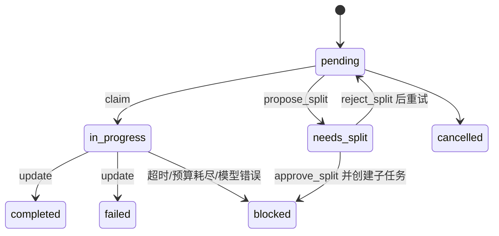

# 05 · 子 Agent 委派契约

> 本章解释父 Agent 如何拆任务、并行启动隔离子 Agent、共享 Todo 状态但不共享完整对话，
> 以及失败、超时和上下文回收如何处理。实现快照：2026-08-14。

## 1. 一句话理解

父 Agent 像项目经理，子 Agent 像外包工程师：

- 项目经理维护任务看板和依赖；
- 每位工程师只拿到自己的任务说明；
- 工程师有独立聊天历史和 `ThreadState`；
- 进度写回共享 Todo，而不是把全部聊天记录交给经理；
- 失败时完整上下文保存为 artifact，只有需要排障才读取；
- 全部任务成功后统一清理上下文 artifact。

核心代码：

- `tools/todo_tool.py:todo_manage`
- `tools/delegate_tool.py:delegate_task`
- `tools/delegate_tool.py:_run_subagent`
- `core/middleware/builtins.py:LoopDetectionMiddleware`
- `core/agent.py:_parse_delegation_entries`

## 2. Todo 是调度真值

委派前，父 Agent 应先用 `todo_manage` 建立任务图。任务不仅有描述，还可以包含：

```json
{
  "id": "docs.memory",
  "description": "核对并重写 Memory 章节",
  "parent_id": "docs",
  "dependencies": ["docs.context"],
  "acceptance_criteria": ["覆盖双 backend", "包含可运行测试"],
  "deliverable": "Improve_progress/04_Memory系统.md",
  "status": "pending"
}
```

### 状态机



### Ready 任务

`_ready_tasks()` 只返回：

- `status=pending`；
- 所有依赖都 completed；
- 自己没有子任务的叶子节点。

因此父任务一旦拆成子任务，就不会再和子任务同时被领取。

### Session 隔离

每个 session 使用独立 Todo 文件：

- 默认兼容路径：`sandbox/todo_lists/todo_list_<session>.json`；
- 开启 session sandbox：`<session-root>/todo_lists/todo_list.json`；
- 空 session 保留旧 `sandbox/todo_list.json` 行为。

`ContextVar`、显式 `session_id` 和 Agent 工具参数注入共同保证父子 Agent 操作同一块看板，
而不同终端不会互相覆盖。

## 3. 委派前的契约

`delegate_task(tasks=...)` 现在要求每个任务必须绑定 `task_id` 或 `id`。裸 goal 会被拒绝，
因为没有看板 id 就无法可靠领取、更新、阻塞和重试。

推荐调用：

```json
[
  {
    "task_id": "docs.memory",
    "goal": "阅读 memory provider、extractor、facts 和对应测试后重写章节",
    "max_iterations": 20,
    "wall_timeout_seconds": 300
  }
]
```

父 Agent 必须让 goal/context_summary 自包含。子 Agent 看不到父对话完整历史，不能依赖
“你知道我刚才说的那个文件”这类隐含上下文。

## 4. 子 Agent 如何被创建

每个任务创建一个新的：

```python
RAgent(
    max_iterations=max_iters,
    session_id=parent_session,
    middlewares=[LoopDetectionMiddleware(...)],
)
```

它获得：

- 新的 `ThreadState` 和 `messages`；
- 专用 system prompt；
- 任务 id、worker id、补充目标；
- 与父 Agent 相同的 session id；
- 父层允许工具的进一步收窄；
- 独立的取消事件和迭代预算。

它不会获得：

- 父 Agent 的完整聊天历史；
- 父 Agent 的 `ThreadState` 对象；
- 写长期 Memory、再次 delegate、语音播放、自演进复盘等副作用工具。

默认排除：

```text
delegate_task
memory
speak_text
text_to_speech
self_evolution_review
```

这既防递归委派爆炸，也防子 Agent 擅自修改跨会话状态。

## 5. 子 Agent 必须遵守的 Todo 协议

系统提示要求它：

1. `todo_manage get` 查看任务和子树；
2. `todo_manage claim` 领取任务并写 worker/lease；
3. 判断任务是否足够具体；
4. 太大时 `propose_split`，但不得自行 approve；
5. 可执行时完成任务并 `update completed`；
6. 失败时写明原因；
7. 达到预算时明确未完成事项。

拆分批准属于父 Agent，因为只有父 Agent 看得到完整依赖图和可用并发预算。

## 6. 并行和两种预算

`delegate_task` 使用 `ThreadPoolExecutor`：

- 默认并发数 `min(3, 任务数)`；
- 显式 `max_workers` 上限 10；
- 每个 Agent 有 `max_iterations` 思考轮数；
- 每个任务还有 `wall_timeout_seconds` 墙钟预算；
- 父线程每 0.2 秒检查完成和超时。

两种预算含义不同：

| 预算 | 防什么 | 停止原因 |
| --- | --- | --- |
| `max_iterations` | 工具调用轮数发散 | `turn_capped` |
| wall timeout | 模型/工具/网络长时间不返回 | `timeout` |
| loop threshold | 相同工具同参重复 | `loop_capped` |

## 7. 结果契约

默认 `return_mode=compact`，每个结果只保留调度所需字段：

```json
{
  "task_id": "docs.memory",
  "status": "success",
  "stop_reason": "completed",
  "truncated": false,
  "max_iterations": 20,
  "token_usage": {
    "prompt_tokens": 1200,
    "completion_tokens": 300,
    "total_tokens": 1500,
    "available": true
  },
  "step_events": [
    {"seq": 1, "event_type": "llm.step"},
    {"seq": 2, "event_type": "tool.start", "name": "read_file"},
    {"seq": 3, "event_type": "tool.end", "name": "read_file"}
  ]
}
```

### `status` 与 `stop_reason`

旧 `status` 保持兼容，新 `stop_reason` 补充统一语义：

| status/条件 | stop_reason |
| --- | --- |
| `success` | `completed` |
| `truncated` | `turn_capped` |
| wall timeout | `timeout` |
| 循环保护 | `loop_capped` |
| 其它异常 | `error` |

### 有界步骤事件

`step_events` 默认最多 32 条，只记录模型轮次、工具名和短预览。它提供足够的调度证据，
但不会把完整子 Agent transcript 塞回父上下文。

## 8. 上下文隔离与 Artifact 生命周期

当前实现采用比“成功就立即删除”更保守的策略：

1. 每个子 Agent 结束后，把完整 `messages` 保存到 context artifact；
2. 内存中的子 Agent messages 随后清空；
3. Todo metadata 只保存 `context_artifact_path`；
4. 父 Agent 默认只读 compact result 和 todo digest；
5. 只有排障时才显式读取 artifact；
6. 整棵 Todo 树全部 completed 后，统一删除所有 context artifacts。

为什么成功任务也暂时保留？因为兄弟任务或父任务尚未完成时，成功任务的上下文仍可能用于
定位集成问题。为什么不 inline 返回？因为那会立刻破坏父子上下文隔离。

删除有路径边界：只允许全局 `sandbox/delegate_contexts` 或当前 session 的迁移根，避免
把任意用户路径误当作上下文 artifact 删除。

## 9. 失败怎样回到父 Agent

| 场景 | Todo 处理 | 上下文处理 |
| --- | --- | --- |
| 正常完成且任务已 update | completed | 保留到整树成功后清理 |
| 达到迭代上限仍 in_progress | blocked | 保存 artifact |
| 模型请求失败 | blocked | 保存 artifact |
| 墙钟超时 | blocked | 发送 cancel，保存 artifact |
| Python 异常 | blocked | 保存 artifact |
| claim 过期 | `reap_stale_claims` 标 blocked 或重置 pending | 由父 Agent决定 |
| 子 Agent 提议拆分 | needs_split | 父 Agent approve/reject |

“blocked”表示需要重新调度，不等于任务永久失败。

## 10. 一个并行例子

任务图：

```text
docs
├── docs.context
├── docs.memory      depends_on docs.context
└── docs.tools
```

第一轮 ready 是 `docs.context` 和 `docs.tools`，可以并行。`docs.memory` 必须等待
`docs.context` completed。父 Agent 的正确做法是：

```text
todo_manage ready
→ delegate(context, tools)
→ todo_manage digest
→ ready 现在出现 memory
→ delegate(memory)
→ 所有叶子 completed
→ 更新父任务
→ 统一清理 context artifacts
```

这比一次性并发三个任务可靠，因为依赖由代码而不是 prompt 自觉保证。

## 11. 当前边界

- 子 Agent 是同一 Python 进程中的线程级并发，不是独立容器；
- 工具通常仍会各自进入隔离子进程；
- 子 Agent 共享仓库文件系统，写同一文件仍需父 Agent 划分不重叠任务；
- `cancel_event` 是协作式取消，无法保证第三方阻塞调用立即停止；
- `ThreadState` 不共享，但 Todo 文件和 session sandbox 是有意共享的协调层；
- `delegate.start/end` 会进入父 RunEventStore；详细 step events 当前主要在 delegate
  返回和 GUI event sink 中，不会逐条统一 emit 为 `delegate.step`；
- compact digest 是默认路径，完整 artifact 读取应是例外。

## 12. 如何验证

```bash
PYTHONPATH=. pytest -q \
  tests/test_delegate_contract.py \
  tests/test_delegate_progress.py \
  tests/test_todo_session_isolation.py

PYTHONPATH=. pytest -q tests/test_token_usage_display.py tests/test_run_event_stream.py
```

重点测试：

- `test_delegate_task_rejects_subtask_without_task_id`
- `test_delegate_task_excludes_child_side_effect_tools`
- `test_loop_detection_reports_loop_capped`
- `test_step_events_are_bounded_and_included`
- `test_delegate_saves_failed_context_by_artifact_only`
- `test_delegate_context_migrates_to_per_session_sandbox`
- `test_reap_stale_claims_blocks_expired_task`

---

<template data-legacy-upgrade-log>

**状态：✅ 已完成（2026-08-11）**
**对应 deer-flow 学习文档：** 第 8 章（Sub-agent 系统）+ 13.4（子 Agent 要有结构化 contract）
**建议顺序：** 第 6 步（R-Agent 这块已最成熟，属收尾增强）
**依赖：** `02_ThreadState结构化状态`（结果写入 `delegation_ledger`）、`08_运行事件流`（`delegate.start/step/end` 事件）。

---

## 1. 要解决什么问题（R-Agent 现状）

这是 R-Agent **最成熟**的子系统，核对过代码，已经相当完整：

已有（`tools/delegate_tool.py:delegate_task` L519）：
- 每个子任务结果带：`task_id`、`status`(completed/blocked/error/timeout)、`result`、`truncated`、`blocked_update`、
  `context_artifact_path`、`token_usage`、`task_index`。
- 预算：每任务 `max_iterations`（1–200 clamp）、`default_wall_timeout_seconds`（`config.get_delegate_task_wall_timeout()`）、`max_workers` 并行。
- 子 agent 是每任务全新 `RAgent`（`_run_subagent`）；截断自动标 `blocked`；超时标 `timeout`；有模型失败检测。
- 每个子任务必须绑定 todo-list `task_id`；in-process 执行（规避 macOS 嵌套 fork 崩溃，见 `core/agent.py:998`）。
- `return_mode` compact/full 控制 payload；step 事件通过 `event_sink`（`_emit_delegate_event`）单独走。

缺口（对照 deer-flow / 13.4）：
1. **`status` 与 `stop_reason` 混在一起**：现在 `blocked/timeout` 既是状态也是原因；deer-flow 建议单列 `stop_reason`（`token_capped/turn_capped/loop_capped`）。
2. **`step_events` 没内嵌进结果**：step 事件只在 `event_sink` 里飘，结果对象里没有可回放的 `step_events` 数组。
3. **无显式 loop detection**：目前靠 `max_iterations` + turn 预算兜底，没有"检测到重复动作就早停"的原语。
4. **结果未沉淀进 state channel**：子任务上下文落在 `sandbox/delegate_contexts/`，但没有统一的内存 `delegation_ledger`（依赖 `02`）。

---

## 2. deer-flow 是怎么做的

- 文件：`subagents/registry.py`（注册 built-in/custom）、`subagents/executor.py`（`SubagentExecutor` 状态机 + 后台执行）、`tools/builtins/task_tool.py`（父 → 子委派）、`agents/middlewares/subagent_limit_middleware.py`（运行时强制限流）。
- 结果是**结构化 contract**（13.4 原文）：
  ```text
  task_id / subagent_type / status(pending|running|completed|failed|cancelled|timed_out)
  result / error / stop_reason(token_capped|turn_capped|loop_capped)
  usage / started_at / completed_at / step_events
  ```
- 每次委派会产生：live custom events、run event store（`subagent.start/step/end`）、token usage 回写父 journal、`delegations` ledger（压缩后仍可通过 durable context 回忆）。
- 子 Agent 不允许递归调用 task（防无限套娃，见 15 章 checklist 第 6 条）。

---

## 3. R-Agent 打算怎么改（简略步骤）

R-Agent 已经 80% 到位，这里是"补齐契约 + 沉淀 ledger"，不重写。

1. **拆分 `stop_reason`**：在结果里新增 `stop_reason` 字段，从现有 `status`+截断/超时信息映射出 `turn_capped`（达 max_iterations）/`timeout`（wall clock）/`token_capped`（预算）/`loop_capped`（见第 3 步）。`status` 只表达最终态。
2. **内嵌 `step_events`**：把本来只走 `event_sink` 的 step 事件同时收集进结果对象的 `step_events`（可截断/采样），便于父 Agent 回放，无需依赖 GUI。
3. **加轻量 loop detection**：在子 agent 循环里检测"连续 N 次相同 tool_call（同名+同参）"→ 早停并置 `stop_reason=loop_capped`。可复用主循环，未来与 `01` 的 middleware 共享。
4. **沉淀 `delegation_ledger`**（依赖 `02`）：把每次委派的结构化结果写进 `ThreadState.delegation_ledger`，压缩后通过 durable context（`03`）回注。
5. **补时间戳**：`started_at`/`completed_at`，对齐 deer-flow contract，也方便 `08` 事件流关联。
6. **确认防递归**：核对子 agent 的工具集是否已排除 `delegate`（不允许子 Agent 再委派）；若没有，补上。

> 关键约束：`delegate_task` 现有对外返回结构要**向后兼容**——新字段是增量添加，老字段语义不变，避免打断现有调用方（如 AutoResearch）。

### 本轮已落地（✅） / 待做（⬜）

> 实测发现 R-Agent 真实 `status` 取值为 `success` / `truncated` / `error` / `timeout`（计划里的 `blocked` 猜测不准，已按真实值实现）。

- ✅ **步骤 1 · stop_reason（附加字段，不改 status）**：`tools/delegate_tool.py` 新增 `_derive_stop_reason()` + `_normalize_result_contract()`，在 `delegate_task` 结果排序后统一补齐 `stop_reason`：`success→completed` / `truncated→turn_capped` / `timeout→timeout` / `error→error` / 循环命中→`loop_capped`（显式优先）。`status`/`truncated` 等既有字段一律不动。`_compact_delegate_item` 也带出 `stop_reason`（compact/full 两种 return_mode 都有）。
- ✅ **步骤 3 · loop detection（loop_capped）**：`core/middleware/builtins.py:LoopDetectionMiddleware`（复用 `01` 框架）在 `before_tool` 检测"连续 N 次相同工具调用（同名+同参）"，达阈值即否决该次调用并在子 agent 上打 `_loop_capped` 标记；`_run_subagent` 据此把 `stop_reason` 记为 `loop_capped`。委派子 Agent **默认启用**循环保护（`LOOP_DETECTION_ENABLED` 默认开，阈值 `LOOP_DETECTION_THRESHOLD` 默认 3）。
- ✅ **步骤 5 · 时间戳**：`_run_subagent` 在子任务开始/结束记录 `started_at`/`completed_at`，加入结果 item（对齐 deer-flow contract，也方便与 `08` 事件流关联）。
- ✅ **步骤 6 · 防递归**：核对确认 `DELEGATE_CHILD_EXCLUDED_TOOLS` 已含 `delegate_task`——子 Agent 无法再委派，本轮无需改动。
- 🔨 **步骤 4 · delegation_ledger 沉淀**：父 Agent 侧已在 `02` 章落地——`core/agent.py` 主循环把 `delegate_task` 返回结果写入 `ThreadState.delegation_ledger`，`03` 章的 durable context 会回注。本章的 `stop_reason` 会随结果一并进入 ledger。
- ✅ **步骤 2 · step_events 有界内嵌**：`_run_subagent` 现在采样 `llm.step / tool.start / tool.end`，记录轮次、工具名、参数/结果短预览和时间戳；默认每个子任务最多 32 条（`DELEGATE_STEP_EVENTS_LIMIT`，0 可关闭，最大 200）。compact/full 返回与 `delegation_ledger` 都保留这些事件，但不返回完整子 Agent transcript。

---

## 4. 为什么这样改

- **为什么 `stop_reason` 与 `status` 分家、且只增不改**：`status` 是既有对外契约（AutoResearch、todo 流转、GUI 都读它），语义必须冻结。`stop_reason` 是 deer-flow 风格的**附加**诊断维度——同一个 `truncated` 状态，用 `stop_reason=turn_capped` 说清"为什么停"。用集中式 `_normalize_result_contract` 在返回前统一补齐（而不是改 5 个 item 构建点），既减少改动面又保证每条结果都有。
- **为什么按真实 status 实现而非计划猜测**：精读代码发现真实取值是 `success/truncated/error/timeout`，计划文档里的 `blocked` 是对 todo 状态的误记。以真实代码为准，避免映射错位——这也是"每次动手前先读真实代码"的价值。
- **为什么 loop detection 用中间件实现、且子 Agent 默认开**：它天然是 `before_tool` 的横切逻辑，正好落在 `01` 的框架上，父/子循环可共享同一实现。子任务是**自动执行、无人盯着**的，最容易陷入"同一工具反复调用"的死循环，所以对子 Agent 默认开启（阈值 3：偶发两次重试是正常的，连续第 3 次同名同参才判定循环）；父 Agent（交互式、有人看着）默认不装，避免误伤正常的重复操作。
- **为什么否决而非直接杀进程**：命中循环时返回一段说明作为工具结果，让模型"看到"自己在打转并有机会改变策略；同时打 `_loop_capped` 标记供上层如实报告。这比硬中断更温和，也保留了子 agent 自我纠偏的可能。
- **为什么先不做 step_events**：它需要在子 agent 内收集事件流并采样回传，改动面和数据量都比其余步骤大，收益偏"锦上添花"。当前 `08` 的事件流已能落盘子 agent 的 `delegate.start/end`，回放需求已基本覆盖，所以把 step_events 内嵌排到最后。

---

## 5. 测试示例

新增 `tests/test_delegate_contract.py`，5 个用例全部通过：

1. `test_derive_stop_reason_mapping` —— 五种映射 + 显式 stop_reason 优先。
2. `test_normalize_only_adds_fields` —— 补 `stop_reason` 但 `status/truncated/task_id` 不变。
3. `test_truncated_task_reports_turn_capped` —— **端到端**：截断任务 compact 返回里 `status=truncated` 且 `stop_reason=turn_capped`。
4. `test_loop_detection_reports_loop_capped` —— **端到端**：陷入循环的子任务返回 `stop_reason=loop_capped`。
5. `test_timestamps_present_full_mode` —— full 模式含 `started_at`/`completed_at` 且 `completed_at >= started_at`。

另有 `LoopDetectionMiddleware` 的单元覆盖（连续 3 次同签名被否决、不同签名重置计数）。

**你可以亲手验证：**

```bash
cd /Users/bytedance/myenv/hermes/R-Agent

# 1) 本章测试
python3 -m pytest tests/test_delegate_contract.py -q          # 5 passed

# 2) 既有委派行为不变
python3 -m pytest tests/test_delegate_progress.py -q          # 8 passed

# 3) 零回归子集
python3 -m pytest tests/ -q -k "delegate or middleware or agent or todo or memory or context or event"
# -> 230 passed（另 3 个 autoresearch 用例失败，git stash 已证与本次改动无关）
```

**契约字段示例**（一条截断子任务的 compact 结果）：

```json
{
  "task_index": 0,
  "task_id": "t1",
  "status": "truncated",
  "truncated": true,
  "stop_reason": "turn_capped",
  "max_iterations": 1,
  "token_usage": { "...": "..." }
}
```

---

## 6. 进度记录
- 2026-08-11 · 建立简略计划。
- 2026-08-11 · **落地步骤 1/3/5/6**：`tools/delegate_tool.py` 加 `stop_reason`（`_derive_stop_reason`+`_normalize_result_contract`，集中补齐、只增不改）、`started_at`/`completed_at`；`core/middleware/builtins.py` 加 `LoopDetectionMiddleware`（子 Agent 默认开，命中记 `loop_capped`）；`core/config.py` 加 2 个 loop 开关；确认防递归已在 `DELEGATE_CHILD_EXCLUDED_TOOLS`。新增 `tests/test_delegate_contract.py`（5 passed），既有 `test_delegate_progress.py`（8 passed）零回归，整体 230 passed。step_events 内嵌（步骤 2）待后续；delegation_ledger 沉淀（步骤 4）已由 `02` 承担。
- 2026-08-11 · **步骤 2 落地，本章完成**：delegate 结果新增有界 `step_events`（默认最多 32 条），采样模型轮次、工具开始/结束短预览；异常与 timeout 路径也尽力保留已采样事件。父 Agent 的 delegation ledger 同步保留 stop_reason、时间戳和 step_events。委派定向 + 基础设施回归 35 passed。

</template>
