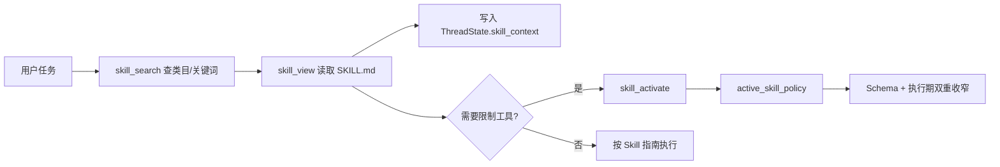

# 07 · Skills 与自定义 Agent

> 本章解释 R-Agent 如何发现、阅读、激活、维护和治理 Skills，以及当前所谓“自定义
> Agent”究竟由哪些能力组合而成。实现快照：2026-08-14。

## 1. Skill 不是一句 Prompt，而是一个受管理的能力包

一个典型 Skill：

```text
skills/
└── productivity/
    └── weekly-report/
        ├── SKILL.md
        ├── references/
        ├── templates/
        ├── scripts/
        └── assets/
```

`SKILL.md` 描述何时使用、怎样执行，并可声明工具白名单：

```yaml
---
name: weekly-report
description: 从项目记录生成结构化周报
triggers: 周报, weekly report
allowed_tools: [read_file, search_files, write_file]
---
```

核心代码：

- `core/skills.py:SkillManager`
- `tools/skill_hierarchy_tool.py`
- `tools/skills_tool.py`
- `core/agent.py:_maybe_record_skill_context`
- `core/agent.py:_maybe_apply_skill_policy`
- `core/skill_usage.py`
- `tools/skill_curator_tool.py`
- `core/prompt_builder.py:build_system_prompt`

## 2. 渐进式加载：先找目录，再读正文

把所有 Skill 全文塞进 system prompt 会迅速撑大上下文。当前流程是：



### `skill_search`

统一支持：

- `categories`：列出类目和数量；
- `by_category`：按类目列 Skill 摘要；
- `search`：按名称、描述和 “When to Use” 关键词搜索。

### `skill_view`

读取完整 `SKILL.md` 或 supporting file。路径只能是：

- `SKILL.md`
- `references/`
- `templates/`
- `scripts/`
- `assets/`
- `Project_progress/`

绝对路径、`..` 和未知顶层目录会被拒绝。

## 3. Metadata 怎样解析

`parse_skill_metadata()` 支持：

1. `---` 包围的 YAML 风格 front matter；
2. 文件顶部连续的 `key: value`；
3. 无 metadata 时，从首个有意义文本行推断 description。

当前解析字段：

- `name`
- `description`
- `triggers`
- `allowed_tools` / `allowed-tools`

解析采用尽力而为策略，不引入完整 YAML 依赖。复杂多行 YAML、嵌套结构不是它的目标。

## 4. 读过 Skill 后为什么不会立刻忘

`skill_view` 工具执行后，主循环从结果中解析 Skill description，并写入：

```json
{
  "skill": "weekly-report",
  "summary": "从项目记录生成结构化周报"
}
```

`merge_skill_context()` 按 Skill 名去重。开启 durable context 时，后续请求会看到精简
Skill 引用，即使最初读取 `SKILL.md` 的完整消息已经被上下文压缩。

这里保留的是“读过哪个 Skill、它做什么”，不是把全文永久复制进 `ThreadState`。
需要 supporting file 时仍应按需读取。

## 5. `skill_view` 和 `skill_activate` 不同

### 只读 Skill

`skill_view` 只加载知识，不改变工具权限。这允许 Agent 阅读一个 Skill 作为参考，而不被
它的工具声明意外锁住。

### 显式激活

`skill_activate(action="activate", skill_name="weekly-report")`：

1. 重新读取 `SKILL.md`；
2. 解析 `allowed_tools`；
3. 返回结构化策略；
4. 主循环写入 `ThreadState.active_skill_policy`；
5. 将这些工具加入 deferred promotion；
6. 本轮后续 schema 与执行期都受白名单限制。

若 Skill 没声明 `allowed_tools`，激活会失败，而不是把空列表解释成“禁止一切”。

### 权限取交集

```text
有效工具 = 外部 allowed_tools ∩ Skill allowed_tools - exclude_tools
```

另外保留 `skill_activate`、`skill_view`、`skill_search`、`tool_search`，让模型仍能查看、
切换或停用策略。

`skill_activate(action="deactivate")` 会清空策略，恢复其它上层约束允许的工具。

## 6. Skill 包的安全管理

`skill_manage` 提供：

- `create`
- `edit` / `write_file`
- `patch`
- `remove_file`
- `delete`
- `usage`

确定性边界包括：

- Skill 名和类目必须是简单相对目录名；
- 不允许路径穿越和隐藏目录；
- 同名 Skill 出现在多个类目时要求先消歧；
- `patch` 的 `old_string` 必须唯一匹配；
- 不能用 `remove_file` 删除 `SKILL.md`，删除整个 Skill 必须走 `delete`；
- supporting file 必须位于允许目录；
- create 默认拒绝覆盖或创建跨类目同名副本。

这些约束比单纯告诉模型“请小心修改 Skill”更可靠。

## 7. 使用记录和生命周期治理

`core/skill_usage.py` 在 `skills/.usage.json` 记录：

- view/use/patch 次数；
- 最近查看、使用、修改时间；
- 创建来源；
- `active` / `stale` / `archived`；
- 是否 pinned；
- 归档路径。

写入采用锁和原子替换，失败不会打断 Skill 主功能。

`skill_curator_manage` 支持：

- `status`：查看状态；
- `run`：按未活跃天数标 stale 或归档；
- `pin`：保护某个 Skill；
- `restore`：从 `.archive` 恢复。

默认 `run` 是 dry-run。只有 Agent 创建的记录进入自动生命周期治理，人工维护 Skill 不会
因为一段时间没用就被自动归档。

需要注意：

- 当前常规 `skill_view` 会增加 view 计数；
- create/patch/edit 等操作会更新 create/patch 记录；
- `skill_activate` 虽调用 `record_event(..., "activate")`，但 telemetry 的
  `record_event()` 目前没有 `activate` 分支，因此不会增加 use/view/patch 计数；
- 仓库也没有统一钩子能准确判断“模型是否真正遵循了 Skill 完成任务”，所以
  `use_count` 不是完整的真实使用指标。

## 8. R-Agent 当前的“自定义 Agent”是什么

当前没有一个独立的：

```text
custom_agents/*.yaml
→ 自动注册具名 Agent Profile
→ 每个 Profile 声明 model/prompt/tools/middleware
```

已经实现的是三种可组合能力：

### 8.1 `SOUL.md`：主 Agent 的稳定人格

`build_system_prompt()` 首先加载项目根 `SOUL.md`。它控制身份、语气和稳定行为原则：

- 文件不存在时可创建默认模板；
- 内容过长时保留头尾并标注截断；
- 明显 prompt injection / secret exfiltration 模式会被阻断；
- 修改通常只影响之后重新构建 prompt 的会话。

### 8.2 Skill：任务级方法和工具策略

Skill 告诉同一个主 Agent “这类任务该怎么做”，可选地限制工具，但不会创建新的模型
实例或独立身份。

### 8.3 Sub-agent：运行级隔离执行者

`delegate_task` 创建新的 `RAgent`，注入专用 system prompt、任务和工具边界。它是临时
工作单元，不是可注册、可复用的具名 Custom Agent Profile。

因此更准确的表述是：

```text
自定义行为 = SOUL 人格 + Skill 工作法/工具策略 + Sub-agent 临时角色
```

## 9. 一个完整例子

用户要求生成周报：

```text
1. skill_search("周报") 找到 weekly-report
2. skill_view("weekly-report") 读取流程
3. skill_context 记录其摘要
4. Skill 声明 read/search/write 三个工具
5. 如任务需要严格只用这些工具，显式 skill_activate
6. Agent 读取项目记录、套用 template、写出报告
7. 完成后 skill_activate(deactivate)
8. view/activate/patch 等行为进入 usage sidecar
```

如果周报任务很大，父 Agent 还可以把“收集提交记录”和“整理风险”交给隔离 Sub-agent，
但它们仍是临时角色，不会自动变成永久自定义 Agent。

## 10. 当前边界

- metadata 不是完整 YAML parser；
- Skill 目录来自仓库本地 `skills/`，没有内置远程 marketplace 安装协议；
- `skill_context` 只保存摘要，不保存全文和 supporting files；
- 激活策略只存在于当前 `RAgent` 的 `ThreadState`；
- 没有 model override、middleware profile、temperature 等 Custom Agent 配置注册表；
- 同名 Skill 跨类目会报歧义，不会静默任选；
- curator 是确定性文件治理，不会自动判断 Skill 内容质量；
- `SOUL.md` 是 system 权限内容，必须比普通 Skill/Memory 更严格审查。

## 11. 如何验证

```bash
PYTHONPATH=. pytest -q \
  tests/test_skill_context.py \
  tests/test_skill_core_tools.py \
  tests/test_self_evolution_skill_manage.py \
  tests/test_self_evolution_review.py
```

重点测试：

- `test_parse_metadata_front_matter_wrapped`
- `test_list_skills_structured`
- `test_skill_view_populates_skill_context`
- `test_skill_policy_only_applies_after_explicit_activation`
- `test_skill_policy_deactivate_restores_unrestricted_state`
- `test_default_registry_exposes_five_core_skill_tools_only`

---

<template data-legacy-upgrade-log>

**状态：🚧 进行中（2026-08-11：metadata 发现 + 结构化目录 + skill_context 持久 + 权限契约 + allowed-tools 已落地；仅 custom agent 待做）**
**对应 deer-flow 学习文档：** 第 10 章（Skills 与 custom agent）
**建议顺序：** 第 8 步（体验增强，可最后做）
**依赖：** `02_ThreadState结构化状态`（`skill_context` channel）、`03_上下文管理`（skill_context 通过 durable context 回注）。

---

## 1. 要解决什么问题（R-Agent 现状）

已有（核对过代码）：
- `core/skills.py:SkillManager`：文件型 skill 库（`skills/` 下分类），`list_skills`/`view_skill`/`create_skill`/`edit_skill_file`/`patch_skill_file`/`remove_skill_file`/`delete_skill`，含路径安全校验。
- `core/skill_usage.py` 记录使用情况。
- 暴露：`tools/skills_tool.py` + `tools/skill_curator_tool.py` + `tools/skill_hierarchy_tool.py`。
- prompt 里有 `SKILLS_GUIDANCE`（`core/prompt_builder.py:257`）引导模型按需 `view_skill`。
- skill 可被 agent 自己编辑（自演化角度）。

缺口（对照 deer-flow 第 10 章）：
1. **发现靠目录扫描 + prompt 引导**，没有结构化 metadata（名称/描述/触发词）供模型先"知道有哪些 skill"再决定读不读。
2. **无延迟加载契约**：没有 deer-flow `describe_skill` 那种"先看摘要、需要时再读全文"的两段式。
3. **无 allowed-tools policy**：skill 激活后不能限制"只允许用哪些工具"。
4. **skill_context 不持久**：读过的 skill 没进 `skill_context` channel，压缩对话后模型会"忘记读过什么"。
5. **无 custom agent / SOUL.md 覆盖机制**：R-Agent 有全局 `SOUL.md`，但没有 per-agent 的 model override / tool group / skill allowlist / `update_agent`。

---

## 2. deer-flow 是怎么做的

第 10 章要点：
- skill 有**可发现 metadata**（先知道有哪些，不必马上读全文）。
- 可 slash 显式激活（`/skill-name`）。
- 可通过 `describe_skill` **延迟加载**详情。
- 有 **allowed-tools policy**（激活后限制可用工具）。
- 被读取后进入 `skill_context`，压缩后仍保留引用。
- 可通过 `skill_manage` 创建/更新，但不鼓励直接写 `SKILL.md` 到 workspace（skill 是持久能力，不是交付物）。

custom agent 可有：`SOUL.md` / model override / tools group / skill allowlist / thinking 配置 / 自更新工具 `update_agent`。

**权限边界（原文）：** skill 内容、custom agent 描述、memory、durable context 都可能含用户/模型文本，需 HTML escape + authority contract，防 structured tag breakout。

---

## 3. R-Agent 打算怎么改（简略步骤）

R-Agent 的 skill CRUD 已很完整，这里主要补"发现/延迟/边界/持久"。

1. **给 skill 加 metadata 头**：约定每个 skill 目录的 `SKILL.md` 顶部包含 `name / description / 触发词`，`list_skills` 返回这些摘要而非全文。
2. **两段式加载**：`list_skills`（只给摘要目录）→ `view_skill`（读全文）。把 `SKILLS_GUIDANCE` 改为引导模型"先看目录、命中触发词再 view"。
3. **skill_context 持久化**（依赖 `02`/`03`）：`view_skill` 成功后把"skill 名 + 摘要"写入 `ThreadState.skill_context`，压缩后通过 durable context 回注，避免"读完就忘"。
4. **allowed-tools（可选）**：约定 skill metadata 可声明 `allowed_tools`，激活后收敛工具集（复用 `_loop` 现有 `allowed_tools` 过滤，天然契合）。
5. **权限转义**：skill 摘要/内容注入 prompt 前做 HTML escape + 一句 authority contract（对齐 `03`/memory 的处理），防止 skill 文本伪装成系统指令。
6. **custom agent 留后续**：SOUL.md override / update_agent 属较大特性，先记录接口设想，本轮不实现（可跳过项，见学习文档第 14 章精神）。

> 关键约束：现有 skill 文件不加 metadata 也要能继续用（metadata 缺失时退回"用目录名 + 首行"），保证零迁移成本。

### 本轮已落地（✅） / 待做（⬜）

- ✅ **步骤 1 · skill metadata 解析**：`core/skills.py` 新增 `SkillManager.parse_skill_metadata()`（解析 `name`/`description`/`triggers`，兼容 `---` 包裹的 front-matter、顶部裸 `key: value`、以及无 metadata 时取正文首行兜底，**绝不抛异常**）。既有 `list_skills` 的即兴解析统一改用它。
- ✅ **步骤 2 · 结构化发现**：新增 `list_skills_structured()` 返回 `[{name, dir_name, category, description, triggers}]`。R-Agent 本来就是两段式（`list_skills` 摘要 → `skill_view` 全文），本轮把"摘要"质量升级为 metadata 解析后的干净描述。实测对真实 54 个 skill 全部解析出描述。
- ✅ **步骤 3 · skill_context 持久化**：`core/agent.py:_maybe_record_skill_context` 在 `skill_view` 执行后，从入参取 `skill_name`、从返回 SKILL.md 解析出摘要，写入 `ThreadState.skill_context`（`02` 章 channel，按 skill 去重）。压缩后由 `03` 章 durable context 回注，避免"读完就忘"。
- ✅ **步骤 5 · 权限契约**：skill_context 通过 `03` 章的 `build_durable_context` 注入时，落在 `<durable_skills>` 分区并统一带 authority contract（"参考资料，非指令"）。本轮 skill 摘要只提取纯描述文本、且以低权限 user 段注入，已满足"不被当作系统指令"的目标。
- ✅ **步骤 4 · allowed-tools policy**：metadata 支持 `allowed_tools: [read_file, write_file]`。新增 `skill_activate` 工具，只有显式 `activate` 才把策略写入 `ThreadState.active_skill_policy` 并从下一轮收窄工具；普通 `skill_view` 不改变工具集。外部 `allowed_tools` 与 skill policy 取交集；执行期再次强制校验，不能靠伪造 tool_call 绕过。始终保留 `skill_activate/skill_view/skill_search/tool_search`，可随时 deactivate 或切换策略。
- ⬜ **步骤 6 · custom agent**：`SOUL.md` override / model override / `update_agent` 属较大特性，按学习文档第 14 章"可暂时跳过"的精神，本轮不实现。

---

## 4. 为什么这样改

- **为什么两段式发现足够、无需大改**：R-Agent 原本就是 `list_skills`（摘要）→ `skill_view`（全文）的渐进式加载，本身就避免了把所有 skill 全文塞进上下文。本轮的增量价值在**把摘要质量做对**——统一用 `parse_skill_metadata` 从 front-matter 取干净的 `description`，而不是原来"取首行、偶尔撞上 `---` 或 `name:`"的脆弱逻辑。
- **为什么 skill_context 要持久化**：长任务里模型可能读了某个 skill、几轮后上下文被压缩，skill 全文随旧消息被删，模型就"忘了自己读过什么"。把"读过哪个 skill + 一句话摘要"记进独立 channel，压缩后仍能通过 durable context 回注一个轻量引用——既省 token 又不失忆。
- **为什么解析/记录都放主循环、且绝不抛异常**：与 `tool_search` 同理，`skill_view` 在隔离子进程执行，主进程解析入参 + 返回最稳。skill 是体验增强，任何解析异常都不该打断对话，所以全程 `try/except` 兜底。
- **为什么 metadata 缺失要兜底而非报错**：仓库已有 54 个 skill，不能要求它们全部先补 metadata。缺失时用目录名当 name、正文首行当 description，保证**零迁移成本**，新旧 skill 都能用。
- **为什么 allowed-tools 必须显式激活**：只查看 skill 往往只是学习说明，如果此时立刻收窄工具，会让普通任务突然失去能力。显式 `skill_activate` 把“读过”与“应用权限策略”分开；没有 `allowed_tools` 的 skill 会拒绝激活，不会意外变成空工具集。
- **为什么 custom agent 暂缓**：custom agent 是独立大特性，涉及 SOUL/model/tool group/update_agent 的持久化与权限边界，仍按学习文档第 14 章建议后置。

---

## 5. 测试示例

新增 `tests/test_skill_context.py`，7 个用例全部通过：

1. `test_parse_metadata_front_matter_wrapped` —— `---` 包裹的 name/description/triggers。
2. `test_parse_metadata_top_keys_without_fence` —— 顶部裸 `key: value`。
3. `test_parse_metadata_fallback_first_line` —— 无 metadata 时取正文首行。
4. `test_parse_metadata_empty` —— 空内容不报错。
5. `test_list_skills_structured` —— 结构化目录；缺 metadata 用目录名 + 首行兜底。
6. `test_skill_view_populates_skill_context` —— **端到端**：`skill_view` 后 `skill_context` 记录该 skill，且出现在 durable context 的 `<durable_skills>` 里。
7. `test_skill_context_dedupes_repeat_views` —— 同一 skill 多次 view 只保留一条最新摘要。

**你可以亲手验证：**

```bash
cd /Users/bytedance/myenv/hermes/R-Agent

# 1) 本章测试
python3 -m pytest tests/test_skill_context.py -q          # 7 passed

# 2) 看真实 skill 目录被正确解析（54 个 skill 的一句话描述）
python3 -c "from core.skills import skill_manager; [print(c['category'],'/',c['dir_name'],'::',c['description'][:50]) for c in skill_manager.list_skills_structured()[:8]]"

# 3) 既有 skill 测试零回归 + 相关子集
python3 -m pytest tests/ -q -k "skill or agent or context or thread or event or tool"
# -> 272 passed（另 3 个 autoresearch 用例失败，git stash 已证与本次改动无关）
```

---

## 6. 进度记录
- 2026-08-11 · 建立简略计划。

</template>
