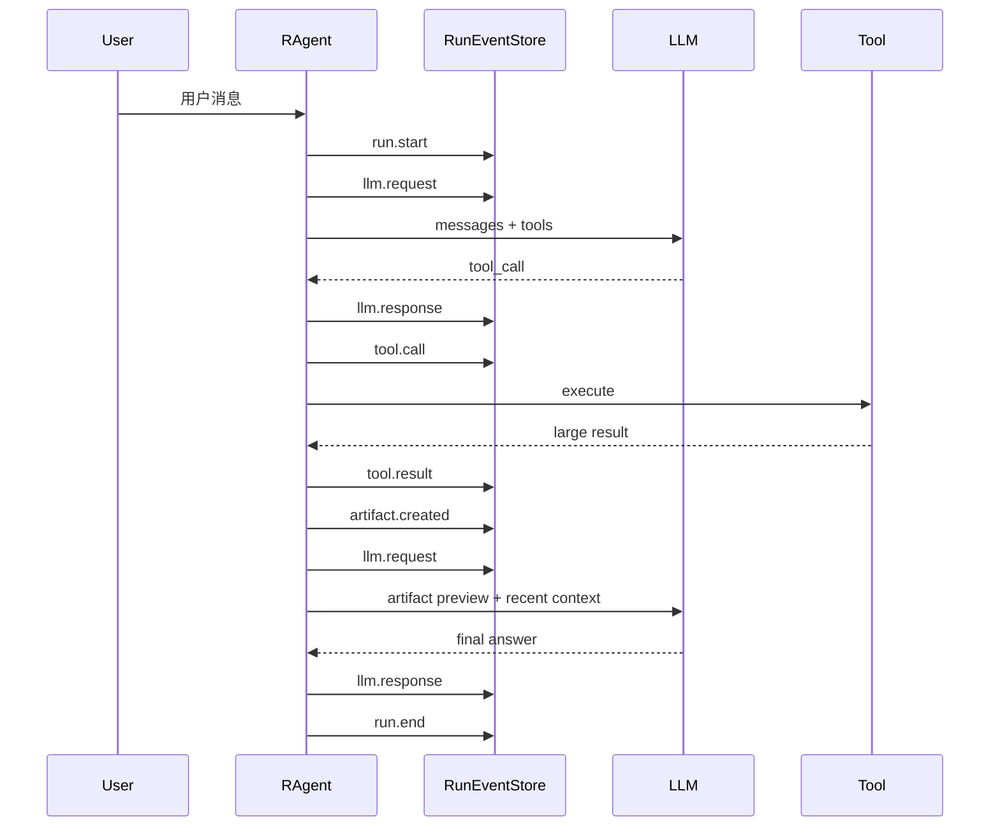

# 08 · 运行事件流（可观测性）

> 本章解释 R-Agent 如何把一次运行写成可排序、可回放的 JSONL 证据流，以及它与 GUI
> 实时事件、结构化状态和普通日志有什么区别。实现快照：2026-08-14。

## 1. 一句话理解

`ThreadState` 像白板，告诉你“现在是什么状态”；`RunEventStore` 像监控录像，告诉你
“事情按什么顺序发生”。

例如当前状态只说子任务已完成，但事件流可以回答：

```text
什么时候开始请求模型？
模型先调用了哪个工具？
哪个工具结果被落成 artifact？
上下文是否在第二轮前压缩？
这次 run 最后是正常结束还是被中断？
```

核心代码：

- `core/events.py:RunEvent`
- `core/events.py:RunEventStore`
- `core/events.py:read_events`
- `core/agent.py:_emit_run_event`
- `scripts/replay_events.py`
- `app_gui/event_bus.py`

## 2. 一条事件长什么样

```json
{
  "thread_id": "session-42",
  "run_id": "session-42-1786634690-1",
  "seq": 4,
  "event_type": "tool.result",
  "category": "trace",
  "content": {
    "name": "web_extract",
    "result_chars": 120000,
    "persisted": true
  },
  "metadata": {
    "iteration": 1,
    "result_preview": "..."
  },
  "created_at": 1786634690.25
}
```

字段含义：

| 字段 | 作用 |
| --- | --- |
| `thread_id` | 属于哪个会话 |
| `run_id` | 属于哪一次用户请求 |
| `seq` | 单个 run 内严格递增的顺序号 |
| `event_type` | 发生了什么 |
| `category` | trace/context/subagent/workspace/outputs/error |
| `content` | 主要结构化负载 |
| `metadata` | 迭代号、短预览等附加信息 |
| `created_at` | Unix 时间戳 |

`content` 非 dict 时会被包成 `{"value": ...}`，保证 JSONL 每行的顶层形状稳定。

## 3. 当前真正发出的事件

常量集合比真实 emit 路径更宽。按当前主循环，已经实际发出的主要事件是：

| 事件 | 触发时机 |
| --- | --- |
| `run.start` | `run_conversation` 建立 event store 后 |
| `run.end` | 主循环正常返回 |
| `run.error` | 当前显式覆盖用户中断 |
| `llm.request` | 每次主模型请求前 |
| `llm.response` | 收到模型回复后 |
| `tool.call` | 执行每个工具前；循环保护也可写该类型 |
| `tool.result` | 工具结果完成；清洗 audit/enforce 也会补写 |
| `context.compact` | 压缩成功，或摘要失败而跳过 |
| `memory.inject` | 请求视图中存在 durable context |
| `delegate.start` | `delegate_task` 开始 |
| `delegate.end` | `delegate_task` 工具结果返回 |
| `artifact.created` | 工具结果被持久化 |

当前虽然定义了 `memory.update` 和 `delegate.step`，但事实库每次更新、每个子 Agent 步骤
尚未统一写入父 RunEventStore。`step_events` 主要存在于 delegate 返回契约和 GUI 事件中。
文档不能因为常量存在就说它们已完整接线。

## 4. 一次 Run 的生命周期



如果第二轮前上下文过长，中间还会出现 `context.compact`；如果 durable context 存在，
每个请求前可出现 `memory.inject`。

## 5. 存储和顺序保证

每次 `run_conversation` 创建新的 `RunEventStore`：

```text
run_id = <safe-session>-<unix-seconds>-<run-counter>
```

默认目录是 `sandbox/run_events/`。开启 session sandbox 后改为：

```text
sandbox/sessions/<session>/run_events/
```

`emit()` 在一把线程锁内：

1. `seq += 1`；
2. 构造 `RunEvent`；
3. 追加一行 UTF-8 JSON；
4. 返回事件对象。

因此单个 store 内，来自同一进程多个线程的事件不会争抢同一个 seq。`read_events()` 还会
按 seq 排序，并跳过坏行。

## 6. 为什么采用 Append-only JSONL

### 优点

- 每次只追加一行，写入路径简单；
- 文件损坏通常只影响个别行；
- 适合 tail、grep、离线分析和回放；
- 事件 envelope 结构稳定；
- 不需要先部署数据库；
- 可与 session sandbox 自然隔离。

### 代价

- 没有跨文件查询索引；
- 不是事务数据库；
- 当前不做日志轮转和自动清理；
- 单个 run 的 seq 只在本进程 store 内有序；
- 不能仅靠事件自动恢复完整 Agent 状态。

## 7. Fail-open：观测不能拖垮任务

`RunEventStore.emit()` 捕获目录创建、序列化和文件追加异常：

- 保存 `last_error`；
- 首次失败尽力发 warning；
- 返回 `None`；
- 不向主循环抛异常。

`RAgent._emit_run_event()` 外层还会再吞一次异常。

这是合理的可用性取舍：磁盘只读不应阻止用户得到回答。但安全审计场景若要求“事件写入失败
就必须停止执行”，需要另加 fail-closed 模式，当前实现没有提供。

## 8. Run Events 与 GUI Events 的区别

R-Agent 同时存在两条事件通道：

| 通道 | 目标 | 生命周期 | 内容倾向 |
| --- | --- | --- | --- |
| `event_sink` / GUI event bus | 让界面实时更新 | 会话快照/前端消费 | message appended、请求快照、子 Agent 开始结束等 UI 细节 |
| `RunEventStore` | 事后回放和审计 | 每个 run 一个 JSONL | 稳定、紧凑的 runtime 事件 |

它们会在主循环中双写，但不是一一对应：

- GUI 需要完整 request snapshot 或 message index；
- Run event 更关注类型、数量、短预览和是否落盘；
- GUI 子 Agent 步骤比父 RunEventStore 更细；
- RunEventStore 即使没有 GUI 也能工作。

## 9. 如何回放

列出全部全局和 session run：

```bash
python scripts/replay_events.py --list
```

按 run id 回放：

```bash
python scripts/replay_events.py <run-id>
```

输出原始 JSON：

```bash
python scripts/replay_events.py <run-id> --json
```

也可以传绝对路径。脚本会同时扫描旧全局目录和 `SESSION_SANDBOX_ROOT/*/run_events`。

示例输出：

```text
#1 [trace    ] run.start
#2 [trace    ] llm.request
#3 [trace    ] llm.response
#4 [trace    ] tool.call
#5 [trace    ] tool.result
#6 [workspace] artifact.created
#7 [trace    ] llm.request
#8 [trace    ] llm.response
#9 [outputs  ] run.end
```

## 10. 用事件流排查三个典型问题

### 10.1 模型是不是重复调用同一个工具

查看连续 `tool.call` 的 `name` 和 `arguments_preview`。如果相同签名重复，进一步确认是否
出现 loop-capped 的工具事件。

### 10.2 为什么模型突然忘了早期内容

查找 `context.compact`：

- `before_tokens`
- `after_tokens`
- `skipped`
- `reason=summary_failed`

再结合 `memory.inject` 判断摘要和 durable context 是否在后续请求中出现。

### 10.3 大结果到底有没有落盘

先看 `tool.result.persisted=true`，再找紧邻的 `artifact.created.path`。如果 tool result 很大
却没有 artifact，检查工具阈值、固定无限阈值和磁盘写入错误。

## 11. 隐私和数据最小化

事件流不会默认保存完整 prompt、完整工具结果或完整子 Agent transcript，而是保存：

- message/tool 数量；
- 工具名和短参数预览；
- 结果字符数和短预览；
- artifact 路径；
- 压缩统计。

这降低泄漏与文件膨胀风险，但不是绝对脱敏：短预览仍可能包含用户数据，artifact 路径也
可能透露目录结构。用于生产环境前应增加字段级 redact、保留期和目录权限策略。

## 12. 当前边界

- `run.error` 当前主要覆盖显式中断，不是所有提前返回的模型错误；
- `memory.update`、`delegate.step` 尚未完整接线；
- 没有 event schema version；
- 没有跨 run correlation、索引、轮转和保留期；
- 没有从事件自动重建 `ThreadState`；
- `created_at` 是 float 秒，排序的强保证仍来自 `seq`；
- fail-open 意味着“没有事件”不能证明“事情没发生”；
- Run events 与 GUI events 不能混用为同一个稳定 API。

## 13. 如何验证

```bash
PYTHONPATH=. pytest -q tests/test_run_event_stream.py
PYTHONPATH=. pytest -q tests/test_gui_context_events.py tests/test_gui_runtime.py
PYTHONPATH=. pytest -q tests/test_middleware_builtins.py tests/test_delegate_contract.py
```

重点测试：

- `test_event_store_records_ordered_run`
- `test_context_compact_event_emitted`
- `test_store_write_failure_does_not_break_loop`
- `test_events_can_be_disabled`
- `test_run_events_migrate_to_per_session_sandbox`

手工验证：

```bash
python scripts/replay_events.py --list
```

---

<template data-legacy-upgrade-log>

**状态：✅ 已完成（2026-08-11）**
**对应 deer-flow 学习文档：** 第 11 章（运行时持久化与观测）+ 13.7（运行事件流）
**建议顺序：** 第 1 步（**最先做**——它是后续所有升级的验证地基）
**依赖：** 无。这是最独立、最先能落地的一块。

---

## 1. 要解决什么问题（R-Agent 现状）

R-Agent 目前有**两套彼此割裂**的观测机制，主循环这条**不落盘**：

- **主循环事件是临时的**：`core/agent.py:66` `_emit_event(event_sink, ...)` 把事件推给一个可选 `event_sink`（主要给 GUI 实时用）。
  事件类型：`EVENT_LLM_REQUEST_SNAPSHOT`、`EVENT_LLM_RESPONSE_RECEIVED`、`EVENT_MESSAGE_APPENDED`、`EVENT_TOOL_CALL_STARTED/FINISHED`、
  `EVENT_TOOL_RESULT_APPENDED`、`EVENT_TRUNCATION_FORCED`（agent.py L14–20）。**这些不持久化**，GUI 一关就没了；也没有 `run.start`/`context.compact`/`delegate.start`。
- **AutoResearch 观测更完整但只服务它自己**：`autoresearch/observability/` 里 `monitor.py:RunMonitor`、`debug.py`（`debug_event` 追加式）、
  `budget.py:BudgetLedger`（每次调用 token/USD 记账 + `MeteredLLMClient`）。这套很好，但**通用 `RAgent` 主循环用不上**。

**痛点：** 主循环没有 append-only 证据流。想调试"上一轮为什么压缩了/工具为什么失败/委派花了多少"，只能翻散乱日志或 GUI 实时流。
这也意味着**本文件夹里其它每一项升级都缺一个稳定的验证手段**——所以它排第一。

对照 deer-flow：内部 `RunEventStore` 是 append-only，`thread_id/run_id/seq/event_type/category/content/metadata/created_at` 信封，
历史回放、debug、subtask cards、workspace review、memory audit 都从同一事件流投影。

---

## 2. deer-flow 是怎么做的

- 两条观测线：外部 tracing（Langfuse/LangSmith）+ 内部 **RunEventStore**（append-only）。
- 信封字段：`thread_id / run_id / seq / event_type / category / content / metadata / created_at`。
- category：`message / trace / outputs / error / middleware / context / subagent / workspace`。
- 子 Agent 事件：`subagent.start / subagent.step / subagent.end`。
- 文档：`deer-flow/backend/docs/RUN_EVENT_STREAM.md`。

**13.7 建议 R-Agent 建立的事件（原文）：**
```text
run.start/end/error
llm.request/response
tool.call/result
context.compact
memory.inject/update
delegate.start/step/end
artifact.created
```
**可迁移结论（原文）：** 成熟 Agent 框架需要 append-only evidence stream，不能只靠日志和最终 messages。

---

## 3. 实际怎么改的（已落地）

复用 R-Agent 已有的两套经验（`_emit_event` 的事件类型 + AutoResearch 的 JSONL 落盘方式），把主循环也接上。**改动清单：**

**① 新增 `core/events.py`（189 行）——事件信封 + append-only store**
- `RunEvent` dataclass，字段完全对齐 deer-flow：`thread_id / run_id / seq / event_type / category / content / metadata / created_at`。
- 14 个事件类型常量（`EV_RUN_START` … `EV_ARTIFACT_CREATED`），对齐学习文档 13.7 建议集合。
- `category_for()` 把事件类型映射到 deer-flow 的 8 类 category（`trace/outputs/error/context/subagent/workspace/message`）。
- `RunEventStore`：写 JSONL 到 `sandbox/run_events/<run_id>.jsonl`。**线程安全**（一把锁保护 `seq` 自增 + 文件追加，兼容 delegate 多线程）；**降级安全**（任何写入异常都吞掉，只记一次 warning，绝不抛给主循环）。
- `read_events()`：读回并按 `seq` 排序，供回放/测试使用。

**② `core/config.py` 新增 2 个开关**（沿用现有 env-getter 风格）
- `get_run_events_enabled()`：默认开启，`RUN_EVENTS_ENABLED=0` 可关。
- `get_run_events_dir()`：默认 `sandbox/run_events`，`RUN_EVENTS_DIR` 可覆盖。

**③ `core/agent.py` 埋点（与 GUI `event_sink` 双写，不改动原有推送）**
- `RAgent.__init__` 新增 `self.event_store`（惰性）+ `_emit_run_event()` 辅助方法（无 store 时静默跳过）。
- `run_conversation`：每轮用户对话开一个新 `run_id` 的 store，发 `run.start`；正常结束发 `run.end`（带 truncated + total_tokens）；`AgentInterrupted` 发 `run.error`。
- `_maybe_compress_context`：压缩成功时发 `context.compact`（带前后 token 数、压缩后占用比）。
- `_loop`：发 `llm.request`（iteration/消息数/工具数）、`llm.response`（是否含 tool_calls、last_total_tokens）、`tool.call`（含 arguments 预览）、`tool.result`（结果字符数、是否落盘为 artifact）；`delegate_task` 额外发 `delegate.start` / `delegate.end`；工具结果被落盘时发 `artifact.created`。

**④ 新增 `scripts/replay_events.py`（98 行）——只读回放器**
- `python3 scripts/replay_events.py --list` 列出所有 run；`... <run_id>` 按 seq 打印；`--json` 打印原始行。

> 与原计划的差异：第 6 步"接 BudgetLedger"暂缓——`llm.response` 已带 `last_total_tokens`，与 `BudgetLedger` 的对齐留到 memory/delegate 章节一起做，避免本次改动面过大。`memory.inject/update` 与 `delegate.step` 的埋点留给 `04` / `05` 章节落地（那时才有对应改动点）。

---

## 4. 为什么这样改

- **为什么先做观测**：后续每一项升级（middleware 化、ThreadState、压缩、memory）都需要"看得见效果"来验证和回归。先有 append-only 事件流，改动风险最低、收益立刻可见——这也是路线图把它排第 1 的原因。
- **为什么用 JSONL append-only**：一行一个事件、只追加不改旧记录，最适合审计与回放；且与仓库已有的 `autoresearch/observability/debug.py` 落盘风格一致（`open("a")` + `json.dumps(..., ensure_ascii=False, default=str)`），维护者无需学新格式。
- **`seq` 单调递增的意义**：文件系统追加顺序在并发/崩溃恢复下不完全可靠，显式 `seq` 让回放能**确定性排序**，也能一眼看出是否丢事件。
- **为什么双写而非替换 `event_sink`**：`event_sink` 服务 GUI 实时渲染（进程内、易失、要求低延迟），事件流服务事后回放（落盘、持久、要求完整）。两者关注点不同，替换任一个都会损失一类能力，所以共用 `RunEvent` 但双写。
- **为什么写失败必须静默**：可观测性是"旁路"，绝不能因为磁盘满/权限问题把用户正在进行的对话搞崩。这与 `core/agent.py:_emit_event` 现有"observability must never break the loop"的既定原则一致。
- **为什么默认开启**：单次事件就是一次内存 dict 构造 + 一行文件追加，开销可忽略；作为验证地基默认开更有价值，同时保留 env 关闭开关满足零配置/极简场景。

---

## 5. 测试示例

新增 `tests/test_run_event_stream.py`，4 个用例全部通过：

1. `test_event_store_records_ordered_run` —— 一次"调模型 + 用一次工具 + 收尾"的会话，断言事件流首尾为 `run.start`/`run.end`，包含 `llm.request/response`、`tool.call/result`，`tool.call` 在 `tool.result` 之前，`seq` 严格递增且不重复，category 映射正确。
2. `test_context_compact_event_emitted` —— monkeypatch 触发一次压缩，断言产生 1 条 `context.compact` 且 `before_tokens=9000 / after_tokens=3000`。
3. `test_store_write_failure_does_not_break_loop` —— 让 `emit` 全部抛 `OSError`，断言 `run_conversation` 仍正常返回。
4. `test_events_can_be_disabled` —— `RUN_EVENTS_ENABLED=0` 时不产生事件文件。

**你可以亲手验证：**

```bash
cd /Users/bytedance/myenv/hermes/R-Agent

# 1) 跑本章测试
python3 -m pytest tests/test_run_event_stream.py -q          # 4 passed

# 2) 确认无回归（主循环相关测试）
python3 -m pytest tests/test_agent_interrupt.py tests/test_agent_large_tool_output.py \
  tests/test_context_control.py tests/test_gui_context_events.py -q   # 68 passed

# 3) 真跑一次对话后，用回放器查看（真实使用时事件在 sandbox/run_events/）
python3 scripts/replay_events.py --list        # 列出所有 run
python3 scripts/replay_events.py <run_id>      # 按 seq 回放某次 run
```

**实测回放输出样例**（一次含工具调用的最小会话）：

```
回放：.../run_events/demo-....jsonl   共 8 条事件
  #1    [trace    ] run.start        model=demo  max_iterations=3
  #2    [trace    ] llm.request      iteration=0  message_count=1  tool_count=1
  #3    [trace    ] llm.response     iteration=0  has_tool_calls=True  tool_call_count=1
  #4    [trace    ] tool.call        name=demo_echo  call_id=call_demo_echo
  #5    [trace    ] tool.result      name=demo_echo  call_id=call_demo_echo  result_chars=46  persisted=False
  #6    [trace    ] llm.request      iteration=1  message_count=3  tool_count=1
  #7    [trace    ] llm.response     iteration=1  has_tool_calls=False  tool_call_count=0
  #8    [outputs  ] run.end          truncated=False
```

> 说明：仓库里预存在 3 个 `test_autoresearch_v2_execution.py` 失败，经 `git stash` 在干净分支上复现，确认与本次改动**无关**。

---

## 6. 进度记录
- 2026-08-11 · 建立简略计划。
- 2026-08-11 · **完成落地**：新增 `core/events.py`、`scripts/replay_events.py`、`tests/test_run_event_stream.py`；`core/config.py` 加 2 个开关；`core/agent.py` 埋点（run/llm/tool/context.compact/delegate/artifact 事件，与 GUI event_sink 双写）。本章测试 4 passed，主循环相关回归 68 passed，端到端回放验证通过。`memory.*` 与 `delegate.step` 事件、BudgetLedger 对齐留待 `04`/`05` 章节。

</template>
