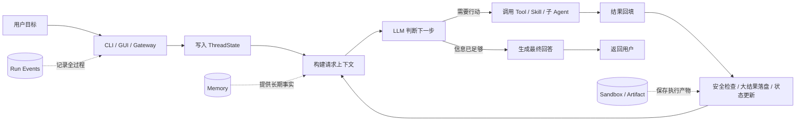
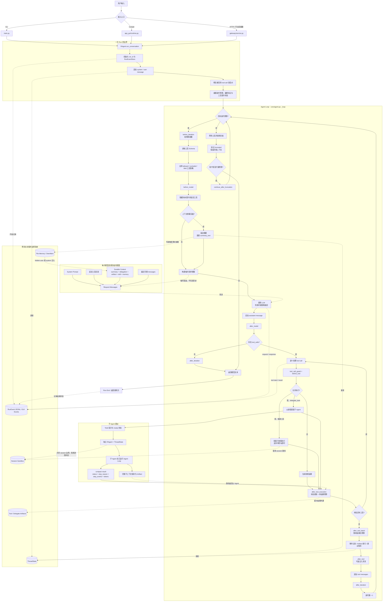
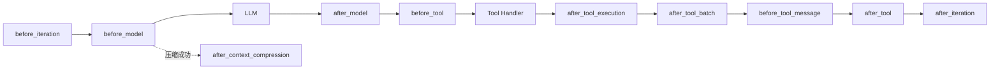
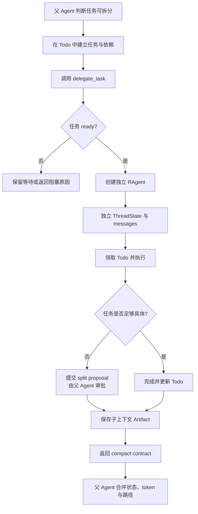

# 09 · R-Agent 整体流程图

> 本文从“用户提出一个任务”开始，说明 R-Agent 如何组织上下文、请求模型、执行工具、
> 管理子 Agent、保存记忆与产物，并最终返回结果。
>
> 流程以当前源码为准，主要入口是
> [`main.py`](../main.py)、[`core/agent.py`](../core/agent.py) 和
> [`tools/registry.py`](../tools/registry.py)。

---

## 1. 一句话理解

R-Agent 不是只把问题发给 LLM，而是给 LLM 配了一张“可反复工作的桌子”：

- `ThreadState` 保存当前工作状态；
- Context 系统决定每次摆到桌面上的内容；
- LLM 决定直接回答还是调用工具；
- Middleware 在关键节点做压缩、预算、安全和状态治理；
- Tool / Skill / Delegate 负责真正执行任务；
- Memory、Artifact、Sandbox 和 Event Stream 负责长期保存、隔离与审计。

最核心的循环可以概括为：

> **准备上下文 → LLM 决策 → 执行工具 → 回填结果 → 再次决策 → 输出答案**

---

## 2. 简化流程图

这张图适合放在 README、汇报材料或项目介绍中。



### 简化图中的 6 个关键动作

1. **接收目标**：CLI、Cockpit GUI 或 Gateway 最终都进入
   `RAgent.run_conversation()`。
2. **保存状态**：用户消息进入 `ThreadState.messages`，摘要、产物、委派结果和
   token 用量保存在各自独立的 channel 中。
3. **准备上下文**：系统提示、最近对话、滚动摘要、已加载 Skill、子任务结果和
   Memory 被组合成本次请求视图。
4. **模型决策**：LLM 可以直接回答，也可以产生一个或多个 tool call。
5. **执行与治理**：工具在权限、超时、进程隔离、结果预算和注入清洗等边界内执行。
6. **循环或结束**：工具结果写回后进入下一轮；没有 tool call 时返回最终答案。

---

## 3. 完整流程图

下面这张图强调真实 Runtime 中的执行顺序。图中的虚线表示旁路能力或按配置启用的能力。



---

## 4. 请求上下文是怎样拼出来的

R-Agent 不会简单地把所有历史原样发送给模型。每次请求前，
`_build_request_messages()` 会创建一个**临时请求视图**：

```text
System Prompt
  + 延迟工具目录（如果启用）
  + Durable Context（如果启用）
  + 最近完整 messages
  + 本轮可见的 tools schema
```

Durable Context 由 [`core/state.py`](../core/state.py) 中的
`build_durable_context()` 生成，可能包含：

| 内容 | 来源 | 作用 |
|---|---|---|
| `summary_text` | 旧对话的滚动摘要 | 长任务压缩后仍能继续 |
| `delegation_ledger` | 子 Agent 的结构化结果 | 父 Agent 知道子任务状态 |
| `artifact_index` | 已外置的大结果和产物 | 保留路径，不重复塞入全文 |
| `skill_context` | 已读取或激活的 Skill | 保留当前任务方法与工具策略 |
| Memory | file 或 deermem provider | 提供跨会话稳定事实 |

这些派生内容只在请求时临时插入，**不会反复追加到 `messages`**。这样可以避免同一份
摘要、记忆和子任务结果在聊天历史里越积越多。

---

## 5. ThreadState 管理什么

[`core/state.py`](../core/state.py) 将一次会话的状态拆成多个 channel：

| Channel | 保存内容 | 为什么不全塞进 `messages` |
|---|---|---|
| `messages` | 最近的 system / user / assistant / tool 消息 | 这是模型对话主历史 |
| `summary_text` | 被压缩历史的滚动摘要 | 摘要需要独立更新 |
| `artifact_index` | 大工具结果和文件产物索引 | 模型通常只需要路径和摘要 |
| `delegation_ledger` | 子任务状态与 compact result | 避免回灌完整子对话 |
| `skill_context` | 已加载 Skill 的引用 | 保留任务方法，不重复加载 |
| `active_skill_policy` | Skill 激活后的工具限制 | 参与工具权限求交集 |
| `sandbox` | 当前 session 路径映射 | 让文件和 Todo 按会话隔离 |
| `todos` | Todo 快照 | 保存任务编排状态 |
| usage channels | 主 Agent、子 Agent、上下文 token 统计 | 支持预算与可观测性 |

可以把它理解成：

> `messages` 是桌面上的对话纸张；`ThreadState` 是整张工作台的抽屉、目录和仪表盘。

---

## 6. Middleware 在哪里介入

Middleware 不替代 Agent Loop，而是在固定节点插入治理逻辑。



当前内核运行时链主要负责：

- 延迟工具 Schema 过滤；
- 上下文估算与自动压缩；
- Tool / Skill / Delegate 运行状态更新；
- 单工具和整轮工具输出预算；
- Artifact、委派账本和运行事件追踪；
- 迭代软预算提醒。

按配置启用的 Middleware 还可以负责：

- 工具结果中的 prompt injection 中和；
- 压缩成功后的 Memory 事实抽取。

Middleware 默认 fail-open：单个观测或增强逻辑失败，不应直接拖垮主循环。但权限
guard、工具隔离和命令审批仍由对应执行层负责，不能只依赖 Middleware。

---

## 7. 工具调用的真实路径

一次 tool call 并不是“模型直接运行代码”，而是：

```text
LLM 只生成：工具名 + JSON 参数
        ↓
Agent 检查 allowed / excluded / Skill policy / guard
        ↓
Middleware 可以否决或记录
        ↓
registry 找到已注册 handler
        ↓
普通工具进入隔离子进程；delegate_task 留在父进程调度
        ↓
结果经过超时、中断、预算、追踪和安全处理
        ↓
作为 role=tool 消息回填给 LLM
```

关键边界：

1. **Schema 可见性不等于执行权限**：即使模型知道某工具，执行期仍会再次检查。
2. **普通工具默认隔离执行**：[`tools/registry.py`](../tools/registry.py) 使用子进程，
   支持取消与超时。
3. **`delegate_task` 是特殊调度器**：它要管理线程、子 Agent、Todo 和事件，因此由
   父进程直接调度。
4. **大结果不会无限回填**：单结果和整批结果都会经过预算控制，必要时保存为 Artifact。
5. **工具结果仍是不可信数据**：可选清洗 Middleware 会降低外部内容被当成指令的风险。

---

## 8. 子 Agent 流程



父子 Agent 之间遵循三个原则：

- **消息隔离**：子 Agent 不继承父 Agent 的完整聊天历史；
- **权限收缩**：子 Agent 禁止再次委派、写长期 Memory 等高影响操作；
- **结果压缩**：父 Agent 默认只接收状态、停止原因、有界 step events、token 用量和
  context artifact 路径，而不是整段子对话。

对应实现位于 [`tools/delegate_tool.py`](../tools/delegate_tool.py)。

---

## 9. Memory、Context 和 Artifact 的区别

这三个概念经常被混在一起：

| 系统 | 回答的问题 | 生命周期 | 典型内容 |
|---|---|---|---|
| Context | “这一次请求给模型看什么？” | 每次 LLM 请求 | 最近消息、摘要、Skill、Memory 投影 |
| Memory | “跨轮次或跨会话要记住什么？” | session 或长期 | 用户偏好、稳定事实、情节事实 |
| Artifact | “太大或需要保留的原始产物放哪里？” | 文件生命周期 | 长日志、工具全文、子 Agent 上下文 |

当前 Memory 支持两类 provider：

- `file`：使用可读的 Markdown Memory；
- `deermem`：使用结构化 `facts.jsonl`、session facts 和检索。

Memory 可以按配置放进 system prompt，也可以通过低权限 hidden-user durable context
注入。自动事实抽取是增强路径：只有启用对应 Middleware，并且上下文压缩真正成功后才会
触发；Memory 写入失败不会阻断 Agent 主任务。

---

## 10. Sandbox 与事件流

### 10.1 Session Sandbox

启用 `SESSION_SANDBOX_ENABLED` 后，一个 session 可以拥有独立目录：

```text
sandbox/sessions/<session_id>/
├── workspace/
├── uploads/
├── outputs/
├── todo_lists/
├── tool_outputs/
├── delegate_contexts/
└── run_events/
```

它负责隔离 Agent 执行路径。Cockpit 的共享文件库仍以仓库根目录下的 `outputs/` 为主，
不要把“GUI 共享文档库”和“Agent session 工作区”当成同一个目录。

### 10.2 Run Events

[`core/events.py`](../core/events.py) 将关键事件追加为 JSONL，例如：

- run start / end / error；
- LLM request / response；
- tool call / result；
- context compact；
- memory inject；
- delegate start / end；
- artifact created。

事件流是旁路观测系统，采用 fail-open：记录失败不能中断用户任务。GUI Events 则主要
服务实时界面更新，两者用途不同。

---

## 11. 两条典型执行路径

### 11.1 简单问答

```text
用户问题
→ run_conversation
→ 构建请求上下文
→ LLM 直接生成文本
→ after_iteration
→ 返回答案
```

这条路径不会执行工具，也不会进入第二轮 Agent Loop。

### 11.2 复杂工程任务

```text
用户目标
→ LLM 先读取文件或搜索代码
→ 工具结果回填
→ LLM 建立 Todo
→ 父 Agent 将独立任务委派给子 Agent
→ 子 Agent 修改 / 验证 / 返回 compact result
→ 父 Agent 读取结果与 Artifact
→ 必要时继续调用工具验证
→ LLM 汇总最终答案
```

如果循环达到 `max_iterations`，R-Agent 会禁用工具并强制输出：

- 当前最佳结论；
- 未完成事项；
- 建议下一步。

随后用户可以选择扩展预算，`continue_after_truncation()` 会在保留原上下文的基础上续跑。

---

## 12. 阅读源码时的推荐顺序

| 顺序 | 文件 | 先看什么 |
|---|---|---|
| 1 | [`main.py`](../main.py) | CLI 如何创建 session、system prompt 和 `RAgent` |
| 2 | [`core/agent.py`](../core/agent.py) | `run_conversation()`、`_loop()`、请求视图和强制收尾 |
| 3 | [`core/state.py`](../core/state.py) | `ThreadState` channel 与 durable context |
| 4 | [`core/middleware/base.py`](../core/middleware/base.py) | Hook 协议、顺序和默认链组装 |
| 5 | [`core/middleware/builtins.py`](../core/middleware/builtins.py) | 压缩、预算、追踪、安全和 Memory 写入 |
| 6 | [`tools/registry.py`](../tools/registry.py) | 工具注册、Schema 和隔离执行 |
| 7 | [`tools/delegate_tool.py`](../tools/delegate_tool.py) | 子 Agent 创建、预算、结果契约和 Artifact |
| 8 | [`core/memory_provider.py`](../core/memory_provider.py) | file / deermem 的注入、抽取、检索和治理 |
| 9 | [`core/sandbox_workspace.py`](../core/sandbox_workspace.py) | session 虚拟路径与本地目录映射 |
| 10 | [`core/events.py`](../core/events.py) | append-only 运行事件 |

对应的专题教程：

- [`01_Agent循环中间件化.md`](01_Agent循环中间件化.md)
- [`02_ThreadState结构化状态.md`](02_ThreadState结构化状态.md)
- [`03_上下文管理.md`](03_上下文管理.md)
- [`04_Memory系统.md`](04_Memory系统.md)
- [`05_子Agent委派契约.md`](05_子Agent委派契约.md)
- [`06_工具系统与沙箱.md`](06_工具系统与沙箱.md)
- [`07_Skills与自定义Agent.md`](07_Skills与自定义Agent.md)
- [`08_运行事件流.md`](08_运行事件流.md)

---

## 13. 最重要的设计结论

1. **Agent Loop 是主干**：所有能力最终都围绕“模型决策—工具结果—再次决策”运转。
2. **ThreadState 是状态中心**：聊天、摘要、产物、委派和计量不再混成一条消息列表。
3. **请求视图是临时投影**：Durable Context 每轮可用，但不会污染持久聊天历史。
4. **Middleware 是治理层**：它把压缩、预算、追踪和安全从主循环中拆出，但不代替权限边界。
5. **工具执行有双重边界**：模型侧控制 Schema 可见性，执行侧再次检查权限并隔离运行。
6. **子 Agent 用隔离换规模**：父 Agent 管调度，子 Agent 管局部执行，只回传紧凑契约。
7. **大内容保存为 Artifact**：保留证据和原文，同时避免把上下文窗口塞满。
8. **Memory 不拥有最高权限**：它是可检索的参考事实，不应覆盖当前用户目标。
9. **Sandbox 管隔离，Events 管审计**：一个限制执行位置，一个解释运行过程。
10. **预算耗尽不等于丢失任务**：强制收尾后仍保留上下文，可由用户决定是否继续。
