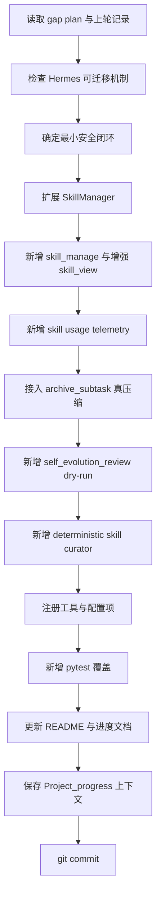
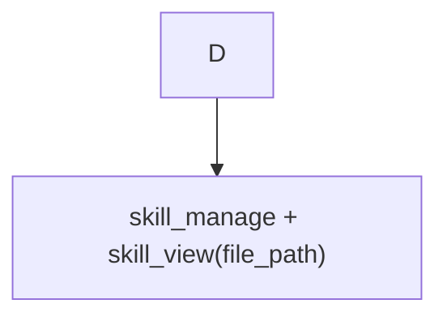
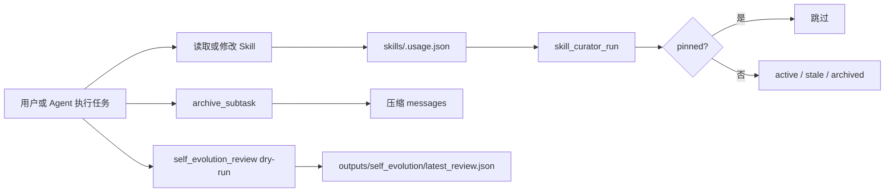

# Hermes 自演进机制融入 R-Agent：维护进度

日期：2026-06-25

## 本轮目标

把此前 gap plan 中梳理的 Hermes Agent 自演进机制，落地为 R-Agent 的最小可运行闭环。这里的“自演进”不是让 Agent 无限制自动改自己，而是先实现一套**可审计、可回滚、默认安全**的维护链路：

1. Agent 可以安全地读写 skill 包及其 supporting files。
2. Agent 对 skill 的查看、创建、修改有 usage telemetry 记录。
3. Agent 可以在复杂任务中主动压缩上下文，保留摘要和下一步。
4. Agent 可以进行后台 self-evolution review，但当前只 dry-run 输出建议，不直接写长期资产。
5. Agent 可以用 deterministic curator 管理 agent-created skills 的生命周期：active / stale / archived / pinned。
6. 为上述能力补测试，并把维护记录写入 README 与 outputs 进度文档。

## 总览流程



## 每一步具体做了什么

### 1. 读取 gap plan 与上轮记录

目的：先恢复本轮升级的上下文，避免重复开发或漏掉用户要求。

具体动作：

- 读取已有升级规划和上轮未完成事项。
- 明确本轮不是一次“大而全”的自进化系统重写，而是先落地 Hermes 风格的最小闭环。
- 根据用户长期要求，确认维护 Agent 项目时必须同步更新：
  - `README.md` 的日期更新日志；
  - `outputs/` 下当前维护进度文档；
  - 若属于较大功能，还要在对应 skill 下保存 `Project_progress/` 上下文保护文件。

结果：确定本轮需要同时改代码、测试、README、outputs 进度文档和 Project_progress 上下文。

### 2. 检查 Hermes 可迁移机制

目的：判断 Hermes Agent 中哪些“自演进”思想适合迁移到 R-Agent。

本轮选中的可迁移方向：

- Skill 包不仅有 `SKILL.md`，还应能包含 supporting files，例如：
  - `references/`
  - `templates/`
  - `scripts/`
  - `assets/`
  - `Project_progress/`
- Skill 的读写应该有统一工具入口，而不是散落在多个工具中。
- Skill 应该有 usage telemetry，后续才能判断哪些 skill 活跃、哪些过期。
- 后台复盘应该先做 dry-run，只输出建议，不直接写入 memory/skill，避免误写长期资产。
- Curator 应该先 deterministic，也就是基于时间、计数、pinned 状态做确定性生命周期管理，而不是让 LLM 直接删除或归档。

结果：形成本轮最小安全闭环的边界：**建议可以自动生成，长期资产修改必须通过显式工具和可审计记录发生。**

### 3. 扩展 `core/skills.py` 的 SkillManager

目的：让 R-Agent 的 skill 系统从“只读 SKILL.md”升级为“安全管理 skill 包”。

修改文件：

- `core/skills.py`

具体实现：

1. 新增 skill 名称校验：
   - 禁止空名称；
   - 禁止绝对路径；
   - 禁止 `..` 路径穿越；
   - 禁止 `/`、`\` 等路径分隔符出现在 skill name 中。

2. 新增 skill 目录定位：
   - 通过 `skills/**/<skill_name>/SKILL.md` 搜索技能目录；
   - 找到后解析为真实路径；
   - 确认路径仍在 `skills/` 根目录内。

3. 新增 supporting file 安全路径规则：
   - 默认读取/写入 `SKILL.md`；
   - 允许访问的子目录白名单为：
     - `references`
     - `templates`
     - `scripts`
     - `assets`
     - `Project_progress`
   - 拒绝绝对路径、`..` 路径穿越、非白名单目录。

4. 增强 `view_skill`：
   - 旧行为：只能看主 `SKILL.md`；
   - 新行为：可以传 `file_path`，读取 skill 包内 supporting file。

5. 新增 `edit_skill_file`：
   - 可覆盖写入 `SKILL.md` 或 supporting file；
   - 自动创建父目录。

6. 新增 `patch_skill_file`：
   - 要求 `old_string` 和 `new_string`；
   - `old_string` 必须唯一匹配；
   - 如果找不到或出现多次，直接报错，避免误替换。

7. 新增 `remove_skill_file`：
   - 只允许删除 supporting file；
   - 拒绝通过 `remove_file` 删除 `SKILL.md`，整 skill 删除必须走 `delete`。

8. 强化 `delete_skill`：
   - 用解析后的 skill 目录删除；
   - 删除后如果父分类目录为空，则清理空目录。

结果：skill 包现在可以安全地被读取、写入、patch 和管理，且支持 `Project_progress/`。

### 4. 新增 `core/skill_usage.py`：Skill 使用遥测

目的：为 skill 的后续维护提供客观数据，不靠主观猜测判断哪些 skill 需要保留、更新或归档。

新增文件：

- `core/skill_usage.py`

数据文件：

- `skills/.usage.json`

记录字段包括：

- `skill_name`
- `created_by`
- `write_origin`
- `use_count`
- `view_count`
- `patch_count`
- `last_used_at`
- `last_viewed_at`
- `last_patched_at`
- `created_at`
- `state`：`active` / `stale` / `archived`
- `pinned`
- `archived_at`
- `archive_path`

具体实现：

1. `read_usage()`：读取并标准化 `.usage.json`。
2. `write_usage()`：原子写入 usage 文件，先写临时文件，再 `os.replace`。
3. `_usage_file_lock()`：使用 lock 文件加锁；Unix/macOS 下优先用 `fcntl.flock`。
4. `normalize_record()`：补齐缺失字段，修复非法 state。
5. `record_event()`：记录 view/use/patch/create 等事件。
6. `latest_activity_at()`：从使用、查看、修改时间里找最近活动时间。
7. `activity_count()`：统计总活动次数。
8. `is_agent_created()`：判断 skill 是否是 agent 创建，供 curator 决定是否处理。
9. `set_pinned()` / `get_record()` / `update_record()`：提供 curator 和工具复用的基础接口。

安全策略：

- telemetry 是 best-effort；如果 usage 写入失败，不应影响用户正在执行的 skill 操作。
- 写入用原子替换，降低半写入导致 JSON 损坏的风险。

结果：后续可以根据真实使用数据进行 skill 生命周期管理。

### 5. 增强 `tools/skills_tool.py`：统一 skill 管理工具

目的：给 Agent 一个统一入口管理 skill 包，同时兼容旧的 `skill_create` / `skill_delete` / `skill_view`。

修改文件：

- `tools/skills_tool.py`

具体实现：

1. 增加统一 JSON 返回 helper：
   - `_json_ok(...)`
   - `_json_error(message)`

2. 增强 `skill_view`：
   - 新增 `file_path` 参数；
   - 支持读取 skill 包内 supporting file；
   - 成功读取后记录 `view` telemetry。

3. 保留 `skill_create`：
   - 作为旧接口兼容；
   - 创建后记录 `create` 和 `patch` telemetry。

4. 保留 `skill_delete`：
   - 作为旧接口兼容；
   - 内部走强化后的 SkillManager。

5. 新增核心工具 `skill_manage`，支持动作：

   | action | 作用 |
   |---|---|
   | `create` | 创建或覆盖一个 skill 的 `SKILL.md` |
   | `edit` | 覆盖写入 `SKILL.md` 或 supporting file |
   | `write_file` | 与 `edit` 类似，用于写 supporting file |
   | `patch` | 对指定文件做唯一字符串替换 |
   | `remove_file` | 删除 supporting file，拒绝删除 `SKILL.md` |
   | `delete` | 删除整个 skill |
   | `usage` | 查看全部或指定 skill 的 usage telemetry |

6. 给 `skill_manage` 注册完整 schema：
   - `action`
   - `skill_name`
   - `description`
   - `content`
   - `category`
   - `file_path`
   - `old_string`
   - `new_string`
   - `created_by`
   - `write_origin`

结果：Agent 现在可以通过一个受控工具维护 skill 包，而不是手工拼路径改文件。

### 6. 接入 `archive_subtask` 真压缩

目的：此前 `archive_subtask` 更像记录摘要；本轮让它真正影响 Agent 上下文，降低复杂任务上下文膨胀。

修改文件：

- `core/agent.py`

具体实现：

1. 新增 `_compress_after_archive(summary, next_steps)`：
   - 保留第一条 system message；
   - 保留最近一条 user message；
   - 插入一条新的 system message，内容为：
     - `【archive_subtask 压缩摘要】`
     - summary
     - next steps
   - 丢弃旧的 assistant/tool 详细中间过程。

2. 在工具调用循环中识别 `archive_subtask` 的成功返回：
   - 如果工具返回 JSON 且 `success=true`；
   - 读取 `recorded_summary` 和 `next_steps`；
   - 调用 `_compress_after_archive(...)` 压缩 `self.messages`。

3. 压缩设计原则：
   - 不写长期 memory；
   - 不丢最新用户请求；
   - 不保留冗长工具输出；
   - 把必要上下文变成一条 system 摘要供后续继续。

结果：复杂任务中可以主动 archive 子任务，减少后续 LLM 需要携带的历史负担。

### 7. 新增 `tools/self_evolution_tool.py`：后台复盘 dry-run

目的：引入 Hermes 式后台自演进复盘，但当前版本严格限制为“只建议，不修改”。

新增文件：

- `tools/self_evolution_tool.py`

输出文件：

- `outputs/self_evolution/latest_review.json`

具体实现：

1. 新增工具 `self_evolution_review(messages_snapshot, mode, dry_run)`。
2. 从消息快照中拼接文本，做启发式检查：
   - 如果出现“用户偏好”、`prefers`、“以后”等，建议可能需要写 memory；
   - 如果出现 `skill`、“流程”、“工作流”、“踩坑”等，建议可能需要沉淀 skill；
   - 如果都没有，返回 `target=none`。
3. 默认 `dry_run=true`。
4. 把复盘结果写到 `outputs/self_evolution/latest_review.json`。
5. 注册为工具，但描述中明确说明：当前只输出 memory/skill 沉淀建议，不直接修改长期资产。

结果：Agent 可以开始做后台复盘，但不会擅自改 memory 或 skill。

### 8. 在 `core/agent.py` 中调度 self-evolution review

目的：让后台复盘不是只能手动调用，而是可以按对话轮数自动触发。

修改文件：

- `core/agent.py`
- `core/config.py`

具体实现：

1. 在 `RAgent.__init__` 中新增：
   - `_turns_since_self_review`

2. 新增 `_schedule_self_evolution_review()`：
   - 截取最近 20 条 message 作为 snapshot；
   - 用 daemon thread 调用 `self_evolution_review`；
   - 参数固定为 `mode="background_review"`、`dry_run=True`；
   - 异常静默处理，避免后台复盘影响主对话。

3. 在 `run_conversation` 成功返回后：
   - 递增 `_turns_since_self_review`；
   - 达到配置阈值后重置计数并启动后台复盘。

4. 在 `core/config.py` 新增配置：
   - `SELF_EVOLUTION_REVIEW_INTERVAL`
   - 默认值：`3`
   - `<=0` 表示关闭。

结果：R-Agent 具备了一个轻量后台复盘入口，但仍保持 dry-run 安全边界。

### 9. 新增 deterministic skill curator

目的：给 skill usage telemetry 一个维护出口：长期不活跃的 agent-created skill 可以先标 stale，再 archive；pinned skill 永远跳过。

新增文件：

- `tools/skill_curator_tool.py`

注册工具：

- `skill_curator_status`
- `skill_curator_run`
- `skill_curator_pin`
- `skill_curator_restore`

具体实现：

#### 9.1 `skill_curator_status`

作用：查看当前 usage telemetry 汇总。

返回内容：

- 每个 state 的数量；
- 每个 skill 的：
  - name
  - state
  - pinned
  - created_by
  - write_origin
  - activity_count
  - last_activity_at
  - created_at
  - archived_at
  - archive_path

#### 9.2 `skill_curator_pin`

作用：设置或取消 pinned。

意义：

- pinned=true 的 skill 会被 curator 跳过；
- 用于保护重要 skill，避免自动标记 stale 或归档。

#### 9.3 `skill_curator_run`

作用：运行 deterministic 生命周期检查。

参数：

- `stale_after_days`，默认 30；
- `archive_after_days`，默认 90；
- `dry_run`，默认 true。

规则：

1. 只处理 `created_by` 属于以下值的 skill：
   - `foreground_agent`
   - `background_review`
   - `agent`
2. pinned skill 直接 skip。
3. 如果没有任何活动时间，先 seed `created_at`，不直接归档。
4. 如果最近活动时间超过 `archive_after_days`：
   - dry-run：只报告将 archive；
   - 非 dry-run：移动目录到 `skills/.archive/<skill_name>`，并写入 `archived_at` 和 `archive_path`。
5. 如果超过 `stale_after_days` 但未到归档阈值：
   - 标记为 `stale`。
6. 如果原本是 stale 但又有新活动：
   - 重新标记为 `active`。

#### 9.4 `skill_curator_restore`

作用：从 archive 恢复 skill。

行为：

- 从 usage 记录中的 `archive_path` 或默认 `skills/.archive/<skill_name>` 找目录；
- 恢复到 `skills/restored/<skill_name>`；
- 更新 usage state 为 `active`。

结果：skill 生命周期管理有了可预览、可 pin、可 restore 的 deterministic 工具。

### 10. 注册新工具并调整入口导入

目的：确保新工具在 Agent 启动时可用。

修改文件：

- `main.py`
- `tools/skills_tool.py`
- `tools/self_evolution_tool.py`
- `tools/skill_curator_tool.py`

具体动作：

- 注册 `skill_manage`。
- 注册 `self_evolution_review`。
- 注册 `skill_curator_status`。
- 注册 `skill_curator_run`。
- 注册 `skill_curator_pin`。
- 注册 `skill_curator_restore`。
- 调整入口导入，确保工具模块被加载后 registry 能看到这些工具。

结果：启动 Agent 后，这些工具可以被模型选择和调用。

### 11. 新增测试覆盖

目的：验证本轮新增能力不是只靠手测。

新增文件：

- `tests/test_self_evolution_skill_manage.py`
- `tests/test_archive_subtask_compression.py`
- `tests/test_skill_curator_tool.py`

具体测试内容：

#### 11.1 `test_skill_view_supporting_file_and_usage`

验证：

- `skill_manage create` 可以创建 skill；
- `skill_manage write_file` 可以写入 `references/api.md`；
- `skill_view(..., file_path="references/api.md")` 可以读取 supporting file；
- usage telemetry 中 `view_count` 增加；
- usage telemetry 中 `patch_count` 至少记录 create/write 两次变化。

#### 11.2 `test_skill_patch_rejects_ambiguous_and_path_traversal`

验证：

- 如果 `old_string` 出现多次，`patch` 会报 ambiguous；
- 如果 `file_path` 包含 `../x`，会被拒绝，防止路径穿越。

#### 11.3 `test_archive_subtask_compresses_messages`

验证：

- `_compress_after_archive` 调用后 message 数量减少为 3；
- 第一条 system message 被保留；
- archive summary 被写入 system message；
- 最近 user message 被保留。

#### 11.4 `test_deterministic_curator_dry_run_and_stale`

验证：

- 创建一个 agent-created skill；
- 人工把活动时间设置为 40 天前；
- dry-run curator 会报告 `mark_stale`，但不会改 usage state；
- 非 dry-run curator 会真的把 state 改为 `stale`；
- status 汇总里 stale 数量为 1。

验证命令：

```bash
python3 -m pytest tests/test_self_evolution_skill_manage.py tests/test_archive_subtask_compression.py tests/test_skill_curator_tool.py -q
```

验证结果：

```text
4 passed
```

### 12. 更新 README 与进度文档

目的：满足用户要求：维护 Agent 项目时，必须把本次升级内容写入 README，并维护 outputs 当前进度文档。

修改文件：

- `README.md`
- `outputs/hermes_self_evolution_upgrade_progress_2026-06-25.md`

README 中记录了：

- 本次升级日期；
- 新增 Hermes 式 self-evolution 维护闭环；
- 新增/增强的核心能力；
- 新增测试与验证结果。

outputs 进度文档中记录了：

- 本轮目标；
- 总览流程图；
- 已落地模块；
- 验证结果；
- 后续建议；
- 本次根据反馈补充了更详细的逐步说明。

### 13. 保存 Project_progress 上下文保护文件

目的：满足用户要求：开发较大功能时，在对应 skill 下保存上下文保护文件，方便后续恢复。

新增文件：

- `skills/agent_ops/project_progress_context/Project_progress/2026-06-25_hermes-self-evolution_context.md`

记录内容包括：

- 本轮维护主体；
- 已完成文件；
- 关键实现点；
- 验证命令；
- 后续建议。

结果：如果后续会话断开，可以先读取该 Project_progress 文件快速恢复上下文。

### 14. 调整 `.gitignore`

目的：让本地运行产物和长期项目产物边界更清晰。

修改文件：

- `.gitignore`

本轮相关处理：

- `outputs/` 默认仍属于运行/进度产物目录，通常不跟踪；
- 但本次用户明确要求维护进度文档，因此提交时对指定进度文档使用 `git add -f` 纳入版本历史。

### 15. 提交代码与文档

本轮产生两个提交：

1. 功能提交：

```text
47ad4e9 feat: add Hermes self-evolution maintenance
```

包含主要代码、测试、README、进度文档、Project_progress 文件。

2. 文档修复提交：

```text
7518586 docs: fix mermaid labels in progress report
```

原因：Mermaid 对节点 label 中的括号、路径、问号等特殊字符敏感，之前的：



已统一用带引号 label 形式修复，并顺手处理两个 Mermaid 图里可能解析失败的节点。

## 已落地能力关系图



## 文件清单

| 模块 | 文件 | 本轮状态 | 说明 |
|---|---|---|---|
| 技能包安全读写 | `core/skills.py` | 已实现 | 支持 supporting files、安全路径、唯一 patch、删除保护 |
| 统一技能管理工具 | `tools/skills_tool.py` | 已实现 | 新增 `skill_manage`，增强 `skill_view(file_path)` |
| Skill 使用遥测 | `core/skill_usage.py` | 已实现 | 写入 `skills/.usage.json`，记录 view/create/patch/use |
| 后台复盘 dry-run | `tools/self_evolution_tool.py` | 已实现 | 输出建议到 `outputs/self_evolution/latest_review.json`，不直接写长期资产 |
| archive_subtask 真压缩 | `core/agent.py` | 已实现 | archive 成功后压缩 messages，保留摘要和下一步 |
| 后台复盘调度 | `core/agent.py` / `core/config.py` | 已实现 | 每 `SELF_EVOLUTION_REVIEW_INTERVAL` 轮触发一次 dry-run review |
| deterministic curator | `tools/skill_curator_tool.py` | 已实现 | status/run/pin/restore，默认 dry-run |
| 入口注册 | `main.py` | 已调整 | 确保新工具可注册 |
| 测试 | `tests/test_*` | 已通过 | 4 passed |
| README 更新 | `README.md` | 已完成 | 按日期记录升级内容 |
| 进度文档 | `outputs/hermes_self_evolution_upgrade_progress_2026-06-25.md` | 已补充 | 本文件 |
| 上下文保护 | `skills/agent_ops/project_progress_context/Project_progress/2026-06-25_hermes-self-evolution_context.md` | 已保存 | 后续会话恢复用 |

## 验证结果

```bash
python3 -m pytest tests/test_self_evolution_skill_manage.py tests/test_archive_subtask_compression.py tests/test_skill_curator_tool.py -q
# 4 passed
```

注册工具检查结果包含：

```text
self_evolution_review
skill_curator_pin
skill_curator_restore
skill_curator_run
skill_curator_status
skill_manage
```

## 当前安全边界

本轮刻意没有做的事情：

1. 没有让后台 review 自动写 memory。
2. 没有让后台 review 自动 patch skill。
3. 没有让 LLM 自动删除或归档 skill。
4. 没有让 curator 默认执行破坏性归档；`skill_curator_run` 默认 `dry_run=true`。
5. 没有把所有 outputs 都纳入 git，只强制加入本次维护进度文档。

原因：自演进能力必须先可观测、可审计、可预览，再逐步提高自动化程度。

## 后续建议

1. 将 `self_evolution_review` 从启发式 dry-run 升级为受限子 Agent：只允许 memory 与 skill 工具，并强制输出 review report。
2. 给 curator 增加 report / backup / rollback，再考虑 LLM 合并重复 skill。
3. 增加 active memory recall 与 compaction flush，让 archive 前先判断是否需要写 memory/skill。
4. 为工具使用也增加 telemetry，形成 skill/tool 双维护闭环。
5. 给 Mermaid / Markdown 文档增加轻量 lint，避免再次出现图表解析错误。
