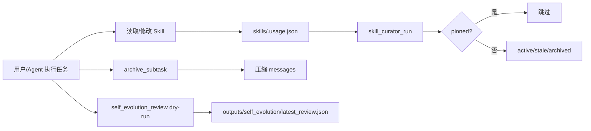

# Hermes 自演进机制融入 R-Agent：维护进度

日期：2026-06-25

## 本轮目标

把此前 gap plan 中梳理的 Hermes Agent 自演进机制，落地为 R-Agent 的最小可运行闭环：技能包管理、使用遥测、后台复盘、上下文压缩和 deterministic curator。

## 我做了什么

```mermaid
flowchart TD
    A[读取 gap plan 与上轮记录] --> B[查看 Hermes 源码]
    B --> C[确认可迁移模块]
    C --> D[修复/补强 skill usage]
    D --> E[skill_manage + skill_view(file_path)]
    E --> F[archive_subtask 真压缩]
    F --> G[self_evolution_review dry-run]
    G --> H[deterministic curator]
    H --> I[新增测试]
    I --> J[更新 README 与进度文档]
    J --> K[保存 Project_progress 上下文]
    K --> L[git commit]
```

## 已落地能力



| 模块 | 文件 | 状态 |
|---|---|---|
| 技能包安全读写 | `core/skills.py` | 已实现 |
| 统一技能管理工具 | `tools/skills_tool.py` | 已实现 |
| Skill 使用遥测 | `core/skill_usage.py` | 已实现 |
| 后台复盘 dry-run | `tools/self_evolution_tool.py` | 已实现 |
| archive_subtask 真压缩 | `core/agent.py` | 已实现 |
| deterministic curator | `tools/skill_curator_tool.py` | 已实现 |
| 配置项 | `core/config.py` | `SELF_EVOLUTION_REVIEW_INTERVAL` |
| 测试 | `tests/test_*` | 4 passed |

## 验证结果

```bash
python3 -m pytest tests/test_self_evolution_skill_manage.py tests/test_archive_subtask_compression.py tests/test_skill_curator_tool.py -q
# 4 passed
```

注册工具检查：

```text
self_evolution_review
skill_curator_pin
skill_curator_restore
skill_curator_run
skill_curator_status
skill_manage
```

## 后续建议

1. 将 `self_evolution_review` 从启发式 dry-run 升级为受限子 Agent：只允许 memory 与 skill 工具。
2. 给 curator 增加 report/backup/rollback，再考虑 LLM 合并重复 skill。
3. 增加 active memory recall 与 compaction flush，让 archive 前先判断是否需要写 memory/skill。
4. 为工具使用也增加 telemetry，形成 skill/tool 双维护闭环。
