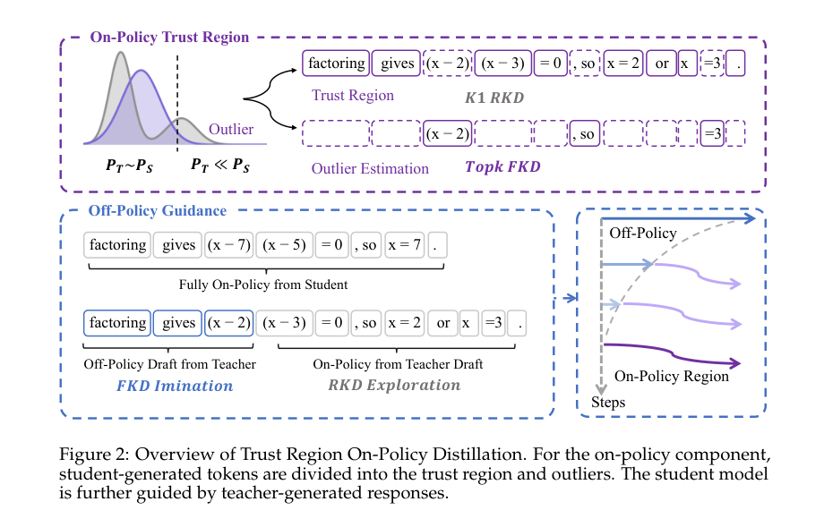
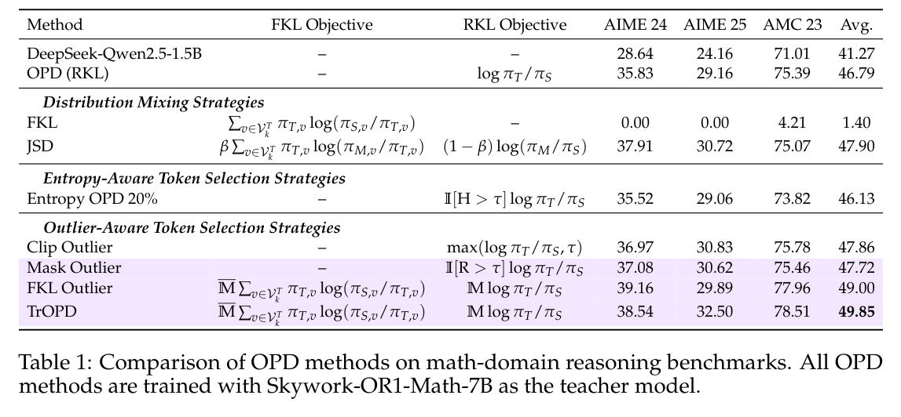
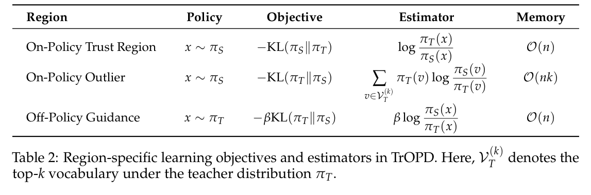
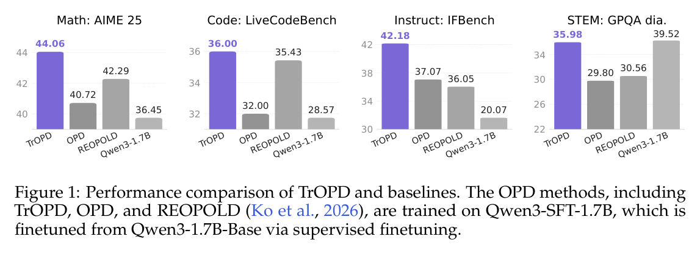
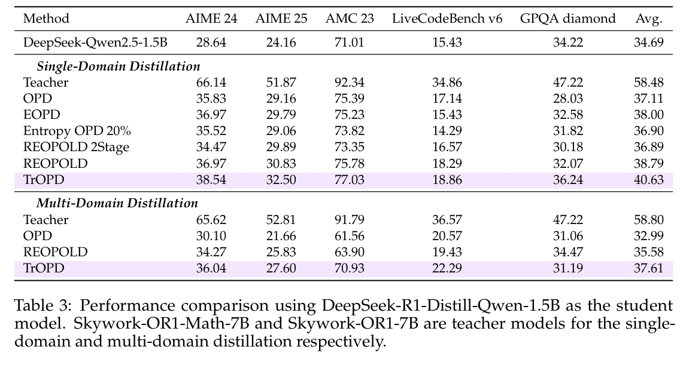
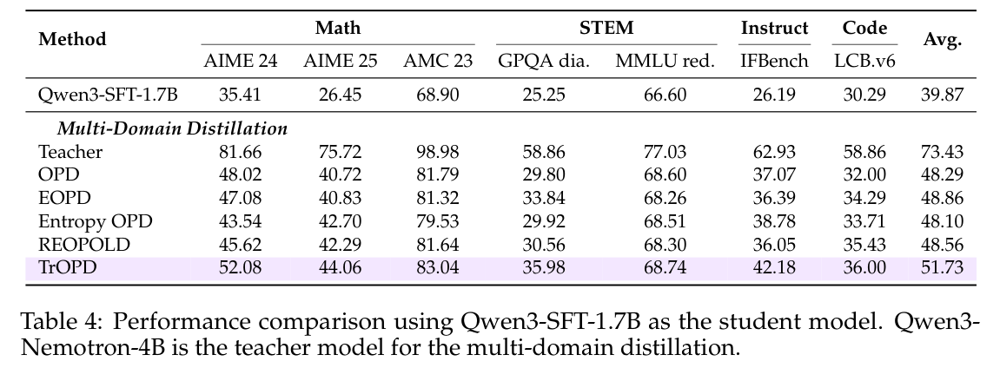
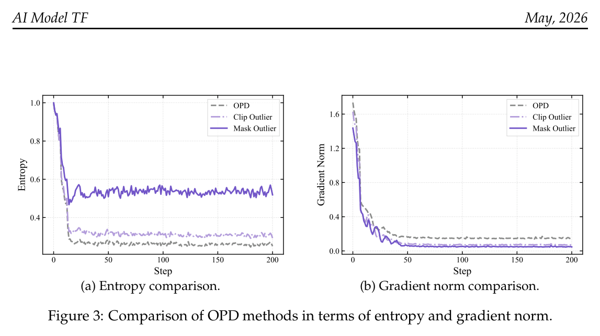
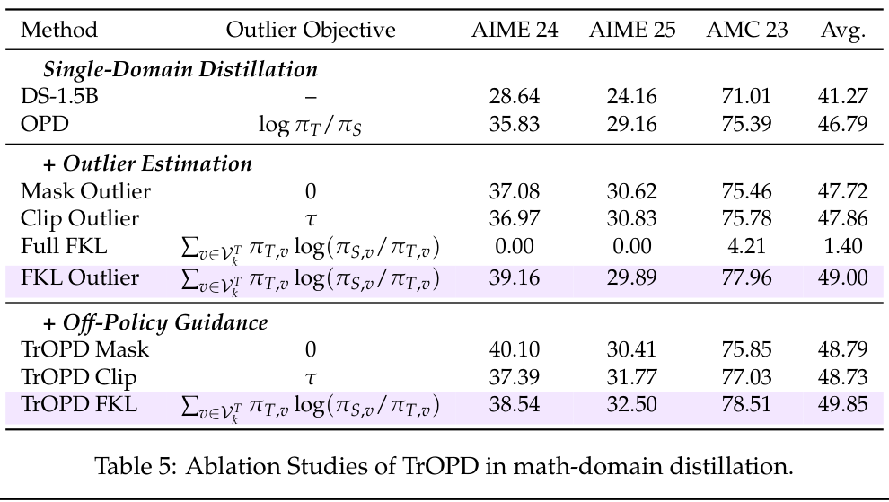
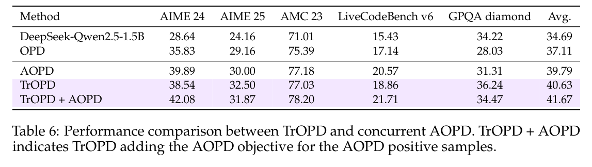

# 《Trust Region On-Policy Distillation》阅读笔记

## 0. 基本信息
- 论文：**Trust Region On-Policy Distillation**
- 作者/机构：Xingrun Xing（Samsung Research, Beijing）、Haoqing Wang（Samsung Research, Beijing）、Boyan Gao（University of Oxford）、Ziheng Li（Samsung Research, Beijing / Peking University）、Yehui Tang（Samsung Research, Beijing，通讯作者）
- 年份/版本：arXiv:2606.01249v3，原文页脚标注 `AI Model TF, May 2026`，arXiv 版本日期为 17 Jun 2026；会议/正式发表信息：论文未明确说明。
- arXiv/DOI：arXiv:2606.01249；DOI 由本地读史脚本推断为 10.48550/arXiv.2606.01249。
- 输入类别目录：`OPD`
- 文件路径：`outputs/papers/OPD/2026-05-31_TrOPD.pdf`
- 输出路径：`outputs/papers_output/OPD/2026-05-31_TrOPD_阅读笔记.md`
- 图片资产目录：`outputs/papers_output/OPD/assets/2026-05-31_TrOPD/`
- 中间文件目录：`sandbox/read_paper/2026-05-31_TrOPD/`
- 阅读日期：2026-07-19
- 用户线索/关注点：抽取正文和关键图表，按 `read_paper` 模板精读 On-Policy Distillation（OPD）论文，重点关注方法、公式、实验、公平性、局限和后续行动。

## 0.5 术语与简称表
| 简称/术语 | 完整英文名 | 中文解释 | 本文中的具体含义 | 首次出现/证据 |
|---|---|---|---|---|
| LLM | Large Language Model | 大语言模型 | 待蒸馏或教师/学生模型的通称 | Abstract / Introduction |
| LRM | Large Reasoning Model | 大型推理模型 | 通过长链路推理和 test-time scaling 获得强推理能力的大模型 | Introduction p.1 |
| SRM | Small Reasoning Model | 小型推理模型 | 论文希望通过蒸馏训练出的低成本推理模型 | Introduction p.1 |
| KD | Knowledge Distillation | 知识蒸馏 | 用教师模型训练学生模型 | Related Works / Sec.3 |
| OPD | On-Policy Distillation | 在线/同策略蒸馏 | 在学生自己生成的轨迹上，让教师给 token-level 监督，缓解 exposure bias | Abstract / Introduction |
| TrOPD | Trust Region On-Policy Distillation | 信赖域在线蒸馏 | 本文方法：只在教师监督可靠区域做 RKL，对异常区域用 top-k FKL，并加入教师前缀引导 | Abstract / Sec.4 |
| ToG | Teacher of Generations | 教师生成轨迹 | off-policy 蒸馏用教师生成的回答训练学生 | Sec.3.1 |
| SoG | Student of Generations | 学生生成轨迹 | OPD 在学生自己生成的回答上训练 | Sec.3.1 / Sec.3.2 |
| RKL | Reverse KL Divergence | 反向 KL 散度 | 以学生分布采样，惩罚学生落到教师低概率区域，模式寻优 | Sec.3.1-3.2 |
| FKL | Forward KL Divergence | 正向 KL 散度 | 以教师分布为视角，让学生覆盖教师支持的 token；本文只在异常区域或教师前缀引导中使用 | Sec.4.1-4.3 |
| JSD | Jensen-Shannon Divergence | Jensen-Shannon 散度 | 混合 FKL/RKL 的对称化思路，本文作为 baseline/比较目标 | Sec.3.2 / Sec.4.1 |
| K1 estimator | K1 estimator | K1 KL 估计器 | 用采样 token 的 log-ratio 做内存友好的 token-level KL 估计，适合长输出但会产生 outlier 梯度 | Sec.3.2 |
| top-k estimator | top-k estimator | top-k 估计器 | 只在教师 top-k 词表上近似 FKL，本文统一 k=64 | Sec.4.1 / Sec.5.1 |
| Trust region | Trust region | 信赖域 | 由教师/学生概率比定义的“教师可验证”区域，在此做 on-policy RKL | Sec.4.2 Eq.6 |
| Outlier | Outlier region/token | 异常区域/异常 token | 学生采样但教师低置信或分布差异大的 token，K1 RKL 梯度不可靠 | Sec.4.2 |
| Off-policy guidance | Off-policy trust-region guidance | 离策略教师引导 | 教师先生成前缀，学生从教师前缀继续；教师前缀上用 FKL imitation | Sec.4.3 |
| EOPD | Entropy-aware On-Policy Distillation | 熵感知在线蒸馏 | 基于高熵 token 选择的 baseline；原文引用 Jin et al., 2026 | Table 3/4 |
| REOPOLD | Relaxed On-Policy Distillation | 放松式在线蒸馏 | 用 reward clipping 修正异常 token 的 baseline；原文引用 Ko et al., 2026 | Abstract / Table 3/4 |
| AOPD | Asymmetric On-Policy Distillation | 非对称在线蒸馏 | 并行工作 baseline，可与 TrOPD 组合 | Sec.5.3 / Table 6 |
| RLVR | Reinforcement Learning with Verifiable Rewards | 可验证奖励强化学习 | 附录 A 中 Qwen3-Nemotron-4B 教师模型训练阶段之一 | Appendix A |
| GRPO | Group Relative Policy Optimization | 组相对策略优化 | 附录 A 中教师模型 RLVR 使用的算法；原文未在正文展开定义 | Appendix A |
| AIME / AMC / GPQA / MMLU-Redux / IFBench / LiveCodeBench | benchmark names | 数学、STEM、指令遵循、代码评测集 | 用于评测 distilled SRM 的任务集合 | Sec.5 |

## 1. 小白友好版论文解释

### 1.1 论文研究的问题
这篇论文研究的是：**怎样把强推理教师模型的能力稳定、低成本地蒸馏给小推理模型，同时避免学生自己生成坏轨迹时被教师给出的 token-level 信号带崩。**

传统 off-policy distillation（离策略蒸馏）让教师先写答案，学生模仿教师答案。它简单稳定，但训练时学生看的是教师轨迹，推理时学生走自己的轨迹，于是长链路推理中会有 exposure bias：学生一旦走偏，训练时没有见过“走偏后如何修正”。On-Policy Distillation（OPD，在线蒸馏）改为让学生自己生成，再让教师对学生生成 token 给监督，因此更贴近推理时的分布。

问题在于，OPD 的好处也正是风险来源：当学生和教师分布差很大时，学生可能生成教师认为极低概率的 token。此时用 K1 估计器做 Reverse KL（RKL，反向 KL）会产生非常大的负梯度，作者称为 unreliable supervision / erroneous policy gradients / outlier gradients。换句话说，教师不是在“纠正学生”，而可能在学生走到教师不熟悉或不支持的区域时给出极端信号，导致训练不稳定甚至 collapse。

论文的成功标准是：在长 reasoning 输出、不能 full-vocabulary KL 的内存约束下，仍能稳定进行 token-level OPD，并在数学、代码、STEM、指令遵循等 benchmark 上超过 OPD、EOPD、REOPOLD 等基线。

### 1.2 核心方法及思想的直观理解和关键公式/代码解释
TrOPD 的直觉很像“不要在老师看不清的地方强行让老师打分”。学生生成的 token 被分成两类：
1. **信赖域（trust region）**：教师对学生 token 还比较认可，说明这个 token 在教师可监督范围内。这里继续用 on-policy RKL，让学生从自己的探索中学习。
2. **异常区（outlier region）**：教师与学生分布差异大，K1 RKL 梯度可能不可靠。这里不再强行用 RKL，而改用教师 top-k token 的 FKL 近似，尽量保留教师支持的有用信息。
3. 另外加入 **off-policy guidance**：训练早期让教师先写一段前缀，学生接着写；教师前缀上做 imitation，使学生更容易走到教师可监督区域。这个前缀长度随训练用 cosine schedule 退火到 0，最后回到 fully on-policy。

核心信赖域概率来自 Eq.6：

$$
P_{trust}(x) = \min \left( \frac{\pi_T(x)}{\pi_S(x)}, 1 \right)
$$

这里 $x$ 是学生采样出的 token，$\pi_S(x)$ 是学生给该 token 的概率，$\pi_T(x)$ 是教师给该 token 的概率。若教师概率不低于学生概率，则该 token 很可能被接纳；若教师概率远低于学生概率，说明学生走到了教师不太支持的位置，进入 outlier 的概率变高。作者把这个设计类比 speculative decoding 的 acceptance ratio。

TrOPD 的统一目标（Eq.9）可以理解为三项相加：

$$
J^{TrOPD}_x
= - I[x \sim \pi_S] M_x \sum_{v \in V^T_k} \pi_{T,v} \log \frac{\pi_{T,v}}{\pi_{S,v}}
- I[x \sim \pi_S] M_x \log \frac{\pi_S}{\pi_T}
- \beta I[x \sim \pi_T] \log \frac{\pi_T}{\pi_S}
$$

注意原文符号中 trust-region mask 和 outlier mask 的排版抽取不够清晰；结合 Eq.5、Eq.7 和 Table 2，本文理解为：学生 on-policy 的 trust region 使用 RKL/K1，outlier 区域使用 teacher top-k FKL，教师生成的 off-policy prefix 使用 FKL imitation。$I[\cdot]$ 是指示函数，$M_x$ 表示区域 mask，$V^T_k$ 表示教师 top-k 词表，$\beta=0.001$ 是教师前缀 imitation 的权重。

### 1.3 方法细节仔细描述
**第一步：定义为什么普通 OPD 会不稳。** 在 RKL-based OPD 中，学生从自己的策略 $\pi_S$ 采样轨迹，目标可写作最小化 $D_{KL}(\pi_S \Vert \pi_T)$。由于 expectation 在学生分布上，学生落入教师低概率区时会被强烈惩罚。长推理输出不能承受 full-vocabulary KL 的 $O(nk)$ 内存，所以近期 reasoning OPD 用 K1 estimator：

$$
J^{KD} = - RKL(\pi_S \Vert \pi_T)
= - E_{x \sim \pi_S} \left[ \log \frac{\pi_S}{\pi_T} \right]
$$

当 $\pi_T(x)$ 近似 0 时，log-ratio 极端，policy-gradient outlier 会很大。这是 TrOPD 的核心诊断。

**第二步：先用 benchmark 对候选策略做“消毒实验”。** 作者比较 top-k FKL、JSD、高熵 token selection、clip outlier、mask outlier、FKL outlier 等。Table 1 显示：standalone top-k FKL 几乎训练失败（Avg 1.40），说明在 top-k 截断下把 FKL 用到所有 token 会严重偏；mask/clip outlier 有帮助；只在 outlier 区域用 FKL 更好；最终 TrOPD Avg 49.85 最强。

**第三步：自适应信赖域。** 不是手设阈值，而用 $P_{trust}(x)$ 抽样/判断 token 是否在 trust region。它的监督信号来源不是人工标签，而是教师与学生对同一 token 的概率比。训练时需要访问 teacher logits/probability（至少当前 token 和 top-k teacher vocabulary）。迁移到开放场景的成本主要是：必须有教师模型在线打分，且要计算 teacher top-k，推理时不需要教师。

**第四步：outlier estimation。** 对 outlier 不简单丢弃，而用 teacher top-k FKL：

$$
J^{FKL}_x
= - M_x \sum_{v \in V^T_k} \pi_T(v) \log \frac{\pi_T(v)}{\pi_S(v)}
$$

这里 $V^T_k=TopK(\pi_T)$。通俗地说，异常 token 本身不可信，但教师在当前位置最看好的 top-k 词仍有教学价值，于是让学生靠近这些教师支持的 token。作者强调当学生在教师 top-k 上概率总量接近 0 时，辅助 outlier objective 会被抑制，不干扰 trust region 梯度；这一点原文表述存在可疑之处，因为严格 KL 在 $\pi_S \to 0$ 时通常趋大，需结合其截断/实现细节理解，代码未在 PDF 中给出。

**第五步：off-policy guidance。** 训练早期教师先生成前缀 $x_{1:l}$，学生从该前缀继续生成 $x_{l:n}$。目标为：

$$
J_x
= - \beta KL_{x_{1:l} \sim \pi_T}(\pi_T \Vert \pi_S) + J^{On}_{x_{l:n}}
$$

教师前缀上用 FKL imitation，学生续写部分仍按 trust-region on-policy 目标训练。最大教师前缀长度初始等于最大训练序列长度，随后 cosine annealing 到 0，因此训练结束时完全 on-policy。

### 1.4 大体实验结果
论文主实验覆盖三组 student/teacher 设置：DeepSeek-R1-Distill-Qwen-1.5B 单数学域、多域蒸馏，以及 Qwen3-SFT-1.7B 多域蒸馏。关键结论：TrOPD 在大多数平均指标上超过 OPD/EOPD/REOPOLD。

- Figure 1 / Table 4：在 Qwen3-SFT-1.7B 多域蒸馏中，TrOPD 相比 OPD 在 AIME25 从 40.72 到 44.06、LiveCodeBench 从 32.00 到 36.00、IFBench 从 37.07 到 42.18、GPQA diamond 从 29.80 到 35.98；总体 Avg 从 48.29 到 51.73，提升 +3.44。
- Table 3：DeepSeek-Qwen2.5-1.5B 单域蒸馏中 Avg 从 OPD 37.11 到 TrOPD 40.63；多域蒸馏中 Avg 从 32.99 到 37.61。
- Table 5：数学域消融中，TrOPD FKL 平均 49.85，高于 OPD 46.79，也高于 TrOPD Mask 48.79 / TrOPD Clip 48.73。

### 1.5 与已有方法相比好多少、为什么好、好在哪里
相对 OPD，TrOPD 的提升来自三点证据链：
1. **不再信任所有 on-policy token。** Trust region 避免 K1 RKL 在教师极低概率 token 上产生错误梯度。
2. **不把异常 token 一刀切丢掉。** 相比 Mask/Clip，outlier FKL 能恢复教师 top-k 中仍有价值的信号。
3. **训练早期把学生带到更好的区域。** Off-policy teacher prefix 避免能力弱学生一开始只生成低质量 SoG。

从数值看，Qwen3-SFT-1.7B 的 Table 4 中 TrOPD 平均 51.73，OPD 48.29，REOPOLD 48.56，EOPD 48.86；数学/代码/指令/STEM 的 Figure 1 分别有约 +3.34、+4.00、+5.11、+6.18 的相对 OPD 提升。DeepSeek 单域 Table 3 中 TrOPD 平均 40.63，比 OPD 37.11 高 +3.52（原文主结果段按数学子集和 general 子集分别报告 +3.06 / +2.63）。

我的判断：TrOPD 最强的地方不是提出一个全新蒸馏范式，而是把“哪些 token 的教师监督可信”这个 OPD 稳定性问题显式建模了。它比单纯 clip 更细，因为 clip 只处理 reward 大小；TrOPD 用 teacher/student agreement 划分区域，并针对区域选择不同 estimator。

### 1.6 代价或局限
- **训练成本**：需要 teacher 在线打分、teacher top-k logits、4 rollouts/prompt、最大 8096 tokens；虽然比 full-vocabulary KL 省内存，但不是轻量训练。
- **超参数和实现复杂度**：top-k 统一设 k=64，off-policy guidance 权重 $\beta=0.001$，教师前缀长度 cosine annealing；论文没有报告这些超参的系统敏感性。
- **教师依赖**：信赖域完全依赖 teacher/student 概率比。如果教师本身对某类问题偏弱或校准差，trust region 并不保证语义正确。
- **评测可信度**：AIME 结果平均 32 次评测，但其他 benchmark 是否多种 seed、是否报告方差/显著性，论文未明确说明。
- **失败案例缺失**：论文有 entropy/gradient norm 曲线，但没有展示具体失败样例、错误类型或训练崩溃案例。
- **作者承认局限**：未做实际部署和应用研究；只聚焦 OPD post-training，未探索 pre-training/mid-training 如何进一步提高 SRM 上界。

## 2. 研究者阅读记录

### 2.1 阅读动机：我为什么读这篇
我读这篇主要是想理解 OPD 在长链路推理蒸馏中的稳定性问题：当学生自己生成轨迹时，教师 token-level 监督是否可靠？如果不可靠，能否不用昂贵 full-vocabulary KL 也能稳定训练小模型？这对低成本训练 small reasoning model 很关键。

### 2.2 预读预测：在看完整结果前我以为会怎样
- 我预期作者会把 OPD 不稳定归因于 teacher-student distribution mismatch，并用 clipping/masking 类似 RL 中 trust region 的方法处理。
- 我预期会比较 OPD、REOPOLD、高熵 token 选择等 baseline，主指标应包括数学和代码。
- 我担心方法可能只是 reward clipping 的改名，或者收益主要来自额外教师轨迹，而不是 trust-region 本身。

### 2.3 读后校正：哪些预测被证实/推翻
- 被证实：核心确实是 distribution mismatch 下 K1 RKL outlier 梯度；baseline 包括 OPD、EOPD、REOPOLD、AOPD。
- 被校正：TrOPD 不只是 clipping；它把 trust region 内 RKL、outlier 上 top-k FKL、teacher prefix FKL imitation 组合起来，并用 Table 5 分开消融。
- 仍存疑：论文没有充分证明 Eq.6 的 trust-region probability 与“语义监督可靠性”强相关，也没有展示 token-level 被划分后的实际样例。

### 2.4 我最想追问的 3 个问题
1. $P_{trust}$ 的阈值/采样方式在代码中到底如何实现？是随机 Bernoulli mask，还是用概率权重软 mask？
2. top-k FKL outlier 在不同 k 值下是否稳定？k=64 是否只是经验选择？
3. TrOPD 对教师错误、教师过度自信、或 teacher/student tokenizer/logit 校准差是否鲁棒？

## 3. 论文主线串读：按行文顺序的完整描述 / 近似翻译式串读

### 3.0 叙事地图：作者如何一步步推进全文
论文从“强推理模型很贵，小推理模型需要蒸馏”出发，先说明 off-policy distillation 有 exposure bias，而 OPD 虽更贴近学生推理分布，却会在 teacher-student 分布差大时产生不可靠 token 监督。随后作者用 Problem Formulation 把 OPD 写成 RKL/K1 estimator，并指出长输出内存约束使 full-vocabulary KL 不现实。Method 部分先 benchmark 各种 OPD baseline，证明 standalone top-k FKL、高熵过滤、clip 都不够，再引出 trust region、outlier estimation 和 off-policy guidance。实验部分用三组 teacher/student 配置和多个 benchmark 验证平均提升，最后附录只补充 Qwen3-Nemotron-4B 教师模型训练细节。

### 3.1 Abstract / Introduction（p.1-p.2, Figure 1）
**节点目的**：交代 OPD 为什么重要，以及本文要解决的“不可靠监督”问题。

摘要先把 OPD 定义为 LLM post-training 中的基础技术，应用于 agent learning、多任务增强和模型压缩。作者马上指出 OPD 在 teacher/student 分布差大时会不稳定，因为教师对学生生成 token 的监督可能产生 unreliable policy gradients，甚至导致 optimization failure。这个摘要不是只说“我们提升了性能”，而是把贡献定位为 **reliable on-policy token-level supervision through credit assignment strategies**。

引言把背景放到 Large Reasoning Models（LRMs）和 Small Reasoning Models（SRMs）的成本矛盾上：LRM 通过 test-time reasoning scale 在数学、代码、agent 任务上很强，但推理成本高；SRM 更适合部署。off-policy distillation 训练于 teacher-generated trajectories，推理时却走 student-generated trajectories，因此长 CoT 会 exposure bias。OPD 在学生轨迹上训练，理论上更适合 SRM。

Figure 1 在引言中提前给结果承诺：TrOPD 在 Qwen3-SFT-1.7B 上相对 OPD/REOPOLD 在 AIME25、LiveCodeBench、IFBench、GPQA diamond 有明显提升。这张图的作用是告诉读者：本文不是只做稳定性诊断，也能转化成多域 benchmark 分数。

材料缺口：引言没有给出训练崩溃的原始 loss 曲线或具体失败案例，只用后续 entropy/gradient norm 和 benchmark 侧面说明不稳定。

### 3.2 Related Works（p.2-p.3）
**节点目的**：把 TrOPD 放在 reasoning model、knowledge distillation、recent OPD 的谱系中。

作者先说 reasoning ability 已经从 prompt elicitation、RL、SFT、OPD 等路径获得，并逐渐和 agentic/multimodal 能力融合；但如何让 SRM 获得强 reasoning 能力仍未充分研究。然后回顾 knowledge distillation：Hinton KD 到 sequence-level KD，再到 full-vocabulary OPD（MiniLLM/GKD/speculative KD）用于缓解 exposure bias。对于 reasoning model，近期使用 K1 estimator 的 token-level KL 目标提高 post-training 推理能力，但长 reasoning 的内存和稳定性问题仍突出。

这一节的过渡作用是：传统 KD 关注“学生模仿教师”，而本文要关注“教师在学生轨迹上何时可信”。它自然引出下一节的问题形式化。

### 3.3 Problem Formulation（Sec.3, p.3-p.4, Eq.1-Eq.2）
**节点目的**：把 OPD 的训练目标写成 RKL/K1，并解释 outlier 梯度从哪里来。

Sec.3.1 区分 ToG 和 SoG。off-policy distillation 在 teacher generations 上训练；OPD 在 student generations 上训练。RKL objective 可理解为：

$$
D_{KL}(\pi_S \Vert \pi_T)
= E_{x \sim \pi_S} \left[ \log \frac{\pi_S(x)}{\pi_T(x)} \right]
$$

因为 expectation 在学生分布上，RKL 会强烈惩罚学生生成教师低概率的序列，但对学生没探索到的教师 mode 直接惩罚较弱，所以表现为 mode-seeking。传统 OPD 如果算 full-vocabulary RKL/JSD，长 generation 的 $O(n \cdot k)$ 内存会不可接受。

Sec.3.2 转向 reasoning models。作者先给 full-vocabulary KL 目标（Eq.1），再说近期 reasoning OPD 用 K1 estimator 降低内存：

$$
J^{KD} = -RKL(\pi_S \Vert \pi_T)
= -E_{x \sim \pi_S} \left[ \log \frac{\pi_S}{\pi_T} \right]
$$

问题在于，当 $\pi_T(x)$ 很小，$\log(\pi_T/\pi_S)$ 或等价 reward 信号会变得极端，导致 policy-gradient outlier。作者还指出第二个瓶颈：学生轨迹质量低，OPD 完全依赖 SoG，弱学生在难题上可能无法进入高质量优化空间。这两个瓶颈分别对应后文 outlier estimation 和 off-policy guidance。

### 3.4 Benchmarking OPD Baselines（Sec.4.1, p.4-p.5, Table 1, Figure 3, Eq.3-Eq.4）
**节点目的**：先证明现有替代策略不足，再为 TrOPD 的分区域目标做铺垫。

作者认为 long-thinking OPD 还新，各方法设置不同，因此先统一 benchmark。第一个问题是：full-vocabulary OPD 里的 FKL/JSD 思路，在 top-k/K1 内存约束下是否仍有效？作者定义 top-k FKL：

$$
J^{top-k}_{FKL}
= - \sum_{v \in V^T_k} \pi_{T,v} \log \frac{\pi_{T,v}}{\pi_{S,v}}
$$

再定义带平衡系数的 generalized JSD：

$$
J^\beta_{JSD}
= \beta \sum_{v \in V^T_k} \pi_{T,v} \log \frac{\pi_{M,v}}{\pi_{T,v}}
+ (1-\beta) \log \frac{\pi_{M,x}}{\pi_{S,x}}
$$

其中 $x \sim \pi_S$，$\pi_{M,v}=\beta \pi_{T,v}+(1-\beta)\pi_{S,v}$，默认 $\beta=0.5$。Table 1 显示 standalone FKL 失败，Avg 只有 1.40；JSD 有改善但非最强。这支持作者判断：top-k FKL 不能直接作为全局 OPD objective，但可以作为增强 RKL 的局部工具。

第二个问题是 token filtering 和 reward clipping。Entropy OPD 只训高熵 token，但 Table 1/4 显示不稳定收益，说明普通 token 也有教师有效监督。Reward clipping 有时提高，但阈值引入额外超参，且可能连有用信号一起裁掉。Figure 3 从 entropy 和 gradient norm 显示：Mask Outlier 保持更高 entropy、降低 gradient norm，支持“抑制 outlier 梯度能稳定训练”的论点。

### 3.5 Trust-Region On-Policy Learning（Sec.4.2, p.5-p.7, Eq.5-Eq.7, Table 2）
**节点目的**：正式给出 TrOPD 的 on-policy 分区域学习目标。

作者从前一节结论出发：直接 top-k FKL 不行，简单 clip/mask 不够，所以要“只在可靠区域做可靠优化”。受到 TRPO 启发，TrOPD 对 token 级目标做区域划分。Eq.5 组合了 trust region 的 RKL 与 outlier 的 FKL：

$$
J^{On}_x
= - M_x KL(\pi_S \Vert \pi_T) - \bar{M}_x KL(\pi_T \Vert \pi_S)
$$

上式中 $M_x$ 与 $\bar{M}_x$ 可理解为 trust/outlier 的互补 mask；PDF 抽取文本把两个 mask 都显示为 $M_x$，但从文字和 Table 2 看，应为不同区域对应不同目标。

接着作者讨论 outlier masking。Clip Outlier 是把超过阈值的 reward 裁掉；Mask Outlier 是当 reward magnitude 超过阈值时直接 mask token-level advantage。Table 1 和 Figure 3 支持 mask/clip 比 OPD 稳定，但静态阈值仍不理想。

Adaptive Trust Region 用 Eq.6 替代静态阈值：

$$
P_{trust}(x)=\min \left( \frac{\pi_T(x)}{\pi_S(x)}, 1 \right)
$$

这一步是论文方法的核心。它把“教师是否认可学生 token”转化成 probability ratio。若教师给该 token 的概率接近或高于学生，就在 trust region 用 K1 RKL；若教师概率远低于学生，则认为 K1 信号不可靠。

Outlier Estimation 接着说：outlier 不等于完全没信息。由于 RKL 的学生采样视角在 severe mismatch 下不可靠，outlier 改用教师视角的 FKL top-k：

$$
J^{FKL}_x
= - \bar{M}_x \sum_{v \in V^T_k} \pi_T(v) \log \frac{\pi_T(v)}{\pi_S(v)}
$$

这个设计的目的，是在不让 outlier token 的极端 RKL 梯度影响训练的同时，仍让学生靠近教师 top-k 支持。Table 2 总结三类区域：on-policy trust region 用 $x \sim \pi_S$ 和 RKL/K1，内存 $O(n)$；on-policy outlier 用 teacher top-k FKL，内存 $O(nk)$；off-policy guidance 用 $x \sim \pi_T$ 的 FKL/K1，内存 $O(n)$。

材料缺口：PDF 没给出 Bernoulli mask 的采样方差、是否用 stop-gradient、top-k FKL 中归一化/截断的实现细节。

### 3.6 Off-Policy Trust-Region Guidance 与统一目标（Sec.4.3, p.7, Eq.8-Eq.9）
**节点目的**：解决低质量 SoG 让学生一开始走不到好区域的问题。

Sec.4.3 引入 teacher prefix：轨迹分为教师生成前缀 $x_{1:l}$ 和学生继续生成 $x_{l:n}$。这让弱学生在难题上不必从空白状态完全自生成，而是在教师支持的推理路径附近继续探索。目标是：

$$
J_x = -\beta KL_{x_{1:l} \sim \pi_T}(\pi_T \Vert \pi_S) + J^{On}_{x_{l:n}}
$$

教师前缀来自 $\pi_T$，所以可以用 K1 estimator 估计 FKL，内存 $O(n)$。统一目标 Eq.9 把三项合到一起：学生 outlier 的 teacher top-k FKL、学生 trust region 的 RKL、教师前缀的 imitation FKL。训练时教师前缀最大长度从最大训练序列长度逐渐 cosine anneal 到 0，因此前期更像 teacher-guided，后期 fully on-policy。

这一节把前文两个瓶颈闭环：trust region/outlier 处理错误梯度，off-policy guidance 处理低质量学生轨迹。

### 3.7 Experimental Results：Implementation Details（Sec.5.1, p.7-p.9）
**节点目的**：说明实验设置是否能支撑“公平比较 OPD 方法”。

作者设置单域和多域 reasoning distillation。模型设置有三类：
1. 单任务数学蒸馏：Skywork-OR1-Math-7B 教师，DeepSeek-Distill-Qwen-1.5B 学生。
2. 多任务蒸馏：Skywork-OR1-7B 教师，DeepSeek-Distill-Qwen-1.5B 学生。
3. 多任务 Qwen 设置：Qwen3-Nemotron-4B 教师，Qwen3-SFT-1.7B 学生；教师由 Qwen3-4B-Base 经 Nemotron SFT & RL recipe 训练，学生由 Qwen3-1.7B-Base 用同 SFT recipe 训练。

数据方面，单域用 OpenThoughts3 数学 prompts；多域用 OpenThoughts3 的 mathematics、code、science prompts，训练只保留 prompts。统一训练设置：200 steps，learning rate $5 \times 10^{-6}$，top-k $k=64$，off-policy guidance $\beta=0.001$，prompt batch size 128，每个 prompt 4 rollouts，最大 generation length 8096 tokens。

评测包括 AIME 2024/2025、AMC 2023、GPQA Diamond、MMLU-Redux v2、IFBench、LiveCodeBench v6；AIME 每项结果是 32 次评测平均。材料缺口：除 AIME 外，其他 benchmark 是否多次运行或报告方差，论文未明确说明。

### 3.8 Main Results（Sec.5.2, p.8-p.10, Table 3-4）
**节点目的**：验证 TrOPD 在不同 teacher/student 和不同域上是否稳定优于 baseline。

Table 3 中，DeepSeek-Qwen2.5-1.5B 单域蒸馏从 OPD Avg 37.11 提升到 TrOPD 40.63。数学项 AIME24/25/AMC23 分别为 38.54/32.50/77.03；OOD 项 LiveCodeBench 18.86、GPQA 36.24。多域蒸馏中，OPD Avg 32.99，REOPOLD 35.58，TrOPD 37.61。作者据此说 TrOPD 在数学和 general domain 上都优于 OPD/REOPOLD。

Table 4 中，Qwen3-SFT-1.7B 多域蒸馏 TrOPD Avg 51.73，高于 OPD 48.29、EOPD 48.86、Entropy OPD 48.10、REOPOLD 48.56。它在 AIME24 52.08、AIME25 44.06、AMC23 83.04、GPQA diamond 35.98、IFBench 42.18、LiveCodeBench 36.00 上均强于 OPD；MMLU-Redux 68.74 只略高于 OPD 68.60，提升不大。

我的判断：结果总体支持“稳定性策略有用”，但 teacher 仍显著强于 student，例如 Table 4 teacher Avg 73.43、TrOPD 51.73，蒸馏后距离教师还有大 gap；论文没有把这个 gap 拆成容量限制、训练步数限制还是 OPD 目标限制。

### 3.9 Ablation Studies and Discussion（Sec.5.3, p.9-p.10, Table 5-6）
**节点目的**：拆分 TrOPD 的三个组件，确认不是某个 baseline 偶然提升。

Table 5 比较 outlier objective 和 off-policy guidance。只做 Mask/Clip/FKL Outlier 时，FKL Outlier Avg 49.00，高于 Mask 47.72、Clip 47.86。加入 off-policy guidance 后，TrOPD Mask 48.79、TrOPD Clip 48.73、TrOPD FKL 49.85；说明 teacher prefix guidance 对三种 outlier 处理都有补充收益，且 FKL outlier 最强。

Table 6 比较并行工作 AOPD：AOPD Avg 39.79，TrOPD 40.63，TrOPD + AOPD 41.67。这支持作者说 AOPD 与 TrOPD 正交，组合互补。

材料缺口：消融没有报告 k、$\beta$、teacher-prefix annealing schedule、trust region ratio 的敏感性；没有按训练阶段显示被判为 trust/outlier 的 token 比例。

### 3.10 Conclusion / Limitations（p.10）
**节点目的**：收束贡献并承认适用边界。

结论重申 TrOPD 是 reasoning-oriented OPD 的可靠稳定框架：通过 trust region optimization 和 outlier estimation 抑制不可靠 policy gradients，同时用 off-policy guidance 引导学生探索教师支持轨迹。作者把未来潜力定位在“训练高质量小推理模型”。

Limitations 很短，主要承认没有做 practical deployment/application studies。真实场景中训练高性能 SRM 往往需要 mid-training 进一步提升 post-training reasoning 上界，而本文主要只研究基于 DeepSeek-Qwen2.5-1.5B 和 Qwen3-SFT-1.7B 的 OPD post-training。作者认为这是为了 fair and controlled comparisons among OPD methods。

我的补充判断：作者承认的局限偏宏观，未充分讨论 teacher 依赖、top-k 截断偏差、token-level trust 与语义正确性的关系，以及评测统计显著性。

### 3.11 Appendix A：Training Details of Teacher Model Qwen3-Nemotron-4B（p.14）
**节点目的**：补充 Table 4 所用教师模型 Qwen3-Nemotron-4B 的训练来源，帮助判断 baseline/teacher 是否公平。

当前 PDF 只有 Appendix A，没有更多附录实验、prompt 模板或额外失败案例。Appendix A 说明 Qwen3-Nemotron-4B 从 Qwen3-4B-Base 初始化，经历 SFT 和 RLVR 两阶段。SFT 使用 Nemotron 3 Nano 公开数据，删除没有 messages 字段的条目，并按技术报告的域分布重采样，得到约 14M training samples。

RLVR 使用 Nemotron 3 Nano RL Training Blend，包含四个域：Math 22,056 samples（DAPO 和 Skywork），Coding 19,169 samples（CodeContests 和 Open-R1），Science 19,670 samples（OpenScienceReasoning-2），Instruction Following 16,575 samples（WildChat-1M，instructions 来自 Open-Instruct）。SFT 使用 Adam，learning rate $5 \times 10^{-5}$，weight decay 0.1，warmup 10%，batch size 512，平均 response length 约 7K tokens。RLVR 使用 GRPO，group size 16，masked importance sampling，batch size 128，每 2048 rollouts 更新，最大 generation length 32K，temperature 1.0。

这部分很重要，因为 Table 4 的 teacher 很强，训练数据覆盖 math/code/science/instruction，可能影响蒸馏后多域结果。论文说明学生 Qwen3-SFT-1.7B 使用同 SFT recipe，但没有说学生是否经历同等 RLVR；这意味着 Table 4 比较 OPD 方法是公平的，但“teacher 与 student 初始能力差距”的来源复杂。

## 4. 论文主线总结

### 4.1 问题定义：任务、输入、输出、成功标准
- 任务：在学生模型自己生成的长推理轨迹上进行 token-level distillation，使学生学习教师模型能力。
- 输入：训练 prompts、student rollouts、teacher logits/probabilities、必要时 teacher-generated prefix。
- 输出：更新后的 small reasoning student model。
- 成功标准：在数学、代码、STEM、指令遵循 benchmark 上超过 OPD/EOPD/REOPOLD 等 baseline，同时保持训练稳定、内存可承受。

### 4.2 核心假设与证据链
- 假设 1：OPD 不稳定主要来自 teacher/student distribution mismatch 下的 K1 RKL outlier 梯度。证据：Problem Formulation 的梯度分析、Figure 3 gradient norm、mask/clip 改善结果。
- 假设 2：教师/学生概率比可作为 token-level 监督可靠性的 proxy。证据：Eq.6 与 speculative decoding acceptance ratio 类比，以及 TrOPD 主结果；但缺少 token-level 可靠性标注验证。
- 假设 3：outlier 区域仍有教师 top-k 信息可用。证据：Table 5 中 FKL Outlier 高于 Mask/Clip。
- 假设 4：teacher prefix 能帮助弱学生进入更高质量轨迹空间。证据：Table 5 三种 TrOPD variant 加 off-policy guidance 后平均更高。

### 4.3 方法流程总览
1. 学生对 prompt 生成 on-policy trajectory。
2. 教师对学生 token 计算概率，并对每个 token 用 $P_{trust}$ 判断 trust region / outlier。
3. Trust region：用 K1 RKL 对学生生成 token 做 on-policy learning。
4. Outlier region：不用不可靠 RKL，改用 teacher top-k FKL 近似保留教师支持 token 的信息。
5. 训练早期：教师生成 prefix，学生继续，prefix 上做 FKL imitation；prefix 长度逐渐退火为 0。
6. 用统一目标更新学生。

### 4.3.1 监督信号/标签/critique/proxy 来源表（如适用）
| 信号 | 用途 | 取值/规则 | 由谁产生 | 是否依赖 ground truth/oracle/evaluator | 训练/评测可用阶段 | 附录证据 | 迁移成本 |
|---|---|---|---|---|---|---|---|
| teacher probability $\pi_T(x)$ | 判断 token 是否在 trust region，计算 KL | 教师对学生 token 的概率 | teacher model | 不依赖 benchmark ground truth，但依赖教师模型 | 训练时需要；评测/推理不需要 | 主文 Sec.4 | 需要在线 teacher forward |
| student probability $\pi_S(x)$ | 概率比、RKL reward | 学生模型 | 不依赖 ground truth | 训练时需要 | 主文 Sec.3-4 | 常规训练可得 |
| $P_{trust}(x)$ | trust/outlier 区域划分 | $\min(\pi_T(x)/\pi_S(x),1)$ | teacher + student probability proxy | 不依赖 ground truth | 训练时需要 | Sec.4.2 Eq.6 | 需要概率校准较可靠 |
| teacher top-k vocabulary $V^T_k$ | outlier FKL supervision | teacher logits top-k，k=64 | teacher model | 不依赖 ground truth | 训练时需要 | Sec.4.1/5.1 | 需额外 teacher top-k logits 和 $O(nk)$ 内存 |
| teacher prefix | off-policy guidance | 教师生成前缀，长度 cosine anneal 到 0 | teacher model | 不依赖 ground truth | 训练早期需要 | Sec.4.3 | 增加 teacher generation 成本 |
| benchmark accuracy | 评估 | AIME/AMC/GPQA/MMLU/IFBench/LCB 分数 | benchmark evaluator | 依赖 benchmark 标准答案/评测器 | 仅评测 | Sec.5 | 开放场景需对应评测器 |

### 4.4 最小可运行版本 / sanity check
最小复现可以只做数学域：选一个 1.5B student 和 7B teacher，使用 OpenThoughts3 math prompts，训练 200 steps，batch size 可缩小，max length 可先降到 2K。比较三组：OPD K1 RKL、Mask Outlier、TrOPD FKL Outlier（先不加 teacher prefix），观察训练 gradient norm、entropy、AIME/AMC 小样本准确率。若 FKL Outlier 不比 Mask/Clip 稳定，说明本文关键 claim 需要重新审视。

## 5. 关键公式索引（可选）
| 公式号 | 对应第 1/3 章位置 | 作用 | 详解位置 |
|---|---|---|---|
| Eq.1 | Sec.3.3 | full-vocabulary RKL/KD objective | 1.3 / 3.3 |
| Eq.2 | Sec.3.3 | K1 estimator 形式的 reasoning OPD | 1.3 / 3.3 |
| Eq.3 | Sec.3.4 | teacher top-k FKL objective | 3.4 |
| Eq.4 | Sec.3.4 | generalized JSD objective | 3.4 |
| Eq.5 | Sec.3.5 | on-policy trust/outlier 分区域目标 | 3.5 |
| Eq.6 | Sec.1.2 / 3.5 | trust region probability | 1.2 / 3.5 |
| Eq.7 | Sec.1.3 / 3.5 | outlier FKL estimation | 1.3 / 3.5 |
| Eq.8 | Sec.1.3 / 3.6 | off-policy guidance objective | 1.3 / 3.6 |
| Eq.9 | Sec.1.2 / 3.6 | unified TrOPD objective | 1.2 / 3.6 |

## 6. 实验是否合理

### 6.1 实验验证的问题
实验基本覆盖了三个核心问题：TrOPD 是否优于 OPD/REOPOLD/EOPD；outlier FKL 是否比 mask/clip 好；teacher prefix guidance 是否有补充收益。主结果覆盖数学、代码、STEM、instruction following，多 teacher/student 设置也增强了外推性。

### 6.2 Baseline 公平性
作者强调所有 OPD benchmark 使用同一训练设置：200 steps、学习率、top-k、rollout 数、max length 等一致。baseline 包括 OPD、EOPD、Entropy OPD、REOPOLD、REOPOLD 2Stage、AOPD，基本覆盖相关近邻方法。需要注意：不同方法的最佳超参可能不同，统一设置有利于公平但不一定是每个 baseline 的最优调参；论文没有报告 baseline 调参预算。

### 6.3 主结果分析
TrOPD 在平均分上稳定领先。Table 4 中 Qwen 多域 Avg +3.44，相对 OPD 的具体提升分布不均：IFBench、GPQA、AIME/LCB 提升明显，MMLU-Redux 提升很小。这说明方法对长推理/可验证任务可能更有价值，对普通知识问答类指标收益有限。

### 6.4 消融实验
Table 5 是论文较强证据：Mask/Clip/FKL Outlier 与加入 off-policy guidance 后的三种 TrOPD variants 都列出。它支持“outlier FKL + guidance”组合最强。不过缺少对 $k=64$、$\beta=0.001$、prefix annealing、trust probability 采样策略的消融。

### 6.5 误差/案例/原始输出分析
论文没有展示具体成功/失败样例、token-level mask 可视化、长链推理出错类型，也没有展示学生在 outlier 区域被 FKL 拉回的实际文本。这是较明显缺口。Figure 3 只展示 entropy 和 gradient norm，不能直接说明语义错误如何被修正。

### 6.6 效率、成本、可扩展性
作者用 K1 和 top-k 估计器降低内存：trust region RKL $O(n)$，outlier top-k FKL $O(nk)$，off-policy prefix FKL $O(n)$。但训练仍需 teacher forward/generation，且 max generation 8096 tokens、4 rollouts/prompt 成本不低。论文未报告 wall-clock、GPU 数、显存、吞吐。

### 6.7 统计可信度与复现性
AIME 结果平均 32 次评测，这是优点。其他 benchmark 的方差、随机种子、显著性检验、训练多 seed 未明确说明。论文说 project homepage available at GitHub，但 PDF 中未给出明确代码细节；本次阅读未联网验证项目页。

## 7. 附录、局限与反证记录

### 7.1 Appendix 关键细节（若已在第 3 章串读，这里做索引和批判性总结）
Appendix A 只补充 Qwen3-Nemotron-4B 教师模型训练：Qwen3-4B-Base 初始化，SFT 约 14M samples，RLVR 四域混合，SFT/RLVR 超参详见第 3.11 节。没有 prompt 模板、额外实验、失败案例、更多超参敏感性或 token-level 可视化附录。

### 7.2 作者承认的局限
作者承认未做实际部署和应用研究；真实 SRM 训练可能需要 pre-training/mid-training 等额外阶段；本文只研究 OPD post-training 的公平受控比较。

### 7.3 我记录的不利证据/反例/边界条件
- Standalone top-k FKL 完全失败，说明 top-k 近似容易引入偏差；TrOPD 依赖“只在 outlier 用 FKL”这个边界条件。
- MMLU-Redux 提升很小，说明方法不是所有任务都强。
- 语义正确性没有 token-level ground truth 验证，trust region 只是 probability proxy。
- 没有真实部署成本和多 seed 方差，工程落地风险尚未充分量化。
- 教师模型的训练数据很强且多域，蒸馏收益可能依赖 teacher 覆盖面和校准。

### 7.4 与旧论文/经典思想/相邻领域的关系
TrOPD 借鉴了 RL 的 trust-region 思想、speculative decoding 的 acceptance ratio、KD 中 FKL/RKL 的 mode-covering/mode-seeking 区分，以及 sequence-level KD 到 on-policy KD 的 exposure bias 讨论。它更像是把旧思想组合到 long reasoning OPD 的特殊约束下：不能 full-vocabulary、学生轨迹质量不稳定、教师 token-level 监督有可信区域。

## 8. 我的判断与可借鉴点
- 真正贡献：把 OPD 的 token-level supervision reliability 显式建模，并用 trust/outlier/off-policy 三区域目标实现稳定训练。
- 最强证据：Table 5 消融清楚显示 FKL Outlier 和 off-policy guidance 的增益；Table 3/4 多设置平均提升支持泛化。
- 可能夸大：把 teacher/student probability ratio 称作可靠监督区域可能过强；它是概率一致性 proxy，不一定等价于语义正确。
- 适用场景：有强教师、学生明显弱于教师、长链路推理输出、full-vocabulary KL 内存不可承受的 OPD post-training。
- 不适用场景：没有在线 teacher logits；教师不可靠或过度自信；任务不需要长推理；训练预算极低。
- 最值得借鉴的研究技巧/工程技巧：先统一 benchmark 拆 baseline，再根据失败现象设计区域化 objective；对 outlier 不只是 mask/drop，而考虑换 estimator 保存信息。

## 9. 后续研究行动
- 最小复现/验证实验：在数学 prompts 上复现 OPD vs Mask Outlier vs FKL Outlier vs TrOPD FKL，记录 gradient norm、entropy、trust/outlier token ratio 和小样本 AIME/AMC。
- 低成本 sanity check：固定 teacher/student，离线收集学生 rollouts，画 $\pi_T/\pi_S$ 与 token 是否导致错误答案之间的相关性，验证 trust proxy 是否真的对应语义可靠。
- 下一步可做的 1-3 个研究问题：
  1. 自适应 k：outlier FKL 的 top-k 是否可根据 teacher entropy 或 trust probability 动态调整？
  2. 语义信赖域：能否把 verifier/reward model 的过程正确性信号与 probability ratio 结合，避免只看概率一致性？
  3. 成本优化：能否缓存 teacher logits 或用小 verifier 替代 teacher top-k，降低 TrOPD 训练成本？
- 下一篇该读的论文/资料：Agarwal et al. 2024 `On-policy distillation of language models: Learning from self-generated mistakes`；Ko et al. 2026 REOPOLD；Jia et al. 2026 AOPD。
- 对 1-2 年后影响力的预测：区域化监督可靠性会继续重要；具体 Eq.6 形式可能被更强的 verifier/uncertainty proxy 替代。TrOPD 更可能作为 OPD 稳定训练组件被吸收，而不是单独成为最终范式。

## 重检查记录
- 重检查日期：2026-07-19
- 对照范围：重新对照 `sandbox/read_paper/2026-05-31_TrOPD/fulltext.txt` 与 PDF 抽取页 1-14，覆盖 Abstract、Introduction、Related Works、Problem Formulation、Method、Experiments、Conclusion、Limitations、Appendix A、Figure 1-3、Table 1-6、Eq.1-Eq.9；并检查图片资产路径和 Markdown 数学格式。
- 补充/修正：
  1. 补充了 Appendix A 中 Qwen3-Nemotron-4B 的 SFT/RLVR 数据规模与训练超参，避免只写“附录无关”。
  2. 修正了 Table 4 的平均提升：Qwen3-SFT-1.7B 多域 OPD Avg 48.29，TrOPD Avg 51.73，提升 +3.44；Figure 1 中四项相对 OPD 提升分别对应 AIME25 +3.34、LiveCodeBench +4.00、IFBench +5.11、GPQA diamond +6.18。
  3. 对 Eq.5/Eq.9 的 mask 符号加入说明：PDF 抽取中文本里 trust/outlier mask 排版不清，结合 Table 2 理解为不同区域对应不同目标；未把抽取异常当作确定数学结论。
  4. 增加了监督信号来源表，明确 TrOPD 依赖 teacher probabilities、teacher top-k、teacher prefix，而非人工标签或 benchmark ground truth。
  5. 增加了对统计可信度、失败案例缺失、超参敏感性缺失的批判性记录。
  6. 修补 Figure 2 图片资产：重新从 PDF 第 3 页按包含图体与图注的区域裁剪，替换同名文件，保持 Markdown 相对链接不变。
- 仍不确定：论文 PDF 未明确给出代码级实现细节，例如 $P_{trust}$ 是硬采样还是软权重、top-k FKL 是否重新归一化、teacher prefix cosine schedule 的精确公式、训练硬件/时长、除 AIME 外的多 seed 方差；这些需查项目代码或补充材料。
