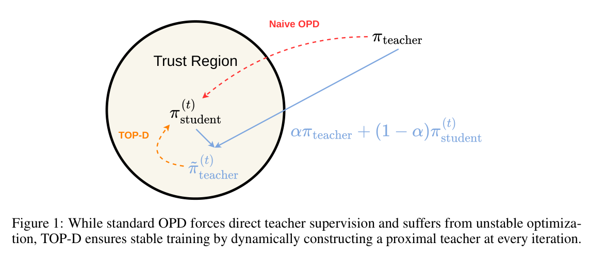
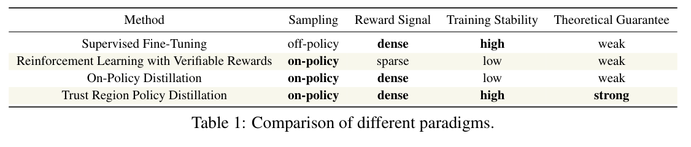
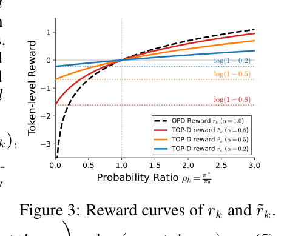
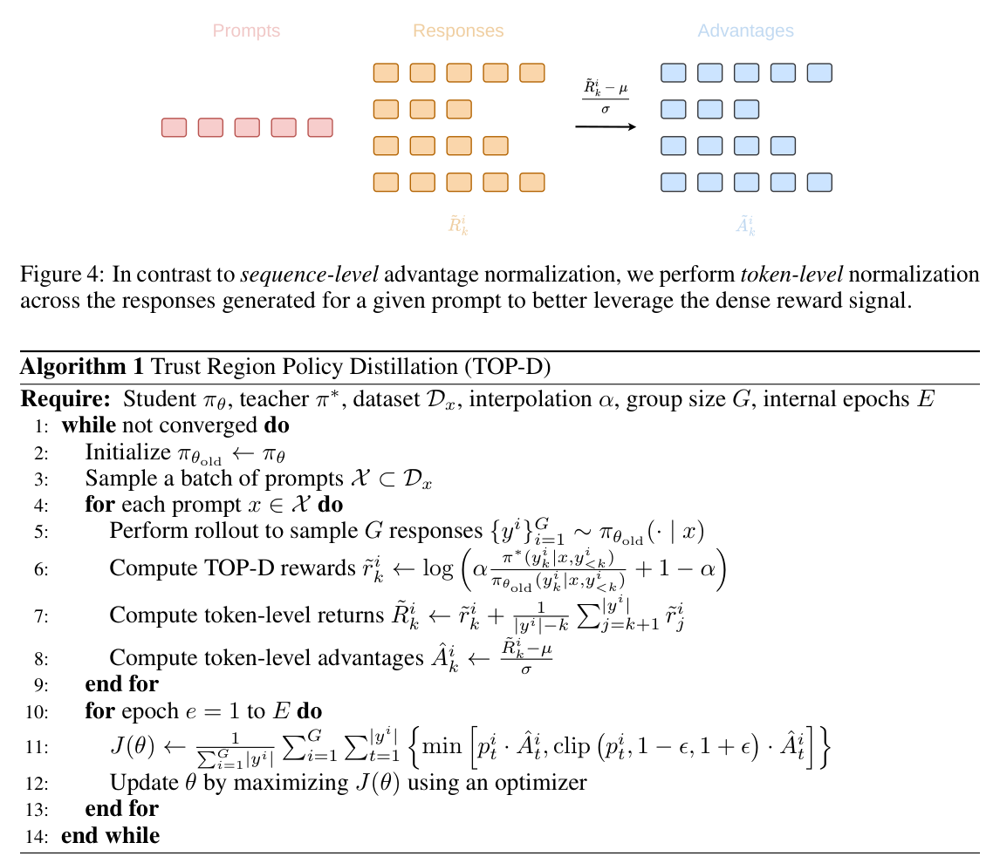
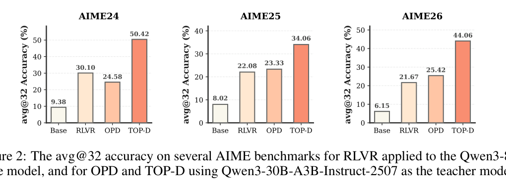
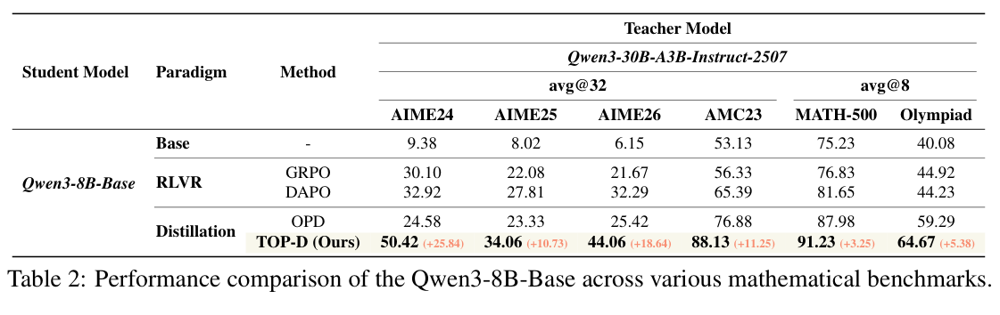
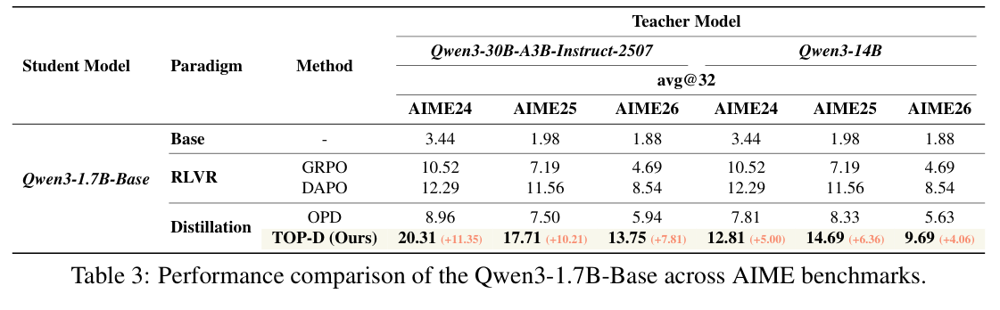
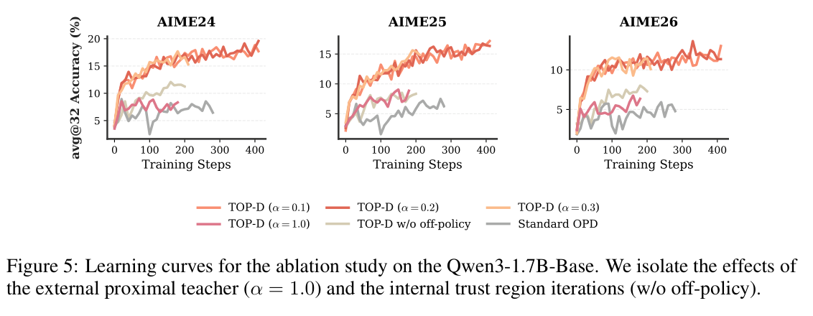
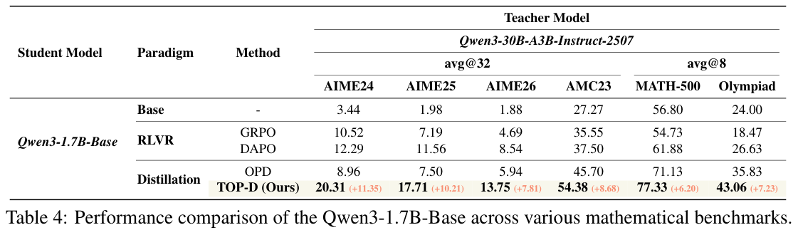
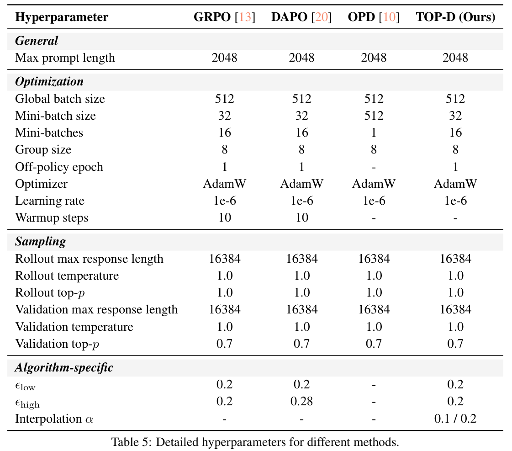

# 《Trust Region Policy Distillation》阅读笔记

## 0. 基本信息
- 论文：Trust Region Policy Distillation（TOP-D）
- 作者：Zhengpeng Xie; Li Lyna Zhang; Zeke Xie; Mao Yang
- 年份/状态：2026，arXiv preprint
- arXiv/DOI：arXiv:2607.04751 v1，6 Jul 2026；DOI 未在论文首页/元数据中找到
- 输入类别目录：OPD
- PDF 路径：`outputs/papers/OPD/2026-07-06_TOP-D_Trust_Region_Policy_Distillation.pdf`
- 抽取文本：`sandbox/read_paper/2026-07-06_TOP-D_Trust_Region_Policy_Distillation/full_text.txt`
- 输出路径：`outputs/papers_output/OPD/2026-07-06_TOP-D_Trust_Region_Policy_Distillation_阅读笔记.md`
- 阅读日期：2026-07-18
- 用户线索/关注点：按新版 `read_paper` 模板重构；重点覆盖小白解释、方法公式、监督信号来源、图表数值、实验公平性、Appendix C proofs、局限与复现建议。
- 截图说明：正文引用 10 张已存在的图表级精裁截图，均使用相对 assets 路径；旧整页截图保留在 assets 目录但本文不引用。

## 0.5 术语与简称表
| 简称/术语 | 完整英文名 | 中文解释 | 本文中的具体含义 | 首次出现/证据 |
|---|---|---|---|---|
| TOP-D | Trust Region Policy Distillation | 信赖域策略蒸馏 | 本文方法：外部近端教师平滑 OPD reward，内部 trust-region/off-policy 迭代复用样本 | 标题、Abstract、Algorithm 1 |
| OPD | On-Policy Distillation | 在线策略蒸馏 | 学生用自己 rollout 得到的 token，学习外部 teacher 的 token-level logprob 信号 | Introduction, Sec.2.1 |
| SFT | Supervised Fine-Tuning | 监督微调 | off-policy、dense signal、稳定；作者称可能有 catastrophic forgetting | Table 1, Introduction |
| RLVR | Reinforcement Learning with Verifiable Rewards | 可验证奖励强化学习 | on-policy、sparse reward，baseline 包括 GRPO、DAPO | Table 1, Sec.5 |
| GRPO | Group Relative Policy Optimization | 组相对策略优化 | RLVR baseline；原文未在本文展开全称细节 | Sec.5.1, Table 2/3 |
| DAPO | 原文未展开 | DAPO 数学 RL 系统/数据来源 | baseline；训练集 DAPO-Math-17k 来自该工作 | Sec.5.1, References |
| proximal teacher | External Proximal Teacher | 外部近端教师 | 每步把 teacher policy 与 current/old student policy 在概率空间插值，形成更接近学生的目标 | Sec.3.1 |
| internal trust region iterations | Internal Trust Region Iterations | 内部信赖域迭代 | 使用 old student rollout，PPO-style clipped objective 多 mini-batch 更新 | Sec.3.2, Algorithm 1 |
| alpha | interpolation coefficient | 插值系数 | 控制 teacher 与 student 混合强度；alpha=1 退化为 OPD；本文常用 0.1/0.2 | Sec.3.1, Table 5 |
| G | group size | 每 prompt 采样响应数 | 本文 G=8 | Algorithm 1, Table 5 |
| E | internal epochs | 内部迭代轮数 | Algorithm 1 输入；Table 5 对应 off-policy epoch=1、16 mini-batches | Algorithm 1, Table 5 |
| avg@32 / avg@8 | average accuracy at 32/8 samples | 多采样平均准确率 | AIME 用 avg@32，AMC/MATH/Olympiad 用 avg@8 | Figure 2, Table 2 |
| DTV | Total Variation Distance | 总变差距离 | 理论分析中的 policy 距离惩罚 | Theorem 4.9 |
| DAPO-Math-17k | 原文未展开数据细节 | 数学推理训练集 | 所有主训练使用的高质量数学推理语料；论文未给样本构造细节 | Sec.5.1 |

## 1. 小白友好版论文解释
> 本章一句话结论与扫描式概览的职责：TOP-D 把 OPD 中无下界的 token log-ratio reward 改成概率空间插值得到的下界化 reward，并用 PPO-style trust region 迭代复用 rollout；它在数学推理蒸馏上显著优于 OPD/RLVR，但提升混合了 reward 平滑和优化器/数据复用两类因素，公平性与复现细节仍需谨慎核查。

### 1.1 论文研究的问题
这篇论文研究的是大语言模型 post-training 中的 policy distillation：有一个更强的 teacher model，希望把它的能力蒸馏到较小或较弱的 student model 中。传统 Supervised Fine-Tuning（SFT，监督微调）可以直接学习离线数据，训练稳定，但它不是学生自己采样出来的分布，容易出现分布错位或作者所说的 catastrophic forgetting；Reinforcement Learning with Verifiable Rewards（RLVR，可验证奖励强化学习）让学生 on-policy 生成，再用答案正确性等 sparse reward 更新，优点是和学生分布匹配，缺点是奖励稀疏、样本效率低。

On-Policy Distillation（OPD，在线策略蒸馏）看起来是一个折中：学生自己 rollout，teacher 对学生生成的每个 token 给 log probability，于是每个 token 都有 dense reward。问题是，teacher 和 student 能力差距大时，student 可能生成 teacher 几乎不认可的 token。标准 OPD 的 reward 是 teacher/student 概率比的对数；如果 teacher 给某个 student token 的概率接近 0，reward 会接近负无穷，梯度方差爆炸，训练极不稳定。论文把这个问题概括为 capacity gap 导致的 unbounded logarithmic probability difference。

Figure 1 的直觉是：标准 OPD 让 student 一步跳到远处的 teacher，容易迈太大步；TOP-D 每轮先在 teacher 和当前 student 之间构造一个更近的 proximal teacher，让 student 只追一个局部目标。这里的“trust region”不是单纯说把 reward clip 掉，而是同时体现在两个层面：外部目标更近，内部更新也受 PPO-style clipped objective 约束。

Table 1 把作者想解决的问题放入四类 post-training 范式中：

作者主张 TOP-D 同时继承 OPD 的 on-policy + dense reward，又获得更高训练稳定性和更强理论保证。我的理解是：论文真正要回答的问题不是“蒸馏有没有用”，而是“OPD 这个很诱人的 dense on-policy 训练范式，能不能被改造成像 PPO/TRPO 那样稳定、可复用样本、又保留 teacher token-level 信号”。

### 1.2 核心方法及思想的直观理解和关键公式/代码解释
最核心的想法可以用一句话解释：不要让学生直接模仿一个离它很远的老师，而是每一步把老师和当前学生混成一个“近一点的老师”，学生先追这个近目标；同时用 PPO-style 的 trust region objective，让同一批学生 rollout 能被多次更新复用。

标准 OPD 的 token-level 概率比是：

$$
\rho_k = \frac{\pi^{*}(y_k \mid x, y_{1:k-1})}{\pi_{\theta}(y_k \mid x, y_{1:k-1})}
$$

其中 `pi star` 是 teacher policy，`pi theta` 是 student policy，`x` 是 prompt，`y_k` 是第 k 个 token。标准 OPD reward 是：

$$
r_k = \log \rho_k
$$

如果 teacher 对这个 token 给很小概率，`rho_k` 接近 0，`log rho_k` 就会非常负。TOP-D 不直接用 teacher，而是在概率空间构造 proximal teacher：

$$
\widetilde{\pi}^{*}(y_k \mid x, y_{1:k-1}) = \alpha \pi^{*}(y_k \mid x, y_{1:k-1}) + (1-\alpha)\pi_{\theta}(y_k \mid x, y_{1:k-1})
$$

于是新 reward 变成：

$$
\widetilde{r}_k = \log \frac{\widetilde{\pi}^{*}(y_k \mid x, y_{1:k-1})}{\pi_{\theta}(y_k \mid x, y_{1:k-1})}
= \log(\alpha \rho_k + 1 - \alpha)
$$

这条公式是全篇最重要的公式。它有三个直观含义：第一，alpha 越大，越接近原 teacher；alpha=1 时完全退化为标准 OPD。第二，alpha 越小，proximal teacher 越靠近 student，负向惩罚越温和。第三，当 `rho_k` 接近 0 时，reward 不再接近负无穷，而是有下界：

$$
\widetilde{r}_k \ge \log(1-\alpha)
$$

Figure 3 把这个差别画出来：OPD reward 曲线向左会无限下坠，而 TOP-D reward 曲线在不同 alpha 下都有最低值。

这不是普通的 reward clipping。普通 clipping 是事后把过大或过小的 reward 截断；TOP-D 是先在概率空间改变目标分布，再自然推出一个有下界的 reward。作者还特别指出，如果在 log-probability 空间插值：

$$
\log \widetilde{\pi}^{*} = \alpha \log \pi^{*} + (1-\alpha)\log \pi_{\theta}
$$

则只会得到：

$$
\widetilde{r}_k = \alpha r_k
$$

这只是把原来的无界 reward 缩放一下，并不能解决负无穷的问题。

把论文的关键伪代码翻成白话，大致是：每个 global step 先保存旧 student 为 behavior policy；用旧 student 对每个 prompt 采样 G 个 responses；对每个 token 计算 teacher logprob 和 old student logprob；用 `log(alpha * exp(logp_teacher - logp_old) + 1 - alpha)` 得到 TOP-D reward；再把 token reward 转成 token-level advantage；最后用 PPO-style clipped objective 对同一批数据做 mini-batch 更新。Figure 4 与 Algorithm 1 正是在说明这个流程。

### 1.3 方法细节仔细描述
TOP-D 方法由两个组件组成。

第一是 external proximal teacher。它的输入是 teacher policy、当前 student policy、prompt 与学生生成的 token；输出不是显式构造出来的一整个词表分布，而是一个可直接计算的 token reward。实际实现只需要 teacher 对已生成 token 的 logprob、old/current student 对同 token 的 logprob，以及 alpha。因为：

$$
\widetilde{r}_k = \log(\alpha \exp(\log \pi^{*}(y_k \mid s_k)-\log \pi_{\mathrm{old}}(y_k \mid s_k)) + 1 - \alpha)
$$

这里 `s_k` 表示 prompt 加前缀构成的状态。训练时用 old student 作为采样分布，因此 Algorithm 1 的 reward 分母是 `pi old`。评测或推理时不再需要 teacher。

第二是 internal trust region iterations。标准 OPD 是严格 on-policy：更新一次后，旧轨迹就不能继续用。TOP-D 采用 behavior policy `pi old` 和 target policy `pi theta` 的分离，用旧轨迹做多次 mini-batch 更新。目标函数类似 PPO clipped objective：

$$
J(\theta)=\mathbb{E}_{x,\{y^i\}_{i=1}^{G}\sim \pi_{\mathrm{old}}}\left[\frac{1}{\sum_{i=1}^{G}|y^i|}\sum_{i=1}^{G}\sum_{t=1}^{|y^i|}\min\left(p_t^i\widehat{A}_t^i,\;\mathrm{clip}(p_t^i,1-\epsilon,1+\epsilon)\widehat{A}_t^i\right)\right]
$$

其中 importance ratio 是：

$$
p_t^i=\frac{\pi_{\theta}(y_t^i\mid x,y_{1:t-1}^i)}{\pi_{\mathrm{old}}(y_t^i\mid x,y_{1:t-1}^i)}
$$

`p_t^i` 衡量当前 student 与生成这条轨迹的 old student 在该 token 上差多少；clip 防止 current policy 相对 behavior policy 走得太远。为了用好 dense token reward，作者没有只做 sequence-level advantage，而是对同一 prompt 下 G 个 responses 的 token-level returns 做归一化：

$$
\widetilde{R}_k^i = \widetilde{r}_k^i + \frac{1}{|y^i|-k}\sum_{j=k+1}^{|y^i|}\widetilde{r}_j^i
$$

$$
\widehat{A}_k^i = \frac{\widetilde{R}_k^i-\mu}{\sigma}
$$

直观地说，`R tilde` 是“当前 token 的 reward 加上长度归一化后的未来平均 reward”；`A hat` 是在同一 prompt 的 token 集合里标准化后的优势。作者称这样能避免模型生成过短或过长回答，但正文没有给出长度分布图作为证据。

理论分析分三段。Theorem 4.2 在 score function 有界的假设下证明 TOP-D token gradient variance 有统一上界：

$$
\mathrm{Var}(\widetilde{g}_k) \le M^2 |\mathcal{V}|\max\left\{(\log(1-\alpha))^2, C^{*}\alpha\right\}
$$

这里 `M` 是 score function 范数上界，`|V|` 是词表大小，`C star` 是 Appendix C.1 推导出的常数。它说明 alpha 是 variance controller：alpha 趋近 1 时，负向下界发散，回到 OPD；alpha 趋近 0 时方差降低，但 teacher 信号也变弱。

Theorem 4.4 把 proximal teacher 看成 operator：

$$
T(\pi)=\alpha\pi^{*}+(1-\alpha)\pi
$$

若实际更新有优化误差：

$$
\pi_{k+1}=T(\pi_k)+\epsilon_k
$$

则到 teacher 的 expected L1 distance 满足：

$$
d(\pi_{k+1},\pi^{*}) \le (1-\alpha)^{k+1}d(\pi_0,\pi^{*}) + \sum_{i=0}^{k}(1-\alpha)^{k-i}\lVert \epsilon_i\rVert_1
$$

并且如果长期误差上界为 `epsilon infinity`：

$$
\limsup_{k\to\infty}d(\pi_{k+1},\pi^{*}) \le \frac{\epsilon_{\infty}}{\alpha}
$$

这揭示了一个 trade-off：alpha 小可以稳，但 asymptotic gap 有 `1/alpha`；所以还需要内部 trust region iteration 降低单步优化误差。Theorem 4.9 则用 finite horizon、normalized state visitation、Total Variation Distance 给出 performance lower bound，说明如果内部更新改进 lower bound，就能单调改进真实目标，并通过 Pinsker/Jensen 把 KL 降低转成 `epsilon_k` 的 L1 上界。

### 1.4 大体实验结果
实验集中在数学推理。训练集是 DAPO-Math-17k；评测包括 AIME24/25/26、AMC23、MATH-500、Olympiad。student 包括 Qwen3-8B-Base 和 Qwen3-1.7B-Base；teacher 包括 Qwen3-30B-A3B-Instruct-2507 和 Qwen3-14B。baseline 包括 GRPO、DAPO、标准 OPD。

首页 Figure 2 已经给出最显眼的结果：Qwen3-8B-Base + Qwen3-30B-A3B teacher 时，TOP-D 在 AIME24/25/26 上分别达到 50.42/34.06/44.06，明显超过 Base、RLVR 和 OPD。

Table 2 是 8B student 的完整主结果：

| 方法 | AIME24 | AIME25 | AIME26 | AMC23 | MATH-500 | Olympiad |
|---|---:|---:|---:|---:|---:|---:|
| Base | 9.38 | 8.02 | 6.15 | 53.13 | 75.23 | 40.08 |
| GRPO | 30.10 | 22.08 | 21.67 | 56.33 | 76.83 | 44.92 |
| DAPO | 32.92 | 27.81 | 32.29 | 65.39 | 81.65 | 44.23 |
| OPD | 24.58 | 23.33 | 25.42 | 76.88 | 87.98 | 59.29 |
| TOP-D | 50.42 | 34.06 | 44.06 | 88.13 | 91.23 | 64.67 |
| TOP-D 相对 OPD | +25.84 | +10.73 | +18.64 | +11.25 | +3.25 | +5.38 |

Table 3 是 1.7B student 在 AIME 上的结果，体现了更大 capacity gap 下 TOP-D 的优势：

用 30B-A3B teacher 时，TOP-D 在 AIME24/25/26 是 20.31/17.71/13.75，相对 OPD 的 8.96/7.50/5.94 提升 +11.35/+10.21/+7.81。用 Qwen3-14B teacher 时，TOP-D 是 12.81/14.69/9.69，相对 OPD 的 7.81/8.33/5.63 提升 +5.00/+6.36/+4.06。

Figure 5 做消融：alpha=1.0 等价于移除 external proximal teacher；w/o off-policy 等价于移除内部数据复用；alpha=0.1/0.2/0.3 测敏感性。曲线显示 alpha=1.0 不稳定，w/o off-policy 样本效率下降，alpha 在 0.1 到 0.3 区间差异较小。

Appendix A 的 Table 4 给出 1.7B student 完整 benchmark，进一步确认 TOP-D 在 AMC23、MATH-500、Olympiad 上也超过 OPD。

### 1.5 与已有方法相比好多少、为什么好、好在哪里
相对 OPD，TOP-D 在本文主设置下提升很大。8B student 的 AIME24 从 24.58 提到 50.42，绝对提升 +25.84；AIME26 从 25.42 到 44.06，绝对提升 +18.64。相对 RLVR/DAPO，TOP-D 在 Table 2 的全部六个 benchmark 上也更高，尤其 AIME24 比 DAPO 高 17.50 个百分点。

机制上，它好在两个地方。第一，external proximal teacher 把“老师完全否定学生某 token”的极端负反馈变成有下界的温和负反馈，从而减少 outlier token 主导梯度的风险。第二，internal trust region iterations 允许同一批 rollout 被多次 mini-batch 更新，并用 clipped objective 控制 current policy 不要离 old policy 太远，所以样本效率更像 PPO，而不是标准 OPD 每次更新后丢弃数据。

相比 SFT，TOP-D 的优势是 on-policy：学生学的是自己会生成的分布，而不是固定离线 demonstrations。相比 RLVR，TOP-D 的优势是 dense token-level teacher signal，不需要等整道题答案对错才给 sparse reward。相比标准 OPD，TOP-D 的优势是 reward 有下界，并且可以做 trust-region data reuse。相比 naive reward scaling，它的优势是从概率空间插值推导出来的 reward 真正有下界，而不是简单缩小一个仍然无界的 log-ratio。

但要区分“作者声称”和“实验支持”。作者在 Sec.5.2 说 AIME24 的大幅提升“definitively proves” bounding variance unlocks reasoning potential；我的判断是这句话偏强。实验确实支持 TOP-D 作为一个整体优于 OPD，但 Table 5 显示 TOP-D 与 OPD 的 mini-batch 和 off-policy 设置不同，因此提升不能完全归因于 reward 平滑。

### 1.6 代价或局限
训练成本方面，作者声称 TOP-D “zero additional computational overhead”，这应理解为不需要显式构造完整 proximal teacher 分布；reward 可由 teacher/student token logprob 代数变换得到。但实际工程仍需 teacher logprob、old student logprob、长响应 token 的 reward/advantage 缓存、PPO-style mini-batch 数据管理。论文没有给 wall-clock、吞吐、显存、teacher serving 或 logprob 缓存细节。

实验范围方面，论文只验证数学推理，student 最大到 8B；作者在 Limitations 中明确说没有验证 student 超过 30B 的 massive-scale，也没有观察长训练饱和，因为训练窗口约 200 到 400 update steps。论文也没有展示失败案例、原始输出、错误类型、随机种子、置信区间、显著性检验、exact verifier、代码开源状态。

方法迁移方面，TOP-D 依赖 teacher logprob 可访问，且 teacher token probability 要和目标任务相关。在数学推理中可用 benchmark verifier 评测，但在开放对话、安全拒答、工具调用等任务中，teacher logprob 未必等价于好的偏好信号。alpha 目前是固定超参，理论说明它是稳定性与收敛精度 trade-off，但没有给出自适应选择规则。

## 2. 研究者阅读记录

### 2.1 阅读动机：我为什么读这篇
我关心 OPD 作为 LLM post-training 的稳定替代路线是否真的可用。此前 OPD 的吸引力在于 token-level dense teacher signal，但工程上常见 teacher-student capacity gap、长推理序列下 log-ratio outlier、rollout 不能复用等问题。TOP-D 直接命中“如何让 OPD 像 PPO 一样稳定且样本高效”这个问题，因此值得精读。

### 2.2 预读预测：在看完整结果前我以为会怎样
- 我预测作者会把 teacher distribution 拉近 student，形式上类似 TRPO/PPO 的 trust region target。
- 我预测关键机制可能是 reward clipping 或 KL clipping，而不是改变 teacher 本身。
- 我预测实验会主要对比 OPD、GRPO、DAPO，并在 AIME/MATH 上报告数学推理结果。
- 我最希望论文回答三件事：下界化 reward 是否有理论保证；性能提升来自 reward 还是来自 PPO 式样本复用；对小 student、大 capacity gap 是否仍稳。

### 2.3 读后校正：哪些预测被证实/推翻
预测大体被证实，但关键机制不是普通 reward clipping。TOP-D 在概率空间构造近端教师，reward 变为：

$$
\widetilde{r}_k = \log(\alpha \rho_k + 1 - \alpha)
$$

它天然有下界 `log(1-alpha)`；作者还明确说明如果在 log-probability 空间插值，只会得到 `alpha r_k`，只是 naive scaling。理论链条也比我预期完整：bounded variance、proximal operator convergence gap、internal trust region 降低单步误差。不过实验上，TOP-D 与 OPD 的差异不只是 reward，Table 5 显示 TOP-D 使用 32 prompt mini-batch、16 mini-batches、off-policy epoch=1，而 OPD 是 512 mini-batch、1 mini-batch、无 off-policy epoch。

### 2.4 我最想追问的 3 个问题
1. 如果只替换 OPD reward，而保持 OPD 完全相同的 optimizer、batching 与更新次数，能保留多少增益？
2. alpha 是否应该随 token-level teacher-student uncertainty 自适应，而不是固定 0.1/0.2？
3. 该方法在非数学任务、对话偏好、安全拒答、工具调用等无法轻易用 AIME 验证的场景中是否仍然稳定？

## 3. 论文主线串读：按行文顺序的完整描述 / 近似翻译式串读

### 3.0 叙事地图：作者如何一步步推进全文
论文的行文路线是：先在 Abstract 和 Introduction 中把 OPD 的吸引力与脆弱性并列呈现；再在 Sec.2 把 OPD 形式化为 reverse KL 与 token-level policy gradient，让“无界 log-ratio reward”成为一个明确数学问题；随后 Sec.3 分两步给出 TOP-D，先构造 external proximal teacher 稳住 reward，再引入 internal trust region iterations 复用 rollout；Sec.4 用 variance bound、operator convergence、monotonic improvement 三段理论把这两个组件串成闭环；Sec.5 用数学推理实验与消融回扣核心假设；Appendix A/B 补实验、资源与超参，Appendix C 给出三条理论证明。这个顺序不是简单目录，而是从“OPD 为什么坏”自然推进到“reward 怎样稳”“样本怎样复用”“理论为什么闭环”“实验是否支持”。

### 3.1 Abstract / Figure 1-2：先用直觉和结果把问题立住
**节点目的**：理解作者为什么把“大目标分成小步”作为 TOP-D 的核心隐喻。

Abstract 用一句比喻开场：big goals are hard to achieve all at once，breaking them into small steps is wiser。这个比喻对应 Figure 1：标准 OPD 强迫 student 直接对齐强 teacher，而 TOP-D 每轮构造 proximal teacher，让 student 追一个局部目标。作者随后声称 TOP-D 能把不稳定、高方差的 OPD 变成稳定训练范式，并建立 gradient variance、global convergence、monotonic improvement 的理论框架。

Figure 2 紧接着给出强动机：在 Qwen3-8B-Base 上，Base 在 AIME24/25/26 是 9.38/8.02/6.15；RLVR 是 30.10/22.08/21.67；OPD 是 24.58/23.33/25.42；TOP-D 是 50.42/34.06/44.06。作者用这组结果暗示：标准 OPD 甚至可能不如 RLVR，而 TOP-D 同时超过 RLVR 与 OPD。

这里的证据有力但还不充分：Figure 2 说明 TOP-D 整体有效，却不能区分增益来自 proximal reward、PPO-style 数据复用、mini-batch 设置，还是三者叠加。这个悬念会在 Table 5 与 Figure 5 中部分回答。

### 3.2 Introduction / Table 1：把 post-training 范式放进同一比较框架
**节点目的**：理解作者如何定位 OPD 的优点和失败机制。

Introduction 先把 OPD 定义为一种 token-level teacher signal 的 on-policy distillation：student 自己生成 token，teacher 对这些 token 给 log probability 信号。作者说它相对 SFT 的优势是 on-policy，避免 student 在离线 demonstration 上训练导致的分布问题；相对 RLVR 的优势是 dense reward，不用等最终答案可验证才给 sparse reward。Table 1 因而把 SFT、RLVR、OPD、TOP-D 按 sampling、reward signal、training stability、theoretical guarantee 对比。

随后作者指出 OPD 的根本瓶颈：teacher-student capacity gap 会让 teacher 对 student 生成 token 给出很低概率，而 OPD 的优化由 teacher/student log probability ratio 驱动，因此对 teacher-student disagreement 极其敏感。作者列举已有工程修复，如 mixed sampling、reward clipping、top-p sampling、off-policy cold starts、full-vocabulary supervision，但认为这些大多是经验 heuristic，没有抓住 unbounded logarithmic probability difference 的根因，也缺理论保证。

这一节的转场很清楚：如果 OPD 的问题来自无界 log-ratio，那么下一步就要把 OPD 写成数学公式，看看 reward 是如何出现的。

### 3.3 Sec.2 Preliminaries：把 OPD 写成 reverse KL 与 policy gradient
**节点目的**：把“蒸馏”翻译成“奖励驱动的强化学习问题”。

Sec.2.1 从 autoregressive language model 出发。给定 prompt `x` 和 response `y`，student 的序列 log probability 是每个 token log probability 的和：

$$
\log \pi_{\theta}(y \mid x) = \sum_{t=1}^{|y|} \log \pi_{\theta}(y_t \mid x, y_{1:t-1})
$$

OPD 的目标是最小化 student 到 teacher 的 reverse KL。作者把它改写为 student 自己采样下的最大化目标：

$$
\theta^{*}=\arg\min_{\theta}\; \mathbb{E}_{x}\,D_{\mathrm{KL}}(\pi_{\theta}(\cdot \mid x)\,\Vert\,\pi^{*}(\cdot \mid x))
$$

$$
=\arg\max_{\theta}\; \mathbb{E}_{x,\,y\sim\pi_{\theta}(\cdot\mid x)}\left[\log \frac{\pi^{*}(y\mid x)}{\pi_{\theta}(y\mid x)}\right]
$$

再写成 policy gradient 后，token k 的 log probability ratio 成为 immediate reward。定义：

$$
\rho_k = \frac{\pi^{*}(y_k \mid x, y_{1:k-1})}{\pi_{\theta}(y_k \mid x, y_{1:k-1})}
$$

则：

$$
r_k = \log \rho_k
$$

作者还指出累计 reward 会带来 length bias 和 high variance，实践中常直接用 immediate reward。Sec.2.2 进一步把 autoregressive generation 写成 deterministic Markov Decision Process：state 是 prompt 加 prefix，action 是 vocabulary token 或 EOS，EOS 后进入 absorbing state，reward 就是 distillation signal，discount 为 1。这个抽象主要服务 Sec.4.3 的 performance improvement proof。至此，问题已经被精确定位：如果 `rho_k` 接近 0，`r_k` 就无下界。

### 3.4 Sec.3.1 / Figure 3：外部 proximal teacher 让 reward 有下界
**节点目的**：理解 TOP-D 最核心的 reward 变换从哪里来，以及它为什么不同于普通缩放或裁剪。

Sec.3.1 直接承接上一节：capacity gap 的极端情形是 teacher 对 student token 赋近零概率，OPD reward 走向负无穷。作者借鉴 trust region 的思想，不强迫 student 完美模仿固定 teacher，而是在 teacher 和 current student 之间构造 intermediate localized target，即 proximal teacher：

$$
\widetilde{\pi}^{*}(y_k \mid x, y_{1:k-1}) = \alpha \pi^{*}(y_k \mid x, y_{1:k-1}) + (1-\alpha)\pi_{\theta}(y_k \mid x, y_{1:k-1})
$$

由这个目标推导出的 reward 是：

$$
\widetilde{r}_k = \log \frac{\widetilde{\pi}^{*}(y_k \mid x, y_{1:k-1})}{\pi_{\theta}(y_k \mid x, y_{1:k-1})}
= \log(\alpha \rho_k + 1 - \alpha)
$$

Figure 3 显示，当 `rho_k` 小于 1 时，标准 OPD reward 会一路下降，而 TOP-D reward 在 `log(1-alpha)` 处有下界：

$$
\widetilde{r}_k \ge \log(1-\alpha)
$$

这解释了为什么 alpha 是稳定性旋钮。alpha 越接近 1，越像原 teacher，也越不稳定；alpha 越小，负向 reward 越安全，但 teacher 信号更弱。作者还专门比较 log-probability 插值：

$$
\log \widetilde{\pi}^{*}=\alpha \log \pi^{*}+(1-\alpha)\log \pi_{\theta}
$$

它只会导致：

$$
\widetilde{r}_k = \alpha r_k
$$

也就是说，log-space interpolation 只是 naive scaling，不能提供下界。这里的方法论证比较扎实：公式直接支撑 Figure 3 的直觉。不过它只解决 reward 稳定性，还没有解决 OPD 样本不能复用的问题。

### 3.5 Sec.3.2-3.3 / Figure 4 / Algorithm 1：内部信赖域迭代提升样本效率
**节点目的**：理解 TOP-D 如何把 dense teacher reward 接入 PPO-style 数据复用。

Sec.3.2 从标准 OPD 的第二个瓶颈出发：严格 on-policy 导致每次 policy 更新后旧 trajectories 被丢弃，样本效率低。作者借鉴 modern trust region algorithms，把 behavior policy `pi old` 和 target policy `pi theta` 分开。rollout 由 `pi old` 产生，更新目标用 current policy 与 old policy 的 ratio，并采用 clipped objective：

$$
J(\theta)=\mathbb{E}_{x,\{y^i\}_{i=1}^{G}\sim \pi_{\mathrm{old}}}\left[\frac{1}{\sum_{i=1}^{G}|y^i|}\sum_{i=1}^{G}\sum_{t=1}^{|y^i|}\min\left(p_t^i\widehat{A}_t^i,\;\mathrm{clip}(p_t^i,1-\epsilon,1+\epsilon)\widehat{A}_t^i\right)\right]
$$

$$
p_t^i=\frac{\pi_{\theta}(y_t^i\mid x,y_{1:t-1}^i)}{\pi_{\mathrm{old}}(y_t^i\mid x,y_{1:t-1}^i)}
$$

Figure 4 的重点是 token-level advantage normalization。作者认为 OPD/TOP-D 的奖励是 token-level dense signal，所以 advantage 也应该在 token 层更细粒度地归一化，而不是只做 sequence-level normalization。

Algorithm 1 给出完整流程：保存 `pi old`，采样 prompts，每个 prompt 采样 G 个 responses，对每个 token 计算：

$$
\widetilde{r}_k^i = \log\left(\alpha \frac{\pi^{*}(y_k^i\mid x,y_{1:k-1}^i)}{\pi_{\mathrm{old}}(y_k^i\mid x,y_{1:k-1}^i)} + 1 - \alpha\right)
$$

再计算 token-level return：

$$
\widetilde{R}_k^i = \widetilde{r}_k^i + \frac{1}{|y^i|-k}\sum_{j=k+1}^{|y^i|}\widetilde{r}_j^i
$$

最后对同一 prompt group 的 token returns 做均值方差标准化：

$$
\widehat{A}_k^i = \frac{\widetilde{R}_k^i-\mu}{\sigma}
$$

Sec.3.3 把两部分合并：external proximal teacher 解决 optimization fragility；internal trust region iterations 打破 strict on-policy data-reuse barrier。材料缺口是：论文没有给 teacher logprob 缓存、长序列 16384 token 下显存/吞吐、optimizer 具体实现、代码开源状态。因此“zero additional computational overhead”应理解为不需要显式构造 proximal teacher，而不是训练系统没有额外复杂度。

### 3.6 Sec.4.1 Theory：bounded variance 证明 reward 平滑确实控制极端梯度
**节点目的**：理解作者如何把 Figure 3 的直觉提升为方差上界。

Sec.4.1 的理论对象是 token-level gradient estimator。Assumption 4.1 假设 student policy 的 score function 范数有统一上界：

$$
\lVert \nabla_{\theta}\log\pi_{\theta}(y_k\mid x,y_{1:k-1})\rVert \le M
$$

Theorem 4.2 给出 TOP-D gradient estimator 的方差上界：

$$
\mathrm{Var}(\widetilde{g}_k) \le M^2 |\mathcal{V}|\max\left\{(\log(1-\alpha))^2, C^{*}\alpha\right\}
$$

作者对该定理的解释是：对于重惩罚区域，`log(1-alpha)` 提供 hard safety bound；对于高 reward 区域，上界以 `C star alpha` 缩放。alpha 趋近 1 时，TOP-D 恢复 OPD，bound 发散；alpha 趋近 0 时，variance 消失。我的判断：这个定理确实刻画了 TOP-D reward 的数学安全性，但 bound 中有词表大小 `|V|`，实践预测可能很松；score function uniformly bounded 对实际 LLM 也是强假设。

### 3.7 Sec.4.2 Theory：operator convergence 揭示 alpha 的稳定性与精度 trade-off
**节点目的**：理解为什么只把 alpha 设小并不够，还必须降低单步优化误差。

Sec.4.2 把 proximal teacher 抽象成 policy space 上的 operator：

$$
T(\pi)=\alpha\pi^{*}+(1-\alpha)\pi
$$

用 expected L1 distance 度量 policy 差异，并把实际训练误差写为：

$$
\pi_{k+1}=T(\pi_k)+\epsilon_k
$$

Theorem 4.4 的有限步 bound 是：

$$
d(\pi_{k+1},\pi^{*}) \le (1-\alpha)^{k+1}d(\pi_0,\pi^{*}) + \sum_{i=0}^{k}(1-\alpha)^{k-i}\lVert \epsilon_i\rVert_1
$$

如果长期单步误差上界为 `epsilon infinity`，则：

$$
\limsup_{k\to\infty}d(\pi_{k+1},\pi^{*}) \le \frac{\epsilon_{\infty}}{\alpha}
$$

这一步把外部 proximal teacher 的局限说清楚了：小 alpha 会让每一步更稳，但也会让 asymptotic gap 对 `epsilon infinity` 更敏感。换句话说，如果每一步都没有很好逼近 proximal teacher，小 alpha 只会让训练稳定地停在离 teacher 较远的位置。于是下一节自然引出 internal trust region iterations：它的作用不是另一个 heuristic，而是降低单步 optimization error。

### 3.8 Sec.4.3 Theory：monotonic improvement 把内部迭代接回 convergence gap
**节点目的**：理解作者如何论证 internal trust region iterations 能压低单步误差。

Sec.4.3 为了做严格分析，回到 Sec.2.2 的 MDP 表述。Assumption 4.6 假设由于 context window 限制，有有限最大 horizon `T max`，每个有效 policy 都会在 `T max` 内生成 EOS。Definition 4.7 排除 absorbing state 后定义 normalized state visitation measure，并把 expected response length 记作 `ell pi`。

Theorem 4.9 给出 lower bound：

$$
\eta(\widetilde{\pi}) \ge \zeta_{\pi}(\widetilde{\pi}) - 2\xi T_{\max}\ell_{\pi}\,\mathbb{E}_{s\sim d_{\pi}^{\mathrm{norm}}}\left[D_{\mathrm{TV}}(\widetilde{\pi}(\cdot\mid s),\pi(\cdot\mid s))\right]
$$

其中 surrogate objective 是：

$$
\zeta_{\pi}(\widetilde{\pi})=\eta(\pi)+\ell_{\pi}\mathbb{E}_{s\sim d_{\pi}^{\mathrm{norm}},a\sim\widetilde{\pi}}[A_{\pi}(s,a)]
$$

作者随后说，优化这个 lower bound 可以保证 true objective 单调改进。把第 k 个 global step 的 proximal teacher 固定为 `T(pi_k)`，内部迭代得到 reverse KL 递减序列：

$$
\mathbb{E}_{x}[D_{\mathrm{KL}}^{(0)}] \ge \mathbb{E}_{x}[D_{\mathrm{KL}}^{(1)}] \ge \cdots \ge \mathbb{E}_{x}[D_{\mathrm{KL}}^{(n)}]
$$

如果最后：

$$
\mathbb{E}_{x}[D_{\mathrm{KL}}^{(n)}] \le \frac{1}{2}\delta^2
$$

则由 Pinsker 和 Jensen 得到：

$$
\lVert \epsilon_k\rVert_1 \le \delta
$$

这就闭合了 Sec.4.2 的 gap：外部 proximal teacher 降方差，但可能留下 `epsilon infinity / alpha`；内部 trust region iterations 通过降低 `epsilon_k` 缩小这个 gap。理论局限是，它把实际 PPO-style clipped objective 与 lower-bound optimization 之间做了较理想化的连接，实际训练中 mini-batch 噪声、模型容量、优化器和长序列实现细节都没有进入 bound。

### 3.9 Sec.5.1 Experimental Setup：实验设置与可复现信息
**节点目的**：确认实验到底验证了什么、用了哪些模型/数据/超参。

Sec.5.1 说明训练使用 DAPO-Math-17k，评测使用 AIME、AMC、MATH-500、Olympiad 等数学推理 benchmark。student 选 Qwen3-1.7B-Base 和 Qwen3-8B-Base，teacher 选 Qwen3-14B 与 Qwen3-30B-A3B-Instruct-2507。baseline 包括 GRPO、DAPO、OPD。rollout 阶段每个 prompt 生成 8 个 responses；global batch size 是 512 prompts，也就是 4096 samples；TOP-D mini-batch size 是 32 prompts/256 samples；alpha 设置 0.1 或 0.2；训练采样 temperature=1.0、top-p=1.0；验证 temperature=1.0、top-p=0.7。

这一节为后续公平性判断留下一个关键点：TOP-D 采用 RLVR 式 off-policy mini-batch 设置，而 OPD 的设置需要到 Appendix B Table 5 才能完整看到。若只看主文，容易把所有增益都归因于 reward 设计。

### 3.10 Sec.5.2 / Table 2-3：主结果支持 TOP-D 整体强于 OPD/RLVR
**节点目的**：检查主结果是否支撑“TOP-D 稳定且强于 OPD/RLVR”。

Table 2 报告 8B student 在完整数学 benchmark 上的结果。TOP-D 在所有六个 benchmark 上超过 OPD，尤其 AIME24 从 24.58 到 50.42，AIME26 从 25.42 到 44.06。作者强调 AIME24 +25.84 absolute improvement，并说这证明 bounding variance stabilizes training。

Table 3 报告 1.7B student 的 AIME 结果。在更小 student 上，标准 OPD 明显落后 RLVR baseline，而 TOP-D 仍然超过 OPD。用 30B-A3B teacher 时，TOP-D 对 OPD 的提升为 +11.35/+10.21/+7.81；用 14B teacher 时，提升为 +5.00/+6.36/+4.06。

我的判断是：主结果强烈支持 TOP-D 作为整体系统在本文数学设置中有效，尤其支持“capacity gap 越大，标准 OPD 越脆弱”的叙事。但作者把结果解释为“definitively proves variance bound 解锁 reasoning potential”过强，因为主结果没有隔离 reward 平滑、数据复用和训练配置差异。

### 3.11 Sec.5.3 / Figure 5：消融验证两个组件重要，但贡献拆分仍不够细
**节点目的**：看消融是否真正拆分 external proximal teacher 与 internal trust region 的贡献。

Sec.5.3 使用 Qwen3-1.7B-Base + Qwen3-30B-A3B teacher 做学习曲线消融。alpha=1.0 意味着移除 external proximal teacher，回到无界 OPD reward；w/o off-policy 意味着关闭内部数据复用，强制 strict on-policy；alpha=0.1/0.2/0.3 用于敏感性分析。

作者从曲线得出三点：alpha=1.0 训练不稳定且性能显著下降；w/o off-policy 收敛更慢、样本效率下降；alpha 在 0.1 到 0.3 间差异小，所以不需要昂贵超参搜索。这个消融方向正确，因为它直指两个核心组件。但它仍有缺口：没有给曲线最终精确数值表；没有“只替换 reward、其余 optimizer 完全同 OPD”的实验；没有扫 group size、internal epoch、clip range、teacher gap。因此它能证明两个模块都重要，但不能精确量化各自贡献。

### 3.12 Conclusion：论文如何收束主张
**节点目的**：理解作者最终如何概括贡献，以及哪些表述需要保留警惕。

Conclusion 重复三条主线：TOP-D 解决标准 OPD 的 optimization instability 和 sample inefficiency；理论上由 external proximal teacher bounding gradient variance，由 internal trust region iterations 保证 monotonic improvement；实验上在数学推理 benchmark 中大幅超过 OPD 与 RLVR baseline。作者还再次说没有 additional computational overhead，并把 TOP-D 定位为 reliable、sample-efficient、robust paradigm。

我的阅读判断是：作为论文收束，这些 claim 和前文一致；但“zero additional computational overhead”仍需要限定为 reward 代数变换层面。真实系统中 teacher logprob、old logprob、长序列缓存和 PPO-style 多 mini-batch 更新都需要工程成本。

### 3.13 Appendix A：更多结果、计算资源与 Limitations
**节点目的**：从附录补回主文没有展开的完整 1.7B 结果、资源和边界条件。

Appendix A 的 Table 4 给出 Qwen3-1.7B-Base 在完整 benchmark 上的结果，而不只是主文 Table 3 的 AIME。用 Qwen3-30B-A3B teacher 时，TOP-D 在 AIME24/25/26/AMC23/MATH-500/Olympiad 上为 20.31/17.71/13.75/54.38/77.33/43.06，相对 OPD 提升 +11.35/+10.21/+7.81/+8.68/+6.20/+7.23。

Appendix A 还说明计算资源：所有 primary experiments 与 baseline reproduction 在 4 nodes × 8 H200，即 32 张 H200 GPU 上完成；作者同时强调 TOP-D reported results 可在单个 8-GPU node 复现。这里的信息对复现很关键，但仍缺 wall-clock、token throughput、teacher serving 和显存占用。

Limitations 承认当前验证受 compute 和 time 限制：student 只到 8B，没有研究超过 30B 的 massive-scale student；训练只跑约 200 到 400 update steps，除了 RLVR baselines，且没有观察到性能饱和；更大规模、更长训练留给未来。论文没有在 limitations 中讨论非数学任务、失败案例、随机性或 exact verifier，这是我认为的额外缺口。

### 3.14 Appendix B / Table 5：超参揭示公平性关键细节
**节点目的**：核查 OPD、RLVR 和 TOP-D 是否在完全相同优化设置下比较。

Appendix B 的 Table 5 是公平性判断最重要的表。所有方法 max prompt length=2048、global batch size=512、group size=8、AdamW、learning rate=1e-6、rollout/validation max response length=16384、rollout temperature=1.0、rollout top-p=1.0、validation top-p=0.7。这些共同设置增强了对比可信度。

但 Table 5 也显示 OPD 与 TOP-D 的优化设置不同：OPD mini-batch size=512、mini-batches=1、off-policy epoch 无；TOP-D mini-batch size=32、mini-batches=16、off-policy epoch=1。GRPO/DAPO 与 TOP-D 同样是 mini-batch size=32、mini-batches=16、off-policy epoch=1。也就是说，TOP-D 对 OPD 的提升混合了 reward 改造与 PPO-style 数据复用/mini-batch 更新机制。这并不是 bug，因为 internal trust region 本来就是 TOP-D 的组成部分；但它意味着不能把提升完全解释为 proximal reward。

### 3.15 Appendix C Proofs：三条证明如何具体展开
**节点目的**：显式串读附录证明，避免只引用主文定理而漏掉证明逻辑。

Appendix C.1 证明 Theorem 4.2。证明第一步用 `Var(g) <= E norm(g)^2`，因此只需上界 TOP-D gradient 的 second moment。给定 prompt 和 prefix，作者分析对有限词表 V 的条件期望。令 `p` 是 student 给 token 的概率，`q` 是 teacher 给 token 的概率，定义单 token 项：

$$
h(p,q)=p\left[\log\left(\alpha\frac{q}{p}+1-\alpha\right)\right]^2
$$

证明把区域分成两类。负 reward 区域 `q < p` 时，括号内概率项在 `1-alpha` 和 1 之间，因此 squared log 被 `(log(1-alpha))^2` 上界。正 reward 区域 `q >= p` 时，作者用 `q < 1` 把比例放宽为 `1/p`，再设 `u=1/p`，得到：

$$
f(u)=\frac{(\log(\alpha u+1))^2}{u}
$$

对 `f` 求导并令导数为 0，得到无关 alpha 的方程：

$$
\log t - 2\left(1-\frac{1}{t}\right)=0
$$

它在 `(2,e^2)` 中有唯一根 `t star`，从而：

$$
C^{*}=\frac{(\log t^{*})^2}{t^{*}-1}
$$

正 reward 区域由 `C star alpha` 上界。两类区域合并后，词表求和给出：

$$
\mathbb{E}[\widetilde{r}_k^2]\le |\mathcal{V}|\max\left\{(\log(1-\alpha))^2,C^{*}\alpha\right\}
$$

再乘以 score function 的 `M^2` 上界，就得到 Theorem 4.2。这个证明的核心是把负极端和正极端分开控制；负端来自下界，正端来自 `p log^2(1/p)` 型函数的最大值。

Appendix C.2 证明 Theorem 4.4。它先写单步 recurrence：

$$
d(\pi_{k+1},\pi^{*}) \le d(T(\pi_k),\pi^{*}) + d(\pi_{k+1},T(\pi_k))
$$

由于 `T(pi_k)=alpha pi star + (1-alpha) pi_k`，第一项等于：

$$
d(T(\pi_k),\pi^{*})=(1-\alpha)d(\pi_k,\pi^{*})
$$

第二项就是优化误差 `norm epsilon_k`，于是得到：

$$
d(\pi_{k+1},\pi^{*}) \le (1-\alpha)d(\pi_k,\pi^{*}) + \lVert \epsilon_k\rVert_1
$$

把这个递推前向展开，就得到有限步几何加权误差和。再对 `k` 取 limsup，初始距离项指数衰减为 0；长期误差和由几何级数上界为 `epsilon infinity / alpha`。证明清楚地说明：早期大误差会被 `(1-alpha)` 衰减遗忘，但长期误差会形成精度天花板。

Appendix C.3 证明 Theorem 4.9。证明从 performance difference 的非归一化形式开始，把真实目标 `eta(pi tilde)` 与 surrogate `zeta_pi(pi tilde)` 相减。通过 Holder inequality，把误差分成“state distribution shift 的 L1 范数”和“expected advantage drift 的最大值 xi”。然后作者用 telescoping hybrid distributions 处理状态分布差异：第一个生成步由 prompt 决定，没有 policy 差异；后续每个时间步的差异可以分解成某个决策步 action distribution 的差异。由于环境转移是 deterministic append token，未来状态的 marginalization 可把差异压缩到该决策步的 policy L1 / total variation distance。经过时间求和与 `T max` 放宽，得到：

$$
\sum_{s\ne s_{\perp}}|d_{\widetilde{\pi}}(s)-d_{\pi}(s)| \le 2T_{\max}\ell_{\pi}\mathbb{E}_{s\sim d_{\pi}^{\mathrm{norm}}}\left[D_{\mathrm{TV}}(\widetilde{\pi}(\cdot\mid s),\pi(\cdot\mid s))\right]
$$

代回 objective approximation error，得到 Theorem 4.9 的 lower bound。这个证明的关键作用是解释 trust region penalty 为什么和 TV distance、horizon、平均长度相关；它把“更新不要离 behavior policy 太远”的 PPO/TRPO 直觉转成本文 MDP 设定下的 bound。

**Appendix 串读总结**：Appendix A/B/C 覆盖了更多结果、资源、超参和证明，但没有提供 prompt 模板、exact verifier、随机种子、置信区间、代码、失败案例或原始输出。Appendix C 证明链条和主文理论一致，未发现主文引用但附录缺失的定理。

## 4. 论文主线总结

### 4.1 问题定义：任务、输入、输出、成功标准
- 任务：用外部 teacher policy 对 student LLM 做 post-training policy distillation。
- 输入：数学训练 prompts（DAPO-Math-17k）、student policy、teacher policy、采样得到的 student responses。
- 输出：post-trained student，在验证时独立生成答案，不再需要 teacher。
- 训练时可用信息：teacher token logprob、old student token logprob、student rollout tokens。
- 成功标准：AIME/AMC/MATH/Olympiad accuracy，主要为 AIME avg@32 与其他 avg@8。
- 难点：teacher-student capacity gap 造成 OPD log-ratio reward 无下界；严格 on-policy 导致样本不能复用。

### 4.2 核心假设与证据链
- 核心假设 1：OPD 不稳定主要来自无界 token log-ratio reward。证据：Sec.3.1 公式与 Figure 3，Sec.4.1 variance bound，alpha=1 消融不稳定。
- 核心假设 2：概率空间 proximal teacher 比 log-space scaling 更能稳定训练。证据：Eq.(5)/(6) 对比，reward 下界 `log(1-alpha)`。
- 核心假设 3：内部 trust region iterations 能降低单步 optimization error，从而缩小 convergence gap。证据：Theorem 4.4/4.9 与 w/o off-policy 消融。
- 证据缺口：未提供只改变单一因素的完整矩阵消融；未报告方差/种子；理论 bound 与实际 PPO clipped objective 之间仍有实现差距。

### 4.3 方法流程总览
1. 在全局 step 开始时保存 `pi old <- pi theta`。
2. 从训练 prompt batch 中采样 prompts。
3. 每个 prompt 用 `pi old` rollout G=8 个 responses。
4. 对每个 token 计算 teacher logprob 与 old student logprob，得到 `rho_k`。
5. 用 `log(alpha * rho_k + 1 - alpha)` 计算 TOP-D dense reward。
6. 计算 token-level return 与 group 内 normalized advantage。
7. 用 PPO-style clipped objective 对同一批数据做 mini-batch 更新。
8. 验证/推理阶段只用训练后的 student，temperature=1.0、top-p=0.7、max response length=16384。

### 4.3.1 监督信号/标签/proxy/reward 来源表
| 信号 | 用途 | 取值/公式 | 由谁产生 | 是否依赖 ground truth/oracle/evaluator | 训练/评测可用阶段 | 附录证据 | 迁移成本 |
|---|---|---|---|---|---|---|---|
| SFT label | 概念对比 | supervised CE | 人类/监督数据；本文未用作主方法 | 依赖标注数据 | 仅比较 | Table 1 | 需要标注或高质量 demonstrations |
| RLVR reward | GRPO/DAPO baseline | 数学答案可验证 sparse reward；论文未细化 exact verifier | benchmark/task verifier | 依赖答案正确性或可验证信号 | baseline 训练 | Sec.5, Table 2/3 | 迁移到开放任务成本高，需要 verifier |
| OPD reward | OPD baseline | `r_k = log pi star(token) / pi student(token)` | teacher logprob 与 student logprob | 不依赖 ground truth；依赖 teacher | 训练可用；评测不用 teacher | Sec.2.1 | 需要可访问 teacher logits/logprob |
| proximal teacher | TOP-D proxy target | `pi tilde = alpha pi star + (1-alpha) pi old` | teacher policy + old student policy | 不依赖 ground truth；依赖 teacher | 训练中隐式使用 | Sec.3.1 | 需 teacher logprob 与 old student logprob；无需显式构造 full distribution |
| TOP-D reward | TOP-D dense reward | `log(alpha * exp(logp_teacher-logp_old) + 1-alpha)` | teacher + old student | 不依赖 ground truth；依赖 teacher | 训练可用；评测不用 teacher | Algorithm 1 | 与 OPD 类似需 teacher logprob，外加 PPO 数据管理 |
| token-level advantage | PPO-style 更新权重 | token return group normalization | 由 TOP-D reward 计算 | 不依赖 ground truth | 训练 | Sec.3.2, Figure 4 | 需保存 token rewards/returns，注意长度偏置 |
| AIME/AMC/MATH/Olympiad accuracy | 评测指标 | avg@32 / avg@8 accuracy | benchmark evaluator | 依赖标准答案 | 评测 | Sec.5 | 数学任务可用，开放对话不直接适用 |

### 4.4 最小可运行版本 / sanity check
- student：Qwen3-1.7B-Base；teacher：Qwen3-14B 或 Qwen3-30B-A3B。
- data：DAPO-Math-17k 子集也可做小规模验证；保持每 prompt G=8。
- 关键实现：缓存 old student logprob 与 teacher logprob；reward 用 `log(alpha * exp(logp_teacher-logp_old) + 1-alpha)`；alpha 取 0.1 或 0.2。
- 更新：lr=1e-6，clip=0.2，mini-batch 32 prompts/256 samples；资源不足时缩小 global batch，但保持对比方法一致。
- sanity checks：alpha=1 应接近 OPD 且不稳定；关闭 off-policy 应样本效率下降；reward 最小值应接近 `log(1-alpha)`；监控 logratio outliers、advantage 分布、长度分布、KL to proximal teacher。

## 5. 关键公式索引
> 这里只做索引，详细解释已经在第 1 章和第 3 章就地出现。

| 公式 | 对应主线节点 | 作用 | 详解位置 |
|---|---|---|---|
| autoregressive logprob | Sec.2 | 定义 LLM policy 的序列概率 | 1.2, 3.3 |
| reverse KL OPD objective | Sec.2.1 | 把蒸馏写成 student-sampling 下的优化目标 | 1.2, 3.3 |
| OPD reward `r_k=log rho_k` | Sec.2.1 | 暴露无下界 reward 问题 | 1.2, 3.3 |
| proximal teacher | Sec.3.1 | 构造更近的 teacher target | 1.2, 3.4 |
| TOP-D reward | Sec.3.1 | 平滑并下界化 OPD reward | 1.2, 3.4 |
| PPO-style objective | Sec.3.2 | 允许 old rollout 被多 mini-batch 更新复用 | 1.3, 3.5 |
| token return/advantage | Sec.3.2 | 将 dense reward 转成 token-level advantage | 1.3, 3.5 |
| variance bound | Theorem 4.2 | 说明 alpha 控制梯度方差 | 1.3, 3.6, 3.15 |
| operator convergence bound | Theorem 4.4 | 解释 `epsilon infinity / alpha` gap | 1.3, 3.7, 3.15 |
| monotonic improvement bound | Theorem 4.9 | 解释 internal trust region 降低单步误差 | 1.3, 3.8, 3.15 |

## 6. 实验是否合理

### 6.1 实验验证的问题
实验主要验证三个 claim：TOP-D 是否比 OPD 稳定且性能更高；是否比 RLVR baselines 更强；external proximal teacher 与 internal trust region 是否都必要。主结果覆盖 8B 与 1.7B students，部分覆盖 14B 与 30B-A3B teachers。

### 6.2 Baseline 公平性
公平性优点：同一训练集 DAPO-Math-17k；同 base students；列出了主要采样、batch、lr、clip、response length 等超参；baseline 由作者复现。

公平性疑点：OPD 与 TOP-D 的优化设置差异很大。OPD 是 512 mini-batch、1 mini-batch、无 off-policy epoch；TOP-D 是 32 mini-batch、16 mini-batches、off-policy epoch=1。性能提升因此不能完全归因于 proximal reward。RLVR baseline 的训练步数也与 TOP-D 不完全一致，Limitations 提到主实验约 200-400 update steps，except for RLVR baselines。

### 6.3 主结果分析
最强证据来自 Table 2：TOP-D 在 8B student 全部六个 benchmark 上超过 OPD，尤其 AIME24 +25.84、AIME26 +18.64。Table 3/4 说明在 1.7B 小 student 下 TOP-D 仍明显优于 OPD，符合“capacity gap 越大，OPD 越脆弱”的叙事。

### 6.4 消融实验
Figure 5 支持两个结论：alpha=1 移除 proximal teacher 后训练不稳定；w/o off-policy 后样本效率下降。alpha=0.1/0.2/0.3 差异小，说明固定 alpha 不太敏感。但论文没有给曲线精确值，也缺少更细粒度消融：只替换 reward、不同 teacher gap、不同 G/E、不同 advantage 公式、不同 clip range。

### 6.5 误差/案例/原始输出分析
论文没有展示原始模型输出、失败案例、错误类型或 benchmark 长尾现象。它主要报告平均 accuracy。对于数学推理论文，这意味着我们还不知道 TOP-D 是减少计算错误、提升题型覆盖、改善长链推理，还是只是提高采样多样性/答案命中率。

### 6.6 效率、成本、可扩展性
作者声称 TOP-D “zero additional computational overhead”，但这应限定为：不需要显式构造 proximal teacher，reward 可由 teacher/student logprob 代数变换得到。实际训练仍需要 teacher logprob、old logprob、长 response logprob 存储、PPO-style mini-batch 数据复用。资源上，主实验使用 32 H200；作者称单 8-GPU node 可复现 reported TOP-D results，但未给 wall-clock、吞吐、显存或 teacher serving 细节。

### 6.7 统计可信度与复现性
论文披露了关键超参、模型、训练集、评测集和资源；但未明确代码开源、随机种子、置信区间、显著性检验、评测污染检查、exact verifier 细节。复现可从 1.7B + 14B/30B teacher 的小规模版本开始，但要自行补齐训练系统细节。

## 7. 附录、局限与反证记录

### 7.1 Appendix 关键细节（索引和批判性总结）
- Appendix A / Table 4 给出 1.7B 全 benchmark，TOP-D 对 OPD 在 AIME/AMC/MATH/Olympiad 均有提升。
- Appendix A 资源段说明主实验 32 H200，但 TOP-D reported results 可在单 8-GPU node 复现。
- Appendix A Limitations 承认 student scale 只到 8B、训练窗口约 200-400 update steps、未观察饱和。
- Appendix B / Table 5 给出超参，尤其暴露 OPD 与 TOP-D mini-batch/off-policy 设置差异。
- Appendix C 给出 Theorem 4.2/4.4/4.9 证明：C.1 证明 reward second moment bounded；C.2 展开 proximal operator 几何收敛与误差项；C.3 用 performance difference、state distribution telescoping 与 TV distance 证明 monotonic improvement lower bound。

### 7.2 作者承认的局限
- student scale 只验证到 8B，未验证 student 超过 30B。
- 训练窗口约 200-400 update steps，未观察饱和，长训练和更大规模留待未来。
- 当前实验证据主要是数学推理，虽然作者没有在 Limitations 中明确强调非数学任务，但正文实验确实未覆盖非数学、多轮对话、安全偏好、工具使用等任务。

### 7.3 我记录的不利证据/反例/边界条件
- alpha 趋近 0 时理论方差小，但 teacher signal 也弱；理论没有自动给出最优 alpha。
- 方差 bound 含词表大小，实践预测可能很松。
- TOP-D 对 OPD 的优势可能部分来自 PPO-style 更新次数/数据复用，而非 reward 设计单独贡献。
- 没有失败案例和输出分析，无法判断提升是否来自真实推理能力提升。
- “zero overhead”容易被误读；实际 teacher logprob 与 PPO 数据管理仍有成本。

### 7.4 与旧论文/经典思想/相邻领域的关系
TOP-D 明显借鉴 TRPO/PPO 的 trust region 与 clipped objective 思想，也与 knowledge distillation 中“不要直接模仿过远 teacher，先构造更近 target”的 curriculum/teacher smoothing 思路相通。它的新意在于把这种直觉写成 OPD reward 的概率空间插值，并把 OPD 的 dense teacher signal 接入 PPO-style off-policy reuse。它还与 MiniLLM、Rethinking On-Policy Distillation、relaxed OPD 等关注 OPD 失败模式的工作处于同一知识谱系。

## 8. 我的判断与可借鉴点
- 真正贡献：用非常简单的概率插值把 OPD 无界 reward 变成下界化 reward，并给出与 PPO-style data reuse 的统一训练框架。
- 最强证据：8B 与 1.7B 在 AIME 上对 OPD 的大幅提升；alpha=1 和 w/o off-policy 消融方向与理论动机一致。
- 可能夸大：“definitively proves” 与 “zero additional computational overhead”表述偏强；增益来源未被完全解耦。
- 适用场景：有可访问 teacher logprob、需要数学/推理类 post-training、teacher 比 student 强且 capacity gap 明显的场景。
- 不适用场景：无法访问 teacher logprob、任务无清晰评测、teacher 本身不可靠或存在安全/偏见问题的开放场景。
- 最值得借鉴的研究技巧/工程技巧：把一个工程 heuristic（平滑 teacher）写成 reward 代数变换；用理论解释“稳定性—收敛精度—内部迭代”的 trade-off；在消融中直接设置 alpha=1 作为回退 OPD 的 sanity check；把 Table 5 超参放到附录也足以暴露公平性关键点，读论文时不能只看主文。

## 9. 后续研究行动
- 最小复现/验证实验：Qwen3-1.7B-Base + Qwen3-14B teacher，DAPO-Math-17k 子集，AIME24 avg@32；对比 OPD、TOP-D alpha=0.1、TOP-D alpha=1、w/o off-policy。
- 低成本 sanity check：不训练完整模型，只在一批 student rollouts 上统计 OPD reward 与 TOP-D reward 分布、下界、方差、outlier token，并验证 `log(1-alpha)` 下界。
- 下一步可做的 1-3 个研究问题：
  1. adaptive alpha：按 token-level teacher-student disagreement、teacher entropy 或 student uncertainty 调整插值强度。
  2. compute-normalized comparison：固定 wall-clock、teacher logprob calls、update tokens，重跑 OPD、TOP-D、DAPO。
  3. 非数学任务迁移：在代码、对话偏好、安全拒答、工具调用上测试 teacher logprob 是否仍是有效 dense signal。
- 下一篇该读的论文/资料：OPD 原文/Thinking Machines blog；Rethinking On-Policy Distillation；MiniLLM；TRPO/PPO 经典论文；DAPO 系统论文。
- 对 1-2 年后影响力的预测：概率空间 proximal target 可能长期有用；固定 alpha 和只在数学任务验证可能是短期版本，后续更可能演化成 adaptive teacher smoothing + compute-normalized OPD/RL hybrid。

## 重检查记录
- 重检查日期：2026-07-18
- 对照范围：重新对照当前 Markdown、`sandbox/read_paper/2026-07-06_TOP-D_Trust_Region_Policy_Distillation/full_text.txt` 的 Abstract、Introduction、Sec.2-5、Appendix A/B/C、Limitations，以及当前笔记原有基本信息、术语表、研究者阅读记录、批判性判断。
- 补充/修正：按新版模板将旧版单句结论与旧版扫描概览合并扩展为 `## 1. 小白友好版论文解释`，补齐 1.1-1.6，并在第 1 章就地插入关键图表、公式、结果表和算法解释；将旧主线串读前移并重写为 `## 3. 论文主线串读`，按 Abstract/Introduction/Sec.2/Sec.3/Sec.4/Sec.5/Conclusion/Appendix A/B/C 顺序串读，显式补入 Appendix C proofs；后续章节调整为 `## 4` 到 `## 9`；保留并整合基本信息、术语表、研究者阅读记录、监督信号表、实验公平性、批判性判断和后续行动。
- 仍不确定：论文未明确代码开源状态、随机种子、置信区间、exact verifier 细节、teacher logprob 缓存/吞吐细节、失败案例与原始输出；Figure 5 未给曲线精确表格值；DAPO-Math-17k 样本构造细节未在本文展开。
- 最终格式检查：已执行 Python 验收，文件存在；代码围栏闭合；块级数学分隔符成对；公式块未发现花括号失衡、尖括号下标、`\left/\right` 不配对或 Python 转义控制字符；Markdown 图片链接 10 个且目标文件均存在；旧精确标题已移除。
- 图片使用记录：正文使用 10 张现有精裁图：`fig1_overview.png`、`fig2_aime_overview.png`、`table1_paradigms.png`、`fig3_reward_curves.png`、`fig4_token_advantage_algorithm.png`、`table2_8b_main_results.png`、`table3_17b_aime_results.png`、`fig5_ablation_curves.png`、`table4_17b_full_results.png`、`table5_hyperparameters.png`。
- 二次验收记录（worker_verify，2026-07-18）：按新版 `read_paper` 最终验收清单再次核查结构、原文关键证据、图片与 Markdown 格式。结构确认包含 `## 1. 小白友好版论文解释`、`### 1.1`-`### 1.6`、新版 `## 3. 论文主线串读` 以及 `## 4`-`## 9`，未发现旧版独立结论/扫描类标题残留；原文抽查确认 TOP-D reward 下界、proximal teacher、Algorithm 1、Appendix C 三组理论、Table 2/3/4/5 数值与 Limitations 表述与抽取文本一致；10 个唯一 assets 相对路径精裁图均存在；代码围栏、块级数学分隔符、公式花括号、尖括号下标、`\left/\right` 配对和控制字符检查通过。
