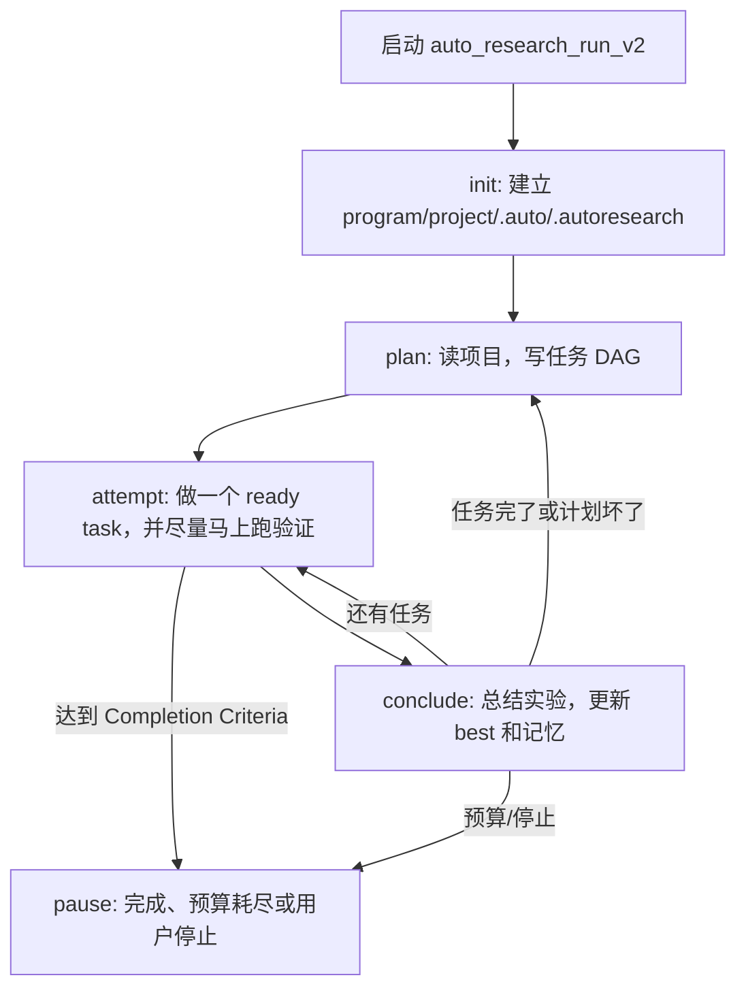

# AutoResearch 小学生版报告

这份报告说明当前 `autoresearch/` 框架在做什么、怎么跑、每一步看什么上下文、能用什么工具、最后会写出什么文件。

你可以把 AutoResearch 想成一个会做实验作业的小队伍。它不会一次聊天把所有事情做完，而是按固定节奏反复做：

```text
看题目 -> 做计划 -> 改一点或跑一次 -> 看分数 -> 记住结果 -> 再决定下一步
```

它最重要的目标是：让 LLM 不靠脑子记住全部历史，而是把重要信息写到项目文件里，下次从文件继续。

---

## 1. 现在代码在哪里

当前主入口在：

```text
autoresearch/tool.py
```

R-Agent 工具注册入口仍然在：

```text
tools/autoresearch_tool.py
```

但这个文件只是一个门牌。真正实现都在 `autoresearch/` 包里。

当前核心文件大概这样分工：

| 文件 | 小学生版解释 | 负责什么 |
|---|---|---|
| `autoresearch/tool.py` | 开关 | 注册和启动 `auto_research_run_v2` |
| `autoresearch/controller.py` | 总调度员 | 控制 `plan -> attempt -> conclude` |
| `autoresearch/planner.py` | 计划员 | 读项目，生成任务 DAG |
| `autoresearch/execution.py` | 干活入口 | 处理 Execute 阶段的任务 |
| `autoresearch/run_handler.py` | 跑分员 | 跑 train/eval，读取 metric |
| `autoresearch/diagnostics.py` | 诊断员 | 生成失败分析、eval 摘要、metric 摘要 |
| `autoresearch/runtime_policy.py` | 工具规则表 | 规定每个 step 能用哪些工具 |
| `autoresearch/state/` | 记忆文件夹 | todo、phase、completion、experiment memory、regression cases |
| `autoresearch/observability/` | 观察文件夹 | monitor、debug、budget、timeout |
| `autoresearch/legacy/` | 老工具箱 | 旧 loop、action、patch、git、runner、step agent 等可复用能力 |

以前很多文件叫 `autoresearch/autoresearch_*.py`，现在已经删掉了。读代码时直接看上面这些新文件。

---

## 2. 项目里有哪些重要文件

AutoResearch 运行时，会在目标项目里读写这些文件：

| 文件 | 谁看 | 作用 |
|---|---|---|
| `program.md` | LLM + 框架 | 题目说明、允许改什么、不能改什么、完成标准 |
| `project.md` | 框架 | 当前 phase、短期计划、最近结论 |
| `.autoresearch/todo_state.json` | 框架 | 机器可读任务 DAG |
| `.autoresearch/state.json` | 框架 | 实验记录、best、Pareto、历史观察 |
| `.autoresearch/experiment_memory.json` | LLM + 框架 | 压缩后的实验记忆 |
| `.autoresearch/regression_cases.json` | LLM + 框架 | 当前必须关注的失败样例和不回退要求 |
| `.autoresearch/monitor.json` | 用户 | 当前跑到哪一步 |
| `.autoresearch/debug/debug.jsonl` | 用户 | 事件流水账 |
| `.autoresearch/debug/inflight.json` | 用户 | 当前卡在哪个 LLM 或 shell |
| `.autoresearch/artifacts/` | 用户 + 框架 | 长日志、LLM trace、shell 输出、patch 记录 |
| `.auto/survey.md` | LLM + 用户 | 初始项目观察 |
| `.auto/plan.md` | LLM + 用户 | 人可读计划 |
| `.auto/failure_digest.md` | LLM + 用户 | 当前失败样例和机械诊断 |
| `.auto/eval_contract.md` | LLM + 用户 | eval.py 怎么评分 |
| `.auto/run_report.md` | LLM + 用户 | 最近一次 run/eval 结果 |

简单说：

```text
program.md = 题目
project.md = 当前进度本
todo_state.json = 机器任务清单
state.json = 实验历史
experiment_memory.json = 给 LLM 看的压缩实验记忆
failure_digest.md = 失败原因小抄
monitor/debug = 给人排查用
```

---

## 3. 总流程

AutoResearch 当前主循环只有三步：

```text
plan -> attempt -> conclude -> plan / attempt / pause
```

Mermaid 图：



---

## 4. Step 1: Plan

### Plan 像什么

Plan 像小组里的“计划员”。它先看题目和项目，然后决定接下来做哪些任务。

### Plan 主要做什么

Plan 会：

1. 读 `program.md`
2. 读 `project.md`
3. 读重要项目文件，比如 `README.md`、`train/train.py`、`eval.py`、`eval.sh`
4. 读 `.autoresearch/experiment_memory.json`
5. 读 `.auto/failure_digest.md`
6. 生成任务 DAG，写到 `.autoresearch/todo_state.json`
7. 写一份人能读的计划到 `.auto/plan.md`

### Plan 输入上下文

Plan 通常会看到：

```text
program.md
project.md
README.md
train/train.py
train/train.sh
eval.py
eval.sh
.autoresearch/experiment_memory.json
.autoresearch/regression_cases.json
.auto/failure_digest.md
.auto/eval_contract.md
```

### Plan 输出

Plan 输出：

```text
.autoresearch/todo_state.json
.auto/plan.md
project.md 里的当前计划
```

一个任务 DAG 例子：

```json
{
  "tasks": [
    {
      "task_id": "inspect_failures",
      "type": "analysis",
      "status": "pending"
    },
    {
      "task_id": "patch_solution",
      "type": "implementation",
      "depends_on": ["inspect_failures"],
      "status": "pending"
    },
    {
      "task_id": "official_eval",
      "type": "validation",
      "depends_on": ["patch_solution"],
      "run_spec": {
        "commands": ["bash train/train.sh", "bash eval.sh", "cat metrics.json"]
      }
    }
  ]
}
```

### Plan 可以用哪些 tools

Plan 允许的工具：

```text
read_file
search_files
artifact_inspect
artifact_search
artifact_slice
skill_search
skill_view
todo_manage
delegate_task
```

Plan 的 child agent 只允许读和调研，不允许写代码：

```text
read_file
search_files
artifact_inspect
artifact_search
artifact_slice
skill_search
skill_view
todo_manage
```

Plan 可以用的 skill：

```text
codebase_scout
```

### Plan 不能做什么

Plan 不应该直接大规模改代码。它的职责是做计划，不是亲自干活。

---

## 5. Step 2: Attempt

### Attempt 像什么

Attempt 像真正干活的人。它一次只拿一个 ready task，读文件、改代码、跑命令。

### Attempt 主要做什么

Attempt 会：

1. 读 `.autoresearch/todo_state.json`
2. 找一个 ready task
3. 如果是 analysis，就读文件并写分析
4. 如果是 implementation，就让 LLM 写文件或 patch
5. 如果有 ready validation，就马上跑 train/eval
6. 把执行结果写回 task 的 `last_result`
7. 写 `.auto/execute_report.md`
8. 写 `.auto/run_report.md`

### Attempt 输入上下文

Attempt 会看到：

```text
当前 ready task
task last_result
program.md
project.md
todo_state.json
state.json
experiment_memory.json
regression_cases.json
eval_contract.md
failure_digest.md
相关源码片段
上次行为检查 artifact
```

尤其重要的是：

```text
.autoresearch/experiment_memory.json
.autoresearch/regression_cases.json
.auto/failure_digest.md
```

这些告诉 LLM：

- 当前 best 是多少
- 之前哪些尝试有效
- 现在剩哪些失败样例
- 不要重复已经失败的方向

### Attempt 输出

Attempt 可能输出：

```text
修改后的源码
.auto/execute_report.md
.auto/run_report.md
.auto/execute_validation.md
.autoresearch/artifacts/*
.autoresearch/todo_state.json 更新
metrics.json 更新
```

### Attempt 可以用哪些 tools

Attempt 允许的工具：

```text
read_file
search_files
write_file
run_command
artifact_inspect
artifact_search
artifact_slice
skill_search
skill_view
todo_manage
delegate_task
```

Attempt 的 child agent 可以读、写、跑命令：

```text
read_file
search_files
write_file
run_command
artifact_inspect
artifact_search
artifact_slice
skill_search
skill_view
todo_manage
```

Attempt child 不允许递归 delegate，防止无限套娃。

### Attempt 写代码有两种方式

第一种：完整写文件。

```json
{
  "path": "solution.py",
  "content": "完整文件内容"
}
```

第二种：写多个文件。

```json
{
  "files": [
    {
      "path": "train/train.py",
      "content": "完整文件内容"
    },
    {
      "path": "solution.py",
      "content": "完整文件内容"
    }
  ]
}
```

当前小补丁策略只是 prompt 建议，不是硬限制：

```text
如果只剩少量失败，优先小补丁；
但如果确实需要重写，也允许 LLM 大改。
```

---

## 6. Step 3: Run

Run 其实属于 Attempt 里的证据收集部分，代码在：

```text
autoresearch/run_handler.py
```

### Run 像什么

Run 像考试。它负责跑训练和评测，看分数有没有变好。

### Run 做什么

Run 会：

1. 找 ready 的 validation task
2. 读取 task 的 `run_spec`
3. 运行命令
4. 读取 `metrics.json`
5. 记录 experiment
6. 判断是否 solved

常见 run spec：

```json
{
  "mode": "single",
  "commands": [
    "bash train/train.sh",
    "bash eval.sh",
    "cat metrics.json"
  ]
}
```

如果 task 只写了：

```text
bash train/train.sh
```

并且项目有 `eval.sh`，框架会自动补：

```text
bash eval.sh
cat metrics.json
```

避免只跑 train 却不刷新 metric。

### Run 的输入

```text
run_spec
program.md Completion Criteria
metrics.json
state.json
best experiment
```

### Run 的输出

```text
metrics.json
results.tsv
.autoresearch/state.json 里的 experiments
.autoresearch/best.json
.autoresearch/pareto_front.json
.auto/run_report.md
```

---

## 7. Step 4: Conclude

### Conclude 像什么

Conclude 像老师批改作业。它不主要写代码，而是看结果、记账、决定下一步。

### Conclude 做什么

Conclude 会：

1. 看最新 experiment
2. 更新 best experiment
3. 更新 Pareto front
4. 写 lessons
5. 写 experiment memory
6. 必要时恢复 best source snapshot
7. 刷新 metrics
8. 决定下一步是：
   - 继续 attempt
   - 回到 plan
   - pause

### Conclude 输入

```text
state.json
todo_state.json
metrics.json
budget.json
gate signals
experiment artifacts
lessons
```

### Conclude 输出

```text
.autoresearch/best.json
.autoresearch/pareto_front.json
.autoresearch/active_context.md
.autoresearch/experiment_memory.json
.autoresearch/experiment_memory.md
.autoresearch/lessons.jsonl
project.md phase 更新
monitor.json 更新
```

### Conclude 可以用哪些 tools

```text
read_file
search_files
write_file
artifact_inspect
artifact_search
artifact_slice
todo_manage
```

Conclude child tools：

```text
read_file
search_files
write_file
artifact_inspect
artifact_search
artifact_slice
todo_manage
```

---

## 8. Completion Criteria 是什么

每个项目自己的 `program.md` 里会写完成标准。

例如：

```md
## Completion Criteria

This project is solved only when the official evaluation in `metrics.json` reports:

- `metric_name`: `score`
- `higher_is_better`: `true`
- `score >= 0.99`
```

框架会机械读取这个标准。

它不会让 LLM 自己说“我觉得完成了”。

判断逻辑在：

```text
autoresearch/state/completion.py
```

---

## 9. experiment_memory 是什么

`experiment_memory` 是最近新增的压缩实验记忆。

它解决的问题是：不能每次都把所有 debug log 塞给 LLM。

它会记录：

```text
当前 metric
best metric
best snapshot
最近尝试过的实验
哪些方向有效
哪些方向回退
当前剩余 failures
下一步建议
```

示意：

```json
{
  "current": {
    "metric_name": "score",
    "metric": 0.82
  },
  "best": {
    "experiment_id": "exp-0002",
    "metric": 0.82,
    "source_snapshot_path": "..."
  },
  "remaining_failures": [],
  "guidance": [
    "Start the next patch from the best snapshot."
  ]
}
```

LLM 应该优先看它，而不是翻几十个 artifact。

---

## 10. regression_cases 是什么

`regression_cases` 是当前失败样例和不回退要求的机器小抄。

文件：

```text
.autoresearch/regression_cases.json
```

它会记录：

```text
是否 closeout
当前 metric
best metric
must_fix cases
must_not_regress
instructions
```

现在它不是硬限制，只是上下文提示。

也就是说：

```text
框架提醒 LLM：最好小补丁；
但不会强制禁止大改。
```

这是因为强制限制会伤害探索能力。

---

## 11. diagnostics 做什么

诊断模块在：

```text
autoresearch/diagnostics.py
```

它负责生成：

```text
.auto/eval_contract.md
.auto/failure_digest.md
.autoresearch/regression_cases.json
```

它会尽量把失败变成可读证据。

例如 CSV 任务会生成：

```text
row_000 email:
actual   = alicesmith0@example.com
expected = alice.smith0@example.com
```

Log anomaly 任务会生成：

```text
false-negative candidates:
status=503
latency_ms=2500
oom_kill_risk=true
```

Unicode decode 任务会补充：

```text
repr(...)
codepoints(...)
```

这样 LLM 不是只看到“分数低”，而是看到“具体哪里错”。

---

## 12. 当前框架能力总结

现在 AutoResearch 已经能做：

```text
1. 初始化项目状态
2. 读取 program.md 完成标准
3. 生成任务 DAG
4. 按 DAG 执行 analysis / implementation / validation
5. 让 LLM 写代码
6. 跑 train/eval
7. 解析 metrics.json
8. 自动判断 solved
9. 记录 best / experiments / artifacts
10. 生成 failure digest
11. 生成 experiment memory
12. 在后台监控运行状态
13. 支持 stop/resume
14. 支持 debug/inflight 排查
```

---

## 13. 当前已知问题

当前框架还不是完美自动研究系统。

已知问题：

1. **有时 plan 太多**

LLM 会生成很多 inspect / record / validate task，真正 patch 的次数不够。

2. **失败样例还没有完全变成可执行测试**

现在 `regression_cases.json` 只是提示，下一步应该生成真正的：

```text
.autoresearch/regression_check.py
```

3. **performance 问题和 failure 问题还需要分开**

例如：

```text
accuracy = 1.0
score < 0.99
```

这不是修失败样例，而是性能优化。

4. **某些任务还依赖 LLM 自己猜规则**

例如：

```text
csv_cleaner
json_repair_micro
log_anomaly_f1
```

这些需要更强的任务专用诊断和 regression test。

---

## 14. 最短阅读路线

如果你只想看懂框架，按这个顺序读：

```text
1. autoresearch/README.md
2. autoresearch/tool.py
3. autoresearch/controller.py
4. autoresearch/runtime_policy.py
5. autoresearch/planner.py
6. autoresearch/execution.py
7. autoresearch/run_handler.py
8. autoresearch/diagnostics.py
9. autoresearch/state/experiment_memory.py
10. autoresearch/state/regression.py
```

如果你想看旧 loop 工具箱：

```text
autoresearch/legacy/
  loop.py
  services.py
  types.py
  context.py
  progress.py
  planners.py
```

---

## 15. 一句话总结

AutoResearch 现在是一个文件驱动的三步实验循环：

```text
Plan 负责想清楚任务；
Attempt 负责改一点和跑验证；
Conclude 负责看结果、记录 best、决定继续还是停止。
```

它的核心思想是：

```text
LLM 负责想办法；
框架负责记忆、验证、记账、判断 solved。
```

