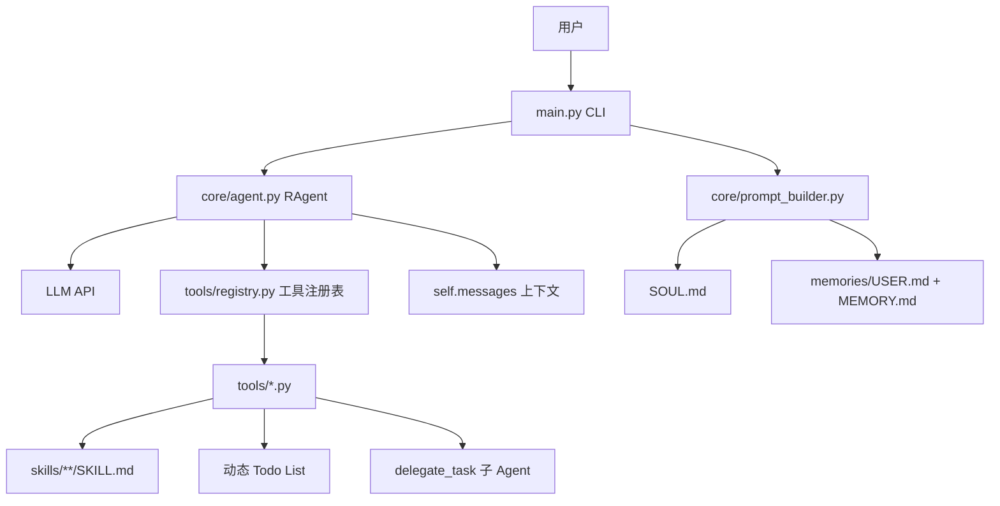
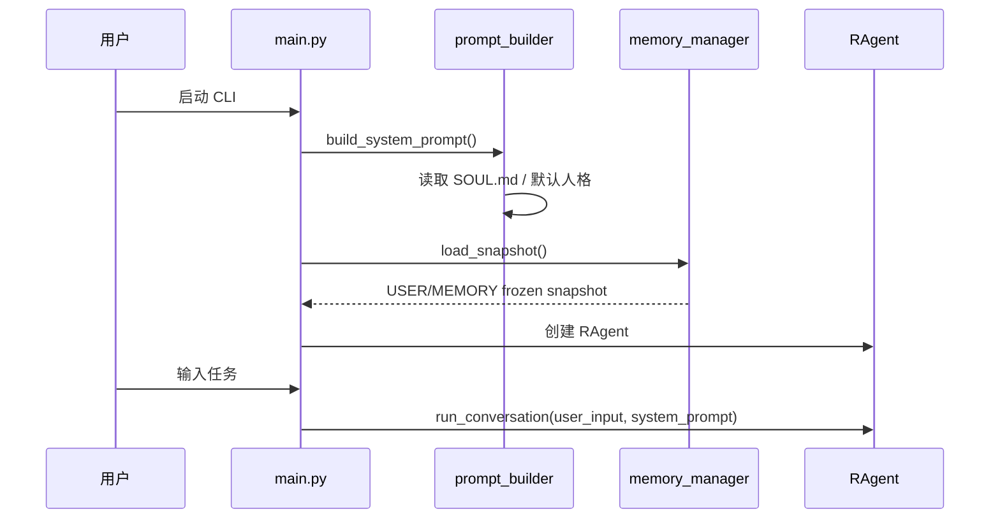
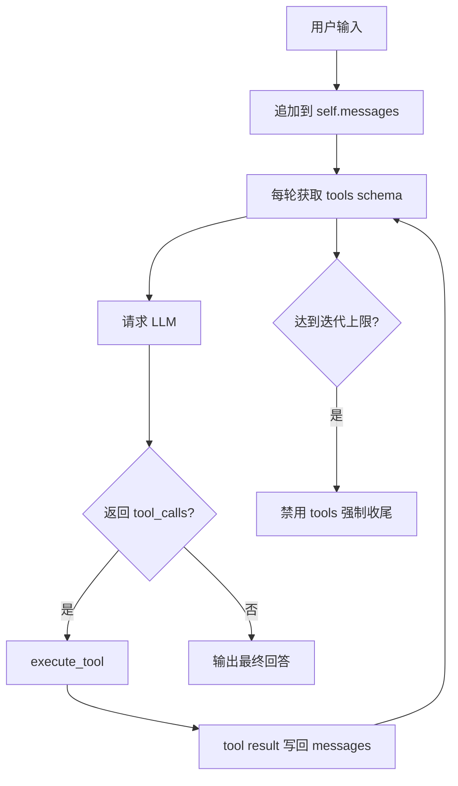
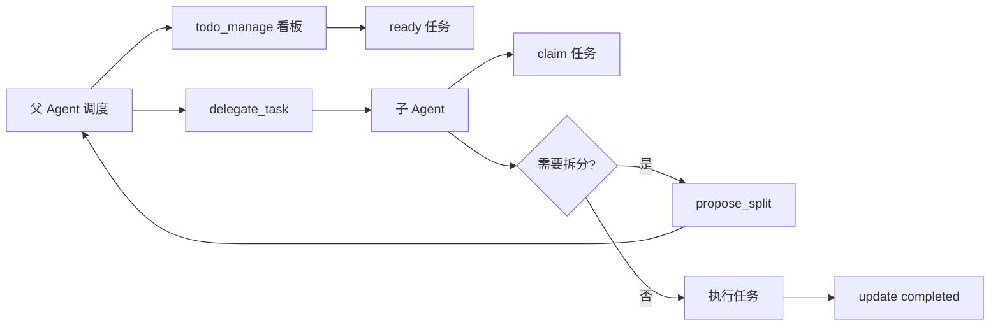

# Maintain Project Overview

## When to Use

当用户要求“更新项目介绍文件”“梳理当前项目架构”“让我重新理解 R-Agent 项目”“准备维护/重构前先更新项目说明”“项目变复杂了帮我整理说明”等任务时，使用本技能。

本技能的目标是：维护一份**足够详细、通俗易懂、可持续更新的项目介绍文件**，帮助用户始终理解 R-Agent 当前架构、功能边界、运行逻辑和复杂度来源，防止项目在持续交给 Agent 修改后朝着用户不理解、不可维护的方向发展。

默认项目介绍文件路径：

```text
项目介绍.md
```

如果用户指定了其他路径，以用户指定为准。

## Core Principle

项目介绍文件不是营销 README，而是“项目地图 + 架构说明书 + 维护认知锚点”。

它必须回答：

1. 这个项目是做什么的？
2. 当前有哪些核心模块？
3. 用户一次请求进入系统后，完整执行链路是什么？
4. Agent 每轮调用能看到哪些上下文？
5. tools、skills、memory、todo、delegate、voice、file、terminal 等系统如何协作？
6. 哪些地方是关键复杂度来源？
7. 后续维护时哪些边界不能随便打破？
8. 如果用户重启项目维护，如何快速重新理解全局？

## Required Workflow

### 1. 必须先调用子 Agent 通读项目

当用户要求更新项目介绍文件时，主 Agent 不应只凭当前上下文或记忆直接写。

必须调用 `delegate_task` 创建一个子 Agent，任务是：

- 通读当前项目代码；
- 理解所有主要目录、核心模块、工具、skills、memory、Agent loop、CLI 入口、配置、测试、outputs 文档；
- 梳理运行逻辑和模块依赖；
- 找出最近新增/变化的复杂点；
- 输出结构化项目理解报告。

推荐委托任务模板：

```text
你是项目架构审计子 Agent。请在当前 R-Agent 仓库中进行只读分析，通读项目代码和关键文档，理解所有主要功能、目录结构、运行链路、模块依赖和维护风险。不要修改文件。

重点输出：
1. 项目定位和一句话解释；
2. 目录结构与每个目录职责；
3. CLI 启动到 Agent Loop 的完整链路；
4. system prompt、messages、tools、skills、memory、todo、delegate_task、上下文压缩、语音工具等机制；
5. 所有已注册工具及分类；
6. skills 系统结构和典型 skill；
7. memory 系统和持久化规则；
8. 子 Agent / todo 动态任务协议；
9. 当前实现中容易误解、复杂或有风险的地方；
10. 建议写入 项目介绍.md 的 Mermaid 图和思维树结构。

请引用关键文件路径和函数/类名，输出结构化 Markdown 报告。
```

调用示例：

```json
{
  "tasks": "[{\"goal\": \"<上面的完整任务描述>\", \"worker_id\": \"project-overview-auditor\", \"max_iterations\": 30}]",
  "max_workers": 1,
  "default_max_iterations": 30
}
```

### 2. 主 Agent 读取子 Agent 报告并补充验证

子 Agent 返回后，主 Agent 需要：

1. 阅读子 Agent 报告；
2. 对关键结论做必要抽查，例如读取：
   - `main.py`
   - `core/agent.py`
   - `core/prompt_builder.py`
   - `core/memory.py`
   - `core/skills.py`
   - `tools/registry.py`
   - `tools/delegate_tool.py`
   - `tools/context_tool.py`
   - `README.md`
   - `上下文.md`
   - `outputs/agent_memory_maintenance_progress.md`（若存在）
3. 若子 Agent 报告与源码矛盾，以源码为准；
4. 不要把未经验证的猜测写成事实。

### 3. 更新项目介绍文件

默认更新：

```text
项目介绍.md
```

文档必须尽量通俗易懂，但也要足够细致。建议结构如下。

## Recommended Document Structure

### 0. 文档说明

- 生成/更新日期；
- 适用项目；
- 本文目的；
- 如何阅读本文。

### 1. 一句话介绍

用普通话解释项目是什么，例如：

```text
R-Agent 是一个可自我维护、可调用工具、可管理长期记忆和技能的命令行智能体框架。
```

### 2. 项目心智模型

必须包含一个通俗比喻，例如：

```text
把 R-Agent 想成一个有大脑、工具箱、长期笔记本、技能库、任务看板和分身助手的命令行工作台。
```

### 3. 总体架构 Mermaid 图

必须包含至少一张总览图：



### 4. 目录结构说明

用表格列出主要目录/文件：

| 路径 | 职责 | 维护注意事项 |
|---|---|---|
| `main.py` | CLI 入口 | 不要把复杂业务都塞进 CLI |
| `core/agent.py` | Agent Loop | 修改会影响每轮上下文和工具调用 |
| `tools/` | 工具系统 | 工具必须注册 schema，注意安全边界 |
| `skills/` | 技能库 | 稳定流程写 skill，不写进 memory |
| `memories/` | 长期记忆 | 不保存临时进度或敏感信息 |
| `outputs/` | 调研/维护输出 | 可保存阶段性维护文档 |
| `tests/` | 测试 | 维护后尽量跑相关测试 |

### 5. 启动链路

说明从 `python main.py` 或启动 CLI 到用户输入的流程。

建议包含 sequenceDiagram：



### 6. Agent Loop 运行逻辑

必须解释：

- `RAgent.messages` 如何累积；
- 每轮如何调用 `registry.get_all_schemas()`；
- tool call 如何执行；
- tool result 如何回写 messages；
- 何时强制收尾；
- 迭代预算如何影响行为。

建议包含 flowchart：



### 7. 上下文系统

必须说明：

- system prompt 来源；
- user/assistant/tool messages；
- tools schema；
- skill 默认不可全文可见，需要按需读取；
- memory 启动 frozen snapshot 与实时工具读取的区别；
- hidden reasoning 不会保存；
- slash command 不进入 Agent 上下文；
- 子 Agent 不继承父 Agent messages。

如果存在 `上下文.md`，要参考并链接它。

### 8. 工具系统

必须列出当前工具注册机制：

- `tools/registry.py` 如何热加载；
- `registry.register()` 参数；
- `execute_tool()` 如何调用 handler；
- 工具结果如何返回 JSON；
- 高风险工具注意事项。

建议按类别列工具，例如：

- 文件工具；
- 终端工具；
- Web 工具；
- Memory 工具；
- Skill 工具；
- Todo/Delegate 工具；
- 语音工具；
- 系统维护工具。

### 9. Skill 系统

必须说明：

- `skills/**/SKILL.md` 结构；
- 层次化 skill 查询；
- 何时创建 skill；
- skill 与 memory 的区别；
- 维护 skill 的原则。

### 10. Memory 系统

必须说明：

- USER.md 和 MEMORY.md 的区别；
- frozen snapshot；
- memory 工具写入当前会话不自动刷新 system prompt；
- 不保存临时进度；
- 不保存敏感信息。

### 11. Todo 与子 Agent 协议

必须说明用户偏好的复杂任务协议：

- 父进程维护动态 todo list；
- 子进程只领取可执行任务；
- 子进程先判断是否需要拆分；
- 需要拆分只提出 proposal；
- 父进程 approve/reject；
- 子进程上下文隔离。

建议包含依赖图：



### 12. 已知复杂点 / 风险点

必须诚实记录当前容易误解或可能失控的地方，例如：

- 工具热加载让工具变更很灵活，但也增加调试复杂度；
- messages 当前可能持续增长；
- `archive_subtask` 若描述与实现不一致，要明确标注；
- 子 Agent 上下文隔离要求 goal 必须自包含；
- memory 与 skill 边界要清楚；
- README、项目介绍、outputs 维护文档之间职责要避免混乱。

### 13. 维护边界和设计原则

建议写入：

1. CLI 层只做交互和展示，不堆复杂业务；
2. Agent Loop 修改必须谨慎；
3. 工具必须有明确 schema、权限和错误返回；
4. 稳定偏好进 memory，流程进 skill，临时进度进 outputs；
5. 复杂任务必须用 todo/delegate 协议；
6. 每次升级/重构/准备 push 要同步 README 更新日志；
7. 项目介绍文件要定期更新，作为用户理解项目的锚点。

### 14. 思维树

必须包含树状结构，帮助用户快速理解：

```text
R-Agent
├── 入口层
│   └── main.py：CLI、slash command、状态展示
├── 核心 Agent 层
│   └── core/agent.py：messages、tools、loop、收尾
├── 上下文层
│   ├── SOUL.md
│   ├── memories/
│   ├── skills/
│   └── tool results
├── 工具层
│   ├── registry.py
│   └── tools/*.py
├── 任务调度层
│   ├── todo_manage
│   └── delegate_task
└── 维护文档层
    ├── README.md
    ├── 上下文.md
    ├── 项目介绍.md
    └── outputs/*.md
```

### 15. 最近更新摘要

如果能从 git diff、README、outputs 或最近文档中可靠判断，应写入“最近架构变化”。无法可靠判断时，明确写“未做 git 历史审计”。

## Verification

更新完项目介绍文件后，必须验证：

1. 文件存在；
2. 行数非空；
3. 至少包含：
   - 总体架构图；
   - 运行链路图；
   - 思维树；
   - 目录结构表；
   - Agent Loop 说明；
   - 上下文系统说明；
   - 工具/skill/memory/todo/delegate 说明；
   - 复杂点和维护原则。

可用命令示例：

```bash
wc -l 项目介绍.md
grep -n '^##\|```mermaid\|R-Agent' 项目介绍.md | head -120
```

## Final Response

最终回复用户时只需简洁说明：

- 已调用子 Agent 通读项目；
- 已更新哪个项目介绍文件；
- 文档包含哪些核心内容；
- 如发现实现不一致或维护风险，列出最重要的 1-3 条。

## Important Boundaries

- 不要凭记忆更新项目介绍；必须基于子 Agent 项目通读报告和必要源码抽查。
- 不要把无法验证的推测写成事实。
- 不要把临时会话进度写入 memory；项目介绍文件是当前架构事实，不是任务日志。
- 如果用户是在进行升级/重构/准备 git push，同时还要按用户长期偏好更新 `README.md` 的日期更新日志。
- 如果项目介绍文件和源码不一致，以源码为准，并在文档中更新到当前事实。
