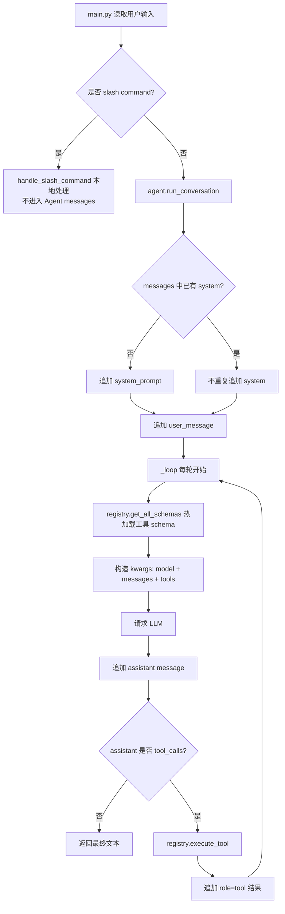

# R-Agent 每轮 Agent 调用上下文说明

> 日期：2026-06-12  
> 范围：本文基于当前仓库源码梳理，重点回答：**每一轮调用大模型/Agent 时，Agent 能看到哪些上下文？这些上下文在具体文件中如何实现？**  
> 关键结论：当前 R-Agent 每轮模型调用的直接输入主要是 `messages` + `tools`。`system prompt`、对话历史、工具调用结果、memory 快照、按需读取的 skill 内容，最终都会以不同方式进入 `messages` 或 `tools schema`。

---

## 1. 一句话总览

当前实现里，每一轮真正发给 LLM 的内容在 `core/agent.py` 的 `_loop()` 中构造：

```python
kwargs = {"model": self.model, "messages": self.messages}
if tools:
    kwargs["tools"] = tools
```

对应源码位置：

- `core/agent.py:241-249`

也就是说，每轮模型调用主要看到：

1. `messages=self.messages`：系统提示、用户输入、历史 assistant 输出、历史工具结果、软提醒/强制收尾提示。
2. `tools=registry.get_all_schemas()`：当前所有注册工具的 JSON schema。
3. `model=self.model`：模型名，不是语义上下文，但影响推理模型。

---

## 2. 每轮调用时 Agent 可以看到哪些东西？

| 类型 | 每轮是否可见 | 以什么形式可见 | 关键实现文件 |
|---|---:|---|---|
| 系统提示词 | 是，但只在会话首次注入到 messages | `role=system` 消息 | `main.py`、`core/prompt_builder.py`、`core/agent.py` |
| 当前用户输入 | 是 | `role=user` 消息 | `core/agent.py` |
| 历史对话 | 是 | `self.messages` 中累计的 user/assistant 消息 | `core/agent.py` |
| 工具 schema | 是，每轮重新获取 | OpenAI function tools schema | `tools/registry.py`、`core/agent.py` |
| 工具调用结果 | 是，调用后下一轮可见 | `role=tool` 消息 | `core/agent.py` |
| Skill 名称/描述 | 是，以工具 schema 和按需工具返回可见 | `skill_categories` / `skills_by_category` / `skills_list` 工具结果 | `core/skills.py`、`tools/skills_tool.py`、`tools/skill_hierarchy_tool.py` |
| Skill 全文 | 默认不可见；调用 `skill_view` 后可见 | `role=tool` 消息中的 SKILL.md 内容 | `tools/skills_tool.py` |
| Memory 快照 | 会话启动时可见 | system prompt 末尾的 `<user_preferences>` / `<environmental_memory>` | `main.py`、`core/memory.py` |
| Memory 实时文件内容 | 默认不自动刷新；调用工具后可见 | `memory_search` / `memory_get` 的工具结果 | `tools/memory_read_tool.py` |
| 本轮隐藏思考链 | 不可见/不保存 | 当前代码不读取或保存模型隐藏 reasoning | `core/agent.py` |
| assistant 工具调用意图 | 可见 | assistant message 中的 `tool_calls` 被追加到 `self.messages` | `core/agent.py` |
| CLI 状态动画/思考第几轮 | 不可见 | 只是 `on_think` 回调更新终端 UI | `main.py` |
| 子 Agent 的父对话历史 | 不可见 | 子 Agent 新建 `RAgent()`，只收到自包含 goal | `tools/delegate_tool.py` |

---

## 3. 真实调用链：从用户输入到模型请求

### 3.1 CLI 主循环接收用户输入

文件：`main.py`

关键位置：

- `main.py:280-291`：创建 `RAgent()`，构建 `system_prompt`。
- `main.py:296-317`：循环读取用户输入，并拦截本地 slash command。
- `main.py:361-368`：调用 `agent.run_conversation(...)`。

核心代码：

```python
agent = RAgent()
system_prompt = (
    build_system_prompt()
    + "\n\n【重要提示：自我进化能力】\n"
    + "..."
    + memory_manager.load_snapshot()
)
```

然后每次普通用户输入会调用：

```python
response = agent.run_conversation(
    user_input,
    system_message=system_prompt,
    on_think=on_think,
    on_tool_start=on_tool_start,
    on_tool_end=on_tool_end
)
```

### 3.2 Agent 将 system/user 放入 messages

文件：`core/agent.py`

关键位置：

- `core/agent.py:173-180`

```python
def run_conversation(self, user_message: str, system_message: str = None, ...):
    if system_message and not any(m.get("role") == "system" for m in self.messages):
        self.messages.append({"role": "system", "content": system_message})

    self.messages.append({"role": "user", "content": user_message})
```

注意：`system_message` 不是每次都追加。只有 `self.messages` 中还没有 `role=system` 时才追加。

所以：

- 同一个 CLI 进程里，第一次普通对话会注入 system prompt。
- 后续用户输入只追加新的 `role=user`。
- 如果运行期间修改了 `SOUL.md` 或 memory 文件，已注入的 system prompt 不会自动变化。

### 3.3 每轮 LLM 调用前获取工具 schema

文件：`core/agent.py`

关键位置：

- `core/agent.py:241-249`

```python
tools = registry.get_all_schemas()
if excluded:
    tools = [
        schema for schema in tools
        if schema.get("function", {}).get("name") not in excluded
    ]
kwargs = {"model": self.model, "messages": self.messages}
if tools:
    kwargs["tools"] = tools
```

这表示每一轮模型调用都重新拿一次工具列表，并把工具 schema 传给模型。

---

## 4. `messages` 里具体会累计什么？

`self.messages` 是 R-Agent 当前会话最核心的上下文容器。

文件：`core/agent.py`

初始化位置：

- `core/agent.py:86`

```python
self.messages = []
```

### 4.1 system 消息

来源：`main.py` 构建出的 `system_prompt`。

注入位置：

- `core/agent.py:177-178`

```python
self.messages.append({"role": "system", "content": system_message})
```

system 消息包含：

1. `SOUL.md` 或默认身份；
2. 工具使用强制规则；
3. 执行纪律；
4. memory 使用规则；
5. skills 使用规则；
6. 自我进化能力提示；
7. memory frozen snapshot。

### 4.2 user 消息

来源：用户每次输入。

注入位置：

- `core/agent.py:180`

```python
self.messages.append({"role": "user", "content": user_message})
```

续跑时也会追加一条 user 风格的指令：

- `core/agent.py:203-210`

```python
self.messages.append({
    "role": "user",
    "content": "【用户决定扩展 ...】请基于上面的「未完成事项」继续推进...",
})
```

### 4.3 assistant 消息

每次模型返回后都会加入历史：

- `core/agent.py:265-266`

```python
message = response.choices[0].message
self.messages.append(message)
```

如果 assistant 返回的是最终文本，后续用户轮次也能看到这段历史回答。

如果 assistant 返回的是工具调用，`tool_calls` 也在这个 assistant message 里被保存。

### 4.4 tool 消息

工具执行完成后，会把工具结果追加进去：

- `core/agent.py:288-293`

```python
self.messages.append({
    "role": "tool",
    "tool_call_id": tool_call.id,
    "name": func_name,
    "content": result,
})
```

因此：

- 工具结果不是只展示给用户；
- 它会进入模型下一轮上下文；
- 后续轮次可继续引用之前工具输出。

### 4.5 软提醒 system 消息

当迭代达到软阈值时，会追加一条 system 提醒：

- `core/agent.py:129-136`
- `core/agent.py:235-239`

```python
warn = f"【系统提醒】你已使用 {used}/{total} 轮思考预算..."
self.messages.append({"role": "system", "content": warn})
```

这条提醒会被后续模型调用看到。

### 4.6 强制收尾 system 消息

达到最大迭代次数时，会追加强制收尾提示，并禁用工具再请求一次模型：

- `core/agent.py:138-168`
- `core/agent.py:300-302`

```python
self.messages.append({"role": "system", "content": finalize_hint})
response = self._chat_completion_with_retry(
    model=self.model,
    messages=self.messages,
)
```

这一次没有传 `tools`，所以模型只能输出文本。

---

## 5. System Prompt 从哪里来？

### 5.1 `build_system_prompt()`

文件：`core/prompt_builder.py`

关键位置：

- `core/prompt_builder.py:210-238`

```python
def build_system_prompt(agent_tools=None) -> str:
    ensure_default_soul_md()
    parts = []

    soul_content = load_soul_md()
    if soul_content:
        parts.append(soul_content)
    else:
        parts.append(DEFAULT_AGENT_IDENTITY)

    parts.append(TOOL_USE_ENFORCEMENT_GUIDANCE)
    parts.append(MODEL_EXECUTION_GUIDANCE)
    parts.append(MEMORY_GUIDANCE)
    parts.append(SKILLS_GUIDANCE)

    return "\n\n".join(parts)
```

它主要拼接：

1. 身份人格：优先 `SOUL.md`，否则用默认身份；
2. 工具使用强制规则；
3. 执行纪律；
4. Memory guidance；
5. Skills guidance。

### 5.2 `SOUL.md` 如何进入上下文？

文件：`core/prompt_builder.py`

关键位置：

- `core/prompt_builder.py:192-207`
- `core/prompt_builder.py:219-224`

```python
soul_content = load_soul_md()
if soul_content:
    parts.append(soul_content)
else:
    parts.append(DEFAULT_AGENT_IDENTITY)
```

`load_soul_md()` 会读取项目根目录的 `SOUL.md`。

同时它会做两类处理：

1. 可疑 prompt injection 扫描：`_scan_soul_content()`，位置 `core/prompt_builder.py:167-176`。
2. 长度截断：`_truncate_soul_content()`，位置 `core/prompt_builder.py:179-189`。

### 5.3 自我进化提示和中文回复约束

文件：`main.py`

关键位置：

- `main.py:284-290`

```python
system_prompt = (
    build_system_prompt()
    + "\n\n【重要提示：自我进化能力】\n"
    + "1. 更新技能(Skills)：..."
    + "2. 更新工具(Tools)：..."
    + "请始终使用中文回复用户。"
    + memory_manager.load_snapshot()
)
```

这部分不是 `core/prompt_builder.py` 生成，而是在 CLI 层额外拼接。

---

## 6. Tools 上下文：每轮都能看到哪些工具？

### 6.1 工具 schema 每轮动态热加载

文件：`tools/registry.py`

关键位置：

- `tools/registry.py:45-48`

```python
def get_all_schemas(self) -> List[Dict[str, Any]]:
    """获取所有已注册工具的 schema 列表，每次获取前自动热更新"""
    self.reload_all()
    return [tool["schema"] for tool in self._tools.values()]
```

`reload_all()` 会扫描 `tools/*.py` 并 import/reload：

- `tools/registry.py:29-43`

```python
self._tools.clear()
current_dir = os.path.dirname(os.path.abspath(__file__))
for file_path in glob.glob(os.path.join(current_dir, "*.py")):
    module_name = os.path.basename(file_path)[:-3]
    if module_name not in ["__init__", "registry"]:
        ... importlib.reload(...) 或 importlib.import_module(...)
```

因此：

- 每轮模型调用前都会刷新工具列表；
- 新增 `tools/*.py` 后，下一轮可能自动注册进来；
- 工具 schema 包括工具名、描述、参数结构。

### 6.2 工具如何注册？

文件：`tools/registry.py`

关键位置：

- `tools/registry.py:15-27`

```python
def register(self, name, description, parameters, handler):
    self._tools[name] = {
        "schema": {
            "type": "function",
            "function": {
                "name": name,
                "description": description,
                "parameters": parameters,
            }
        },
        "handler": handler
    }
```

每个工具模块 import 时会调用 `registry.register(...)`。

### 6.3 工具如何执行？

文件：`tools/registry.py`

关键位置：

- `tools/registry.py:50-70`

```python
def execute_tool(self, name: str, args_json: str) -> str:
    args = json.loads(args_json)
    handler = self._tools[name]["handler"]
    result = handler(**args)
    return json.dumps({"success": True, "result": result}, ensure_ascii=False)
```

执行结果再由 `core/agent.py` 包成 `role=tool` 消息放回 `self.messages`。

### 6.4 被排除的工具

`run_conversation()` 支持 `exclude_tools`。

文件：`core/agent.py`

关键位置：

- `core/agent.py:187`
- `core/agent.py:241-246`
- `core/agent.py:278-281`

如果某工具被排除：

1. 它的 schema 会从本轮 `tools` 中移除；
2. 即使模型仍然调用，也会返回“工具已禁用”。

子 Agent 中会用到这个能力，见 `tools/delegate_tool.py:93-100`。

---

## 7. Skill 上下文：默认不是全文注入，而是按需加载

### 7.1 Skill 管理器

文件：`core/skills.py`

关键位置：

- `core/skills.py:4-8`

```python
class SkillManager:
    """
    技能系统管理器 ...
    负责管理技能的渐进式加载：List (Tier 1) -> View (Tier 2) -> Load (Tier 3)
    """
```

当前实现里，skills 存放在项目根目录的 `skills/` 下：

- `core/skills.py:16-23`

### 7.2 模型每轮默认能看到什么？

每轮模型直接可见的是工具 schema，里面包含这些 skill 相关工具：

- `skills_list`
- `skill_view`
- `skill_create`
- `skill_delete`
- `skill_categories`
- `skills_by_category`
- `skill_relocate`

也就是说：

- 模型知道“有工具可以列出/读取 skill”；
- 但不自动看到所有 `SKILL.md` 的全文；
- 只有调用 skill 工具后，结果才进入 messages。

### 7.3 列出所有 skill

文件：`tools/skills_tool.py`

关键位置：

- `tools/skills_tool.py:5-7`

```python
def skills_list_tool() -> str:
    return json.dumps({"skills": skill_manager.list_skills()}, ensure_ascii=False)
```

`skill_manager.list_skills()` 在 `core/skills.py:29-76` 中实现，会递归扫描 `skills/**/SKILL.md`，返回名称和描述。

### 7.4 层次化 skill 查询

文件：`tools/skill_hierarchy_tool.py`

关键位置：

- `tools/skill_hierarchy_tool.py:64-76`：`skill_categories`
- `tools/skill_hierarchy_tool.py:79-103`：`skills_by_category`

这两个工具用于先看类目，再看某类目下的技能摘要，避免一次把所有技能展开。

### 7.5 读取某个 skill 全文

文件：`tools/skills_tool.py`

关键位置：

- `tools/skills_tool.py:9-14`

```python
def skill_view_tool(skill_name: str, file_path: str = None) -> str:
    return json.dumps({"content": skill_manager.view_skill(skill_name)}, ensure_ascii=False)
```

`skill_manager.view_skill()` 在 `core/skills.py:78-90` 中读取对应 `SKILL.md` 全文。

调用 `skill_view` 后，这个全文会作为工具结果进入 `self.messages`，后续模型轮次就能看到。

---

## 8. Memory 上下文：启动快照 + 实时工具读取

### 8.1 启动时 frozen snapshot

文件：`core/memory.py`

关键位置：

- `core/memory.py:219-222`

```python
def load_snapshot(self) -> str:
    """在 Agent/session 启动时冻结一次记忆快照。"""
    self._snapshot = self.read_memory_live()
    return self._snapshot
```

文件：`main.py`

关键位置：

- `main.py:284-291`

```python
system_prompt = (... + memory_manager.load_snapshot())
```

因此，`memories/USER.md` 和 `memories/MEMORY.md` 的内容会在 CLI 启动构建 system prompt 时被读取一次，并拼到 system prompt 末尾。

格式由 `_format_snapshot()` 决定：

- `core/memory.py:197-203`

```python
if user_content:
    snapshot += f"\n<user_preferences>\n{user_content}\n</user_preferences>\n"
if memory_content:
    snapshot += f"\n<environmental_memory>\n{memory_content}\n</environmental_memory>\n"
```

### 8.2 当前会话写 memory 后会马上进入 system prompt 吗？

不会。

文件：`tools/memory_tool.py`

关键位置：

- `tools/memory_tool.py:33-35`
- `tools/memory_tool.py:40-48`
- `tools/memory_tool.py:70-71`

工具描述和返回信息都明确说：

```text
写入会立即落盘，但当前会话的 system prompt 使用启动时 frozen snapshot；新记忆主要在未来会话可见。
```

所以：

- `memory` 工具写入后，当前模型能看到“工具返回的写入成功消息”；
- 但不会自动修改已在 `self.messages` 里的 system prompt；
- 未来新会话启动时，`load_snapshot()` 才会读到新内容。

### 8.3 当前会话如何实时读取 memory？

通过工具：

- `memory_search`
- `memory_get`

文件：`tools/memory_read_tool.py`

关键位置：

- `tools/memory_read_tool.py:17-24`
- `tools/memory_read_tool.py:27-34`

它们调用：

- `core/memory.py:307-347`：`search_memory()`
- `core/memory.py:349-389`：`get_memory()`

调用后，工具结果会进入 `self.messages`。

---

## 9. 对话历史：会一直累积吗？

是的，当前主 Agent 实现中，`self.messages` 会一直累积，直到进程结束或新建 `RAgent()`。

文件：`core/agent.py`

关键点：

- 初始化：`core/agent.py:86`
- user 追加：`core/agent.py:180`
- assistant 追加：`core/agent.py:266`
- tool 追加：`core/agent.py:288-293`
- soft warning 追加：`core/agent.py:136`
- finalize hint 追加：`core/agent.py:151`

当前没有看到自动裁剪 `self.messages` 的逻辑。

---

## 10. “思考”上下文：哪些能看到，哪些不能？

这里要区分三种东西。

### 10.1 CLI 展示的“正在思考第 N 轮”

文件：`main.py`

关键位置：

- `main.py:326-335`
- `core/agent.py:251-254`

`on_think(iteration)` 只是用来更新终端状态：

```python
status.update(f"🤖 Agent 正在思考 (第 {iteration+1} 轮)...")
```

这不会进入 `self.messages`，模型下一轮看不到这些 UI 状态文字。

### 10.2 assistant 返回的可见内容

文件：`core/agent.py`

关键位置：

- `core/agent.py:265-266`

```python
message = response.choices[0].message
self.messages.append(message)
```

模型返回的 assistant message 会进入上下文。

如果它包含：

- 最终文本；
- 工具调用 `tool_calls`；

这些会被保留。

### 10.3 模型隐藏思考链 / reasoning

当前代码没有读取、保存或展示模型内部隐藏思考链。

`response.choices[0].message` 被直接 append，但没有任何逻辑专门处理 reasoning 字段或 hidden chain-of-thought。

所以在当前实现中：

- 隐藏思考不进入 `self.messages`；
- 后续轮次不可见；
- 用户也不会看到。

---

## 11. 工具调用结果上下文：不仅给用户看，也给模型看

工具结果的路径是：

```text
模型请求 tool_call
  ↓
registry.execute_tool(...)
  ↓
返回 JSON 字符串 result
  ↓
append role=tool 到 self.messages
  ↓
下一轮 LLM 请求带上完整 self.messages
```

关键代码：

- 执行工具：`core/agent.py:280-281`
- 追加工具结果：`core/agent.py:288-293`

CLI 中 `on_tool_end()` 只是展示工具结果给用户：

- `main.py:342-358`

它不会决定模型是否能看到工具结果；真正决定的是 `core/agent.py` 追加 `role=tool`。

---

## 12. Slash command 会进入 Agent 上下文吗？

一般不会。

文件：`main.py`

关键位置：

- `main.py:314-317`

```python
if user_input.strip().startswith("/"):
    handle_slash_command(user_input, console)
    continue
```

这意味着以 `/` 开头的输入被 CLI 本地处理，不会调用 `agent.run_conversation()`，因此不会进入 `self.messages`。

例如：

- `/help`
- `/skill list`
- `/tool list`
- `/mem USER`
- `/model ...`
- `/mode ...`

这些本地命令只是展示或修改本地状态。

注意：这和模型通过工具调用 `skill_view` 不一样。模型工具调用的结果会进入 `self.messages`。

---

## 13. 子 Agent 的上下文隔离

文件：`tools/delegate_tool.py`

关键位置：

- `tools/delegate_tool.py:67`
- `tools/delegate_tool.py:69-80`
- `tools/delegate_tool.py:91-100`

子 Agent 执行时会新建：

```python
sub_agent = RAgent(max_iterations=max_iters)
```

然后构造一个新的局部 system prompt：

```python
system_prompt = (
    "你是一个专注的子智能体..."
    "你必须保持上下文隔离：只依赖任务描述和你通过工具获得的信息，不假设知道父进程完整对话。"
    ...
)
```

调用：

```python
result = sub_agent.run_conversation(
    user_message=goal,
    system_message=system_prompt,
    ...
    exclude_tools=["delegate_task", "memory"]
)
```

因此子 Agent：

1. 不继承父 Agent 的 `self.messages`；
2. 只能看到父进程传给它的 `goal`；
3. 可以通过工具重新读取文件/搜索信息；
4. 默认禁止再次调用 `delegate_task`，避免递归爆炸；
5. 默认禁止 `memory` 持久写入；
6. 仍可看到除排除项外的工具 schema。

这也是为什么 `delegate_task` 的工具描述强调：

> 子智能体对父进程对话历史一无所知，因此 goal/context_summary 必须完整、自包含。

---

## 14. `archive_subtask` 当前实现注意事项

文件：`tools/context_tool.py`

关键位置：

- `tools/context_tool.py:4-17`
- `tools/context_tool.py:19-41`

工具描述说它会：

> 将摘要保存为临时上下文记忆，并清空之前繁杂的对话历史记录。

但当前代码里，`archive_subtask()` 只是返回一个 JSON 确认：

```python
res = {
    "success": True,
    "message": "Subtask archived successfully. Conversation history has been compressed.",
    "recorded_summary": summary,
    "next_steps": next_steps
}
```

并且在 `core/agent.py` 中没有看到对 `archive_subtask` 的特殊拦截逻辑。

所以当前实际效果是：

- 模型可以调用它；
- 工具返回会进入 `self.messages`；
- 但不会真的清空或压缩 `self.messages`；
- 工具描述与实现存在不一致。

这点如果后续要做真正上下文压缩，需要在 `core/agent.py` 的工具调用处理处增加特殊逻辑。

---

## 15. 每轮上下文的生命周期图



---

## 16. 从“模型实际可见性”角度拆解

### 16.1 立即可见

这些内容在每轮请求里直接给模型：

- `self.messages` 的全部内容；
- 当前工具 schemas；
- system prompt 中已经注入的 memory snapshot；
- 已经被工具读取并返回的文件内容、skill 内容、memory 搜索结果等。

### 16.2 知道有入口，但默认看不到全文

这些内容模型知道可以通过工具获取，但默认不在上下文里：

- 工作区文件内容；
- skill 全文；
- memory 文件实时最新内容；
- web 页面内容；
- 命令输出；
- git diff；
- 系统状态。

模型必须调用对应工具，结果才会进入 `messages`。

### 16.3 当前实现中不可见

这些内容当前不会作为上下文给模型：

- CLI 本地 slash command 的输出，除非用户再复制给 Agent；
- `on_think` 状态文字；
- 模型隐藏思考链；
- 父 Agent 的完整对话历史对子 Agent 不可见；
- `memory` 工具写入后的新 memory 内容不会自动刷新进已存在 system prompt。

---

## 17. 关键源码索引

| 主题 | 文件 | 行号/函数 |
|---|---|---|
| Agent 类和 messages 初始化 | `core/agent.py` | `RAgent.__init__`, `core/agent.py:78-90` |
| system/user 注入 | `core/agent.py` | `run_conversation`, `core/agent.py:173-180` |
| 每轮工具 schema 注入 | `core/agent.py` | `_loop`, `core/agent.py:241-249` |
| LLM 请求 | `core/agent.py` | `_chat_completion_with_retry`, `core/agent.py:95-127`; `_loop`, `core/agent.py:256-261` |
| assistant message 进入历史 | `core/agent.py` | `core/agent.py:265-266` |
| tool result 进入历史 | `core/agent.py` | `core/agent.py:288-293` |
| 软提醒 | `core/agent.py` | `_inject_soft_warning`, `core/agent.py:129-136` |
| 强制收尾 | `core/agent.py` | `_force_finalize`, `core/agent.py:138-168` |
| system prompt 构建 | `core/prompt_builder.py` | `build_system_prompt`, `core/prompt_builder.py:210-238` |
| SOUL.md 读取 | `core/prompt_builder.py` | `load_soul_md`, `core/prompt_builder.py:192-207` |
| CLI 拼接 memory snapshot | `main.py` | `main.py:284-291` |
| CLI 调用 Agent | `main.py` | `main.py:361-368` |
| slash command 拦截 | `main.py` | `main.py:314-317` |
| 工具注册 | `tools/registry.py` | `register`, `tools/registry.py:15-27` |
| 工具热加载和 schema 获取 | `tools/registry.py` | `reload_all`, `get_all_schemas`, `tools/registry.py:29-48` |
| 工具执行 | `tools/registry.py` | `execute_tool`, `tools/registry.py:50-70` |
| memory 快照 | `core/memory.py` | `load_snapshot`, `core/memory.py:219-222` |
| memory snapshot 格式 | `core/memory.py` | `_format_snapshot`, `core/memory.py:197-203` |
| memory 写入工具 | `tools/memory_tool.py` | `memory_tool`, `tools/memory_tool.py:23-56` |
| memory 搜索/读取工具 | `tools/memory_read_tool.py` | `memory_search`, `memory_get` |
| skill 管理器 | `core/skills.py` | `SkillManager` |
| skill list/view 工具 | `tools/skills_tool.py` | `skills_list_tool`, `skill_view_tool` |
| 层次化 skill 查询 | `tools/skill_hierarchy_tool.py` | `skill_categories`, `skills_by_category` |
| 子 Agent 隔离 | `tools/delegate_tool.py` | `_run_subagent`, `tools/delegate_tool.py:57-100` |
| archive_subtask 当前实现 | `tools/context_tool.py` | `archive_subtask`, `tools/context_tool.py:4-17` |

---

## 18. 当前实现的几个重要结论

1. **每轮模型调用不是只看当前用户输入，而是看完整 `self.messages`。**
2. **工具 schema 每轮都会热加载，因此工具列表是动态的。**
3. **工具结果会进入下一轮上下文。**
4. **Skill 不会自动全文注入；需要按需调用工具读取。**
5. **Memory 在启动时作为 frozen snapshot 注入 system prompt；写入 memory 不会自动刷新当前 system prompt。**
6. **CLI 的 slash command 输出不会进入 Agent 上下文。**
7. **隐藏思考链不会被保存或传给下一轮。**
8. **子 Agent 上下文与父 Agent 隔离，只看到自包含任务描述和自己获取的工具结果。**
9. **`archive_subtask` 当前并未真正压缩上下文，描述和实现不一致。**
10. **当前主 Agent 没有自动 token/消息裁剪机制，长会话会持续增长。**

---

## 19. 如果后续要改进上下文系统，建议方向

### 19.1 实现真正的 `archive_subtask`

在 `core/agent.py` 的工具调用处理处特殊识别 `archive_subtask`：

1. 保留最初 system prompt；
2. 保留最近 N 轮关键消息；
3. 将旧消息压缩成一条 `role=system` 或 `role=user` 摘要；
4. 清理中间工具噪音；
5. 明确记录 next_steps。

### 19.2 增加 messages/token 预算管理

当前仅有迭代次数预算，没有 token 预算裁剪。

可以增加：

- 工具结果过长自动摘要；
- 旧工具输出引用化存盘；
- 最近窗口 + 摘要窗口；
- 按任务阶段压缩。

### 19.3 Skill 使用可更结构化

现在 skill 是工具按需读取。可以进一步：

- 在 system prompt 中只注入 skill 类目索引；
- 对复杂任务自动推荐相关 skill；
- skill_view 后标记“已加载技能”；
- 防止重复读取同一 skill 浪费上下文。

### 19.4 子 Agent 结果结构化

子 Agent 当前返回自然语言结果。可以进一步要求：

- `summary`
- `files_read`
- `files_modified`
- `tool_outputs_relevant`
- `risks`
- `next_steps`

方便父 Agent 合并上下文。

---

## 20. 最简心智模型

把当前 R-Agent 想成这样：

```text
每轮模型调用 = 已累计的消息记录 + 当前工具说明书
```

其中：

```text
已累计的消息记录 = system prompt + 用户输入 + assistant 回复 + 工具结果 + 系统软提醒/强制收尾
```

而：

```text
工具说明书 = tools/*.py 每轮热加载后注册出来的 schema
```

Skill、Memory、文件、网页、命令输出，都不是天然全量可见；它们必须通过以下两种方式进入上下文：

1. 启动时被拼进 system prompt，例如 memory snapshot；
2. 运行中被工具读取，作为 tool result 进入 messages。
