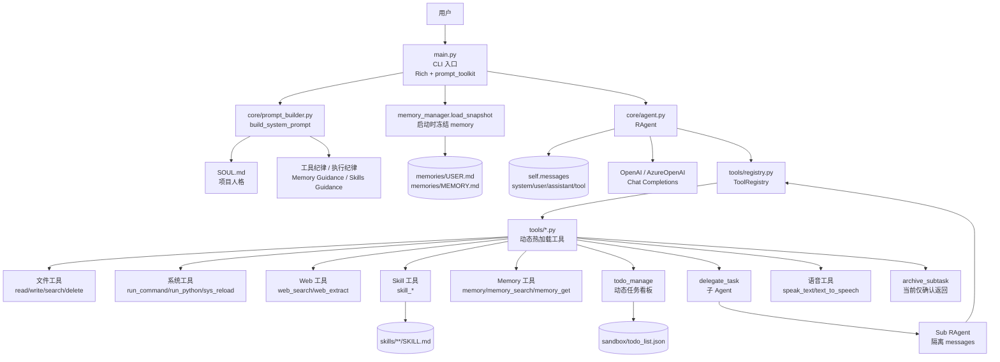
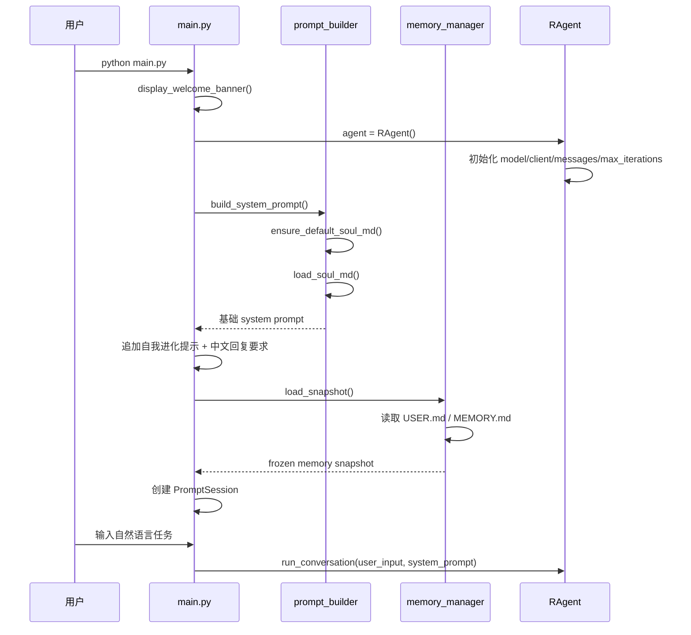
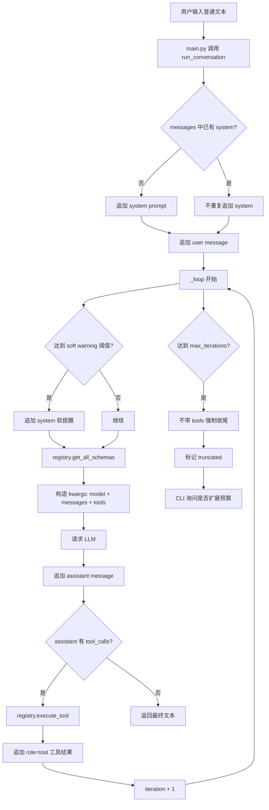
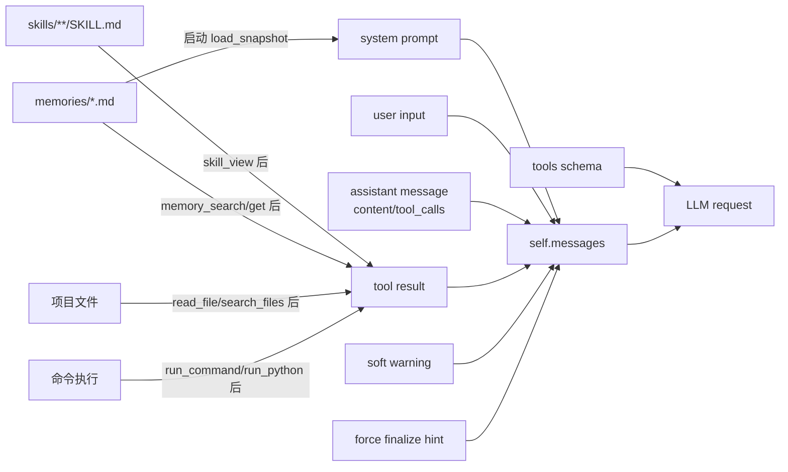
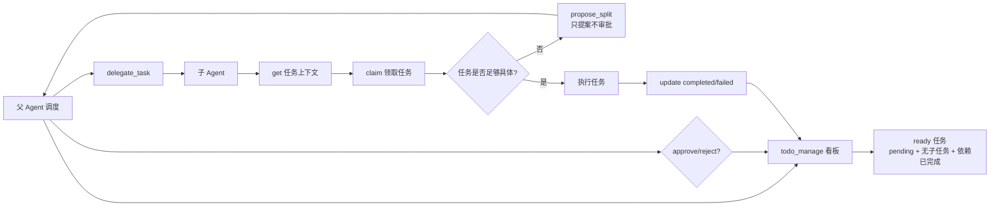

# R-Agent 项目介绍：架构地图、运行逻辑与维护边界

> 更新日期：2026-06-12  
> 适用项目：当前 `R-Agent` 仓库  
> 文档定位：这不是营销 README，而是给维护者看的“项目地图 + 架构说明书 + 认知锚点”。  
> 维护目标：让用户随时能理解 R-Agent 当前架构、功能边界和复杂度来源，避免项目在持续交给 Agent 修改后朝不可理解、不可维护的方向发展。

---

## 0. 如何阅读本文

如果你刚重启 Agent、刚回到这个项目，建议按这个顺序读：

1. 先读 **第 1-3 节**：建立整体心智模型。
2. 再读 **第 4-7 节**：理解一次用户请求如何真正跑起来。
3. 然后读 **第 8-12 节**：理解 tools、skills、memory、todo、delegate 等扩展系统。
4. 最后读 **第 13-16 节**：理解当前风险、维护边界和下一步优先级。

如果只想快速恢复全局认知，看这句话：

> **R-Agent = 一个本地 CLI 智能体框架：用 `RAgent.messages` 保存上下文，用工具注册表暴露真实操作能力，用 memory/skills/todo/delegate 承载长期记忆、复用流程和复杂任务调度。**

---

## 1. 一句话介绍

**R-Agent 是一个可自我维护、可调用工具、可管理长期记忆和技能、可委托子 Agent 执行任务的本地命令行智能体框架。**

它不是普通的 LLM wrapper。

普通 LLM wrapper 大概是：

```text
用户输入 → 调 LLM → 输出文本
```

R-Agent 是：

```text
用户输入 → 构造上下文 → 调 LLM → LLM 选择工具 → 执行真实操作 → 工具结果回填上下文 → 再调 LLM → 直到完成任务
```

因此它的核心能力不只是“回答”，而是“边思考、边操作、边验证”。

---

## 2. 项目心智模型

可以把 R-Agent 想成一个命令行工作台：

```text
R-Agent = 大脑 + 黑板 + 工具箱 + 长期笔记本 + 技能库 + 任务看板 + 分身助手
```

| 部件 | 项目里的实现 | 通俗解释 |
|---|---|---|
| 大脑 | LLM API，通过 `core/config.py` 创建客户端 | 真正负责语言理解和决策 |
| 黑板 | `RAgent.messages` | 保存 system/user/assistant/tool 历史 |
| 工具箱 | `tools/*.py` + `tools/registry.py` | 文件、命令、web、memory、skill、todo 等真实操作 |
| 长期笔记本 | `memories/USER.md`、`memories/MEMORY.md` | 保存长期偏好和稳定项目事实 |
| 技能库 | `skills/**/SKILL.md` | 保存可复用流程和工作方法 |
| 任务看板 | `sandbox/todo_list.json` + `todo_manage` | 管理复杂任务、依赖和子任务状态 |
| 分身助手 | `delegate_task` 创建的子 `RAgent` | 用隔离上下文处理子任务 |
| 人格/灵魂 | `SOUL.md` | 控制 Agent 的稳定身份、语气、行为原则 |
| 维护文档 | `README.md`、`上下文.md`、`项目介绍.md`、`outputs/*.md` | 让人类维护者恢复项目理解 |

---

## 3. 总体架构图



---

## 4. 主要目录结构与职责

```text
R-Agent/
├── main.py
├── README.md
├── SOUL.md
├── requirements.txt
├── .env / .env.example
├── core/
├── tools/
├── skills/
├── memories/
├── sandbox/
├── docs/
├── tests/
├── outputs/
├── 上下文.md
├── 项目介绍.md
└── 进度.md
```

| 路径 | 职责 | 维护注意事项 |
|---|---|---|
| `main.py` | CLI 主入口；创建 Agent；构建 system prompt；处理 slash command；展示 Rich UI；调用 Agent Loop | 不要把复杂业务全部塞进 CLI；CLI 层应主要负责交互、展示和配置刷新 |
| `core/agent.py` | `RAgent` 核心；维护 `messages`；调用 LLM；执行工具；迭代预算；强制收尾；续跑 | 这是最核心文件，修改会影响每轮上下文、工具调用和长任务行为 |
| `core/config.py` | 读取 `.env` 和环境变量；创建 OpenAI/AzureOpenAI client | 修改时要注意 Azure/OpenAI 两种 client 兼容 |
| `core/prompt_builder.py` | 构建 system prompt；加载 `SOUL.md`；注入工具纪律、执行纪律、memory/skills 指南 | system prompt 是 Agent 行为源头，修改要谨慎 |
| `core/memory.py` | 持久化 memory 管理；atomic write；锁；去重；安全扫描；frozen snapshot；搜索分页 | memory 会进入未来 system prompt，不能写临时进度和敏感信息 |
| `core/skills.py` | 扫描、查看、创建、删除 skills | skill 是流程知识，不应和 memory 混用 |
| `tools/registry.py` | 工具注册表；热加载所有 `tools/*.py`；输出 tool schema；执行工具 | 每轮都可能 reload，工具模块顶层副作用要谨慎 |
| `tools/*.py` | 各类工具实现 | 工具必须有清晰 schema、错误返回和安全边界 |
| `skills/` | 可复用技能库，按类目组织 | 稳定流程写 skill；过期 skill 要及时修正或删除 |
| `memories/` | 长期记忆文件 | `USER.md` 存用户偏好；`MEMORY.md` 存项目/环境稳定事实 |
| `sandbox/` | 运行时沙盒文件 | 当前存放 `todo_list.json`，不应手动乱改运行态文件 |
| `tests/` | 自动测试 | 当前主要覆盖 memory；后续应补工具、todo、delegate 测试 |
| `outputs/` | 调研和维护输出 | 可保存阶段性维护文档、研究文档、TTS 输出等 |
| `README.md` | 项目说明、配置、更新日志 | 升级/重构/准备 push 时要按日期更新日志 |
| `上下文.md` | 每轮 Agent 调用上下文说明 | 是理解 `messages + tools` 可见性的专题文档 |
| `项目介绍.md` | 当前文档 | 是全局架构认知锚点，项目复杂化后优先更新 |

---

## 5. 启动链路：从启动 CLI 到用户输入

### 5.1 启动时序图



### 5.2 启动阶段做了什么？

`main.py` 的 `main()` 是入口。

启动后主要做：

1. 显示欢迎 banner。
2. 创建 `RAgent()`。
3. 构建 system prompt：
   - `build_system_prompt()`；
   - 自我进化提示；
   - 中文回复要求；
   - `memory_manager.load_snapshot()`。
4. 创建 `PromptSession()`。
5. 进入 `while True` 主循环读取用户输入。

### 5.3 slash command 不进入 Agent 上下文

在 `main.py` 中：

```python
if user_input.strip().startswith("/"):
    handle_slash_command(user_input, console)
    continue
```

因此这些本地命令不会进入 `RAgent.messages`：

- `/help`
- `/skill`
- `/tool`
- `/mem`
- `/model`
- `/mode`
- `/apikey`

它们只在 CLI 本地处理。

---

## 6. Agent Loop：一次请求如何跑完

### 6.1 核心流程图



### 6.2 `messages` 如何累积？

`core/agent.py` 中，`RAgent.__init__` 初始化：

```python
self.messages = []
```

之后每轮会追加：

| 消息类型 | 来源 | 何时追加 |
|---|---|---|
| `system` | system prompt | 第一次 `run_conversation` 且 messages 中没有 system 时 |
| `user` | 用户输入 | 每次普通用户输入 |
| `assistant` | LLM 返回 | 每次 LLM 调用后 |
| `tool` | 工具执行结果 | 每个 tool_call 执行完后 |
| `system` | 软提醒 | 到达 soft warning 阈值 |
| `system` | 强制收尾提示 | 达到最大迭代次数时 |

核心结论：

> 同一个 `RAgent` 实例内，`self.messages` 会持续累积。当前主 Agent 没有自动 token 裁剪机制。

### 6.3 每轮模型请求看到什么？

在 `core/agent.py` 的 `_loop()` 中，每轮构造：

```python
kwargs = {"model": self.model, "messages": self.messages}
if tools:
    kwargs["tools"] = tools
```

所以每轮模型调用 =

```text
完整 messages + 当前工具 schemas
```

详见专题文档：[`上下文.md`](./上下文.md)。

---

## 7. 上下文系统：Agent 到底看得到什么？

### 7.1 立即可见

这些内容会直接进入每轮 LLM 请求：

1. `self.messages` 全部历史：
   - system prompt；
   - 用户历史输入；
   - assistant 历史回复；
   - assistant tool_calls；
   - tool results；
   - soft warning / force finalize。
2. 当前工具 schemas。
3. 启动时 frozen memory snapshot。
4. 已经通过工具读取回来的 skill/file/web/memory/command 输出。

### 7.2 知道入口，但默认看不到全文

这些内容默认不在上下文中，必须调用工具后才可见：

- 文件内容：调用 `read_file`；
- 文件搜索结果：调用 `search_files`；
- 命令输出：调用 `run_command` / `run_python`；
- skill 全文：调用 `skill_view`；
- memory 最新内容：调用 `memory_search` / `memory_get`；
- 网页内容：调用 `web_search` / `web_extract`。

### 7.3 当前不可见

这些当前不会进入模型上下文：

- CLI slash command 的本地输出；
- `on_think` 状态动画；
- 模型隐藏思考链；
- 子 Agent 默认看不到父 Agent 完整对话；
- 当前会话中新写入 memory 不会自动刷新进已存在 system prompt。

### 7.4 上下文系统图



---

## 8. 工具系统：Agent 的手和脚

### 8.1 工具注册机制

核心文件：`tools/registry.py`

每个工具模块会调用：

```python
registry.register(
    name="tool_name",
    description="工具描述",
    parameters={... JSON schema ...},
    handler=some_function,
)
```

注册表内部保存：

```text
工具名 -> schema + handler
```

### 8.2 工具热加载机制

`get_all_schemas()` 每次调用都会：

1. 清空当前 `_tools`；
2. 扫描 `tools/*.py`；
3. 跳过 `__init__` 和 `registry`；
4. 对已导入模块 `importlib.reload`；
5. 对未导入模块 `importlib.import_module`；
6. 返回所有工具 schema。

优点：

- 新增工具文件后下一轮可自动注册；
- Agent 可通过 `write_file` 自我扩展工具。

风险：

- 每轮 reload 有性能成本；
- 工具模块顶层副作用会重复执行；
- 并发子 Agent 下 registry reload 缺少显式锁；
- 某工具 import 失败只打印 warning，工具集可能悄悄变化。

### 8.3 工具执行机制

当 LLM 返回 tool_call：

```text
tool_call.function.name
工具名

 tool_call.function.arguments
JSON 字符串参数
```

`registry.execute_tool()` 会：

1. 找到 handler；
2. `json.loads(args_json)`；
3. 如果参数是 dict，则 `handler(**args)`；
4. 如果参数是 list，则 `handler(*args)`；
5. 否则 `handler(args)`；
6. 返回 JSON 字符串。

### 8.4 当前工具总览

当前动态注册工具总数：**24 个**。

#### 网络类

| 工具 | 说明 |
|---|---|
| `web_search` | 互联网搜索 |
| `web_extract` | 提取网页文本 |

#### 文件类

| 工具 | 说明 |
|---|---|
| `read_file` | 分页读取文件，带工作区外授权机制 |
| `write_file` | 覆盖写文件，工作区外需授权 |
| `search_files` | 搜索文件名或文件内容 |
| `delete_file` | 删除文件/目录，沙盒外需确认 |

#### 系统执行类

| 工具 | 说明 |
|---|---|
| `run_command` | 执行 shell 命令，高风险命令需审批 token |
| `run_python` | 执行 Python 代码，危险删除调用需授权 |
| `sys_reload` | 重新加载工具和 skills |

#### Skill 类

| 工具 | 说明 |
|---|---|
| `skills_list` | 列出所有 skills |
| `skill_view` | 查看指定 `SKILL.md` |
| `skill_create` | 创建或更新 skill |
| `skill_delete` | 删除 skill |
| `skill_categories` | 只列出 skill 类目与数量 |
| `skills_by_category` | 按类目列出 skill 摘要 |
| `skill_relocate` | 移动 skill 到新类目 |

#### Memory 类

| 工具 | 说明 |
|---|---|
| `memory` | add/replace/remove 长期 memory |
| `memory_search` | 搜索 USER/MEMORY |
| `memory_get` | 分页读取 USER/MEMORY |

#### 任务调度类

| 工具 | 说明 |
|---|---|
| `todo_manage` | 树状动态任务看板 |
| `delegate_task` | 创建隔离上下文子 Agent 并发执行 |

#### 上下文与语音类

| 工具 | 说明 |
|---|---|
| `archive_subtask` | 声称上下文压缩；当前未真正压缩 messages |
| `speak_text` | 语音朗读，可由 `voice_enabled` 控制播放 |
| `text_to_speech` | 只保存语音文件，不播放 |

---

## 9. Skill 系统：可复用流程知识

### 9.1 Skill 目录结构

当前 skills 按类目组织：

```text
skills/
├── agent_ops/
├── creative/
├── github/
└── productivity/
```

当前统计：

| 类目 | 数量 | 代表技能 |
|---|---:|---|
| `agent_ops` | 5 | `agent_capability_management`、`agent_context_audit`、`dynamic_todo_delegation`、`maintain_project_overview`、`smart_voice_response` |
| `creative` | 20 | `architecture-diagram`、`claude-design`、`excalidraw`、`popular-web-designs` 等 |
| `github` | 6 | `github-pr-workflow`、`github-code-review`、`github-issues` 等 |
| `productivity` | 10 | `google-workspace`、`notion`、`powerpoint`、`research_explainer_md` 等 |

### 9.2 Skill 是什么？

Skill 是一个可复用流程说明，通常保存在：

```text
skills/<category>/<skill_name>/SKILL.md
```

它适合保存：

- 稳定工作流程；
- 复杂任务 SOP；
- 可复用提示；
- 工具组合方法；
- 多步骤执行规范。

### 9.3 Skill 与 Memory 的区别

| 类型 | 存什么 | 例子 |
|---|---|---|
| Memory | 长期偏好和稳定事实 | “用户偏好中文回复”、“项目 memory 目录是 memories/” |
| Skill | 可复用流程 | “如何审计 Agent 上下文”、“如何维护项目介绍” |
| outputs | 临时/阶段性研究成果 | “Claude Code 源码解析”、“memory 改造进度” |
| README | 面向项目维护的更新日志和入口说明 | “2026-06-12 新增项目介绍.md” |

### 9.4 当前关键 Agent Ops Skills

| Skill | 作用 |
|---|---|
| `maintain_project_overview` | 当前文档维护流程：必须调用子 Agent 通读项目，再更新 `项目介绍.md` |
| `agent_context_audit` | 审计每轮 Agent 上下文可见性，生成源码级说明 |
| `dynamic_todo_delegation` | 父进程 + 子进程 + todo 看板的复杂任务协议 |
| `smart_voice_response` | 安静优先的语音回复/播放规范 |
| `agent_capability_management` | Agent 能力维护相关流程 |

---

## 10. Memory 系统：长期记忆

### 10.1 Memory 数据模型

```text
memories/
├── USER.md      # 用户偏好、身份、沟通风格
├── MEMORY.md    # 项目/环境稳定事实
└── .memory.lock # 文件锁
```

### 10.2 USER 与 MEMORY 的区别

| 文件 | 用途 | 示例 |
|---|---|---|
| `USER.md` | 用户长期偏好 | 用户偏好复杂任务使用父子 todo/delegate 协议 |
| `MEMORY.md` | 项目/环境长期事实 | 语音工具必须有 `voice_enabled` 开关 |

### 10.3 Frozen Snapshot

启动时：

```python
memory_manager.load_snapshot()
```

会读取当前 `USER.md` / `MEMORY.md`，格式化为：

```xml
<user_preferences>
...
</user_preferences>

<environmental_memory>
...
</environmental_memory>
```

然后拼到 system prompt 末尾。

关键点：

> memory 在 CLI 启动时冻结一次。当前会话中写入 memory 会落盘，但不会自动更新已注入的 system prompt。

### 10.4 Memory 写入安全规则

`MemoryManager` 做了这些保护：

1. atomic write；
2. 线程锁 + `fcntl.flock`；
3. duplicate check；
4. replace/remove 要求 old_text 唯一匹配；
5. char limit：
   - USER：4000 字符；
   - MEMORY：6000 字符；
6. 基础 prompt injection / secret 扫描。

### 10.5 什么不能写进 Memory？

不要写：

- 临时任务进度；
- 本次会话日志；
- PR 编号、issue 编号、commit SHA；
- 一周后会过期的 TODO；
- API key、密码、token、私钥；
- prompt injection 指令；
- 大段流程 SOP。

流程 SOP 应该写成 skill，阶段性记录写进 outputs。

---

## 11. Todo 与子 Agent 协议

### 11.1 为什么需要 Todo / Delegate？

复杂任务如果只靠一个 Agent 在一个上下文里做，容易：

- 上下文爆炸；
- 工具调用发散；
- 子任务依赖混乱；
- 用户无法理解进度；
- Agent 自己拆任务后失控。

因此当前项目采用用户偏好的协议：

> 父进程维护动态 todo list，子进程只领取可执行子任务；子进程先判断是否需要拆分，若需要只提出拆分建议，父进程审批后再调度。

### 11.2 Todo 状态机

任务状态包括：

```text
pending
in_progress
needs_split
blocked
completed
failed
cancelled
```

### 11.3 协议图



### 11.4 子 Agent 上下文隔离

`delegate_task` 会新建：

```python
sub_agent = RAgent(max_iterations=max_iters)
```

子 Agent 的 system prompt 明确说：

- 只依赖任务描述和自己通过工具获得的信息；
- 不假设知道父进程完整对话；
- 不是全局调度者；
- 需要拆分时只 `propose_split`；
- 不得擅自 `approve_split` / `reject_split`。

子 Agent 默认禁用：

- `delegate_task`：避免递归爆炸；
- `memory`：避免子任务污染长期记忆。

---

## 12. 语音系统

语音工具位于：

```text
tools/speech_tool.py
```

当前工具：

| 工具 | 行为 |
|---|---|
| `speak_text` | 可播放、可保存，由 `voice_enabled` 控制是否播放 |
| `text_to_speech` | 只保存音频文件，不播放 |

关键约定：

> `voice_enabled=false` 时绝不播放语音。

这符合当前环境 memory 约定：安静优先。

默认归档目录：

```text
outputs/tts
```

---

## 13. 上下文压缩与长任务控制

### 13.1 当前已有机制

`RAgent` 有迭代预算机制：

1. `MAX_ITERATIONS` 默认 30；
2. `SOFT_WARN_RATIO` 默认 0.7；
3. 到达软阈值时注入 system 提醒；
4. 达到上限时不再提供 tools，强制模型总结；
5. CLI 询问用户是否扩展预算；
6. `continue_after_truncation(extra_iterations)` 可在完整上下文基础上续跑。

### 13.2 当前缺口：真正上下文压缩尚未实现

`archive_subtask` 工具描述称会：

```text
保存摘要，并清空之前繁杂的对话历史
```

但当前实现只是返回 JSON 确认，`core/agent.py` 未见对它的特殊拦截。

因此当前事实是：

> `archive_subtask` 不会真正清理或压缩 `self.messages`。

这是当前项目最需要明确记录的风险之一。

---

## 14. 当前已知复杂点 / 风险点

### 14.1 `archive_subtask` 描述与实现不一致

- 描述：会压缩并清空历史；
- 实际：只返回确认 JSON；
- 风险：Agent 误以为上下文已压缩，实际 messages 继续增长。

建议优先级：**P0**。

### 14.2 system prompt 提到不存在的 `skill_manage`

`core/prompt_builder.py` 的 Skills Guidance 中提到 `skill_manage` 和 patch 行为，但当前工具只有：

- `skill_create`
- `skill_delete`
- `skill_view`
- `skills_list`
- `skill_relocate`

风险：模型可能尝试调用不存在的工具。

建议：修改 prompt 或实现兼容工具。

### 14.3 `skill_view(file_path)` 参数存在但未实现

`tools/skills_tool.py` 接受 `file_path`，但注释说明当前忽略该参数，只返回主 `SKILL.md`。

风险：模型以为能读取 skill 内 references/templates，但实际不能。

### 14.4 工具热加载灵活但复杂

`get_all_schemas()` 每轮都 reload 所有工具。

风险：

- 性能成本；
- 顶层副作用；
- 并发子 Agent 共享全局 registry；
- import 失败只 warning，工具集可能静默变化。

### 14.5 `delegate_task` 多线程共享全局状态

并发子 Agent 共享：

- 当前 Python 进程；
- 全局 registry；
- 工作目录；
- `sandbox/todo_list.json`。

而 `todo_tool.py` 当前没有明显文件锁/atomic write 机制。

风险：并发 claim/update 可能竞态覆盖。

### 14.6 `todo_manage claim` 记录 lease 但未自动回收

任务 claim 记录了 `lease_minutes`，但 ready/view/update 逻辑未见自动 lease 过期回收。

风险：子 Agent 崩溃后任务可能长期卡在 `in_progress`。

### 14.7 `run_python` 危险检测较简单

当前危险检测主要看：

- `os.remove`
- `shutil.rmtree`

未覆盖：

- `pathlib.Path.unlink`
- `os.unlink`
- `subprocess.run('rm ...')`
- 写入覆盖重要路径
- 网络请求等。

### 14.8 工作区边界依赖 `os.getcwd()`

`file_tools` / `sys_tools` 中工作区目录取当前启动目录。

如果不是从仓库根目录启动，工作区边界可能和用户预期不同。

### 14.9 memory 与 skills 的长期污染风险

memory 会进入未来 system prompt；skills 会影响未来工作流程。

因此：

- memory 不能保存临时进度；
- skills 不能保存未验证或过度具体的一次性流程；
- 新增/修改 skill 应进行人工审计或至少 diff 审查。

---

## 15. 维护边界和设计原则

### 15.1 分层原则

| 层 | 应该做什么 | 不应该做什么 |
|---|---|---|
| `main.py` | CLI 输入、展示、slash command、调用 Agent | 堆复杂业务逻辑 |
| `core/agent.py` | Agent Loop、messages、工具调用生命周期 | 混入具体工具业务 |
| `tools/` | 单一工具能力 | 在工具里偷偷改变全局 Agent 行为 |
| `skills/` | 可复用流程 SOP | 存临时项目进度 |
| `memories/` | 长期稳定事实 | 存任务日志、敏感信息、短期 TODO |
| `outputs/` | 调研和阶段性文档 | 当作 system prompt 直接注入 |
| `README.md` | 项目入口和更新日志 | 记录过多一次性推理细节 |
| `项目介绍.md` | 架构地图和维护认知锚点 | 代替代码事实或测试 |

### 15.2 复杂任务原则

1. 复杂任务先建 todo；
2. 父 Agent 维护任务树和依赖；
3. 子 Agent 只领取 ready 任务；
4. 子 Agent 先判断任务是否需要拆分；
5. 需要拆分只 propose，不 approve；
6. 父 Agent 汇总和审批；
7. 子 Agent 的 goal 必须自包含。

### 15.3 自我进化原则

R-Agent 允许 Agent 创建 skill 和工具，但必须遵守：

1. 新工具要有清晰 schema；
2. 新工具要有安全边界；
3. 高风险行为要走审批；
4. 复杂工作流优先写 skill，不要塞 memory；
5. 维护/升级/重构后更新 README 更新日志；
6. 项目变复杂后更新 `项目介绍.md`。

---

## 16. 思维树

```text
R-Agent
├── 入口层
│   ├── main.py
│   │   ├── 欢迎界面 Rich Panel
│   │   ├── prompt_toolkit 输入
│   │   ├── slash command 本地处理
│   │   ├── system_prompt 构建拼接
│   │   └── 调用 RAgent.run_conversation
│   └── .env / core.config
│       ├── OpenAI / Azure 客户端类型
│       ├── API Key
│       ├── 模型名
│       ├── max iterations
│       └── display mode
├── 核心 Agent 层
│   └── core/agent.py：RAgent
│       ├── self.messages
│       ├── _chat_completion_with_retry
│       ├── run_conversation
│       ├── _loop
│       ├── tool_calls 执行
│       ├── soft warning
│       ├── force finalize
│       └── continue_after_truncation
├── System Prompt 层
│   ├── SOUL.md
│   ├── DEFAULT_AGENT_IDENTITY
│   ├── TOOL_USE_ENFORCEMENT_GUIDANCE
│   ├── MODEL_EXECUTION_GUIDANCE
│   ├── MEMORY_GUIDANCE
│   ├── SKILLS_GUIDANCE
│   ├── 自我进化提示
│   └── memory frozen snapshot
├── 上下文层
│   ├── system messages
│   ├── user messages
│   ├── assistant messages
│   ├── tool result messages
│   ├── tools schema
│   ├── skill_view 结果
│   ├── memory_search/get 结果
│   └── 文件/命令/web 工具结果
├── 工具层
│   ├── tools/registry.py
│   │   ├── register
│   │   ├── reload_all
│   │   ├── get_all_schemas
│   │   └── execute_tool
│   ├── file_tools
│   ├── sys_tools
│   ├── web_tools
│   ├── memory_tools
│   ├── skills_tools
│   ├── todo_tool
│   ├── delegate_tool
│   ├── context_tool
│   └── speech_tool
├── Skill 层
│   ├── skills/agent_ops
│   ├── skills/creative
│   ├── skills/github
│   └── skills/productivity
├── Memory 层
│   ├── memories/USER.md
│   ├── memories/MEMORY.md
│   ├── atomic write
│   ├── duplicate check
│   ├── unique replace/remove
│   ├── char limit
│   └── suspicious content scan
├── 任务调度层
│   ├── sandbox/todo_list.json
│   ├── todo_manage
│   │   ├── init/view/ready/get
│   │   ├── claim/release
│   │   ├── propose_split
│   │   ├── approve_split/reject_split
│   │   └── update
│   └── delegate_task
│       ├── ThreadPoolExecutor
│       ├── Sub RAgent
│       ├── 隔离上下文
│       └── 禁用 delegate_task/memory
├── 语音层
│   ├── speak_text
│   ├── text_to_speech
│   ├── voice_enabled
│   └── outputs/tts
├── 测试层
│   ├── tests/test_memory_p0.py
│   └── tests/test_memory_p1_read.py
└── 维护文档层
    ├── README.md：入口 + 更新日志
    ├── 上下文.md：每轮上下文专题
    ├── 项目介绍.md：全局架构地图
    ├── outputs/agent_memory_maintenance_progress.md
    ├── outputs/current_memory_system_improvement_plan.md
    └── docs/MIGRATION_DOC.md
```

---

## 17. 最近架构变化摘要

> 说明：本节基于当前 `README.md`、`上下文.md`、`outputs/agent_memory_maintenance_progress.md`、子 Agent 审计报告和源码抽查整理；未做完整 git 历史审计。

### 17.1 2026-06-12：项目认知文档体系补强

新增/更新：

- `上下文.md`：详细说明每轮 Agent 调用可见的上下文。
- `项目介绍.md`：当前文档，作为全局架构地图和维护认知锚点。
- `skills/agent_ops/maintain_project_overview`：规定未来更新项目介绍必须先调用子 Agent 通读项目。
- `skills/agent_ops/agent_context_audit`：沉淀 Agent 上下文审计流程。

### 17.2 2026-06-09：SOUL.md 与审批机制

从 README 更新日志可见：

- 引入项目级 `SOUL.md` 主身份；
- system prompt 构建时优先加载 `SOUL.md`；
- 加入 prompt injection / secret-exfiltration 扫描；
- 修复工作区外文件操作授权阻塞问题；
- 统一结构化权限二次确认。

### 17.3 2026-06-08：Memory 系统 P0/P1 升级

从 README 和 progress 文档可见：

- memory atomic write；
- duplicate check；
- unique replace/remove；
- char limit；
- frozen snapshot；
- memory_search / memory_get；
- `/mem` 读取走 MemoryManager；
- 新增 memory 测试。

---

## 18. 后续演进建议

### P0：避免误导和上下文失控

1. 真正实现 `archive_subtask`，或修改描述避免误导。
2. 修正 system prompt 中不存在的 `skill_manage` 引用。
3. 明确或实现 `skill_view(file_path)`。

### P1：并发与持久化安全

1. `todo_tool.py` 增加文件锁和 atomic write。
2. `tools/registry.py` 的 reload 增加锁和 mtime 检测。
3. `delegate_task` 明确并发共享状态限制。
4. `claim` 增加 lease 过期回收机制。

### P2：安全和测试

1. `run_python` 增加更完整风险扫描或沙盒化。
2. workspace root 改为仓库根目录而不是 `os.getcwd()`。
3. skill 创建/更新增加安全扫描。
4. 新增架构级测试：
   - 工具注册数量和关键工具存在；
   - system prompt 构成；
   - memory frozen snapshot；
   - todo claim/update/propose_split；
   - delegate_task 禁止递归委托和 memory。

---

## 19. 最简维护口诀

```text
事实进 项目介绍.md
变更进 README.md
长期偏好进 memories/USER.md
稳定环境事实进 memories/MEMORY.md
流程方法进 skills/
阶段研究进 outputs/
复杂任务进 todo_manage
并行子任务进 delegate_task
真实动作进 tools/
核心循环慎改 core/agent.py
```

---

## 20. 本次更新依据

本次 `项目介绍.md` 由以下资料综合生成：

1. 子 Agent 对当前项目的只读架构审计报告；
2. `README.md` 更新日志；
3. `上下文.md` 每轮上下文专题文档；
4. `outputs/agent_memory_maintenance_progress.md` memory 维护进度；
5. 当前工具注册表动态查询结果；
6. 当前 skills 分类统计；
7. 对关键源码文件的抽查：
   - `main.py`
   - `core/agent.py`
   - `core/prompt_builder.py`
   - `core/memory.py`
   - `core/skills.py`
   - `tools/registry.py`
   - `tools/delegate_tool.py`
   - `tools/context_tool.py`

如果未来源码与本文不一致，以源码为准，并应立即更新本文。
